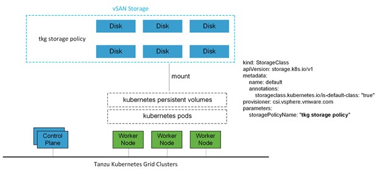
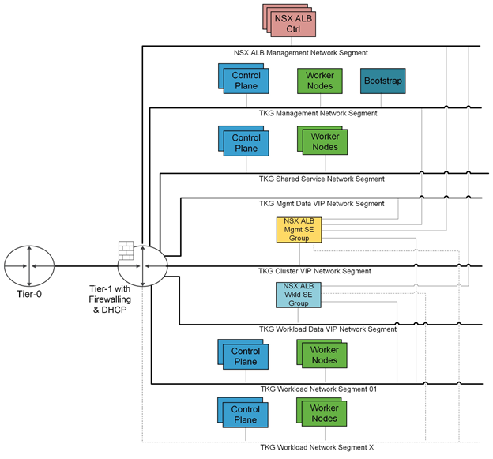
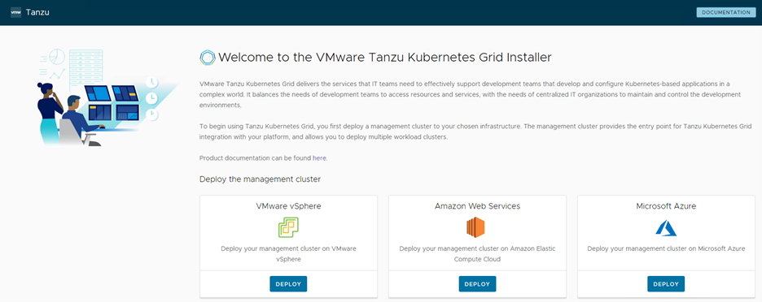
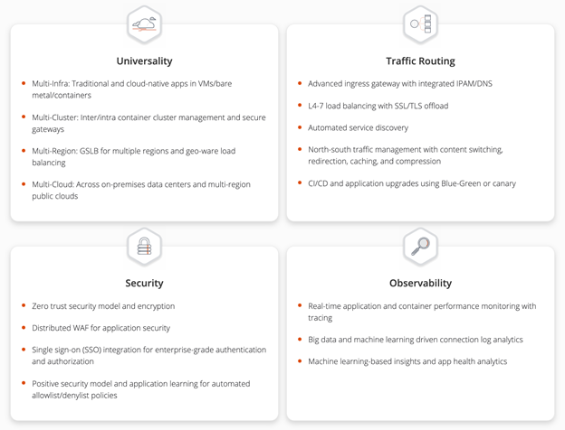
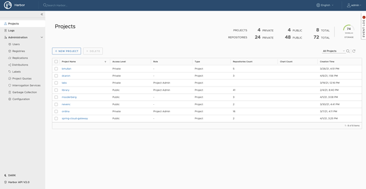

# VMware Tanzu for Kubernetes Operations on vSphere with NSX-T Reference Design

VMware Tanzu simplifies operation of Kubernetes for multi-cloud deployment by centralizing management and governance for clusters and teams across on-premises, public clouds, and edge. It delivers an open source aligned Kubernetes distribution with consistent operations and management to support infrastructure and application modernization.

This document lays out a reference architecture related for VMware Tanzu for Kubernetes Operations when deployed on a vSphere environment backed by NSX-T and offers a high-level overview of the different components.

This reference design is based on the architecture and components described in [VMware Tanzu for Kubernetes Operations Reference Architecture](index.md)

## Supported Component Matrix

The validated Bill of Materials that can be used to install Tanzu Kubernetes Grid on your vSphere with NSX-T environment is as follows:

|**Software Components**|**Version**|
| --- | --- |
|Tanzu Kubernetes Grid|1.5.1|
|VMware vSphere ESXi|7.0 U2 and later|
|VMware vCenter (VCSA)|7.0 U2 and later|
|VMware vSAN|7.0 U2 and later|
|NSX Advanced Load Balancer|20.1.7|

For up-to-date information about which software versions can be used together, check the Interoperability Matrix [here](https://interopmatrix.vmware.com/Interoperability?col=551,&row=2,%26789,).

## Tanzu Kubernetes Grid Components

VMware Tanzu Kubernetes Grid (TKG) provides organizations with a consistent, upstream-compatible, regional Kubernetes substrate that is ready for end-user workloads and ecosystem integrations. You can deploy Tanzu Kubernetes Grid across software-defined datacenters (SDDC) and public cloud environments, including vSphere, Microsoft Azure, and Amazon EC2.

Tanzu Kubernetes Grid comprises the following components:

**Management Cluster -** A management cluster is the first element that you deploy when you create a Tanzu Kubernetes Grid instance. The management cluster is a Kubernetes cluster that performs the role of the primary management and operational center for the Tanzu Kubernetes Grid instance. The management cluster is purpose-built for operating the platform and managing the lifecycle of Tanzu Kubernetes clusters.

**Cluster API -** Tanzu Kubernetes Grid functions through the creation of a management Kubernetes cluster which houses [Cluster API](https://cluster-api.sigs.k8s.io/). The Cluster API then interacts with the infrastructure provider to service workload Kubernetes cluster lifecycle requests.

**Tanzu Kubernetes Cluster -** Tanzu Kubernetes clusters are the Kubernetes clusters in which your application workloads run. These clusters are also referred to as workload clusters. Tanzu Kubernetes clusters can run different versions of Kubernetes, depending on the needs of the applications they run.

**Shared Service Cluster -**  Each Tanzu Kubernetes Grid instance can only have one shared services cluster. You will deploy this cluster only if you intend to deploy shared services such as Contour and Harbor.

**Tanzu Kubernetes Cluster Plans -** A cluster plan is a blueprint that describes the configuration with which to deploy a Tanzu Kubernetes cluster. It provides a set of configurable values that describe settings like the number of control plane machines, worker machines, VM types, and so on. This release of Tanzu Kubernetes Grid provides two default templates, dev and prod.

**Tanzu Kubernetes Grid Instance -** A Tanzu Kubernetes Grid instance is the full deployment of Tanzu Kubernetes Grid, including the management cluster, the workload clusters, and the shared services cluster that you configure.

**Tanzu CLI -** A command-line utility that provides the necessary commands to build and operate Tanzu management and Tanzu Kubernetes clusters.

**Bootstrap Machine -** The bootstrap machine is the laptop, host, or server on which you download and run the Tanzu CLI. This is where the initial bootstrapping of a management cluster occurs before it is pushed to the platform where it will run.

**Tanzu Kubernetes Grid Installer -** The Tanzu Kubernetes Grid installer is a graphical wizard that you launch by running the `tanzu management-cluster create --ui` command. The installer wizard runs locally on the bootstrap machine and provides a user interface to guide you through the process of deploying a management cluster.

## Tanzu Kubernetes Grid Storage
Tanzu Kubernetes Grid integrates with shared datastores available in the vSphere infrastructure. The following types of shared datastores are supported:

- vSAN
- VMFS
- NFS
- vVols

Tanzu Kubernetes Grid Cluster Plans can be defined by operators to use a certain vSphere datastore when creating new workload clusters. All developers then have the ability to provision container-backed persistent volumes from that underlying datastore.

Tanzu Kubernetes Grid is agnostic to which option you choose. For Kubernetes stateful workloads, Tanzu Kubernetes Grid installs the [vSphere Container Storage interface (vSphere CSI)](https://github.com/container-storage-interface/spec/blob/master/spec.md) to automatically provision Kubernetes persistent volumes for pods.

[VMware vSAN](https://docs.vmware.com/en/VMware-vSAN/index.html) is a recommended storage solution for deploying Tanzu Kubernetes Grid clusters on vSphere.

|**Decision ID**|**Design Decision**|**Design Justification**|**Design Implications**|
| --- | --- | --- | --- |
|TKO-STG-001|Use vSAN storage for TKO|By using vSAN as the shared storage solution, you can take advantage of more cost-effective local storage.|Minimizes storage platform complexity by standardizing on a single type.|

While the default vSAN storage policy can be used, administrators should evaluate the needs of their applications and craft a specific [vSphere Storage Policy](https://docs.vmware.com/en/VMware-vSphere/6.7/com.vmware.vsphere.storage.doc/GUID-89091D59-D844-46B2-94C2-35A3961D23E7.html). vSAN storage policies describe classes of storage (For example, SSD or NVME) along with quotas for your clusters.

Starting with vSphere 7.0 environments with vSAN, the vSphere CSI driver for Kubernetes also supports the creation of NFS File Volumes, which support ReadWriteMany access modes. This allows for provisioning volumes, which can be read and written from multiple pods simultaneously. To support this, you must enable vSAN File Service.

**Note:** vSAN File Service is available only in the vSAN Enterprise and Enterprise Plus editions.

## Tanzu Kubernetes Clusters Networking

A Tanzu Kubernetes cluster provisioned by Tanzu Kubernetes Grid supports two Container Network Interface (CNI) options:

- [Antrea](https://antrea.io/)
- [Calico](https://www.tigera.io/project-calico/)

Both are open-source software that provides networking for cluster pods, services, and ingress.

When you deploy a Tanzu Kubernetes cluster using Tanzu Mission Control or Tanzu CLI, Antrea CNI is automatically enabled in the cluster.

Tanzu Kubernetes Grid also supports [Multus](https://github.com/k8snetworkplumbingwg/multus-cni) CNI which can be installed through Tanzu user-managed packages. Multus CNI lets you attach multiple network interfaces to a single pod and associate each with a different address range.

To provision a Tanzu Kubernetes cluster using a non-default CNI, see the following instructions:

- [Deploy Tanzu Kubernetes clusters with Calico](https://docs.vmware.com/en/VMware-Tanzu-Kubernetes-Grid/1.5/vmware-tanzu-kubernetes-grid-15/GUID-tanzu-k8s-clusters-networking.html#calico)
- [Implement Multiple Pod Network Interfaces with Multus](https://docs.vmware.com/en/VMware-Tanzu-Kubernetes-Grid/1.5/vmware-tanzu-kubernetes-grid-15/GUID-packages-cni-multus.html)

Each CNI is suitable for a different use case. The following table lists some common use cases for the three CNIs that Tanzu Kubernetes Grid supports. This table will help you with information on selecting the right CNI in your Tanzu Kubernetes Grid implementation.

|**CNI**|**Use Case**|**Pros and Cons**|
| --- | --- | --- |
|Antrea|
Enable Kubernetes pod networking with IP overlay networks using VXLAN or Geneve for encapsulation. Optionally encrypt node-to-node communication using IPSec packet encryption.

Antrea supports advanced network use cases like kernel bypass and network service mesh.
|
Pros

- Provides an option to configure egress IP pool or static egress IP for Kubernetes workloads.
|
|Calico|
Calico is used in environments where factors like network performance, flexibility, and power are essential.

For routing packets between nodes, Calico leverages the BGP routing protocol instead of an overlay network. This eliminates the need to wrap packets with an encapsulation layer resulting in increased network performance for Kubernetes workloads.
|
Pros

- Support for network policies

- High network performance

- SCTP support

Cons

- No multicast support

|
|Multus|Multus CNI provides multiple interfaces per each Kubernetes pod. Using Multus CRDs, you can specify which pods get which interfaces and allow different interfaces depending on the use case.|
Pros

- Separation of data/control planes.

- Separate security policies can be used for separate interfaces. 

- Supports SR-IOV, DPDK, OVS-DPDK, and VPP workloads in Kubernetes with both cloud native and NFV based applications in Kubernetes.
|

## Tanzu Kubernetes Grid Infrastructure Networking
Tanzu Kubernetes Grid on vSphere can be deployed on various networking stacks including:

- VMware NSX-T Data Center Networking
- vSphere Networking (VDS)

**Note:** The scope of this document is limited to VMware NSX-T Data Center Networking with NSX Advanced Load Balancer.

## Tanzu Kubernetes Grid on VMware NSX-T Data Center Networking with NSX Advanced Load Balancer

When deployed on VMware NSX-T Networking, Tanzu Kubernetes Grid uses the NSX-T logical segments and gateways to provide connectivity to Kubernetes control plane VMs, worker nodes, services, and applications. All hosts from the cluster where Tanzu Kubernetes clusters are deployed are configured as NSX-T Transport nodes, which provide network connectivity to the Kubernetes environment.

Tanzu Kubernetes Grid leverages NSX Advanced Load Balancer to provide L4 load balancing for the Tanzu Kubernetes clusters control plane HA and L7 ingress to the applications deployed in the Tanzu Kubernetes clusters. Users access the applications by connecting to the Virtual IP address (VIP) of the applications provisioned by NSX Advanced Load Balancer.

## NSX Advanced Load Balancer Components
NSX Advanced Load Balancer is deployed in Write Access Mode in vSphere Environment. This mode grants NSX Advanced Load Balancer Controllers full write access to vCenter which helps in automatically creating, modifying, and removing service engines (SEs) and other resources as needed to adapt to changing traffic needs. The core components of NSX Advanced Load Balancer are as follows:

- **NSX Advanced Load Balancer Controller** - NSX Advanced Load Balancer Controller manages Virtual Service objects and interacts with the vCenter Server infrastructure to manage the lifecycle of the service engines (SEs). It is the central repository for the configurations and policies related to services and management, and it provides the portal for viewing the health of VirtualServices and SEs and the associated analytics that NSX Advanced Load Balancer provides.
- **NSX Advanced Load Balancer Service Engine** - The service engines (SEs) are lightweight VMs that handle all data plane operations by receiving and executing instructions from the controller. The SEs perform load balancing and all client- and server-facing network interactions.
- **Avi Kubernetes Operator (AKO)** - It is a Kubernetes operator that runs as a pod in the Supervisor Cluster and Tanzu Kubernetes clusters, and it provides ingress and load balancing functionality. AKO translates the required Kubernetes objects to NSX Advanced Load Balancer objects and automates the implementation of ingresses, routes, and services on the service engines (SE) through the NSX Advanced Load Balancer Controller.
- **AKO Operator (AKOO)** - This is an operator which is used to deploy, manage, and remove the AKO pod in Kubernetes clusters. This operator when deployed creates an instance of the AKO controller and installs all the relevant objects like:
  - AKO `Statefulset`
  - `Clusterrole` and `Clusterrolebinding`
  - `Configmap` (required for the AKO controller and other artifacts).

Each environment configured in NSX Advanced Load Balancer is referred to as a cloud. Each cloud in NSX Advanced Load Balancer maintains networking and NSX Advanced Load Balancer Service Engine settings. The cloud is configured with one or more VIP networks to provide IP addresses to load balancing (L4/L7) virtual services created under that cloud.

The virtual services can be spanned across multiple Service Engines if the associated Service Engine Group is configured in Active/Active HA mode. A Service Engine can belong to only one Service Engine group at a time.

IP address allocation for virtual services can be over DHCP or via NSX Advanced Load Balancer in-built IPAM functionality. The VIP networks created/configured in NSX Advanced Load Balancer are associated with the IPAM profile.

## Network Architecture

For the deployment of Tanzu Kubernetes Grid in the vSphere environment, it is required to build separate networks for the Tanzu Kubernetes Grid management cluster and workload clusters, NSX Advanced Load Balancer management, cluster-VIP network for control plane HA, Tanzu Kubernetes Grid management VIP or data network, and Tanzu Kubernetes Grid workload data or VIP network.

The network reference design can be mapped into this general framework.

This topology enables the following benefits:

- Isolate and separate SDDC management components (vCenter, ESX) from the Tanzu Kubernetes Grid components. This reference design allows only the minimum connectivity between the Tanzu Kubernetes Grid clusters and NSX Advanced Load Balancer to the vCenter Server.
- Isolate and separate NSX Advanced Load Balancer management network from the Tanzu Kubernetes Grid management segment and the Tanzu Kubernetes Grid workload segments.
- Depending on the workload cluster type and use case, multiple workload clusters may leverage the same workload network or new networks can be used for each workload cluster. To isolate and separate Tanzu Kubernetes Grid workload cluster networking from each other it’s recommended to make use of separate networks for each workload cluster and configure the required firewall between these networks. For more information, see [Firewall Requirements](#fwreq).
- Separate provider and tenant access to the Tanzu Kubernetes Grid environment.
  - Only provider administrators need access to the Tanzu Kubernetes Grid management cluster. This prevents tenants from attempting to connect to the Tanzu Kubernetes Grid management cluster.

###  Network Requirements

As per the defined architecture, the list of required networks follows:

|**Network Type**|**DHCP Service**|
**Description & Recommendations**

|
| --- | --- | --- |
|NSX ALB Management Logical Segment|Optional|
NSX ALB controllers and SEs will be attached to this network. 

DHCP is not a mandatory requirement on this network as NSX ALB can handle IPAM services for a given network.
|
|TKG Management Logical Segment|Yes|Control plane and worker nodes of TKG management cluster and shared service clusters will be attached to this network.|
|TKG Shared Service Logical Segment|Yes|Control plane and worker nodes of TKG shared service Cluster will be attached to this network.|
|TKG Workload Logical Segment|Yes|Control plane and worker nodes of TKG workload clusters will be attached to this network.|
|TKG Cluster VIP/Data Logical Segment|No|Virtual services for Control plane HA of all TKG clusters (management, shared service, and workload) Reserve sufficient IPs depending on the number of TKG clusters planned to be deployed in the environment, NSX Advanced Load Balancer takes care of IPAM on this network.|
|TKG Management VIP/Data Logical Segment|No|Virtual services for all user-managed packages (such as Contour, Harbor, Contour, Prometheus, Grafana) hosted on the shared service cluster. For more information, see [User-Managed Packages](https://docs.vmware.com/en/VMware-Tanzu-Kubernetes-Grid/1.5/vmware-tanzu-kubernetes-grid-15/GUID-packages-user-managed-index.html).|
|TKG Workload VIP/Data Logical Segment|No|Virtual services for all applications hosted on the workload clusters Reserve sufficient IPs depending on the number of applications that are planned to be hosted on the workload clusters along with scalability considerations.|

####  Subnet and CIDR Examples

For the purpose of demonstration, this document makes use of the following subnet CIDR for Tanzu for Kubernetes Operations deployment.

|**Network Type**|**Segment Name**|**Gateway CIDR**|**DHCP Pool in NSXT**|**NSX ALB IP Pool**|
| --- | --- | --- | --- | --- |
|NSX ALB Mgmt Network|alb-management-segment|172.19.10.1/24|N/A|172.19.10.100- 172.19.10.200|
|TKG Management Network|tkg-mgmt-segment|172.19.40.1/24|172.19.40.100- 172.19.40.200|N/A|
|TKG Shared Service Network|tkg-ss-segment|172.19.41.1/24|172.19.41.100 - 172.19.41.200|N/A|
|TKG Mgmt VIP Network|tkg-mgmt-vip-segment|172.19.50.1/24|N/A|172.19.50.100- 172.19.50.200|
|TKG Cluster VIP Network|tkg-cluster-vip-segment|172.19.80.1/24|N/A|172.19.80.100- 172.19.80.200|
|TKG Workload VIP Network|tkg-workload-vip-segment|172.19.70.1/24|N/A|172.19.70.100- 172.19.70.200|
|TKG Workload Network|tkg-workload-segment|172.19.60.1/24|172.19.60.100- 172.19.60.200|N/A|

###  Firewall Requirements
To prepare the firewall, you need to gather the following information:

1. NSX ALB Controller nodes and Cluster IP address.
2. NSX ALB Management Network CIDR.
3. TKG Management Network CIDR
4. TKG Shared Services Network CIDR
5. TKG Workload Network CIDR
6. TKG Cluster VIP Address Range
7. TKG Management VIP Address Range
8. TKG Workload VIP Address Range
9. Client Machine IP Address
10. Bootstrap machine IP Address
11. Harbor registry IP address
12. vCenter Server IP.
13. DNS server IP(s).
14. NTP Server(s).

|**Source**|**Destination**|**Protocol:Port**|**Description**|
| --- | --- | --- | --- |
|TKG Management and TKG Workload Networks|DNS Server NTP Server|UDP:53 UDP:123|DNS Service  Time Synchronization|
|TKG Management and TKG Workload Networks|DHCP Server|UDP: 67, 68|Allows hosts to get DHCP addresses|
|TKG Management and TKG Workload Networks|vCenter IP|TCP:443|Allows components to access vCenter to create VMs and Storage Volumes|
|TKG Management, Shared service  and Workload Cluster CIDR|Harbor Registry|TCP:443|
Allows components to retrieve container images 

This registry can be a local or a public image registry (projects.registry.vmware.com)
|
|TKG Management Cluster Network|TKG Cluster VIP Network |TCP:6443|For Management cluster to configure Workload Cluster|
|TKG Shared Service Cluster Network|TKG Cluster VIP Network|TCP:6443|Allow Shared cluster to register with management cluster|
|TKG Workload Cluster Network|TKG Cluster VIP Network|TCP:6443|Allow Workload cluster to register with management cluster|
|TKG Management, Shared service, and Workload Networks|AVI Controllers (NSX ALB Management Network)|TCP:443|Allow Avi Kubernetes Operator (AKO) and AKO Operator (AKOO) access to Avi Controller|
|AVI Controllers (NSX ALB Management Network)|vCenter and ESXi Hosts|TCP:443|Allow AVI to discover vCenter objects and deploy SEs as required|
|Admin network|Bootstrap VM|SSH:22|To deploy, manage  and configure TKG clusters|
|deny-all|any|any|deny|

## Installation Experience

Tanzu Kubernetes Grid management cluster is the first component that you deploy to get started with Tanzu Kubernetes Grid.

You can deploy the management cluster in two ways:

- Run the Tanzu Kubernetes Grid installer, a wizard interface that guides you through the process of deploying a management cluster. This is the recommended method if you are installing a Tanzu Kubernetes Grid management cluster for the first time.
- Create and edit YAML configuration files, and use them to deploy a management cluster with the CLI commands.

The Tanzu Kubernetes Grid Installation user interface shows that, in the current version, it is possible to install Tanzu Kubernetes Grid on vSphere (including VMware Cloud on AWS), AWS EC2, and Microsoft Azure. The UI provides a guided experience tailored to the IaaS, in this case, VMware vSphere.

The installation of Tanzu Kubernetes Grid on vSphere is done through the same UI as mentioned above but tailored to a vSphere environment.

This installation process will take you through the setup of a management cluster on your vSphere environment. Once the management cluster is deployed, you can make use of [Tanzu Mission Control](https://tanzu.vmware.com/mission-control) or Tanzu CLI to deploy Tanzu Kubernetes shared service and workload clusters.

## Design Recommendations

### NSX Advanced Load Balancer Recommendations

The following table provides the recommendations for configuring NSX Advanced Load Balancer (NSX ALB) in a vSphere with Tanzu environment.

|**Decision ID**|**Design Decision**|**Design Justification**|**Design Implications**|
| --- | --- | --- | --- |
|TKO-ALB-001|Deploy NSX ALB controller cluster nodes on a network dedicated to NSX-ALB.|Isolate NSX ALB traffic from infrastructure management traffic and Kubernetes workloads.|Using the same network for NSX ALB Controller Cluster nodes allows for configuring a floating cluster IP address that will be assigned to the cluster leader.|
|TKO-ALB-002|Deploy 3 NSX ALB controller nodes.|To achieve high availability for the NSX ALB platform.|In clustered mode, NSX ALB availability is not impacted by an individual controller node failure. The failed node can be removed from the cluster and redeployed if recovery is not possible. |
|TKO-ALB-003|Use static IP addresses for the NSX ALB controllers if DHCP cannot guarantee a permanent lease.|NSX ALB Controller cluster uses management IP addresses to form and maintain quorum for the control plane cluster. Any changes to management IP addresses will be disruptive.|NSX ALB Controller control plane might go down if the management IP addresses of the controller node change.|
|TKO-ALB-004|Use NSX ALB IPAM for service engine data network and virtual services. |Guarantees IP address assignment for service engine data NICs and virtual services.|Removes the corner case scenario when the DHCP server runs out of the lease or is down.|
|TKO-ALB-005|Reserve an IP address in the NSX ALB management subnet to be used as the cluster IP address for the controller cluster.|NSX ALB portal is always accessible over cluster IP address regardless of a specific individual controller node failure.|NSX ALB administration is not affected by an individual controller node failure.|
|TKO-ALB-006|Use separate VIP networks for application load balancing and L7 services in Tanzu Kubernetes Grid clusters|Separate dev/test and prod workloads L7 load balancer traffic from each other.|Install AKO in TKG clusters manually using helm charts. Reference the VIP network to use in the AKO configuration.|
|TKO-ALB-007|Create separate service engine groups for TKG management and workload clusters.|This allows isolating load balancing traffic of the management and shared services cluster from workload clusters.|Create dedicated service engine groups under the vCenter cloud configured manually.|
|TKO-ALB-008|Shared service engines for the same type of workload (dev/test/prod) clusters.|Minimize the licensing cost.|
Each service engine contributes to the CPU core capacity associated with a license.

Sharing service engines can help reduce the licensing cost. 
|

### Network Recommendations
The key network recommendations for a production-grade Tanzu Kubernetes Grid deployment with NSX-T Data Center Networking are as follows:

|**Decision ID**|**Design Decision**|**Design Justification**|**Design Implications**|
| --- | --- | --- | --- |
|TKO-NET-001|Configure ESXi transport nodes directly on VDS, not on N-VDS.|NSX ALB does not detect the logical segments created in vCenter Cloud if you configure the hosts with N-VDS.|NSX ALB does not support using NSX-T Cloud for deploying Tanzu Kubernetes clusters.|
|TKO-NET-002|Use separate logical segments for management cluster, shared services cluster, workload clusters, and all VIP/data networks.|To have a flexible firewall and security policies.|Sharing the same network for multiple clusters can complicate firewall rules creation.|
|TKO-NET-003|Configure DHCP  for each TKG cluster network.|Tanzu Kubernetes Grid does not support static IP address assignments for Kubernetes VM components.|IP address pool can be used for the TKG clusters in absence of the DHCP.|
|TKO-NET-004|Use NSX-T for configuring DHCP|NSX-T provides DHCP service on logical segments.|For a simpler configuration, make use of the DHCP local server to provide DHCP services for required segments.|
|TKO-NET-005|(Optional) Spread segments across multiple tier-1 gateways.|Configure the segments across multiple tier-1 gateway for tenant isolation.|When the segments are spread across multiple tier-1 gateway, required firewall rules need to be configured on each tier-1 gateway.|

### Tanzu Kubernetes Grid Clusters Recommendations

|**Decision ID**|**Design Decision**|**Design Justification**|**Design Implications**|
| --- | --- | --- | --- |
|TKO-TKG-001|Deploy TKG management cluster from TKG installer UI.|Simplified method of installation|
When you deploy a management cluster by using the installer interface, it populates a cluster configuration file for the management cluster with the required parameters. 

You can use the configuration file as a model for future deployments from the CLI.
|
|TKO-TKG-002|Register management cluster with Tanzu Mission Control (TMC).|Tanzu Mission Control automates the creation of the Tanzu Kubernetes clusters and manages the life cycle of all clusters centrally.|Tanzu Mission Control also automates the deployment of Tanzu packages in all Tanzu Kubernetes clusters associated with TMC.|
|TKO-TKG-003|Use NSX Advanced Load Balancer as your control plane endpoint provider and for application load balancing.|Eliminates the requirement for an external load balancer and additional configuration changes on your Tanzu Kubernetes Grid clusters.|NSX ALB is a true SDN solution, and it offers a flexible deployment model and automated way of scaling load balancer objects when needed.|
|TKO-TKG-004|Deploy Tanzu Kubernetes clusters in large form factor.|Allow TKG clusters integration with Tanzu SaaS components (Tanzu Mission Control, Tanzu Observability, and Tanzu Service Mesh).|
When TKG is integrated with SaaS endpoints, new pods or services are created in the target cluster and the pods have specific CPU requirements which can’t be fulfilled with medium and small-sized control plane or worker nodes.

|
|TKO-TKG-005|Deploy Tanzu Kubernetes clusters with Prod plan.|This deploys multiple control plane nodes and provides high availability for the control plane.|TKG infrastructure is not impacted by a single node failure. |
|TKO-TKG-006|Enable identity management for Tanzu Kubernetes Grid clusters.|To avoid usage of administrator credentials and ensure that required users with right roles have access to Tanzu Kubernetes Grid clusters.|
Pinniped package helps with integrating TKG management cluster with LDAPS or OIDC Authentication.

Workload cluster inherits the authentication configuration from the management cluster.
|
|TKO-TKG-007|Enable Machine Health Checks for TKG clusters.|vSphere HA and Machine Health Checks interoperably work together to enhance workload resiliency.|A MachineHealthCheck is a resource within the Cluster API which allows users to define conditions under which machines within a cluster should be considered unhealthy. Remediation actions can be taken when MachineHealthCheck has identified a node as unhealthy.|
|TKO-TKG-008|Use Photon based image for TKG clusters.|TMC supports only Photon-based images for deploying TKG clusters.|Provisioning clusters from TMC with Ubuntu or any custom images is still in development.|

### Kubernetes Ingress Routing

The default installation of Tanzu Kubernetes Grid does not have any ingress controller installed. Users can use Contour (available for installation through Tanzu Packages) or any third-party ingress controller of their choice.

Contour is an open-source controller for Kubernetes ingress routing. Contour can be installed in the shared services cluster on any Tanzu Kubernetes Cluster. Deploying Contour is a prerequisite if you want to deploy the Prometheus, Grafana, and Harbor Packages on a workload cluster.

For more information about Contour, see the [Contour](https://projectcontour.io/) site and [Implementing Ingress Control with Contour](https://docs.vmware.com/en/VMware-Tanzu-Kubernetes-Grid/1.5/vmware-tanzu-kubernetes-grid-15/GUID-packages-ingress-contour.html).

Another option is to use the NSX Advanced Load Balancer Kubernetes ingress controller which offers an advanced L7 ingress for containerized applications that are deployed in the Tanzu Kubernetes workload cluster.

For more information about the NSX Advanced Load Balancer ingress controller, see [Configuring L7 Ingress with NSX Advanced Load Balancer](https://docs.vmware.com/en/VMware-Tanzu-Kubernetes-Grid/1.5/vmware-tanzu-kubernetes-grid-15/GUID-networking-configure-l7.html).

[Tanzu Service Mesh](https://tanzu.vmware.com/service-mesh), which is a SaaS offering for modern applications running across multi-cluster, multi-clouds, also offers an ingress controller based on [Istio](https://istio.io/).

The following table provides general recommendations on when you should use a specific ingress controller for your Kubernetes environment.

|**Ingress Controller**|**Use Cases**|
| --- | --- |
|Contour|
Use Contour when only north-south traffic is needed in a Kubernetes cluster. You can apply security policies for the north-south traffic by defining the policies in the application's manifest file.

It's a reliable solution for simple Kubernetes workloads. 
|
|Istio|Use Istio ingress controller when you intend to provide security, traffic direction, and insights within the cluster (east-west traffic) and between the cluster and the outside world (north-south traffic).|
|NSX ALB ingress controller|
Use NSX ALB ingress controller when a containerized application requires features like local and global server load balancing (GSLB), web application firewall (WAF), performance monitoring, etc. 

|

## Container Registry

VMware Tanzu for Kubernetes Operations using Tanzu Kubernetes Grid includes Harbor as a container registry. Harbor provides a location for pushing, pulling, storing, and scanning container images used in your Kubernetes clusters.

Harbor registry is used for day-2 operations of the Tanzu Kubernetes workload clusters. Typical day-2 operations include tasks such as pulling images from Harbor for application deployment, pushing custom images to Harbor, etc.

You may use one of the following methods to install Harbor:

- [**Tanzu Kubernetes Grid Package deployment**](https://docs.vmware.com/en/VMware-Tanzu-Kubernetes-Grid/1.5/vmware-tanzu-kubernetes-grid-15/GUID-packages-harbor-registry.html) to a Tanzu Kubernetes Grid cluster - VMware recommends this installation method for general use cases. The Tanzu packages, including Harbor, must either be pulled directly from VMware or be hosted in an internal registry.
- [**VM-based deployment**](https://goharbor.io/docs/latest/install-config/installation-prereqs/) using `docker-compose` - VMware recommends using this installation method in cases where Tanzu Kubernetes Grid is being installed in an air-gapped or Internet-less environment and no pre-existing image registry exists to host the Tanzu Kubernetes Grid system images. VM-based deployments are only supported by VMware Global Support Services to host the system images for air-gapped or Internet-less deployments. Do not use this method for hosting application images.
- [**Helm-based deployment**](https://goharbor.io/docs/latest/install-config/harbor-ha-helm/) to a Kubernetes cluster - This installation method may be preferred for customers already invested in Helm. Helm deployments of Harbor are only supported by the Open Source community and not by VMware Global Support Services.

If you are deploying Harbor without a publicly signed certificate, you must include the Harbor root CA in your Tanzu Kubernetes Grid clusters. To do so, follow the procedure in [Trust Custom CA Certificates on Cluster Nodes](https://docs.vmware.com/en/VMware-Tanzu-Kubernetes-Grid/1.5/vmware-tanzu-kubernetes-grid-15/GUID-cluster-lifecycle-secrets.html#trust-custom-ca-certificates-in-new-clusters-6).

## Logging

Fluent Bit is a lightweight log processor and forwarder that allows you to collect data and logs from different sources, unify them, and send them to multiple destinations. Tanzu Kubernetes Grid includes signed binaries for Fluent Bit that you can deploy on management clusters and on Tanzu Kubernetes clusters to provide a log-forwarding service.

Tanzu for Kubernetes Operations includes [Fluent Bit](https://fluentbit.io/) as a user managed package for integration with logging platforms such as vRealize Log Insight, Elasticsearch, Splunk, or other logging solutions. For information about configuring Fluent Bit to your logging provider, see [Implement Log Forwarding with Fluent Bit](https://docs.vmware.com/en/VMware-Tanzu-Kubernetes-Grid/1.5/vmware-tanzu-kubernetes-grid-15/GUID-packages-logging-fluentbit.html).

You can deploy Fluent Bit on any management cluster or Tanzu Kubernetes clusters from which you want to collect logs. First, you configure an output plugin on the cluster from which you want to gather logs, depending on the endpoint that you use. Then, you deploy Fluent Bit on the cluster as a package.

vRealize Log Insight (vRLI) provides real-time log management and log analysis with machine learning based intelligent grouping, high-performance searching, and troubleshooting across physical, virtual, and cloud environments. vRLI already has a deep integration with the vSphere platform where you can get key actionable insights, and it can be extended to include the cloud native stack as well.

vRealize Log Insight appliance is available as a separate on-prem deployable product. You can also choose to go with the SaaS version vRealize Log Insight Cloud.

## Tanzu Kubernetes Grid and Tanzu SaaS Integration

The SaaS products in the VMware Tanzu portfolio are in the critical path for securing systems at the heart of your IT infrastructure. VMware Tanzu Mission Control provides a centralized control plane for Kubernetes, and Tanzu Service Mesh provides a global control plane for service mesh networks. Tanzu Observability provides Kubernetes monitoring, application observability, and service insights.

To learn more about Tanzu Kubernetes Grid integration with Tanzu SaaS, see [Tanzu SaaS Services](./tko-saas.md#tanzu-for-kubernetes-operations-saas-integration)

### Custom Tanzu Observability Dashboards

Tanzu Observability provides various out-of-the-box dashboards. You can customize the dashboards for your particular deployment. For information on how to customize Tanzu Observability dashboards for Tanzu for Kubernetes Operations, see [Customize Tanzu Observability Dashboard for Tanzu for Kubernetes Operations](../deployment-guides/tko-to-customized-dashboard.md).

##  Appendix A - Configure Node Sizes
The Tanzu CLI creates the individual nodes of management clusters and Tanzu Kubernetes clusters according to the settings that you provide in the configuration file.

On vSphere, you can configure all node VMs to have the same predefined configurations, set different predefined configurations for control plane and worker nodes, or customize the configurations of the nodes. By using these settings, you can create clusters that have nodes with different configuration compared to the configuration of management cluster nodes. You can also create clusters in which the control plane nodes and worker nodes have different configuration.

### Use Predefined Node Configuration

The Tanzu CLI provides the following predefined configuration for cluster nodes:

|**Size**|**CPU**|**Memory (in GB)**|**Disk (in GB)**|
| --- | --- | --- | --- |
|Small|2|4|20|
|Medium|2|8|40|
|Large|4|16|40|
|Extra-large|8|32|80|

To create a cluster in which all of the control plane and worker node VMs are the same size, specify the `SIZE` variable. If you set the `SIZE` variable, all nodes will be created with the configuration that you set.

- `SIZE: "large"`

To create a cluster in which the control plane and worker node VMs are different sizes, specify the `CONTROLPLANE_SIZE` and `WORKER_SIZE` options.

- `CONTROLPLANE_SIZE: "medium"`
- `WORKER_SIZE: "large"`

You can combine the `CONTROLPLANE_SIZE` and `WORKER_SIZE` options with the `SIZE` option. For example, if you specify `SIZE: "large"` with `WORKER_SIZE: "extra-large"`, the control plane nodes will be set to large and worker nodes will be set to extra-large.

- `SIZE: "large"`
- `WORKER_SIZE: "extra-large"`

### Define Custom Node Configurations

You can customize the configuration of the nodes rather than using the predefined configurations.

To use the same custom configuration for all nodes, specify the `VSPHERE_NUM_CPUS`, `VSPHERE_DISK_GIB`, and `VSPHERE_MEM_MIB` options.

- `VSPHERE_NUM_CPUS: 2`
- `VSPHERE_DISK_GIB: 40`
- `VSPHERE_MEM_MIB: 4096`

To define different custom configurations for control plane nodes and worker nodes, specify the `VSPHERE_CONTROL_PLANE_*` and `VSPHERE_WORKER_*` options.

- `VSPHERE_CONTROL_PLANE_NUM_CPUS: 2`
- `VSPHERE_CONTROL_PLANE_DISK_GIB: 20`
- `VSPHERE_CONTROL_PLANE_MEM_MIB: 8192`
- `VSPHERE_WORKER_NUM_CPUS: 4`
- `VSPHERE_WORKER_DISK_GIB: 40`
- `VSPHERE_WORKER_MEM_MIB: 4096`

##  Appendix B - NSX Advanced Load Balancer Sizing Guidelines

### NSX Advanced Load Balancer Controller Sizing Guidelines

Regardless of NSX Advanced Load Balancer Controller configuration, each controller cluster can achieve up to 5000 virtual services, which is a hard limit. For further details,  refer to [Sizing Compute and Storage Resources for NSX Advanced Load Balancer Controller(s)](https://docs.vmware.com/en/VMware-Cloud-Foundation/services/vcf-nsx-advanced-load-balancer-v1/GUID-0B159D7A-E9ED-4C3C-B959-AC09877D26CE.html).

|**Controller Size**|**VM Configuration**|**Virtual Services**|**Avi SE Scale**|
| --- | --- | --- | --- |
|Small|4 vCPUS, 12 GB RAM|0-50|0-10|
|Medium|8 vCPUS, 24 GB RAM|0-200|0-100|
|Large|16 vCPUS, 32 GB RAM|200-1000|100-200|
|Extra Large|24 vCPUS, 48 GB RAM|1000-5000|200-400|

### Service Engine Sizing Guidelines
For guidance on sizing your service engines (SEs), see [Sizing Compute and Storage Resources for NSX Advanced Load Balancer Service Engine(s)](https://docs.vmware.com/en/VMware-Cloud-Foundation/services/vcf-nsx-advanced-load-balancer-v1/GUID-149D3FFA-BF77-4B6F-B73D-A42D5375E9CF.html).

|**Performance metric**|**1 vCPU core**|
| --- | --- |
|Throughput|4 Gb/s|
|Connections/s|40k|
|SSL Throughput|1 Gb/s|
|SSL TPS (RSA2K)|~600|
|SSL TPS (ECC)|2500|

Multiple performance vectors or features may have an impact on performance.  For instance, to achieve 1 Gb/s of SSL throughput and 2000 TPS of SSL with EC certificates, NSX Advanced Load Balancer recommends two cores.

NSX Advanced Load Balancer SEs may be configured with as little as 1 vCPU core and 1 GB RAM, or up to 36 vCPU cores and 128 GB RAM. SEs can be deployed in Active/Active or Active/Standby mode depending on the license tier used. NSX Advanced Load Balancer Essentials license doesn’t support Active/Active HA mode for SE.

|**Decision ID**|**Design Decision**|**Design Justification**|**Design Implications**|
| --- | --- | --- | --- |
|TKO-ALB-SE-001|Configure the high availability mode for SEs.|To mitigate a single point of failure for the NSX Advanced Load Balancer data plane.|High availability for SEs is configured by setting the Elastic HA mode to Active/Active or N+M in the Service Engine Group.|

## Summary

Tanzu Kubernetes Grid on vSphere offers high-performance potential, convenience, and addresses the challenges of creating, testing, and updating on-premises Kubernetes platforms in a consolidated production environment. This validated approach will result in a near-production quality installation with all the application services needed to serve combined or uniquely separated workload types through a combined infrastructure solution.

This plan meets many day-0 needs for quickly aligning product capabilities to full stack infrastructure, including networking, firewalling, load balancing, workload compute alignment, and other capabilities. Observability is quickly established and easily consumed with Tanzu Observability.

## Deployment Instructions
For instructions on how to deploy this reference design, see [Deploy VMware Tanzu for Kubernetes Operations on VMware vSphere with VMware NSX-T](../deployment-guides/tko-on-vsphere-nsxt.md).