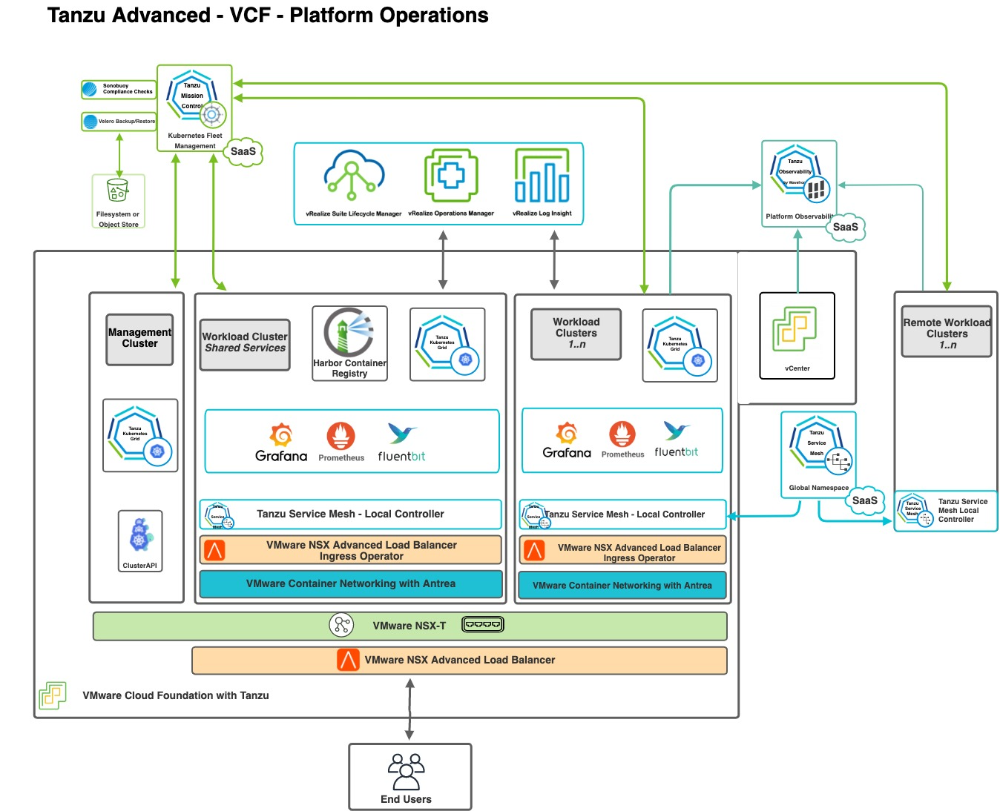
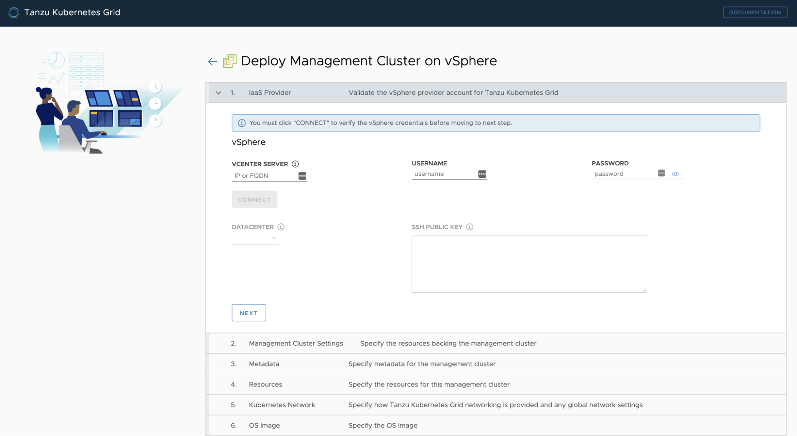
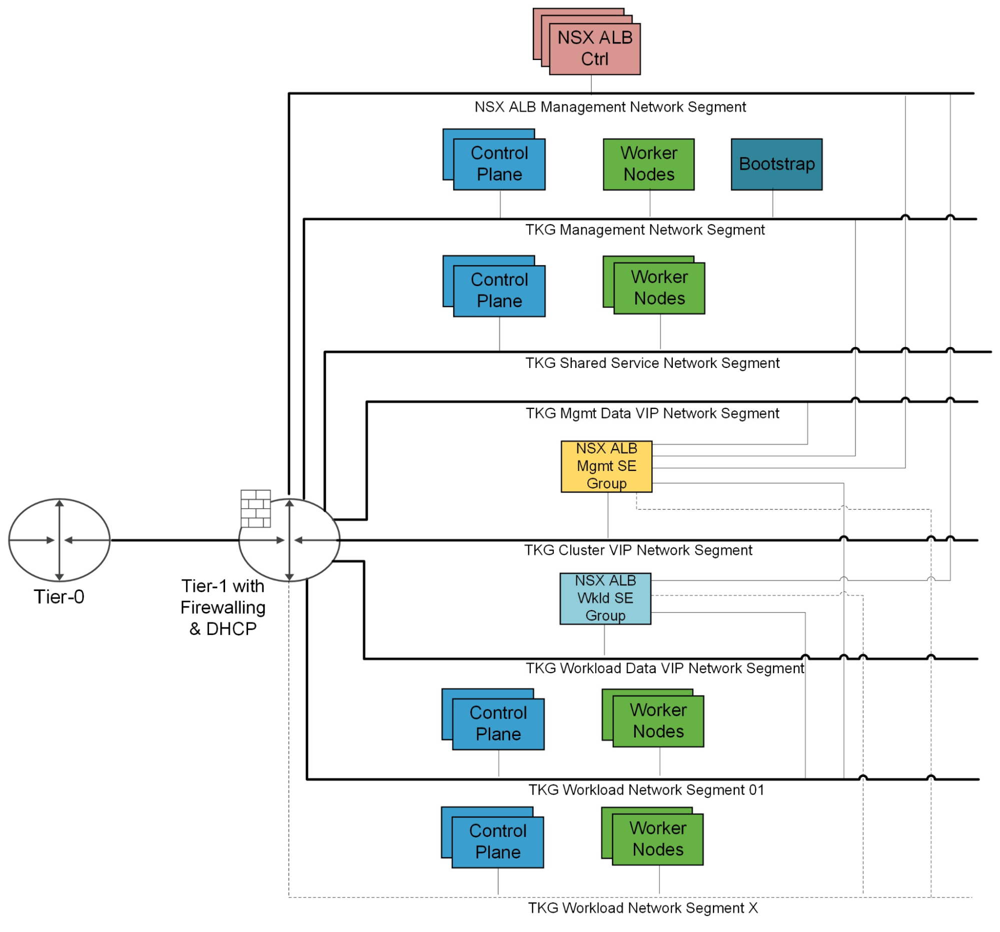
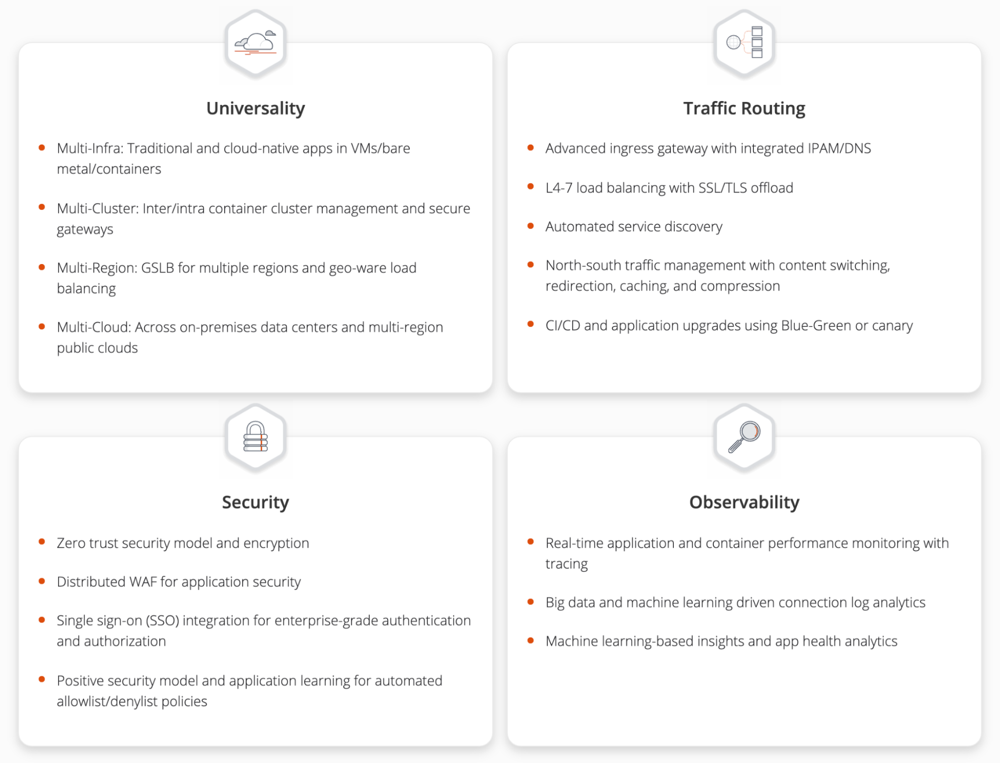
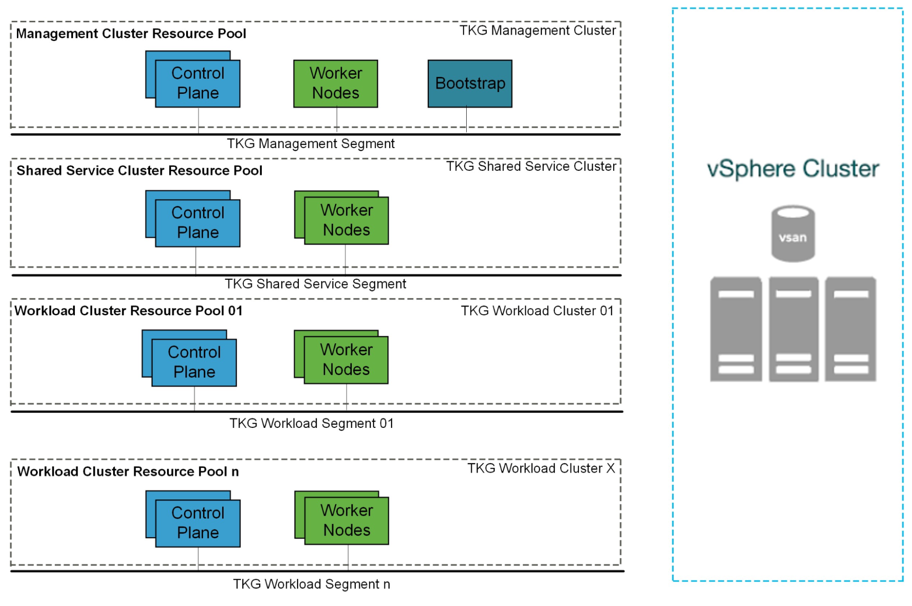
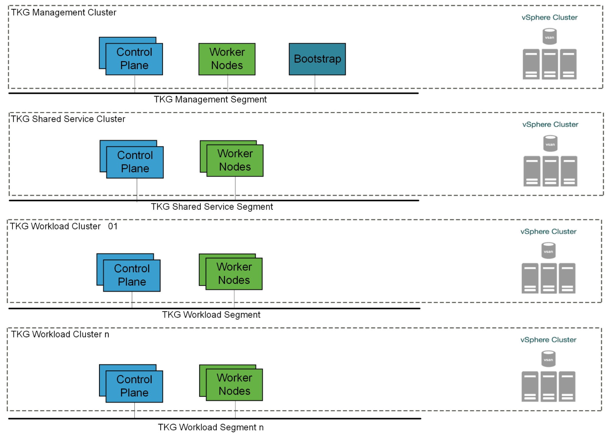

# VMware Tanzu for Kubernetes Operations on vSphere with NSX-T Reference Design

VMware Tanzu simplifies operation of Kubernetes for multi-cloud deployment by centralizing management and governance for clusters and teams across on-premises, public clouds, and edge. It delivers an open source aligned Kubernetes distribution with consistent operations and management to support infrastructure and application modernization.

This document lays out a reference design for deploying VMware Tanzu for Kubernetes Operations on a vSphere environment backed by NSX-T.

The following reference design is based on the architecture and components described in [VMware Tanzu for Kubernetes Operations Reference Architecture](index.md).



## Supported Component Matrix

The following table provides the component versions and interoperability matrix supported with the reference design:

| **Software Components** | **Version** |
| --- | --- |
| Tanzu Kubernetes Grid | 1.4.0 |
| VMware vSphere ESXi | 6.7U3 and later |
| VMware vCenter (VCSA) | 6.7U3 and later |
| VMware vSAN | 6.7U3 and later |
| NSX Advanced LB | 20.1.6 |


## Installation Experience

You can create three types of clusters in a Tanzu Kubernetes Grid environment

- Management Cluster
- Shared Services Cluster
- Workload Cluster

### Management Cluster

The management cluster is a Kubernetes cluster that runs Cluster API operations on a specific cloud provider to create and manage workload clusters on that provider. The management cluster is also where you configure the shared and in-cluster services that the workload clusters use.

You can deploy the management cluster in two ways:

- Run the Tanzu Kubernetes Grid installer, a wizard interface that guides you through the process of deploying a management cluster. This is the recommended method if you are installing a Tanzu Kubernetes Grid management cluster for the first time. The Tanzu Kubernetes Grid installer is tailored to a vSphere environment.
- Create and edit YAML configuration files to deploy a management cluster with the CLI commands.




### Shared Services Cluster

Each Tanzu Kubernetes Grid instance can only have one shared services cluster. You will deploy this cluster only if you intend to deploy Harbor.

The Harbor service runs on a shared services cluster, to serve all the other clusters in an installation. The Harbor service requires the Contour service to also run on the shared services cluster.

To deploy a shared services cluster, you create a configuration file that specifies the different options with which to deploy the cluster. You then run the `tanzu cluster create` command, specifying the configuration file in the `--file` option.

After the cluster is created, add the `tanzu-services` label to the shared services cluster as its cluster role. This label identifies the shared services cluster to the management cluster and workload clusters. For example:

`kubectl label cluster.cluster.x-k8s.io/tkg-services cluster-role.tkg.tanzu.vmware.com/tanzu-services="" --overwrite=true`

 In the example, `tkg-services` is the name of the shared services cluster. You will see the confirmation `cluster.cluster.x-k8s.io/tkg-services labeled`.

### Design Recommendations for Tanzu Kubernetes Grid Management and Shared Services Clusters

- Make use of the Tanzu Kubernetes Grid installer interface rather than the CLI to deploy your first Tanzu Kubernetes Grid management cluster.
 When you deploy a management cluster by using the installer interface, it populates a cluster configuration file for the management cluster with the required parameters. You can use the configuration file as a model for future deployments from the CLI.
- Use NSX Advanced Load Balancer as your Control Plane Endpoint Provider and for application load balancing.
 This eliminates the requirement for an external load balancer and additional configuration changes on your Tanzu Kubernetes Grid clusters.
 Tanzu Kubernetes Grid includes VMware NSX Advanced Load Balancer Essentials Edition.
- Enable identity management for Tanzu Kubernetes Grid clusters. We recommend using identity management for any production grade deployment. This avoids usage of administrator credentials and ensures that required users with right roles have access to Tanzu Kubernetes Grid clusters.
- Enable Machine Health Checks - vSphere HA and Machine Health Checks interoperably work together to enhance workload resiliency
- In order to have flexible firewall and security policies, use dedicated segments for
  - Tanzu Kubernetes Grid management cluster nodes
  - Tanzu Kubernetes Grid shared services cluster nodes
  - VIP network for Control Plane HA
  - VIP network for applications hosted on shared services cluster
- Create a separate service engine group in NSX Advanced Load Balancer. Service engines part of this Service Engine Group hosts VIPs to provide load balancing service for:
  - Tanzu Kubernetes Grid clusters control plane nodes
  - Pinniped
  - User managed packages, such as Harbor, deployed in shared services clusters

- For production based deployments, make use of **Prod** plan for both Tanzu Kubernetes Grid Management and shared services cluster. This deploys multiple control plane nodes and provides HA.
- Set the control plane and worker nodes size for the management cluster to **Large**. This allows for the deployment of Cert Manager, Contour, and Harbor extensions and integrating the shared service cluster with Tanzu Mission Control and Tanzu Observability. See [Appendix A - Configure Node Sizes](#appendix-a) for more details.
- If you are deploying Harbor in the shared services cluster without a publicly signed certificate, create the required overlays such that the Tanzu Kubernetes Grid cluster nodes trust the Harbor endpoint.

### Workload Cluster

Your applications run on Tanzu Kubernetes workload clusters. These clusters can be attached to SaaS solutions such as Tanzu Mission Control, Tanzu Observability, and  Tanzu Service Mesh, which are part of the Tanzu for Kubernetes Operations stack.

When you deploy Tanzu Kubernetes (workload) clusters to vSphere, you must specify options in the cluster configuration file to connect to vCenter Server and identify the vSphere resources that the cluster will use. You can also specify standard sizes for the control plane and worker node VMs and configure the CPU, memory, and disk sizes for control plane and worker nodes explicitly. If you use custom image templates, you can identify which template to use to create node VMs.


### Design Recommendations for Tanzu Kubernetes Grid Workload Clusters

- In order to have flexible firewall and security policies, use dedicated segments for
  - Each Tanzu Kubernetes Grid workload cluster
  - VIP network for applications hosted on workload clusters
- For Service Engine Group and VIP network for workload clusters:
  * Create a separate Service Engine Group in NSX Advanced Load Balancer. Service engines part of this Service Engine Group provides load balancing service for applications hosted on workload clusters.
  * For setups with a small number of Tanzu Kubernetes workload clusters that each have a large number of nodes, it is recommended to use one dedicated Service Engine Group per cluster.
  * A Service Engine Group can be shared by any number of workload clusters as long as the sum of the number of distinct cluster node networks and the number of distinct cluster VIP networks is no bigger than 8.
	* All clusters can share a single VIP network or each cluster can have a dedicated VIP network.

## Network Overview

### General Topology

 For deployment of Tanzu Kubernetes Grid in the vSphere environment, we build separate logical segments for the Tanzu Kubernetes Grid management cluster, Tanzu Kubernetes Grid shared services cluster, Tanzu Kubernetes Grid workload clusters, NSX ALB management, Cluster-VIP segment for Control plane HA, Tanzu Kubernetes Grid management VIP/Data segment, and Tanzu Kubernetes Grid workload Data/VIP segment. The network reference design can be mapped into this general framework.



### Network Recommendations

By bootstrapping a Kubernetes management cluster with the Tanzu command line tool, Tanzu Kubernetes Grid is able to manage the lifecycle of multiple Kubernetes workload clusters. Consider the following when configuring the network around Tanzu Kubernetes Grid:

- To have flexible firewall and security policies, place Tanzu Kubernetes Grid management cluster, shared services cluster, workload clusters, and all VIP/Data networks on separate Logical Segments.
- Tanzu Kubernetes Grid does not support static IP assignments for Tanzu Kubernetes Grid Kubernetes VM components. **DHCP is required for each Tanzu Kubernetes Grid cluster network (Mgmt, shared services, and Workload clusters)**
- NSX-T provides DHCP service on a segment. For a simpler configuration, make use of the DHCP local server to provide DHCP services for required segments.
- NSX Advanced load balancer is used to provide HA for the control plane of each Kubernetes cluster.
- NSX Advanced load balancer is used to provide load balancing services for applications hosted on shared services and workload clusters.
- The architecture supports network segments spread across multiple Tier-1 Routers
>  **Note:** When the segments are spread across multiple Tier-1 routers, required firewall rules need to be configured on each Tier-1 router. For more information, see [Firewall Recommendations](#firewall-reco).

This topology enables the following benefits:

- Isolate and separate SDDC management components (vCenter, ESX) from the Tanzu Kubernetes Grid components.
 This reference design only allows the minimum connectivity between the Tanzu Kubernetes Grid clusters and NSX ALB to the vCenter Server.
- Isolate and separate NSX ALB management network from the Tanzu Kubernetes Grid management segment and the Tanzu Kubernetes Grid workload segments.
- Depending on the workload cluster type and use case, multiple workload clusters may leverage the same logical segments or new segments can be used for each workload cluster.

 To isolate and separate Tanzu Kubernetes Grid workload cluster networking from each other, we recommend using separate logical segments for each workload cluster and configuring the required firewall between these networks. For more information, see [Firewall Recommendations](#firewall-reco).
- Separate provider and tenant access to the Tanzu Kubernetes Grid environment.
  - Only provide administrators access to the Tanzu Kubernetes Grid management cluster. This prevents tenants from attempting to connect to the Tanzu Kubernetes Grid management cluster.

#### Network Requirements

The following table provides the list of required networks:

| **Network Type** | **DHCP Service** | **Description Recommendations** |
| --- | --- | --- |
| NSX ALB Management Logical Segment | Optional | NSX ALB controllers and SEs will be attached to this network. DHCP is not a mandatory requirement on this network as NSX ALB can handle IPAM services for a given network |
| TKG Management Logical Segment | Yes | Control plane and worker nodes of TKG management cluster and shared services clusters will be attached to this network |
| TKG Shared Service Logical Segment | Yes | Control plane and worker nodes of the TKG shared services cluster will be attached to this network |
| TKG Workload Logical Segment | Yes | Control plane and worker nodes of the TKG workload clusters will be attached to this network |
| TKG Cluster VIP/Data Logical Segment | No | Virtual services for control plane HA of all TKG clusters (management, shared services, and workload). Reserve sufficient IPs depending on the number of TKG clusters planned to be deployed in the environment. NSX ALB takes care of IPAM on this network |
| TKG Management VIP/Data Logical Segment | No | Virtual services for all user-managed packages (such as Contour, Harbor, Contour, Prometheus, Grafana) hosted on the shared services cluster. See [User-Managed Packages](https://docs.vmware.com/en/VMware-Tanzu-Kubernetes-Grid/1.4/vmware-tanzu-kubernetes-grid-14/GUID-packages-user-managed-index.html) for mode details |
| TKG Workload VIP/Data Logical Segment | No | Virtual services for all applications hosted on the workload clusters. Reserve sufficient IPs depending on the number of applications that are planned to be hosted on the workload clusters along with scalability considerations. |


### <a id="firewall-reco"></a>Firewall Recommendations

To prepare the firewall, you need to gather the following:

1. NSX Advanced Load Balancer Management Network CIDR
2. Tanzu Kubernetes Grid Management Cluster Network CIDR
3. Tanzu Kubernetes Grid Cluster VIP Network CIDR
4. Tanzu Kubernetes Grid Management VIP Network CIDR
5. Tanzu Kubernetes Grid Workload Cluster CIDR
6. VMware Harbor registry IP
7. vCenter Server IP
8. DNS server IP(s)
9. NTP Server(s)


| **Source** | **Destination** | **Protocol:Port** | **Description** |
| --- | --- | --- | --- |
| TKG Management and TKG Workload Networks | DNS Server, NTP Server | UDP:53, UDP:123 | DNS Service, Time Synchronization |
| TKG Management and TKG Workload Networks | DHCP Server | UDP: 67, 68 | Allows hosts to get DHCP addresses |
| TKG Management and TKG Workload Networks | vCenter IP | TCP:443 | Allows components to access vCenter to create VMs and Storage Volumes |
| TKG Management, Shared Services, and Workload Cluster CIDR | Harbor Registry | TCP:443 | Allows components to retrieve container images. This registry can be a local or a public image registry (projects.registry.vmware.com) |
| TKG Management Cluster Network | TKG Cluster VIP Network | TCP:6443 | For management cluster to configure workload cluster |
| TKG Shared Services Cluster Network | TKG Cluster VIP Network | TCP:6443 | Allow shared services cluster to register with management cluster |
| TKG Workload Cluster Network | TKG Cluster VIP Network | TCP:6443 | Allow workload cluster to register with management cluster |
| TKG Management, TKG Shared Services, and TKG Workload Networks | AVI Controllers (NSX ALB Management Network) | TCP:443 | Allow Avi Kubernetes Operator (AKO) and AKO Operator (AKOO) access to Avi Controller |
| AVI Controllers (NSX ALB Management Network) | vCenter and ESXi Hosts | TCP:443 | Allow AVI to discover vCenter objects and deploy SEs as required |
| Admin network | Bootstrap VM | SSH:22 | To deploy, manage and configure TKG clusters |
|Deny-all | Any | Any | Deny |


### Ingress and Load Balancing

You can provision load balancer services with [**VMware NSX Advanced Load Balancer**](https://avinetworks.com/vmware-tanzu/) (NSX ALB).

NSX ALB **Essentials** provides **Layer 4 load balancing** for your Kubernetes workloads:



#### NSX Advanced Load Balancer (NSX ALB) integration with vSphere

NSX ALB is deployed in orchestrated Write Access Mode in a vSphere Environment. This mode grants NSX ALB full write access to the vCenter. NSX ALB can automatically create, modify, and remove SEs and other resources as needed to adapt to changing traffic needs.

##### Recommendations For NSX ALB Controller

- To have flexible firewall and security policies, place the NSX ALB controllers on a dedicated logical segment
- The Avi Controller service runs on three virtual machines and is a clustered service. This provides HA for NSX ALB controllers
>  **Note:** Requires advanced licensing.
- The Avi Controller VMs are only connected to the NSX ALB management network segment and the required firewall rules must be in place on the Tier-1 router. For more information, see [Firewall Recommendations](#firewall-reco).

**Avi Controller Configuration**

| **Avi Controller Configuration (medium)** | **Specification** |
| --- | --- |
| vCPUs | 8 |
| Memory (GB) | 24 |
| Hard disk (GB) | 128 |
| Number of network adapters | 1 |
| Number of appliances | 3 |

##### NSX ALB Controller Sizing Guidelines

Regardless of Avi Controller configuration, each Avi Controller cluster can achieve up to 5,000 virtual services, this is a hard limit. For further details, please refer to this [guide](https://avinetworks.com/docs/20.1/avi-controller-sizing/#cpuandmemalloc).

| **Controller Size** | **VM Configuration** | **Virtual Services** | **Avi SE Scale** |
| --- | --- | --- | --- |
| Small | 4 vCPUS, 12 GB RAM | 0-50 | 0-10 |
| Medium | 8 vCPUS, 24 GB RAM | 0-200 | 0-100 |
| Large | 16 vCPUS, 32 GB RAM | 200-1000 | 100-200 |
| Extra Large | 24 vCPUS, 48 GB RAM | 1000-5000 | 200-400 |

##### Recommendations for Avi Service Engines

  - Create a Service Engine Groups.
 	 -  In one Service Engine Group, the service engines (SE) part hosts VIPs to provide load balancing service for:
    	- Tanzu Kubernetes Grid clusters control plane nodes
    	- Pinniped
    	- User-managed packages, such as Harbor, deployed in the shared services cluster
  	- In a separate Service Engine Group the SE part part provides load balancing service for applications hosted on workload clusters.
- NSX ALB Service Engines (SEs) are deployed as virtual machines (VMs) and orchestrated by NSX ALB Controller.
- Depending on the network requirement for virtual services, network configurations for SEs is handled by NSX ALB controller.
- The SEs connect to the Avi Controller over the NSX ALB management network segment, which is the logical network connection to the vNIC0 of the SE VM.
- For setups with a small number of Tanzu Kubernetes workload clusters that each have a large number of nodes, we recommended using one dedicated SE group per cluster.
- An SE group can be shared by any number of workload clusters as long as the sum of the number of distinct cluster node networks and the number of distinct cluster VIP networks is no bigger than 8.
- All clusters can share a single VIP network or each cluster can have a dedicated VIP network.

**Service Engine Configuration**

| **Service Engine Configuration** | **Specification** |
| --- | --- |
| vCPUs | 1 Default
 2 Recommended |
| Memory (GB) | 2 (4)\* |
| Hard disk (GB) | 15 |
| Number of network adapters | 10 |
| Number of service engines per Service Engine Group | 2 |

##### Service Engine Sizing Guidelines

See [Sizing Service Engines](https://avinetworks.com/docs/20.1/sizing-service-engines/)for guidance on sizing your SEs. In summary, for Intel v4 CPUs, for example Intel(R) Xeon(R) CPU E5-2686 v4 @ 2.30GHz:

| **Performance metric** | **1 vCPU core** |
| --- | --- |
| Throughput | 4 Gb/s |
| Connections/s | 40k |
| SSL Throughput | 1 Gb/s |
| SSL TPS (RSA2K) | ~600 |
| SSL TPS (ECC) | 2500 |

Multiple performance vectors or features may have an impact on performance. For instance, to achieve 1 Gb/s of SSL throughput and 2000 TPS of SSL with EC certificates, Avi recommends two cores.

Avi Service Engines may be configured with as little as 1 vCPU core and 1 GB RAM, or up to 36 vCPU cores and 128 GB RAM.

**Network Requirements**

- AVI Controllers are only connected to the AVI management network and AVI SEs are connected to multiple networks, such as, Management, VIP/Data Networks, and Tanzu Kubernetes Grid cluster networks.
- As part of the Tanzu requirements, DHCP service is mandatory on the Tanzu Kubernetes Grid cluster networks (management, shared services, and workload clusters).
 SEs connected to these networks can either make use of an available DHCP service or a static IP pool can be configured in NSX Advanced Load Balancer, so that NSX Advanced Load Balancer assigns IPs from the pools to the SEs.
- Starting from Tanzu Kubernetes Grid 1.4, either NSX Advanced Load Balancer or kube-vip can be used to provide HA for control plane endpoints of Tanzu Kubernetes Grid clusters. We recommend using NSX Advanced Load Balancer as the HA provider.
- For each Tanzu Kubernetes Grid VIP/Data network, reserve a block of IP addresses for the NSX Advanced Load Balancer service engines and virtual services. NSX Advanced Load Balancer can be used to handle IPAM for these networks.

##### Contour for Kubernetes Ingress Routing

Tanzu Editions also includes [Contour](https://projectcontour.io/) for Kubernetes Ingress routing. Contour and can be installed on any Tanzu Kubernetes Grid cluster with ease. For more information, see [Implementing Ingress Control with Contour](https://docs.vmware.com/en/VMware-Tanzu-Kubernetes-Grid/1.4/vmware-tanzu-kubernetes-grid-14/GUID-packages-ingress-contour.html). Contour provides **Layer 7 based routing** to Kubernetes services.


## Storage

Many storage options are available and Kubernetes is agnostic about which option you choose.

For Kubernetes stateful workloads, Tanzu Kubernetes Grid installs the **vSphere Container Storage interface (vSphere CSI)** to provision Kubernetes persistent volumes for pods automatically. While the default vSAN storage policy can be used, site reliability engineers (SREs) and administrators should evaluate the needs of their applications and craft a specific vSphere Storage Policy. vSAN storage policies describe classes of storage (e.g. SSD, NVME, etc.) along with quotas for your clusters.

In vSphere 7u1+ **environments with vSAN**, the vSphere CSI driver for Kubernetes also supports creation of **NFS File Volumes**, which support **ReadWriteMany** access modes. This allows for provisioning volumes, which can be read and written from multiple pods simultaneously. To support this, the **vSAN File Service** must be enabled.

Using **other types of vSphere Datastores is also possible**. Tanzu Kubernetes Grid Cluster Plans can be defined by operators to use a certain vSphere Datastore when creating new workload clusters. All developers would then have the ability to provision container-backed persistent volumes from that underlying datastore.


## Clustering on vSphere

### Single Cluster

Starting with a single vSphere cluster, management and workload Kubernetes clusters can be **separated into different vSphere resource pools**. Using a resource pool lets you manage each Kubernetes cluster's CPU and memory limitations and reservations. However, it does not separate elements on the physical layer.

This approach is ideal for functional trials, proofs-of-concepts, or production application deployments that do not require hardware separation.



### Multi-clusters

For more physical separation of application workloads on Kubernetes, operators can deploy **separate Kubernetes clusters to independent vSphere clusters** and gain physical layer separation. For example, a Kubernetes cluster with intense computing workloads can leverage hosts with high performance CPU, while extreme IO workload clusters can be placed onto hosts with high performance storage.

**This also applies to the management cluster** for compute separation between management and workloads.



### High Availability

Tanzu Kubernetes Grid relies heavily on existing vSphere features for mitigating common availability disruptions, such as single-host hardware failure. In this scenario, ensuring vSphere HA is enabled will allow VMs on failed hardware to be automatically restarted on surviving hosts.

The Tanzu Kubernetes Grid management cluster performs [Machine Health Checks](https://cluster-api.sigs.k8s.io/tasks/healthcheck.html) on all Kubernetes worker VMs. This ensures workloads remain in a functional state, and can remediate issues like:

- Worker VM accidentally deleted or corrupted
- Kubelet process on worker VM accidentally stopped or corrupted

This health check aims to ensure your worker capacity remains stable and can be scheduled for workloads. This health check, however, does not apply to VMs deployed on the control plane, and does not recreate VMs due to physical host failure. Sphere HA and Machine Health Checks interoperably work together to enhance workload resilience.

Enabling **Fully Automated DRS is also recommended** to continuously ensure cluster load is evenly spread over all hosts. This indirectly helps reduce vSphere HA recovery time as no single host is overloaded. Recovery time on surviving hosts is reduced because the number or the size of VMs is not large.


### Non-Stretched vSphere clusters

We propose deploying Tanzu Kubernetes Grid on non-stretched vSphere clusters. Although stretched cluster topology is possible, the Tanzu Kubernetes Grid layer is unaware of this and will provision VMs randomly across the two sites. This would mean that, when the VMs are placed in an unlucky way, you will experience downtimes during a site failure. You can run the workloads in an active passive way by putting the hosts on the second site in maintenance mode, and perform DRS on site failure. However, this will cause downtime. These setups are not fully supported yet and not advised for production environments.

## Container Registry

The Tanzu Editions include [Harbor](https://goharbor.io/) as a container registry. Harbor provides a location for pushing, pulling, storing, and scanning container images used in your Kubernetes clusters. There are three main supported installation methods for Harbor:

- [**Tanzu Kubernetes Grid Package deployment**](https://docs.vmware.com/en/VMware-Tanzu-Kubernetes-Grid/1.4/vmware-tanzu-kubernetes-grid-14/GUID-packages-harbor-registry.html) on a Tanzu Kubernetes Grid shared services cluster cluster - Tanzu Kubernetes Grid includes signed binaries for Harbor, which you can deploy into a shared services cluster to provide container registry services for other Tanzu Kubernetes (workload) clusters. This installation method is recommended for general use cases.
- [**Helm based deployment**](https://goharbor.io/docs/2.1.0/install-config/harbor-ha-helm/) to a Kubernetes cluster - this installation method may be preferred for customers already invested in Helm.
- [**VM-based deployment]**(https://goharbor.io/docs/2.1.0/install-config/installation-prereqs/) using docker-compose - this installation method is recommended in cases where Tanzu Kubernetes Grid is installed in an air-gapped environment and no pre-existing Kubernetes clusters exist on which to install Harbor. When Kubernetes is already available, the Helm based deployment also works for air-gapped environments.

If you are deploying Harbor without a publicly signed certificate, create the required overlays such that the Tanzu Kubernetes Grid cluster nodes trust the Harbor endpoint.


## Deployment Instructions
For instructions on how to deploy this reference design, see [Deploy VMware Tanzu for Kubernetes Operations on VMware vSphere with VMware NSX-T](../deployment-guides/tko-on-vsphere-nsxt.md).

## <a id=appendix-a></a> Appendix A - Configure Node Sizes

The Tanzu CLI creates the individual nodes of management clusters and Tanzu Kubernetes clusters according to settings that you provide in the configuration file. On vSphere, you can configure all node VMs to have the same predefined configurations, set different predefined configurations for control plane and worker nodes, or customize the configurations of the nodes. By using these settings, you can create clusters that have nodes with different configurations to the management cluster nodes. You can also create clusters in which the control plane nodes and worker nodes have different configurations.

### Use Predefined Node Configurations

The Tanzu CLI provides the following predefined configurations for cluster nodes:

1. small: 2 CPUs, 4 GB memory, 20 GB disk
2. medium: 2 CPUs, 8 GB memory, 40 GB disk
3. large: 4 CPUs, 16 GB memory, 40 GB disk
4. extra-large: 8 CPUs, 32 GB memory, 80 GB disk

To create a cluster in which the control plane and worker node VMs are the same size, specify the `SIZE` variable. If you set the `SIZE` variable, all nodes will be created with the configuration that you set.

 SIZE: "large"

To create a cluster in which the control plane and worker node VMs are different sizes, specify the `CONTROLPLANE_SIZE` and `WORKER_SIZE` options.

<!-- /* cSpell:disable */ -->
```bash
CONTROLPLANE_SIZE: "medium"
WORKER_SIZE: "extra-large"
```
<!-- /* cSpell:enable */ -->

You can combine the `CONTROLPLANE_SIZE` and `WORKER_SIZE` options with the `SIZE` option. For example, if you specify `SIZE: "large"` with `WORKER_SIZE: "extra-large"`, the control plane nodes will be set to large and worker nodes will be set to extra-large.

<!-- /* cSpell:disable */ -->
```bash
SIZE: "large"
WORKER_SIZE: "extra-large"
```
<!-- /* cSpell:enable */ -->

### Define Custom Node Configurations

You can customize the configuration of the nodes rather than using the predefined configurations.

To use the same custom configuration for all nodes, specify the `VSPHERE_NUM_CPUS`, `VSPHERE_DISK_GIB`, and `VSPHERE_MEM_MIB` options.

<!-- /* cSpell:disable */ -->
```bash
VSPHERE_NUM_CPUS: 2
VSPHERE_DISK_GIB: 40
VSPHERE_MEM_MIB: 4096
```
<!-- /* cSpell:enable */ -->

To define different custom configurations for control plane nodes and worker nodes, specify the `VSPHERE_CONTROL_PLANE_*` and `VSPHERE_WORKER_*`

<!-- /* cSpell:disable */ -->
```bash
VSPHERE_CONTROL_PLANE_NUM_CPUS: 2
VSPHERE_CONTROL_PLANE_DISK_GIB: 20
VSPHERE_CONTROL_PLANE_MEM_MIB: 8192
VSPHERE_WORKER_NUM_CPUS: 4
VSPHERE_WORKER_DISK_GIB: 40
VSPHERE_WORKER_MEM_MIB: 4096
```
<!-- /* cSpell:enable */ -->
