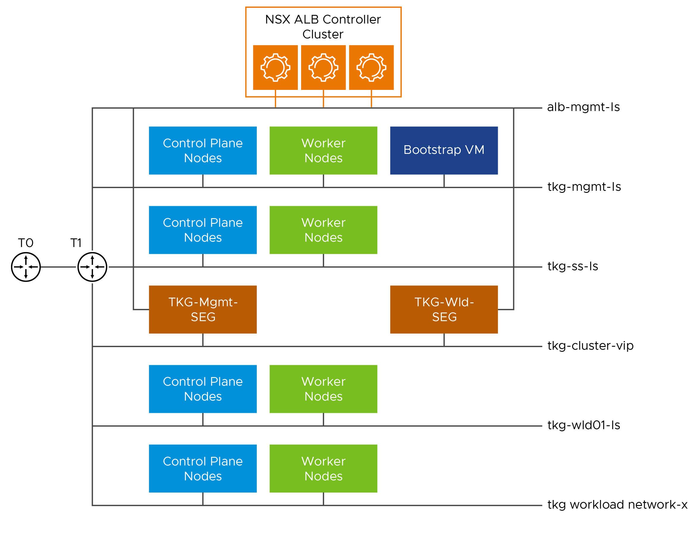

# VMware Tanzu for Kubernetes Operations on vSphere with NSX Networking Reference Design

VMware Tanzu simplifies operation of Kubernetes for multi-cloud deployment by centralizing management and governance for clusters and teams across on-premises, public clouds, and edge. It delivers an open source aligned Kubernetes distribution with consistent operations and management to support infrastructure and application modernization.

This document lays out a reference architecture related for VMware Tanzu for Kubernetes Operations when deployed on a vSphere environment backed by VMware NSX and offers a high-level overview of the different components.

This reference design is based on the architecture and components described in [VMware Tanzu for Kubernetes Operations Reference Architecture](index.md).

## Supported Component Matrix

The validated Bill of Materials that can be used to install Tanzu Kubernetes Grid on your vSphere with NSX environment is as follows:

|**Software Components**|**Version**|
| --- | --- |
|Tanzu Kubernetes Grid|2.2.0|
|VMware vSphere ESXi|7.0 U3g and later|
|VMware vCenter (VCSA)|7.0 U3g and later|
|NSX Advanced Load Balancer|22.1.3|
|VMware NSX|4.1.0.0|

For more information about the software versions can be used together, see [Interoperability Matrix](https://interopmatrix.vmware.com/Interoperability?col=551,17050&row=789,%262,%26912,).

## Tanzu Kubernetes Grid Components

VMware Tanzu Kubernetes Grid (TKG) provides organizations with a consistent, upstream-compatible, regional Kubernetes substrate that is ready for end-user workloads and ecosystem integrations. You can deploy Tanzu Kubernetes Grid across software-defined datacenters (SDDC) and public cloud environments, including vSphere, Microsoft Azure, and Amazon EC2.

Tanzu Kubernetes Grid comprises the following components:

**Management Cluster -** A management cluster is the first element that you deploy when you create a Tanzu Kubernetes Grid instance. The management cluster is a Kubernetes cluster that performs the role of the primary management and operational center for the Tanzu Kubernetes Grid instance. The management cluster is purpose-built for operating the platform and managing the lifecycle of Tanzu Kubernetes clusters.

**ClusterClass API -** Tanzu Kubernetes Grid 2 functions through the creation of a management Kubernetes cluster which holds [ClusterClass API](https://cluster-api.sigs.k8s.io/introduction.html). The ClusterClass API then interacts with the infrastructure provider to service workload Kubernetes cluster lifecycle requests.The earlier primitives of Tanzu Kubernetes Clusters will still exist for Tanzu Kubernetes Grid 1.X . A new feature has been introduced as a part of Cluster API called ClusterClass which reduces the need for redundant templating and enables powerful customization of clusters. The whole process for creating a cluster using ClusterClass is the same as before but with slightly different parameters. 

**Tanzu Kubernetes Cluster -** Tanzu Kubernetes clusters are the Kubernetes clusters in which your application workloads run. These clusters are also referred to as workload clusters. Tanzu Kubernetes clusters can run different versions of Kubernetes, depending on the needs of the applications they run.

**Shared Service Cluster -** Each Tanzu Kubernetes Grid instance can only have one shared services cluster. You deploy this cluster only if you intend to deploy shared services such as Contour and Harbor.

**Tanzu Kubernetes Cluster Plans -** A cluster plan is a blueprint that describes the configuration with which to deploy a Tanzu Kubernetes cluster. It provides a set of configurable values that describe settings like the number of control plane machines, worker machines, VM types, and so on. This release of Tanzu Kubernetes Grid provides two default templates, dev and prod.

**Tanzu Kubernetes Grid Instance -** A Tanzu Kubernetes Grid instance is the full deployment of Tanzu Kubernetes Grid, including the management cluster, the workload clusters, and the shared services cluster that you configure.

**Tanzu CLI -** A command-line utility that provides the necessary commands to build and operate Tanzu management and Tanzu Kubernetes clusters.

**Carvel Tools -** Carvel is an open-source suite of reliable, single-purpose, composable tools that aid in building, configuring, and deploying applications to Kubernetes. Tanzu Kubernetes Grid uses the following Carvel tools:

- **ytt -** A command-line tool for templating and patching YAML files. You can also use `ytt` to collect fragments and piles of YAML into modular chunks for reuse.
- **kapp -** The application deployment CLI for Kubernetes. It allows you to install, upgrade, and delete multiple Kubernetes resources as one application.
- **kbld -** An image-building and resolution tool.
- **imgpkg -** A tool that enables Kubernetes to store configurations and the associated container images as OCI images, and to transfer these images.
- **yq -** a lightweight and portable command-line YAML, JSON, and XML processor. `yq` uses `jq`-like syntax but works with YAML files as well as JSON and XML.

**Bootstrap Machine -** The bootstrap machine is the laptop, host, or server on which you download and run the Tanzu CLI. This is where the initial bootstrapping of a management cluster occurs before it is pushed to the platform on which it runs.

**Tanzu Kubernetes Grid Installer -** The Tanzu Kubernetes Grid installer is a CLI or a graphical wizard that provides an option to deploy a management cluster. You launch it locally on the bootstrap machine by running the `tanzu management-cluster` create command.

## Tanzu Kubernetes Grid Storage

Tanzu Kubernetes Grid integrates with shared datastores available in the vSphere infrastructure. The following types of shared datastores are supported:

- vSAN
- VMFS
- NFS
- vVols

Tanzu Kubernetes Grid is agnostic to which option you choose. For Kubernetes stateful workloads, Tanzu Kubernetes Grid installs the [vSphere Container Storage interface (vSphere CSI)](https://github.com/container-storage-interface/spec/blob/master/spec.md) to automatically provision Kubernetes persistent volumes for pods.

Tanzu Kubernetes Grid Cluster Plans can be defined by operators to use a certain vSphere datastore when creating new workload clusters. All developers then have the ability to provision container-backed persistent volumes from that underlying datastore.

## Tanzu Kubernetes Clusters Networking

A Tanzu Kubernetes cluster provisioned by Tanzu Kubernetes Grid supports two Container Network Interface (CNI) options:

- [Antrea](https://antrea.io/)
- [Calico](https://www.tigera.io/project-calico/)

Both are open-source software that provide networking for cluster pods, services, and ingress.

When you deploy a Tanzu Kubernetes cluster using Tanzu Mission Control or Tanzu CLI, Antrea CNI is automatically enabled in the cluster.

Tanzu Kubernetes Grid also supports [Multus](https://github.com/k8snetworkplumbingwg/multus-cni) CNI which can be installed through Tanzu user-managed packages. Multus CNI lets you attach multiple network interfaces to a single pod and associate each with a different address range.

To provision a Tanzu Kubernetes cluster using a non-default CNI, see the following instructions:

- [Deploy Tanzu Kubernetes clusters with Calico](https://docs.vmware.com/en/VMware-Tanzu-Kubernetes-Grid/2.2/using-tkg-22/workload-clusters-networking.html#calico)
- [Implement Multiple Pod Network Interfaces with Multus](https://docs.vmware.com/en/VMware-Tanzu-Kubernetes-Grid/2.2/using-tkg-22/workload-packages-multus.html)

Each CNI is suitable for a different use case. The following table lists some common use cases for the three CNIs that Tanzu Kubernetes Grid supports. This table helps you with information on selecting the right CNI in your Tanzu Kubernetes Grid implementation.

|**CNI**|**Use Case**|**Pros and Cons**|
| --- | --- | --- |
|Antrea|
Enable Kubernetes pod networking with IP overlay networks using VXLAN or Geneve for encapsulation. Optionally encrypt node-to-node communication using IPSec packet encryption.

Antrea supports advanced network use cases like kernel bypass and network service mesh.
|
Pros

- Provides an option to configure egress IP pool or static egress IP for Kubernetes workloads.
|
|Calico|
Calico is used in environments where factors like network performance, flexibility, and power are essential.

For routing packets between nodes, Calico leverages the BGP routing protocol instead of an overlay network. This eliminates the need to wrap packets with an encapsulation layer resulting in increased network performance for Kubernetes workloads.
|
Pros

- Support for network policies

- High network performance

- SCTP support

Cons

- No multicast support

|
|Multus|Multus CNI provides multiple interfaces per each Kubernetes pod. Using Multus CRDs, you can specify which pods get which interfaces and allow different interfaces depending on the use case.|
Pros

- Separation of data/control planes.

- Separate security policies can be used for separate interfaces. 

- Supports SR-IOV, DPDK, OVS-DPDK, and VPP workloads in Kubernetes with both cloud native and NFV based applications in Kubernetes.
|

## Deploy Pods with Routable and No-NAT IP Addresses (NSX)

On vSphere with NSX networking and the Antrea container network interface (CNI), you can configure a workload clusters with routable IP addresses for its worker pods, bypassing network address translation (NAT) for external requests from and to the pods.

You can perform the following tasks by using the routable IP addresses on pods:

- Trace outgoing requests to common shared services, due to their source IP address is the routable pod IP address and not a NAT address.
- Support authenticated incoming requests from the external internet directly to pods by bypassing NAT.

## Tanzu Kubernetes Grid Infrastructure Networking

Tanzu Kubernetes Grid on vSphere can be deployed on various networking stacks including:

- VMware NSX Data Center Networking
- vSphere Networking (VDS)

**Note:** The scope of this document is limited to VMware NSX Data Center Networking with NSX Advanced Load Balancer Enterprise Edition.

## Tanzu Kubernetes Grid on VMware NSX Data Center Networking with NSX Advanced Load Balancer

When deployed on VMware NSX Networking, Tanzu Kubernetes Grid uses the NSX logical segments and gateways to provide connectivity to Kubernetes control plane VMs, worker nodes, services, and applications. All hosts from the cluster where Tanzu Kubernetes clusters are deployed are configured as NSX transport nodes, which provide network connectivity to the Kubernetes environment.

You can configure NSX Advanced Load Balancer in Tanzu Kubernetes Grid as:

- L4 load balancer for application hosted on the TKG cluster.

- The L7 ingress service provider for the applications in the clusters that are deployed on vSphere.

- L4 load balancer for the control plane API server.

Each workload cluster integrates with NSX Advanced Load Balancer by running an Avi Kubernetes Operator (AKO) on one of its nodes. The cluster’s AKO calls the Kubernetes API to manage the lifecycle of load balancing and ingress resources for its workloads.

## NSX Advanced Load Balancer Components

NSX Advanced Load Balancer is deployed in Write Access Mode in VMware NSX Environment. This mode grants NSX Advanced Load Balancer controllers full write access to vCenter which helps in automatically creating, modifying, and removing service engines (SEs) and other resources as needed to adapt to changing traffic needs. The core components of NSX Advanced Load Balancer are as follows:

- **NSX Advanced Load Balancer Controller** - NSX Advanced Load Balancer controller manages virtual service objects and interacts with the vCenter Server infrastructure to manage the lifecycle of the service engines (SEs). It is the central repository for the configurations and policies related to services and management, and it provides the portal for viewing the health of VirtualServices and SEs and the associated analytics that NSX Advanced Load Balancer provides.
- **NSX Advanced Load Balancer Service Engine** - The service engines (SEs) are lightweight VMs that handle all data plane operations by receiving and executing instructions from the controller. The SEs perform load balancing and all client- and server-facing network interactions.
- **Service Engine Group -** Service engines are created within a group, which contains the definition of how the SEs should be sized, placed, and made highly available. Each cloud has at least one SE group.
- **Cloud -** Clouds are containers for the environment that NSX Advanced Load Balancer is installed or operating within. During the initial setup of NSX Advanced Load Balancer, a default cloud, named `Default-Cloud`, is created. This is where the first controller is deployed into Default-Cloud. Additional clouds may be added containing SEs and virtual services.
- **Avi Kubernetes Operator (AKO)** - It is a Kubernetes operator that runs as a pod in the Supervisor Cluster and Tanzu Kubernetes clusters, and it provides ingress and load balancing functionality. AKO translates the required Kubernetes objects to NSX Advanced Load Balancer objects and automates the implementation of ingresses, routes, and services on the service engines (SE) through the NSX Advanced Load Balancer Controller.
- **AKO Operator (AKOO)** - This is an operator which is used to deploy, manage, and remove the AKO pod in Kubernetes clusters. This operator when deployed creates an instance of the AKO controller and installs all the relevant objects like:
  - AKO `Statefulset`
  - `Clusterrole` and `Clusterrolebinding`
  - `Configmap` (required for the AKO controller and other artifacts).

Tanzu Kubernetes Grid management clusters have an AKO operator installed out of the box during cluster deployment. By default, a Tanzu Kubernetes Grid management cluster has a couple of AkoDeploymentConfig created which dictate when and how AKO pods are created in the workload clusters. For more information, see [AKO Operator documentation](https://github.com/vmware/load-balancer-and-ingress-services-for-kubernetes/tree/master/ako-operator).

Each environment configured in NSX Advanced Load Balancer is referred to as a cloud. Each cloud in NSX Advanced Load Balancer maintains networking and service engine settings. The cloud is configured with one or more VIP networks to provide IP addresses for load balancing (L4/L7) virtual services created under that cloud.

The virtual services can be spanned across multiple service Engines if the associated Service Engine Group is configured in Active/Active HA mode. A service engine can belong to only one SE group at a time.

IP address allocation for virtual services can be over DHCP or through NSX Advanced Load Balancer in-built IPAM functionality. The VIP networks created or configured in NSX Advanced Load Balancer are associated with the IPAM profile.

## Network Architecture

For the deployment of Tanzu Kubernetes Grid in the VMware NSX environment, it is required to build separate networks for the Tanzu Kubernetes Grid management clusters, workload clusters, NSX Advanced Load Balancer management, cluster-VIP, and workload VIP network for control plane HA and application load balancing/ingress.

The network reference design can be mapped into this general framework. This design uses a single VIP network for control plane L4 load balancing and application L4/L7. This design is mostly suited for dev/test environment.

Another reference design that can be implemented in production environment is shown below, and it uses separate VIP network for the applications deployed in management/shared services and the workload cluster. 

This topology enables the following benefits:

- Isolate and separate SDDC management components (vCenter, ESX) from the Tanzu Kubernetes Grid components. This reference design allows only the minimum connectivity between the Tanzu Kubernetes Grid clusters and NSX Advanced Load Balancer to the vCenter Server.
- Isolate and separate NSX Advanced Load Balancer management network from the Tanzu Kubernetes Grid management segment and the Tanzu Kubernetes Grid workload segments.
- Depending on the workload cluster type and use case, multiple workload clusters may leverage the same workload network or new networks can be used for each workload cluster. To isolate and separate Tanzu Kubernetes Grid workload cluster networking from each other it’s recommended to make use of separate networks for each workload cluster and configure the required firewall between these networks. For more information, see [Firewall Requirements](#fwreq).
- Separate provider and tenant access to the Tanzu Kubernetes Grid environment.
  - Only provider administrators need access to the Tanzu Kubernetes Grid management cluster. This prevents tenants from attempting to connect to the Tanzu Kubernetes Grid management cluster.

###  Network Requirements

As per the production architecture, the following list of networks are required:

|**Network Type**|**DHCP Service**|
**Description & Recommendations**

|
| --- | --- | --- |
|NSX ALB Management Logical Segment|Optional|
NSX ALB controllers and SEs are attached to this network. 

DHCP is not a mandatory requirement on this network as NSX ALB can handle IPAM services for the management network.
|
|TKG Management Logical Segment|Yes|Control plane and worker nodes of TKG management cluster are attached to this network.|
|TKG Shared Service Logical Segment|Yes|Control plane and worker nodes of TKG shared services cluster are attached to this network.|
|TKG Workload Logical Segment|Yes|Control plane and worker nodes of TKG workload clusters are attached to this network.|
|TKG Management VIP Logical Segment|No|Virtual services for control plane HA of all TKG clusters (management, shared services, and workload). Reserve sufficient IP addresses depending on the number of TKG clusters planned to be deployed in the environment.   NSX Advanced Load Balancer takes care of IPAM on this network.|
|TKG Workload VIP Logical Segment|No|Virtual services for applications deployed in the workload cluster. The applications can be of type Load balancer or Ingress. Reserve sufficient IP addresses depending on the number of applications planned to be deployed in the environment.   NSX Advanced Load Balancer takes care of IPAM on this network.|

**Note -** You can also select `TKG Workload VIP` network for control plane HA of the workload cluster if you wish so. 

####  Subnet and CIDR Examples

For this demonstration, this document makes use of the following subnet CIDR for Tanzu for Kubernetes Operations deployment.

|**Network Type**|**Segment Name**|**Gateway CIDR**|**DHCP Pool in NSXT**|**NSX ALB IP Pool**|
| --- | --- | --- | --- | --- |
|NSX ALB Management Network|alb-mgmt-ls|172.19.71.1/27|N/A|172.19.71.6 - 172.19.71.30|
|TKG Management VIP Network|tkg-cluster-vip|172.19.75.1/26|N/A|172.19.75.2 - 172.19.75.60|
|TKG Management Network|tkg-mgmt-ls|172.19.72.1/27|172.19.72.2 - 172.19.72.30|N/A|
|TKG Shared Service Network|tkg-ss-ls|172.19.73.1/27|172.19.73.2 - 172.19.73.30|N/A|
|TKG Workload Network|tkg-workload-ls|172.19.77.1/24|172.19.77.2- 172.19.77.251|N/A|
|TKG Workload VIP Network|tkg-workload-vip-ls|172.19.77.1/24|172.19.77.2- 172.19.77.251|N/A|

These networks are spread across the tier-1 gateways shown in the reference architecture diagram. You must configure the appropriate firewall rules on the tier-1 gateways for a successful deployment.

###  Firewall Requirements
To prepare the firewall, you must collect the following information:

1. NSX ALB Controller nodes and Cluster IP address
2. NSX ALB Management Network CIDR
3. TKG Management Network CIDR
4. TKG Shared Services Network CIDR
5. TKG Workload Network CIDR
6. TKG Management VIP Address Range
7. Client Machine IP Address
8. Bootstrap machine IP Address
9. Harbor registry IP address
10. vCenter Server IP
11. DNS server IP(s)
12. NTP Server(s)
13. NSX nodes and VIP address.

|**Source**|**Destination**|**Protocol:Port**|**Description**|**Configured On**|
| --- | --- | --- | --- |---|
|NSX Advanced Load Balancer controllers and Cluster IP address|vCenter and ESXi hosts|TCP:443|Allows NSX ALB to discover vCenter objects and deploy SEs as required.|NSX ALB Tier-1 Gateway|
|NSX Advanced Load Balancer controllers and Cluster IP address|NSX nodes and VIP address.|TCP:443|Allows NSX ALB to discover NSX Objects (logical routers and logical segments, and so on).|NSX ALB Tier-1 Gateway|
|NSX Advanced Load Balancer management network CIDR|
DNS Server.

NTP Server
|
UDP:53

UDP:123
|
DNS Service

Time synchronization
|NSX ALB Tier-1 Gateway|
|Client Machine|NSX Advanced Load Balancer controllers and Cluster IP address|TCP:443|To access NSX Advanced Load Balancer portal.|NSX ALB Tier-1 Gateway|
|Client Machine|Bootstrap VM IP address|SSH:22|To deploy,configure and manage TKG clusters.|TKG Mgmt Tier-1 Gateway|
|
TKG management network CIDR

TKG shared services network CIDR

|DNS Server NTP Server|UDP:53 UDP:123|DNS Service  Time Synchronization|TKG Mgmt Tier-1 Gateway|
|
TKG management network CIDR

TKG shared services network CIDR

|vCenter Server|TCP:443|Allows components to access vCenter to create VMs and storage volumes|TKG Mgmt Tier-1 Gateway|
|
TKG management network CIDR

TKG shared services network CIDR

|Harbor Registry|TCP:443|
Allows components to retrieve container images. 

This registry can be a local or a public image registry. 
|TKG Mgmt Tier-1 Gateway|
|
TKG management network CIDR

TKG shared services network CIDR

|TKG Management VIP Network |TCP:6443|For management cluster to configure workload cluster.  Allows shared cluster to register with management cluster.|TKG Mgmt Tier-1 Gateway|
|
TKG management network CIDR

TKG shared services network CIDR

|NSX Advanced Load Balancer management network CIDR|TCP:443|Allow Avi Kubernetes Operator (AKO) and AKO Operator (AKOO) access to NSX ALB controller.|TKG Mgmt Tier-1 Gateway|
|TKG workload network CIDR|DNS Server NTP Server|UDP:53 UDP:123|DNS Service  Time Synchronization|TKG Workload Tier-1 Gateway|
|TKG workload network CIDR|vCenter Server|TCP:443|Allows components to access vCenter to create VMs and storage volumes.|TKG Workload Tier-1 Gateway|
|TKG workload network CIDR|Harbor Registry|TCP:443|
Allows components to retrieve container images. 

This registry can be a local or a public image registry. 
|TKG Workload Tier-1 Gateway|
|TKG workload network CIDR|TKG Management VIP Network |TCP:6443|Allow TKG workload clusters to register with TKG management cluster.|TKG Workload Tier-1 Gateway|
|TKG workload network CIDR|NSX Advanced Load Balancer management network CIDR|TCP:443|Allow Avi Kubernetes Operator (AKO) and AKO Operator (AKOO) access to NSX ALB controller.|TKG Workload Tier-1 Gateway|
|deny-all|any|any|deny|All Tier-1 gateways|

## Installation Experience

Tanzu Kubernetes Grid management cluster is the first component that you deploy to get started with Tanzu Kubernetes Grid.

You can deploy the management cluster in two ways:

- Run the Tanzu Kubernetes Grid installer, a wizard interface that guides you through the process of deploying a management cluster. This is the recommended method if you are installing a Tanzu Kubernetes Grid management cluster for the first time.
- Create and edit YAML configuration files, and use them to deploy a management cluster with the CLI commands.

The Tanzu Kubernetes Grid Installation user interface shows that, in the current version, it is possible to install Tanzu Kubernetes Grid on vSphere (including VMware Cloud on AWS), AWS EC2, and Microsoft Azure. The UI provides a guided experience tailored to the IaaS, in this case, VMware vSphere.

The installation of Tanzu Kubernetes Grid on vSphere is done through the same UI as mentioned above but tailored to a vSphere environment.

This installation process takes you through the setup of a management cluster on your vSphere environment. Once the management cluster is deployed, you can make use of [Tanzu Mission Control](https://tanzu.vmware.com/mission-control) or Tanzu CLI to deploy Tanzu Kubernetes shared service and workload clusters.

### Kubernetes Ingress Routing

The default installation of Tanzu Kubernetes Grid does not have any ingress controller installed. Users can use Contour, which is available for installation through Tanzu Packages, or any third-party ingress controller of their choice.

Contour is an open-source controller for Kubernetes ingress routing. Contour can be installed in the shared services cluster on any Tanzu Kubernetes Cluster. Deploying Contour is a prerequisite if you want to deploy Prometheus, Grafana, and Harbor packages on a workload cluster.

For more information about Contour, see the [Contour website](https://projectcontour.io/) and [Implementing Ingress Control with Contour](https://docs.vmware.com/en/VMware-Tanzu-Kubernetes-Grid/2.1/using-tkg-21/workload-packages-contour.html).

Another option is to use the NSX Advanced Load Balancer Kubernetes ingress controller that offers an advanced L4-L7 load balancing/ingress for containerized applications that are deployed in the Tanzu Kubernetes workload cluster.

For more information about the NSX Advanced Load Balancer ingress controller, see [Configuring L7 Ingress with NSX Advanced Load Balancer](https://docs.vmware.com/en/VMware-Tanzu-Kubernetes-Grid/2.1/tkg-deploy-mc-21/mgmt-reqs-network-nsx-alb-ingress.html).

[Tanzu Service Mesh](https://tanzu.vmware.com/service-mesh), which is a SaaS offering for modern applications running across multi-cluster, multi-clouds, also offers an ingress controller based on [Istio](https://istio.io/).

The following table provides general recommendations on when you should use a specific ingress controller for your Kubernetes environment.

|**Ingress Controller**|**Use Cases**|
| --- | --- |
|Contour|
Use Contour when only north-south traffic is needed in a Kubernetes cluster. You can apply security policies for the north-south traffic by defining the policies in the application's manifest file.

It's a reliable solution for simple Kubernetes workloads. 
|
|Istio|Use Istio ingress controller when you intend to provide security, traffic direction, and insights within the cluster (east-west traffic) and between the cluster and the outside world (north-south traffic).|
|NSX ALB ingress controller|
Use NSX ALB ingress controller when a containerized application requires features like local and global server load balancing (GSLB), web application firewall (WAF), performance monitoring, and so on. 

|

### NSX Advanced Load Balancer (ALB) as an L4+L7 Ingress Service Provider

NSX Advanced Load Balancer provides an L4+L7 load balancing solution for vSphere. It includes a Kubernetes operator that integrates with the Kubernetes API to manage the lifecycle of load balancing and ingress resources for workloads.

Legacy ingress services for Kubernetes include multiple disparate solutions. The services and products contain independent components that are difficult to manage and troubleshoot. The ingress services have reduced observability capabilities with little analytics, and they lack comprehensive visibility into the applications that run on the system. Cloud-native automation is difficult in the legacy ingress services.

In comparison to the legacy Kubernetes ingress services, NSX Advanced Load Balancer has comprehensive load balancing and ingress services features. As a single solution with a central control, NSX Advanced Load Balancer is easy to manage and troubleshoot. NSX Advanced Load Balancer supports real-time telemetry with an insight into the applications that run on the system. The elastic auto-scaling and the decision automation features highlight the cloud-native automation capabilities of NSX Advanced Load Balancer.

NSX Advanced Load Balancer also lets you configure L7 ingress for your workload clusters by using one of the following options:

- L7 ingress in ClusterIP mode
- L7 ingress in NodePortLocal mode
- L7 ingress in NodePort mode
- NSX Advanced Load Balancer L4 ingress with Contour L7 ingress

#### L7 Ingress in ClusterIP Mode

This option enables NSX Advanced Load Balancer L7 ingress capabilities, including sending traffic directly from the service engines (SEs) to the pods, preventing multiple hops that other ingress solutions need when sending packets from the load balancer to the right node where the pod runs. The NSX Advanced Load Balancer controller creates a virtual service with a backend pool with the pod IPs which helps to send the traffic directly to the pods.

However, each workload cluster needs a dedicated SE group for Avi Kubernetes Operator (AKO) to work, which could increase the number of SEs you need for your environment. This mode is used when you have a small number of workload clusters.

#### L7 Ingress in NodePort Mode

The NodePort mode is the default mode when AKO is installed on Tanzu Kubernetes Grid. This option allows your workload clusters to share SE groups and is fully supported by VMware. With this option, the services of your workloads must be set to NodePort instead of ClusterIP even when accompanied by an ingress object. This ensures that NodePorts are created on the worker nodes and traffic can flow through the SEs to the pods via the NodePorts. Kube-Proxy, which runs on each node as DaemonSet, creates network rules to expose the application endpoints to each of the nodes in the format “NodeIP:NodePort”. The NodePort value is the same for a service on all the nodes. It exposes the port on all the nodes of the Kubernetes Cluster, even if the pods are not running on it.

#### L7 Ingress in NodePortLocal Mode

This feature is supported only with Antrea CNI. You must enable this feature on a workload cluster before its creation. The primary difference between this mode and the NodePort mode is that the traffic is sent directly to the pods in your workload cluster through node ports without interfering Kube-proxy. With this option, the workload clusters can share SE groups. Similar to the ClusterIP Mode, this option avoids the potential extra hop when sending traffic from the NSX Advanced Load Balancer SEs to the pod by targeting the right nodes where the pods run.

Antrea agent configures NodePortLocal port mapping rules at the node in the format “NodeIP:Unique Port” to expose each pod on the node on which the pod of the service is running. The default range of the port number is 61000-62000. Even if the pods of the service are running on the same Kubernetes node, Antrea agent publishes unique ports to expose the pods at the node level to integrate with the load balancer.

#### NSX Advanced Load Balancer L4 Ingress with Contour L7 Ingress

This option does not have all the NSX Advanced Load Balancer L7 ingress capabilities but uses it for L4 load balancing only and leverages Contour for L7 Ingress. This also allows sharing SE groups across workload clusters. This option is supported by VMware and it requires minimal setup.

## Design Recommendations

### NSX Advanced Load Balancer Recommendations

The following table provides the recommendations for configuring NSX Advanced Load Balancer in a vSphere environment backed by NSX networking.

|**Decision ID**|**Design Decision**|**Design Justification**|**Design Implications**|
| --- | --- | --- | --- |
|TKO-ALB-001|Deploy NSX ALB controller cluster nodes on a network dedicated to NSX ALB.|Isolate NSX ALB traffic from infrastructure management traffic and Kubernetes workloads.|Additional Network (VLAN) is required.|
|TKO-ALB-002|Deploy 3 NSX ALB controller nodes.|To achieve high availability for the NSX ALB platform. In clustered mode, NSX ALB availability is not impacted by an individual controller node failure. The failed node can be removed from the cluster and redeployed if recovery is not possible.|Clustered mode requires more Compute and Storage resources. |
|TKO-ALB-003|Initial setup should be done only on one NSX Advanced Load Balancer controller VM out of the three deployed to create an NSX Advanced Load Balancer controller cluster.|NSX Advanced Load Balancer controller cluster is created from an initialized NSX Advanced Load Balancer controller which becomes the cluster leader.  Follower NSX Advanced Load Balancer controller nodes need to be uninitialized to join the cluster.|NSX Advanced Load Balancer controller cluster creation fails if more than one NSX Advanced Load Balancer controller is initialized.|
|TKO-ALB-004|Use static IP addresses for the NSX ALB controllers.|NSX ALB controller cluster uses management IP addresses to form and maintain quorum for the control plane cluster. Any changes to management IP addresses are disruptive.|NSX ALB Controller control plane might go down if the management IP addresses of the controller node change.|
|TKO-ALB-005|Use NSX ALB IPAM for service engine data network and virtual services. |Guarantees IP address assignment for service engine data NICs and virtual services.|None|
|TKO-ALB-006|Reserve an IP address in the NSX ALB management subnet to be used as the cluster IP address for the controller cluster.|NSX ALB portal is always accessible over cluster IP address regardless of a specific individual controller node failure.|None|
|TKO-ALB-007|Share service engines for the same type of workload (dev/test/prod) clusters.|Minimize the licensing cost.|
Each service engine contributes to the CPU core capacity associated with a license.

Sharing service engines can help reduce the licensing cost. 
|
|TKO-ALB-008|Configure anti-affinity rules for the NSX ALB controller cluster.|This is to ensure that no two controllers end up in same ESXi host and thus avoid single point of failure.| Anti-affinity rules need to be created manually.|
|TKO-ALB-009|Configure backup for the NSX ALB Controller cluster.|Backups are required if the NSX ALB Controller becomes inoperable or if the environment needs to be restored from a previous state.|To store backups, a SCP capable backup location is needed. SCP is the only supported protocol currently.|
|TKO-ALB-010|Create an NSX-T Cloud connector on NSX Advanced Load Balancer controller for each NSX transport zone requiring load balancing.|An NSX-T Cloud connector configured on the NSX Advanced Load Balancer controller provides load balancing for workloads belonging to a transport zone on NSX.|None |
|TKO-ALB-011|Replace default NSX ALB certificates with Custom CA or Public CA-signed certificates that contains  SAN entries of all Controller nodes |To establish a trusted connection with other infra components, and the default certificate doesn’t include SAN entries which is not acceptable by Tanzu. | None,   SAN entries are not applicable if using wild card certificate.  | 
|TKO-ALB-012|Create a dedicated resource pool with appropriate reservations for NSX ALB controllers.|Guarantees the CPU and Memory allocation for NSX ALB Controllers and avoids performance degradation in case of resource contention.| None |
|TKO-ALB-013|Configure Remote logging for NSX ALB Controller to send events on Syslog.|For operations teams to centrally monitor NSX ALB and escalate alerts events sent from the NSX ALB Controller.| Additional Operational Overhead.  Additional infrastructure Resource.|  
|TKO-ALB-014|Use LDAP/SAML based Authentication for NSX ALB| Helps to Maintain Role based Access Control. | Additional Configuration is required.|
### NSX Advanced Load Balancer Service Engine Recommendations

|**Decision ID**|**Design Decision**|**Design Justification**|**Design Implications**|
| --- | --- | --- | --- |
|TKO-ALB-SE-001|Configure SE Group for Active/Active HA mode.|Provides optimum resiliency, performance, and utilization.|Certain applications might not work in Active/Active mode. For instance, applications that require preserving client IP address. In such cases, use the legacy Active/Standby HA mode.|
|TKO-ALB-SE-002|Configure anti-affinity rule for the SE VMs.|This is ensure that no two SEs in the same SE group end up on same ESXi Host and thus avoid single point of failure.|DRS must be enabled on vSphere cluster where SE VMs are deployed.|
|TKO-ALB-SE-003|Configure CPU and Memory reservation for the SE VMs.|This is to ensure that service engines don’t compete with other VMs during resource contention.|CPU and memory reservation is configured at SE Group level.|
|TKO-ALB-SE-004|Enable 'Dedicated dispatcher CPU' on SE groups that contain the SE VMs of 4 or more vCPUs. Note: This setting must be enabled on SE groups that are servicing applications that have high network requirement.|This enables a dedicated core for packet processing enabling high packet pipeline on the SE VMs.|None.|
|TKO-ALB-SE-005|Create multiple SE groups as desired to isolate applications.|Allows efficient isolation of applications for better capacity planning.  Allows flexibility of life-cycle-management.|Multi SE groups will increase the licensing cost.|
|TKO-ALB-SE-006|Create separate service engine groups for TKG management and workload clusters.|Allows isolating the load balancing traffic of management cluster from shared services cluster and workload clusters.|Dedicated service engine groups increase licensing cost.|
|TKO-ALB-SE-007|Set 'Placement across the Service Engines' setting to 'distributed'.|This allows maximum fault tolerance and even utilization of capacity.| None|
|TKO-ALB-SE-008|Set the SE size to a minimum 2vCPU and 4GB of Memory. |This configuration should meet the most generic use case. | For services that require higher throughput, these configurations need to be investigated and modified accordingly. |

### NSX Advanced Load Balancer L7 Ingress Recommendations

|**Decision ID**|**Design Decision**|**Design Justification**|**Design Implications**|
| --- | --- | --- | --- |
|TKO-ALB-L7-001|Deploy NSX ALB L7 Ingress in NodePortLocal mode.| 1. Network hop efficiency is gained by by-passing the kube-proxy to receive external traffic to applications. 2. TKG clusters can share SE groups, optimizing or maximizing capacity and license consumption. 3. Pod's node port only exists on nodes where the Pod is running, and it helps to reduce the east-west traffic and encapsulation overhead. 4. Better session persistence. |1. This is supported only with Antrea CNI. 2. NodePortLocal mode is currently only supported for nodes running Linux or Windows with IPv4 addresses. Only TCP and UDP service ports are supported (not SCTP). For more information, see [Antrea NodePortLocal Documentation](https://antrea.io/docs/v1.8.0/docs/node-port-local/).|ß|

VMware recommends using NSX Advanced Load Balancer L7 ingress with the NodePortLocal mode as it gives you a distinct advantage over other modes as mentioned below:

- Although there is a constraint of one SE group per Tanzu Kubernetes Grid cluster, which results in increased license capacity, ClusterIP provides direct communication to the Kubernetes pods, enabling persistence and direct monitoring of individual pods.

- NodePort resolves the issue for needing a SE group per workload cluster, but a kube-proxy is created on each and every workload node even if the pod doesn’t exist in it, and there’s no direct connectivity. Persistence is then broken.

- NodePortLocal is the best of both use cases. Traffic is sent directly to the pods in your workload cluster through node ports without interfering with kube-proxy. SE groups can be shared and load balancing persistence is supported.

### Network Recommendations

The key network recommendations for a production-grade Tanzu Kubernetes Grid deployment with NSX Data Center Networking are as follows:

|**Decision ID**|**Design Decision**|**Design Justification**|**Design Implications**|
| --- | --- | --- | --- |
|TKO-NET-001|Use separate logical segments for management cluster, shared services cluster, workload clusters, and VIP network.|To have a flexible firewall and security policies.|Sharing the same network for multiple clusters can complicate firewall rules creation.|
|TKO-NET-002|Configure DHCP  for each TKG cluster network.|Tanzu Kubernetes Grid does not support static IP address assignments for Kubernetes VM components.|IP address pool can be used for the TKG clusters in absence of the DHCP.|
|TKO-NET-003|Use NSX for configuring DHCP|This avoids setting up dedicated DHCP server for TKG.|For a simpler configuration, make use of the DHCP local server to provide DHCP services for required segments.|
|TKO-NET-004|Create a overlay-backed NSX segment connected to a Tier-1 gateway for the SE management for the NSX Cloud of overlay type.|This network is used for the controller to the SE connectivity.|None|
|TKO-NET-005|Create a overlay-backed NSX segment as data network for the NSX Cloud of overlay type.|The SEs are placed on overlay Segments created on Tier-1 gateway.|None|

### Tanzu Kubernetes Grid Clusters Recommendations

|**Decision ID**|**Design Decision**|**Design Justification**|**Design Implications**|
| --- | --- | --- | --- |
|TKO-TKG-001|Register management cluster with Tanzu Mission Control (TMC).|Tanzu Mission Control automates the creation of the Tanzu Kubernetes clusters and manages the lifecycle of all clusters centrally.|Only Antrea CNI is supported on Workload clusters created via TMC Portal.|
|TKO-TKG-002|Use NSX Advanced Load Balancer as your control plane endpoint provider and for application load balancing.|Eliminates the requirement for an external load balancer and additional configuration changes on your Tanzu Kubernetes Grid clusters.|Adds NSX Advanced Load Balancer License cost to the solution.|
|TKO-TKG-003|Deploy Tanzu Kubernetes Management cluster in large form factor.|Large form factor should suffice to integrate TKG Management cluster with TMC, pinniped and Velero. This must be capable of accommodating 100+ Tanzu Workload Clusters.|
Consume more resources from infrastructure.
|
|TKO-TKG-004|Deploy the Tanzu Kubernetes Cluster with prod plan(Management and Workload Clusters).|Deploying three control plane nodes ensures the state of your Tanzu Kubernetes Cluster control plane stays healthy in the event of a node failure.|
Consume more resources from infrastructure.
|
|TKO-TKG-005|Enable identity management for Tanzu Kubernetes Grid clusters.|To avoid usage of administrator credentials and ensure that required users with right roles have access to Tanzu Kubernetes Grid clusters.|
Required external Identity Management.

|TKO-TKG-006|Enable MachineHealthCheck for TKG clusters.|vSphere HA and MachineHealthCheck interoperability work together to enhance workload resiliency.|NA|

## Container Registry

VMware Tanzu for Kubernetes Operations using Tanzu Kubernetes Grid includes Harbor as a container registry. Harbor provides a location for pushing, pulling, storing, and scanning container images used in your Kubernetes clusters.

Harbor registry is used for day-2 operations of the Tanzu Kubernetes workload clusters. Typical day-2 operations include tasks such as pulling images from Harbor for application deployment, pushing custom images to Harbor, and so on.

You may use one of the following methods to install Harbor:

- [**Tanzu Kubernetes Grid Package deployment**](https://docs.vmware.com/en/VMware-Tanzu-Kubernetes-Grid/2.1/using-tkg-21/workload-packages-harbor.html) to a Tanzu Kubernetes Grid cluster - VMware recommends this installation method for general use cases. The Tanzu packages, including Harbor, must either be pulled directly from VMware or be hosted in an internal registry.
- [**VM-based deployment**](https://goharbor.io/docs/latest/install-config/installation-prereqs/) using `docker-compose` - VMware recommends using this installation method in cases where Tanzu Kubernetes Grid is being installed in an air-gapped or Internet-restricted environment and no pre-existing image registry exists to host the Tanzu Kubernetes Grid system images. VM-based deployments are only supported by VMware Global Support Services to host the system images for air-gapped or Internet-restricted deployments. Do not use this method for hosting application images.
- [**Helm-based deployment**](https://goharbor.io/docs/latest/install-config/harbor-ha-helm/) to a Kubernetes cluster - This installation method may be preferred for customers already invested in Helm. Helm deployments of Harbor are only supported by the Open Source community and not by VMware Global Support Services.

If you are deploying Harbor without a publicly signed certificate, you must include the Harbor root CA in your Tanzu Kubernetes Grid clusters. To do so, follow the procedure in [Trust Custom CA Certificates on Cluster Nodes](https://docs.vmware.com/en/VMware-Tanzu-Kubernetes-Grid/2.1/using-tkg-21/workload-clusters-secret.html).

## Tanzu Kubernetes Grid Monitoring

Monitoring for the Tanzu Kubernetes clusters is provided through [Prometheus](https://prometheus.io/) and [Grafana](https://grafana.com/). Both Prometheus and Grafana can be installed on Tanzu Kubernetes Grid clusters through Tanzu Packages.  

Prometheus is an open-source system monitoring and alerting toolkit. It can collect metrics from target clusters at specified intervals, evaluate rule expressions, display the results, and trigger alerts if certain conditions arise. The Tanzu Kubernetes Grid implementation of Prometheus includes Alert Manager, which you can configure to notify you when certain events occur.

Grafana is open-source visualization and analytics software. It allows you to query, visualize, alert on, and explore your metrics no matter where they are stored.
Both Prometheus and Grafana are installed through user-managed Tanzu packages by creating the deployment manifests and invoking the `tanzu package install` command to deploy the packages in the Tanzu Kubernetes clusters.

The following diagram shows how the monitoring components on a cluster interact.

You can use out-of-the-box Kubernetes dashboards or you can create new dashboards to monitor compute, network, and storage utilization of Kubernetes objects such as Clusters, Namespaces, Pods, and so on.

You can also monitor your Tanzu Kubernetes Grid clusters with [Tanzu Observability](https://docs.vmware.com/en/VMware-Tanzu-Observability/index.html) which is a SaaS offering by VMware. Tanzu Observability provides various out-of-the-box dashboards. You can customize the dashboards for your particular deployment. For information on how to customize Tanzu Observability dashboards for Tanzu for Kubernetes Operations, see [Customize Tanzu Observability Dashboard for Tanzu for Kubernetes Operations](../deployment-guides/tko-to-customized-dashboard.md).

## Logging

Fluent Bit is a lightweight log processor and forwarder that allows you to collect data and logs from different sources, unify them, and send them to multiple destinations. Tanzu Kubernetes Grid includes signed binaries for Fluent Bit that you can deploy on management clusters and on Tanzu Kubernetes clusters to provide a log-forwarding service.

Tanzu for Kubernetes Operations includes [Fluent Bit](https://fluentbit.io/) as a user managed package for integration with logging platforms such as vRealize Log Insight, Elasticsearch, Splunk, or other logging solutions. For information about configuring Fluent Bit to your logging provider, see [Implement Log Forwarding with Fluent Bit](https://docs.vmware.com/en/VMware-Tanzu-Kubernetes-Grid/2.1/using-tkg-21/workload-packages-fluentbit.html).

You can deploy Fluent Bit on any management cluster or Tanzu Kubernetes clusters from which you want to collect logs. First, you configure an output plugin on the cluster from which you want to gather logs, depending on the endpoint that you use. Then, you deploy Fluent Bit on the cluster as a package.

vRealize Log Insight (vRLI) provides real-time log management and log analysis with machine learning based intelligent grouping, high-performance searching, and troubleshooting across physical, virtual, and cloud environments. vRLI already has a deep integration with the vSphere platform where you can get key actionable insights, and it can be extended to include the cloud native stack as well.

vRealize Log Insight appliance is available as a separate on-prem deployable product. You can also choose to go with the SaaS version vRealize Log Insight Cloud.

## Bring Your Own Images for Tanzu Kubernetes Grid Deployment

You can build custom machine images for Tanzu Kubernetes Grid to use as a VM template for the management and Tanzu Kubernetes (workload) cluster nodes that it creates. Each custom machine image packages a base operating system (OS) version and a Kubernetes version, along with any additional customizations, into an image that runs on vSphere, Microsoft Azure infrastructure, and AWS (EC2) environments.

A custom image must be based on the operating system (OS) versions that are supported by Tanzu Kubernetes Grid. The table below provides a list of the operating systems that are supported for building custom images for Tanzu Kubernetes Grid.

|**vSphere**|**AWS**|**Azure**|
| --- | --- | --- |
|
- Ubuntu 20.04

- Ubuntu 18.04

- RHEL 8

- Photon OS 3
|
- Ubuntu 20.04

- Ubuntu 18.04

- Amazon Linux 2
|
- Ubuntu 20.04

- Ubuntu 18.04
|

For additional information on building custom images for Tanzu Kubernetes Grid, see the [Build Machine Images](https://docs.vmware.com/en/VMware-Tanzu-Kubernetes-Grid/2.1/tkg-deploy-mc-21/mgmt-byoi-index.html)

- [Linux Custom Machine Images](https://docs.vmware.com/en/VMware-Tanzu-Kubernetes-Grid/2.1/tkg-deploy-mc-21/mgmt-byoi-linux.html)
- [Windows Custom Machine Images](https://docs.vmware.com/en/VMware-Tanzu-Kubernetes-Grid/2.1/tkg-deploy-mc-21/mgmt-byoi-windows.html)

## Compliance and Security

VMware published Tanzu Kubernetes releases (TKrs), along with compatible versions of Kubernetes and supporting components, use the latest stable and generally-available update of the OS version that they package. They contain all current CVE and USN fixes, as of the day that the image is built. The image files are signed by VMware and have file names that contain a unique hash identifier.

VMware provides FIPS-capable Kubernetes OVA which can be used to deploy FIPS compliant Tanzu Kubernetes Grid management and workload clusters. Tanzu Kubernetes Grid core components, such as Kubelet, Kube-apiserver, Kube-controller manager, Kube-proxy, Kube-scheduler, Kubectl, Etcd, Coredns, Containerd, and Cri-tool are made FIPS compliant by compiling them with the [BoringCrypto](https://csrc.nist.gov/projects/cryptographic-module-validation-program/certificate/2964) FIPS modules, an open-source cryptographic library that provides [FIPS 140-2](https://www.nist.gov/standardsgov/compliance-faqs-federal-information-processing-standards-fips) approved algorithms.

## Tanzu Kubernetes Grid and Tanzu SaaS Integration

The SaaS products in the VMware Tanzu portfolio are in the critical path for securing systems at the heart of your IT infrastructure. VMware Tanzu Mission Control provides a centralized control plane for Kubernetes, and Tanzu Service Mesh provides a global control plane for service mesh networks. Tanzu Observability provides Kubernetes monitoring, application observability, and service insights.

To learn more about Tanzu Kubernetes Grid integration with Tanzu SaaS, see [Tanzu SaaS Services](./tko-saas.md#tanzu-for-kubernetes-operations-saas-integration).

##  Appendix A - Configure Node Sizes

The Tanzu CLI creates the individual nodes of management clusters and Tanzu Kubernetes clusters according to the settings that you provide in the configuration file.

On vSphere, you can configure all node VMs to have the same predefined configurations, set different predefined configurations for control plane and worker nodes, or customize the configurations of the nodes. By using these settings, you can create clusters that have nodes with different configuration compared to the configuration of management cluster nodes. You can also create clusters in which the control plane nodes and worker nodes have different configuration.

### Use Predefined Node Configuration

The Tanzu CLI provides the following predefined configuration for cluster nodes:

|**Size**|**CPU**|**Memory (in GB)**|**Disk (in GB)**|
| --- | --- | --- | --- |
|Small|2|4|20|
|Medium|2|8|40|
|Large|4|16|40|
|Extra-large|8|32|80|

To create a cluster in which all of the control plane and worker node VMs are the same size, specify the `SIZE` variable. If you set the `SIZE` variable, all nodes are created with the configuration that you set.

- `SIZE: "large"`

To create a cluster in which the control plane and worker node VMs are different sizes, specify the `CONTROLPLANE_SIZE` and `WORKER_SIZE` options.

- `CONTROLPLANE_SIZE: "medium"`
- `WORKER_SIZE: "large"`

You can combine the `CONTROLPLANE_SIZE` and `WORKER_SIZE` options with the `SIZE` option. For example, if you specify `SIZE: "large"` with `WORKER_SIZE: "extra-large"`, the control plane nodes are set to `large` and worker nodes are set to `extra-large`.

- `SIZE: "large"`
- `WORKER_SIZE: "extra-large"`

### Define Custom Node Configurations

You can customize the configuration of the nodes rather than using the predefined configurations.

To use the same custom configuration for all nodes, specify the `VSPHERE_NUM_CPUS`, `VSPHERE_DISK_GIB`, and `VSPHERE_MEM_MIB` options.

- `VSPHERE_NUM_CPUS: 2`
- `VSPHERE_DISK_GIB: 40`
- `VSPHERE_MEM_MIB: 4096`

To define different custom configurations for control plane nodes and worker nodes, specify the `VSPHERE_CONTROL_PLANE_*` and `VSPHERE_WORKER_*` options.

- `VSPHERE_CONTROL_PLANE_NUM_CPUS: 2`
- `VSPHERE_CONTROL_PLANE_DISK_GIB: 20`
- `VSPHERE_CONTROL_PLANE_MEM_MIB: 8192`
- `VSPHERE_WORKER_NUM_CPUS: 4`
- `VSPHERE_WORKER_DISK_GIB: 40`
- `VSPHERE_WORKER_MEM_MIB: 4096`

##  Appendix B - NSX Advanced Load Balancer Sizing Guidelines

### NSX Advanced Load Balancer Controller Sizing Guidelines

Regardless of NSX Advanced Load Balancer Controller configuration, each controller cluster can achieve up to 5000 virtual services, which is a hard limit. For further details,  see [Sizing Compute and Storage Resources for NSX Advanced Load Balancer Controller(s)](https://avinetworks.com/docs/22.1/avi-controller-sizing/).

|**Controller Size**|**VM Configuration**|**Virtual Services**|**Avi SE Scale**|
| --- | --- | --- | --- |
|Essential|4 vCPUS, 24 GB RAM|0-50|0-10|
|Small|6 vCPUS, 24 GB RAM|0-200|0-100|
|Medium|10 vCPUS, 32 GB RAM|200-1000|100-200|
|Large|16 vCPUS, 48 GB RAM|1000-5000|200-400|

### Service Engine Sizing Guidelines

For guidance on sizing your service engines (SEs), see [Sizing Compute and Storage Resources for NSX Advanced Load Balancer Service Engine(s)](https://avinetworks.com/docs/22.1/sizing-service-engines/).

|**Performance metric**|**1 vCPU core**|
| --- | --- |
|Throughput|4 Gb/s|
|Connections/s|40k|
|SSL Throughput|1 Gb/s|
|SSL TPS (RSA2K)|~600|
|SSL TPS (ECC)|2500|

Multiple performance vectors or features may have an impact on performance.  For instance, to achieve 1 Gb/s of SSL throughput and 2000 TPS of SSL with EC certificates, NSX Advanced Load Balancer recommends two cores.

NSX Advanced Load Balancer SEs may be configured with as little as 1 vCPU core and 1 GB RAM, or up to 36 vCPU cores and 128 GB RAM. SEs can be deployed in Active/Active or Active/Standby mode depending on the license tier used. NSX Advanced Load Balancer Essentials license doesn’t support Active/Active HA mode for SE.

## Summary

Tanzu Kubernetes Grid on vSphere offers high-performance potential, convenience, and addresses the challenges of creating, testing, and updating on-premises Kubernetes platforms in a consolidated production environment. This validated approach results in a near-production quality installation with all the application services needed to serve combined or uniquely separated workload types through a combined infrastructure solution.

This plan meets many day-0 needs for quickly aligning product capabilities to full stack infrastructure, including networking, firewalling, load balancing, workload compute alignment, and other capabilities. Observability is quickly established and easily consumed with Tanzu Observability.

## Deployment Instructions

For instructions on how to deploy this reference design, see [Deploy VMware Tanzu for Kubernetes Operations on VMware vSphere with VMware NSX](../deployment-guides/tko-on-vsphere-nsxt.md).
