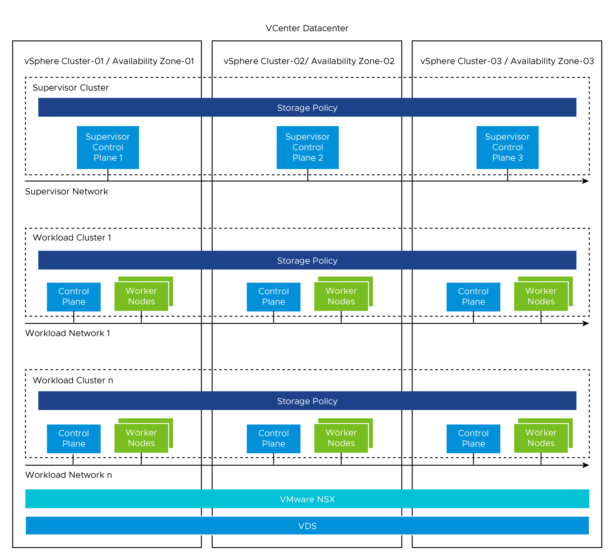

# VMware Tanzu Kubernetes Grid Services Multi-AZ Reference Architecture on NSX Networking

vSphere with Tanzu transforms vSphere into a platform for running Kubernetes workloads natively on the hypervisor layer. When vSphere with Tanzu is enabled on a vSphere cluster, you can run Kubernetes workloads directly on ESXi hosts and create upstream Kubernetes clusters within dedicated resource pools.

This document lays out a reference design for deploying Supervisor on three vSphere Zones to provide cluster-level high-availability. Each vSphere Zone maps to one vSphere cluster.  A three-zone Supervisor only supports Tanzu Kubernetes clusters and VMs, it does not support vSphere Pods. This document does not cover any recommendations or deployment steps for underlying software-defined data center (SDDC) environments.

For more information about the Non-Zonal Supervisor deployment, see [VMware Tanzu for Kubernetes Operations using vSphere with Tanzu on NSX-T Reference Design](https://docs.vmware.com/en/VMware-Tanzu-for-Kubernetes-Operations/2.1/tko-reference-architecture/GUID-reference-designs-tko-on-vsphere-with-tanzu-nsxt.html).

## Supported Component Matrix

For more information, see [**VMware Product Interoperability Matrix](https://interopmatrix.vmware.com/Interoperability?isHidePatch=false&isHideGenSupported=true&isHideTechSupported=true&isHideCompatible=false&isHideIncompatible=false&isHideNTCompatible=false&isHideNotSupported=true&isCollection=false&col=912,8325&row=1363,17055%262,17056%26820).

The following table provides the component versions and interoperability matrix supported with reference design:

|**Software Components**     |**Version**           |
|--------------------------- |----------------------|
|Tanzu Kubernetes Release    |1.23.8                |
|VMware vSphere ESXi         |8.0 Update 1a 21813344|
|VMware vCenter              |8.0 Update 1a 21815093|
|VMware NSX                  |4.1.0.2               |

## vSphere With Tanzu Components

- **Supervisor cluster:** When Workload Management is enabled on a vSphere cluster, it creates a Kubernetes layer within the ESXi hosts that are part of the cluster. A cluster that is enabled for Workload Management is called a Supervisor cluster. You can containerize workloads by creating upstream Kubernetes clusters on the top of Supervisor cluster through the Tanzu Kubernetes Grid Service (informally known as TKGS).

  The Supervisor cluster runs on top of an SDDC layer that consists of 3 vSphere clusters for computing, NSX for networking, and a shared storage such as VSAN.

  You can deploy a Supervisor on three vSphere Zones to provide cluster-level high-availability that protects your Kubernetes workloads against cluster-level failure. A vSphere Zone maps to one vSphere cluster that you can set up as an independent cluster failure domain. In a three-zone deployment, all three vSphere clusters become one Supervisor cluster. 

- **vSphere Namespaces:** A vSphere Namespace is a tenancy boundary within vSphere with Tanzu. A vSphere Namespace allows sharing vSphere resources(computing, networking, and storage), and enforcing resource limits within the underlying objects such as Tanzu Kuenretes clusters. For each namespace, you configure role-based access control (policies and permissions), image library, and virtual machine classes.

  In a Supervisor activated on three vSphere Zones, a namespace resource pool is created on each vSphere cluster that is mapped to a zone. The vSphere Namespace spreads across all three vSphere clusters that are part of the vSphere Zones. The resources utilized on such namespace are taken from all three underlying vSphere clusters in equal parts.

- **Tanzu Kubernetes Grid Service:** Tanzu Kubernetes Grid Service (TKGS) allows you to create and manage ubiquitous Kubernetes clusters on a VMware vSphere infrastructure using the Kubernetes Cluster API. The Cluster API provides declarative Kubernetes-style APIs for creating, configuring, and managing the Tanzu Kubernetes Cluster. vSphere 8.0 and above supports the `ClusterClass` API. The ClusterClass API is a collection of templates that define a cluster topology and configuration. 

- **Tanzu Kubernetes Cluster ( Workload Cluster ):** Tanzu Kubernetes clusters are Kubernetes workload clusters in which your application workloads run. These clusters can be attached to SaaS solutions such as Tanzu Mission Control (TMC), Tanzu Observability, and Tanzu Service Mesh, which are part of Tanzu for Kubernetes Operations.

- **VM Class in vSphere with Tanzu**: A VM class is a template that defines CPU, memory, and reservations for VMs. VM classes are used for VM deployment in a Supervisor Namespace. VM classes can be used by standalone VMs that run in a Supervisor Namespace, and by VMs hosting a Tanzu Kubernetes cluster.

VM Classes in a vSphere with Tanzu are categorized into the following two groups:

- **Guaranteed:** This class fully reserves its configured resources.
- **Best-effort:** This class allows to be overcommitted.

vSphere with Tanzu offers several default VM classes. You can either use the default VM classes, or create customized VM classes based on the requirements of the application. The following table explains the default VM classes that are available in vSphere with Tanzu:


|Class|CPU|Memory(GB)|Reserved CPU and Memory|
| :- | :- | :- | :- |
|best-effort-xsmall|2|2|No|
|best-effort-small|2|4|No|
|best-effort-medium|2|8|No|
|best-effort-large|4|16|No|
|best-effort-xlarge|4|32|No|
|best-effort-2xlarge|8|64|No|
|best-effort-4xlarge|16|128|No|
|best-effort-8xlarge|32|128|No|
|guaranteed-xsmall|2|2|Yes|
|guaranteed-small|2|4|Yes|
|guaranteed-medium|2|8|Yes|
|guaranteed-large|4|16|Yes|
|guaranteed-xlarge|4|32|Yes|
|guaranteed-2xlarge|8|64|Yes|
|guaranteed-4xlarge|16|128|Yes|
|guaranteed-8xlarge|32|128|Yes|

- **Storage Classes in vSphere with Tanzu** :  A `StorageClass` allows the administrators to describe the classes of storage that they offer. Different storage classes can map to meet quality-of-service levels, to backup policies, or to arbitrary policies determined by the cluster administrators. The policies representing datastore can manage storage placement of such components and objects as control plane VMs, vsphere Pod ephemeral disks, and container images. You might need policies for storage placement of persistent volumes and VM content libraries. 

A three-zone Supervisor supports zonal storage, where a datastore is shared across all hosts in a single zone. Storage policies that you create for a Supervisor or for a namespace in a three-zone Supervisor must be topology aware and have the consumption domain enabled. For more information, see [Create Storage Policy for a Three-Zone Supervisor](https://docs.vmware.com/en/VMware-vSphere/8.0/vsphere-with-tanzu-services-workloads/GUID-46783798-E3FD-49C6-BB62-C5EB09C2B82A.html).

When you prepare storage resources for three-zone Supervisor, consider the following parameters:

- Storage in all three vSphere zones does not need to be of the same type. However, having uniform storage in all three clusters provides a consistent performance.
- Create a storage policy that is compliant with shared storage in each of the clusters. The storage policy must be topology aware.
- A three-zone Supervisor does not support the following items:
  - Cross-zonal volumes
  - vSAN File volumes (ReadWriteMany Volumes)
  - Static volumes provisioning by using the Register Volume API
  - Workloads that use VSAN Data Persistence platform
  - vSphere POD
  - VSAN Stretched clusters
  - VMs with vGPU and instance storage

- The Ephemeral Disk Storage Policy and the Image Cache Storage Policy options are disabled because vSphere Pods are not supported with a Zonal Supervisor deployment.

You cannot create a storage class manually by using kubectl and YAML. You can create a storage class using the vSphere storage policy framework and apply it to the vSphere Namespace. While a storage class cannot be created manually by using kubectl and YAML, an existing storage class can be modified by using kubectl. 

The following table provides recommendations for configuring Storage Classes in a vSphere with Tanzu environment:


|Decision ID|Design Decision|Design Justification|Design Implications|
| :- | :- | :- | :- |
|TKO-TKGS-001|<p>Create custom Storage Classes/Profiles/Policies.</p><p></p>|<p>To provide different levels of QoS and SLA for production, development, and test Kubernetes workloads.</p><p></p><p></p>|Storage Policies must include one datastore from each vSphere Zone.|

## Identity and Access Management

vSphere with Tanzu supports the following two identity providers:

- **vCenter Single Sign-On:** This is the default identity provider that is used to authenticate with vSphere with Tanzu environment, including the Supervisors and Tanzu Kubernetes Grid Clusters. vCenter SSO provides authentication for vSphere infrastructure and can integrate with AD/LDAP systems.

  To authenticate using vCenter Single Sign-On, use vSphere plug-in for kubectl. Once authenticated, use kubectl to declaratively provision and manage the lifecycle of TKG clusters, deploy TKG cluster workloads.

- **External Identity Provider:** You can configure a Supervisor with an external identity provider and support the [OpenID Connect protocol](https://openid.net/connect/). Once connected, the Supervisor functions as an OAuth 2.0 client, and uses the [Pinniped](https://pinniped.dev/) authentication service to connect to Tanzu Kubernetes Grid clusters by using the Tanzu CLI. Each Supervisor instance can support one external identity provider. For more information about the list of supported OIDC providers, see [Configure an External IDP](https://docs.vmware.com/en/VMware-vSphere/8.0/vsphere-with-tanzu-tkg/GUID-766CC14B-BE5D-427E-8EA5-1570F28C95DE.html).

The Tanzu Kubernetes Grid (TKG) cluster permissions are set and scoped at the vSphere Namespace level. When permissions are set for Namespace, including identity source, users & groups, and roles, all these permissions apply to any TKG cluster deployed within that vSphere Namespace.

### Roles and Permissions

TKG Clusters supports the following three roles: 
- Viewer 
- Editor 
- Owner. 

These permissions are assigned and scoped at vSphere Namespace.

|**Permission**|**Description**|
| :- | :- |
|Can view|Read-only access to TKG clusters provisioned in that vSphere Namespace.|
|Can edit|Create, read, update, and delete TKG clusters in that vSphere Namespace.|
|Owner|Can administer TKG clusters in that vSphere Namespace, and can create and delete additional vSphere Namespaces using kubectl.|

## vSphere with Tanzu Architecture

On a three-zone Supervisor, you can run Kubernetes workloads on Tanzu Kubernetes Grid clusters and VMs created by using the VM service. A three zone Supervisor has the following components:

- **Supervisor Control Plane VM:** n this environment, three supervisor control plane VMs are created and spread evenly across the three vSphere zones. The three Supervisor control plane VMs are load balanced as each one of them has its own IP address. Additionally, a floating IP address is assigned to one of the VMS and a fifth IP address is reserved for patching purposes. vSphere DRS determines the exact placement of the control plane VMs on the ESXi hosts part of zones and migrate them when needed.
- **Tanzu Kubernetes Grid and Cluster API:** Modules running on the Supervisor and enable the provisioning and management of Tanzu Kubernetes Grid clusters.
- **Virtual Machine Service:** A module that is responsible for deploying and running stand-alone VMs, and VMs that makeup the Tanzu Kubernetes Grid clusters.


## vSphere with Tanzu Storage

vSphere with Tanzu integrates with the  shared datastore available in vSphere infrastructure. The following types of shared datastore are supported.

- VMFS
- NFS
- VSAN
- vVOls

vSphere with Tanzu is agnostic about which storage option you choose. For Kubernetes stateful workloads, vSphere with Tanzu installs the **[vSphere Container Storage Interface (vSphere CSI)](https://github.com/container-storage-interface/spec)** to automatically provision Kubernetes persistent volumes for pods.

Depending on your vSphere storage environment and needs of DevOps, you can create several storage policies for different classes of storage. When you enable a Supervisor and set up namespaces, you can assign different storage policies to be used by various objects, components, and workloads.

For three-zone Supervisor, perform the following prerequisites:

- Create three vSphere clusters with at least 3 hosts. For using vSAN, the cluster must have 3 or 4 hosts.
- Configure storage with VSAN or other shared storage for each cluster.
- Enable vSphere HA and vSphere DRS on Fully Automate or Partially Automate mode.


## Networking for vSphere with Tanzu

You can enable Vsphere with Tanzu in the following environments:

- vSphere backed with NSX networking.
- vSphere backed with virtual Distributed Switch (VDS) Networking and HA proxy to provide Load Balancing capabilities.
- vSphere backed with virtual Distributed Switch (VDS) Networking and NSX Advanced Load Balancer to provide Load Balancing capabilities.

**Note:** The scope of this document is limited to VMware NSX Data Center Networking.

NSX provides network connectivity to the objects inside the Supervisor and external networks. Connectivity to the ESXi hosts comprises three vSphere clusters that are backed by VLAN backed port groups.

The following diagram shows a general overview of three-zone deployment of vSphere with Tanzu on NSx networking. 


The Supervisor cluster configured with NSX networking either uses a distributed port group (routable to required infrastructure components such as vCenter, NSX manager, DNS , NTP and so on. For more information, see [Firewal Recommendation](#firewall-recommendation)) or to NSX segment to provide connectivity to Kubernetes control plane VMs. Tanzu Kubernetes clusters have their own networking provided by the NSX segment.  All hosts from the cluster, which is enabled for vSphere with Tanzu, are connected to the distributed switch that provides connectivity to Kubernetes workload and control plane VMs.

The following section explains the networking components and services included in the Supervisor cluster:

- NSX Container Plugin (NCP) provides integration between NSX and Kubernetes. The main component of NCP runs in a container and communicates with the NSX manager and with the Kubernetes control plane. NCP monitors changes to containers and other resources and manages resources such as logical ports, segments, routers, and security groups for the containers by calling the NSX API.
- By default, NCP creates one shared tier-1 gateway for system namespaces, and a tier-1 gateway and load balancer for each namespace. The tier-1 gateway for namespace is connected to the tier-0 gateway and a default segment.
- System namespaces are namespaces that are used by the core components that are integral to functioning of the Supervisor and Tanzu Kubernetes Grid clusters. The shared network resources that include the tier-1 gateway, load balancer, and SNAT IP are grouped in a system namespace.
- NSX Edge provides connectivity from external networks to the Supervisor resources. An NSX edge cluster normally includes at least two Edge nodes and has a load balancer that provides a redundancy to the Kube-API servers residing on control plane VMs and any application that must be published and be accessible from outside the Supervisor cluster. For more information, see [Install and Configure NSX for vSphere with Tanzu](https://docs.vmware.com/en/VMware-vSphere/8.0/vsphere-with-tanzu-installation-configuration/GUID-8D0E905F-9ABB-4CFB-A206-C027F847FAAC.html).

- A tier-0 gateway is associated with the NSX Edge cluster to provide routing to the external network. The uplink interfaces use either the dynamic routing, BGP, or static routing.
- Each vSphere namespace has a separate network and set of networking resources shared by applications inside the namespace, such as tier-1 gateway, load balancer service, and SNAT IP address.
- Workloads running in Tanzu kubernetes Grid clusters will have the same isolation rule that is implemented by the default firewall.
- NSX LB provides
  - L4 Load Balancer service for Kube-API to the Supervisor cluster and workload clusters.
  - L4 Load Balancer service for all services of type LoadBalancer deployed in workload clusters.

## Networking Prerequisites

- All ESXi hosts, part of three vSphere clusters, share a common VDS with at least one uplink. We recommend that you configure two uplinks. You must use VDS version 8 or above.
- Three vSphere clusters are mapped to the same overlay transport zone.
- Supervisor Management network is used to instantiate the zonal supervisor. This can either be L2 stretched network or NSX segment.


## Network Requirements

The following table lists the required networks for the reference design: **Note:** Based on your business requirements, modify subnet range to fit the projected growth.


|Network Type|Sample Recommendation|Description|
| :- | :- | :- |
|Supervisor Management Network|/28 to allow for 5 IPs and  future expansion|Network to host the supervisor VMs. It can be a VLAN backed VDS Port group or pre-created NSX segment. |
|Ingress IP range|/24, 254 address|Each service type Load Balancer deployed will consume 1 IP address. |
|Egress IP range|/27|Each vSphere namespace consumes 1 IP address for the SNAT egress. |
|Namespace/POD network CIDR|/20 <br>By default, it is used in /28 blocks by workload. |Allocate IP address to workload attached to supervisor namespace segments.|
|Supervisor Service CIDR|/24|Network from which IPs for Kubernetes ClusterIP Service will be allocated.|


## <a id="firewall-recommendation">Firewall Recommendations</a>

To prepare the firewall, you need the following information:

1. Supervisor network (Tanzu Kubernetes Grid Management) CIDR
1. Tanzu Kubernetes Grid workload cluster CIDR
1. Ingress and Egress range
1. Client machine IP address
1. vCenter server IP address
1. NSX Manager IP address
1. VMware Harbor registry IP address
1. DNS server IP address(es)
1. NTP server IP address(es)

The following table provides a list of firewall rules based on the assumption that there is no firewall within a subnet or VLAN.


|**Source**|**Destination**||**Description**|
| :-: | :-: | :-: | :-: |
|vCenter|Supervisor Network|TCP:6443|Allows vCenter to manage the supervisor VMs.|
|vCenter|Supervisor Network|TCP:22|Allows platform administrators to connect to VMs through vCenter.|
|Supervisor Network|NSX Manager|TCP:443|Allows supervisor to access NSX-T Manager to orchestrate networking.|
|Supervisor Network|vCenter|<p>TCP:6443</p><p>TCP:443</p>|Allows supervisor to access vCenter to create VMs and Storage Volumes.|
|Supervisor Network|ESXi Hosts|TCP:10250|Supervisor Cluster to Spherelet ESXi hosts.|
|ESXi Hosts|Supervisor IP Addresses|TCP:6443|Spherelet ESXi hosts to Supervisor Cluster.|
|Supervisor Network|DNS Servers|<p>TCP:53</p><p>UDP:53</p>|DNS|
|Supervisor Network|NTP Servers|UDP:123|NTP|
|Supervisor Network|Workload Network|TCP:6443|GCM, VMOperator needs to communicate with TKC apiserver.|
|Supervisor Network|\*.tmc.cloud.vmware.com|TCP:443|TMC Connectivity|
|Egress IP Range|DNS Servers|<p>TCP:53</p><p>UDP:53</p>|DNS|
|Egress IP Range|NTP Servers|UDP:123|NTP|
|Jumpbox|vCenter|<p>TCP:22</p><p>TCP:443</p>|Management|
|Jumpbox|NSX-T|TCP:443|Management|
|Jumpbox|Supervisor Network|<p>TCP:22</p><p>TCP:6443</p>|Management|
|Jumpbox|Workload Network|||
|Jumpbox|Ingress IP pool|<p>TCP:443</p><p>TCP:6443</p>|Management|
|Jumpbox|Web proxy|TCP:TBC|Settings depend on proxy|
|Jumpbox|Git Server|<p>TCP:443</p><p>TCP:22</p>|Version Control|
|Jumpbox|Ingress IP Range|<p>TCP:443</p><p>TCP:6443</p>|Management|
|Platform Admins|Jumpbox|TCP:22|Management|
|Kubernetes users|Ingress IP Range|<p>TCP:443</p><p>TCP:6443</p>|<p>Management. <br>You can further restrict to individual IPs for cluster access.</p><p></p>|

Note: For Tanzu Mission Control (TMC), if the firewall does not allow wildcards, you just whitelist all IP addresses of [account].tmc.cloud.vmware.com and extensions.aws-usw2.tmc.cloud.vmware.com.


## Installation Experience

While deploying Supervisor by using vSphere 8 and above, you can select vSphere Zone deployment, and can assign vSphere zones to provide high availability and fault tolerance. IN this scenario, all three vsphere clusters become one supervisor. In a three-zone deployment, you can perform the following operations:

- Provide cluster-level high-availability to the Supervisor as each vSphere cluster is an independent failure domain.
- Distribute the nodes of your Tanzu Kubernetes Grid clusters across all three vSphere zones, thus providing HA for your Kubernetes workloads at a vSphere cluster level.

vSphere with Tanzu deployment starts with deploying the Supervisor cluster on three vSphere Zones. The deployment is directly done from vCenter UI. The Get Started page lists the pre-requisite for the deployment:


1. In the vCenter UI, Select NSX as networking stack.


2. On the next page, provide a name for the  Supervisor cluster, and select the previously created three vSphere Zones.


This installation process takes you through the steps of deploying Supervisor cluster in your vSphere environment. Once the Supervisor cluster is deployed, you can use either [Tanzu Mission Control](https://tanzu.vmware.com/mission-control) or Kubectl utility to deploy the Tanzu Kubernetes Grid Clusters.

The following tables list recommendations for deploying the Supervisor Cluster:


|Decision ID|Design Decision|Design Justification|Design Implications|
| :- | :- | :- | :- |
|TKO-TKGS-001|Deploy Supervisor cluster control plane nodes in large form factor.|Large form factor should suffice to integrate Supervisor cluster with TMC.|Consume more resources from Infrastructure. |
|TKO-TKGS-002|Register the Supervisor cluster with Tanzu Mission Control.|Tanzu Mission Control automates the creation of the Tanzu Kubernetes clusters, and manages the life cycle of all Tanzu Kubernetes clusters centrally.|Need outbound connectivity to the internet for TMC registration.|

**Note:** In this scenario, the SaaS endpoints refer to Tanzu Mission Control, Tanzu Service Mesh, and Tanzu Observability.

## vSphere Namespaces 

A vSphere Namespace provides the runtime environment for TKG Clusters on Zonal Supervisor. To provision a TKG cluster, you first configure a vSphere namespace with users, roles, permissions, compute, storage, content library, and assign virtual machine classes. All these configurations are inherited by TKG clusters deployed in that namespace.

When you create a vSphere Namespace, a network segment is created which is derived from the Namespace Network configured in Supervisor. While creating vSphere namespace, you have the option to override cluster network settings. Choosing this option lets you customize the vSphere Namespace network by adding Ingress, Egress, and Namespace network CIDR (unique from the Supervisor and from any other vSphere namespace).

The typical use case for overriding Supervisor network settings is to provision a TKG cluster with routable pod networking. 

**Note:** The Override supervisor network setting is only available if the Supervisor is configured with NSX networking.

**Recommendations for Using Namespace with Tanzu**

|Decision ID|Design Decision|Design Justification|Design Implications|
| :- | :- | :- | :- |
|TKO-TKGS-003|Create dedicated namespace to environment specific.|Segregate prod/dev/test cluster via assigning them to dedicated namespaces.|Clusters created within the namespace share the same access policies/quotas/network & storage resources.|
|TKO-TKGS-004|Register external IDP with Supervisor or AD/LDAP with vCenter SSO.|Limit access to namespace based on role of users or groups.|External AD/LDAP needs to be integrated with vCenter or SSO Groups need to be created manually.|
|TKO-TKGS-005|Enable namespace self-service|Enables Devops users to create namespace in self-service manner.|The vSphere administrator must publish a namespace template to LDAP users or groups to enable them to create a namespace.|
|TKO-TKGS-006|Use guaranteed VM Class for production cluster.|CPU and Memory limits configured on vSphere Namespace have impact on TKG cluster if deployed using the guaranteed VM Class type.|Consume more infrastructure resources and contention might occur.|

## Tanzu Kubernetes Grid Workload Clusters

vSphere zones provide a way to create highly available Tanzu Kubernetes Grid (TKG) clusters on Supervisor. If you are provisioning TKG cluster across vSphere zones, you must provide the failure domain for each node pool. Each failure domain maps to a vSphere Zone which thereby will be associated with one vSphere cluster. Failure domains, also known as vSphere Fault domains, are defined and managed by the vSphere administrator when creating vSphere Zones.

The Control plane nodes of Tanzu Kubernetes Grid clusters are automatically placed across the vSphere Zones. However you can control how the worker nodes are spread across zones. You can define a NodePool object for the worker nodes of Tanzu kubernetes Grid clusters and map each vSphere Zone to a Failure domain with each NodePools. ClusterAPI spreads the Node Pools across zones automatically.


In a zone topology, when you provision a TKG cluster on Supervisor, the cluster is aware of the vSphere Zones. The zone topology supports failure domains for highly available workloads. If needed you can run workload in a specific zone using annotations.





## Tanzu Kubernetes Grid Cluster APIs

Tanzu Kubernetes Grid provides the following two APIS for provisioning and managing the life cycle of TKG2 clusters:

- API Version v1alpha3 for Tanzu Kubernetes clusters
- API version v1beta1 for Clusters based on a ClusterClass

The v1alpha3 API lets you create conformant Kubernetes clusters of type `TanzuKubernetesCluster`. This type of cluster is pre-configured with common defaults for quick provisioning, and can be customized. The v1beta1 API lets you create conformant Kubernetes clusters based on the default ClusterClass named **tanzukubernetescluster** and cluster type of **Cluster**.


## Tanzu Kubernetes Clusters Networking

A Tanzu Kubernetes cluster provisioned by the Tanzu Kubernetes Grid supports the following Container Network Interface (CNI) options:

- Antrea
- Calico

The CNI options are open-source software that provide networking for cluster pods, services, and ingress.

When you deploy a Tanzu Kubernetes cluster using the default configuration, Antrea CNI is automatically enabled in the cluster.

To provision a Tanzu Kubernetes cluster using Calico CNI, see [Deploy Tanzu Kubernetes Clusters with Calico](https://docs.vmware.com/en/VMware-vSphere/8.0/vsphere-with-tanzu-tkg/GUID-0787A2CC-0C57-44F8-B880-F0B8F5483E0F.html).


|**CNI**|**Use Case**|**Pros and Cons**|
| :- | :- | :- |
|Antrea|<p>Enable Kubernetes pod networking with IP overlay networks using VXLAN or Geneve for encapsulation. Optionally encrypt node-to-node communication using IPSec packet encryption.</p><p>Antrea supports advanced network use cases like kernel bypass and network service mesh.</p><p></p>|<p>**Pros:**</p><p>- Antrea leverages Open vSwitch as the networking data plane. Open vSwitch supports both Linux and Windows.</p><p>- VMware supports the latest conformant Kubernetes and stable releases of Antrea.</p><p></p>|
|Calico|<p>Calico is used in environments where factors like network performance, flexibility, and power are essential.</p><p>For routing packets between nodes, Calico leverages the BGP routing protocol instead of an overlay network. This eliminates the need to wrap packets with an encapsulation layer resulting in increased network performance for Kubernetes workloads.</p><p></p>|<p>**Pros:**</p><p></p><p>- Support for Network Policies</p><p></p><p>- High network performance</p><p></p><p>- SCTP Support</p><p></p><p>**Cons:**</p><p></p><p>- No multicast support.</p>|


## Kubernetes Ingress Routing

vSphere with Tanzu does not ship a default ingress controller. You can use Any Tanzu-supported ingress controller. For example, Contour, an open-source controller for Kubernetes ingress routing. Contour is part of a Tanzu package and can be installed on any Tanzu Kubernetes cluster. Deploying Contour is a prerequisite for deploying Prometheus, Grafana, and Harbour on a workload cluster. You can also manually deploy AKO on the Tanzu Kubernetes cluster and make use of NSX Advanced Load Balancer as L7 ingress. However, this will require an enterprise license of NSX Advanced Load Balancer.


For more information about Contour, see [Contour](https://projectcontour.io/) and [Ingress Using Contour](https://docs.vmware.com/en/VMware-vSphere/8.0/vsphere-with-tanzu-tkg/GUID-D540E8AA-38FE-41D8-9FF2-72C6EB17A721.html). 

[Tanzu Service Mesh](https://tanzu.vmware.com/service-mesh) also offers an Ingress controller based on [Istio](https://istio.io/). 

Each ingress controller has advantages and disadvantages of its own. The following table provides general recommendations on when you should use a specific ingress controller for your Kubernetes environment:


|**Ingress Controller**|**Use Cases**|
| :- | :- |
|Contour|<p>You use Contour when only north-south traffic is needed in a Kubernetes cluster. You can apply security policies for the north-south traffic by defining the policies in the manifest file for the application.</p><p>Contour is a reliable solution for simple Kubernetes workloads.</p><p></p>|
|Istio|You use Istio ingress controller when you need to provide security, traffic direction, and insight within the cluster (east-west traffic), and between the cluster and the outside world (north-south traffic).|


## Container Registry

vSphere with Tanzu includes Harbor as a container registry. Harbor provides a location of pushing, pulling, storing, and scanning container images used in your Kubernetes clusters.

The initial configuration and setup of the platform does not require any external registry because the required images are delivered through vCenter. Harbor registry is used for day-2 operations of the Tanzu Kubernetes workload clusters. Typical day-2 operations include tasks, such as pulling images from Harbor for application deployment, and pushing custom images to Harbor.

When vSphere with Tanzu is deployed on NSX networking, you can deploy an external container registry (Harbor) for Tanzu Kubernetes clusters.

You can use one of the following methods to install Harbor:

- [Tanzu Kubernetes Grid Package deployment:](https://docs.vmware.com/en/VMware-Tanzu-Kubernetes-Grid/1.5/vmware-tanzu-kubernetes-grid-15/GUID-packages-harbor-registry.html)** VMware recommends this installation method for general use cases. The Tanzu packages, including Harbor, must either be pulled directly from VMware or be hosted in an internal registry.
- [VM-based deployment using docker-compose:](https://goharbor.io/docs/latest/install-config/installation-prereqs/) VMware recommends using this installation method in cases where Tanzu Kubernetes Grid is being installed in an air-gapped or Internet-restricted environment, and no pre-existing image registry exists to host the Tanzu Kubernetes Grid system images. VM-based deployments are only supported by VMware Global Support Services to host the system images for air-gapped or Internet-less deployments. Do not use this method for hosting application images.
- [**Helm-based deployment to a Kubernetes cluster:](https://goharbor.io/docs/latest/install-config/harbor-ha-helm/) This installation method might be preferred by customers with Helm configured. Helm deployments of Harbor are only supported by the open source community and not by VMware Global Support Services.

If you are deploying Harbor without a publicly signed certificate, you must include the Harbor root CA in your Tanzu Kubernetes Grid clusters. For more information, see [Trust Custom CA Certificates on Cluster Nodes](https://docs.vmware.com/en/VMware-Tanzu-Kubernetes-Grid/1.5/vmware-tanzu-kubernetes-grid-15/GUID-cluster-lifecycle-secrets.html#trust-custom-ca-certificates-in-new-clusters-6).

To configure  TKG2 cluster with private container registry, see [Integrate TKG 2 cluster with container registry](https://docs.vmware.com/en/VMware-vSphere/8.0/vsphere-with-tanzu-tkg/GUID-EC2C9619-2898-4574-8EF4-EA66CFCD52B9.html).

## Scale a Tanzu Kubernetes Grid Cluster

You can scale a Tanzu Kubernetes Grid cluster on Supervisor horizontally by changing the number of nodes, or vertically by changing the virtual machine class hosting the nodes. 

The following table lists the supported scaling operations for TKG cluster:


|Node|Horizontal Scale Out|Horizontal Scale In|Vertical Scale |Volume Scale|
| :- | :- | :- | :- | :- |
|Control Plane|Yes|Yes|Yes|No|
|Worker|Yes|Yes|Yes|Yes|

**Note:**

- The number of control plane nodes must be odd, either 3 or 5.
- You can change the Worker node volumes after provisioning. However, you can not change the control plane node volumes.

## Backup And Restore

There are following two options for backing up and restoring stateless and stateful applications running on TKG Clusters on Supervisor:


|Tool|Comments|
| :- | :- |
|Velero plug-in for vSphere|<p>Both Kubernetes metadata and persistent volumes can be backed up and restored.</p><p>Velero snapshotting is used for persistent volumes with stateful applications.</p><p>Requires the Velero plug-in for vSphere installed and configured on Supervisor.</p><p></p>|
|Standalone Velero and Restic|<p>Both Kubernetes metadata and persistent volumes can be backed up and restored.</p><p>Restic is used for persistent volumes with stateful applications.</p><p>Use this approach if you require portability.</p><p></p>|

To backup and restore workloads running on TKG Cluster on Zonal Supervisor, create a datastore and install Velero with Restic on Kubernetes cluster. For more information, see [Install and Configure Standalone Velero and Restic](https://docs.vmware.com/en/VMware-vSphere/8.0/vsphere-with-tanzu-tkg/GUID-6CC3E1B5-CDAB-453C-98FE-CB579BC6AAF0.html). 

**Note:** Velero plug-in for vSphere runs as a pod which is not supported with Zonal Supervisor, and it requires NSX-T networking. For more information, see the prerequisites section of [Install and Configure the Velero Plugin for vSphere on Supervisor](https://docs.vmware.com/en/VMware-vSphere/8.0/vsphere-with-tanzu-tkg/GUID-1E294812-0E8B-494B-9F6E-C8631FEB9403.html).


## <a id="appendix-a"></a> Appendix A - Deploy TKG Cluster

Following is the sample yaml file for deploying the TKG 2 workload cluster on Supervisor:

<!-- /* cspell:disable */ --> 
```yaml
apiVersion: cluster.x-k8s.io/v1beta1
kind: Cluster
metadata:
  name: tkc-prod-cluster-1
  namespace: prod
spec:
  clusterNetwork:
    services:
      cidrBlocks: ["10.96.0.0/12"]
    pods:
      cidrBlocks: ["192.168.0.0/16"]
    serviceDomain: "cluster.local"
  topology:
    class: tanzukubernetescluster
    version: v1.23.8+vmware.2-tkg.2-zshippable
    #describe the cluster control plane
    controlPlane:
      #number of control plane nodes; integer 1 or 3
      replicas: 3
    #describe the cluster worker nodes
    workers:
      #specifies parameters for a set of worker nodes in the topology
      machineDeployments:
        - class: node-pool
          name: node-pool-1
          replicas: 1
          failureDomain: zone-a
        - class: node-pool
          name: node-pool-2
          replicas: 1
          failureDomain: zone-b
        - class: node-pool
          name: node-pool-3
          replicas: 1
          failureDomain: zone-c
    variables:
      #virtual machine class type and size for cluster nodes
      - name: vmClass
        value: guaranteed-small
      #persistent storage class for cluster nodes
      - name: storageClass
        value: gold-sp
```
<!-- /* cspell:enable */ --> 

The TKG cluster is provisioned across vSphere Zones, and can be verified by running the following command:


<!-- /* cSpell:disable */ -->
```
kubectl get nodes -L topology.kubernetes.io/zone

NAME                                                    STATUS   ROLES                  AGE   VERSION            ZONE

tkc-prod-cluster-2-node-pool-1-986dx-5f66d4c87c-5ss6f   Ready    <none>                 46h   v1.23.8+vmware.2   zone-a

tkc-prod-cluster-2-node-pool-2-rbmh4-847684c759-szld4   Ready    <none>                 46h   v1.23.8+vmware.2   zone-b

tkc-prod-cluster-2-node-pool-3-2gwqq-9d5576964-sbsx2    Ready    <none>                 46h   v1.23.8+vmware.2   zone-c

tkc-prod-cluster-2-wtjxq-h55lj                          Ready    control-plane,master   46h   v1.23.8+vmware.2   zone-a

tkc-prod-cluster-2-wtjxq-wcb8b                          Ready    control-plane,master   46h   v1.23.8+vmware.2   zone-b

tkc-prod-cluster-2-wtjxq-wzxgp                          Ready    control-plane,master   46h   v1.23.8+vmware.2   zone-c
```
<!-- /* cSpell:eable */ -->

## <a id="appendix-b"></a> Appendix B - Deploy StatefulSet Application to vSphere Zones

The following Stateful sample application deploys pod to each vSphere zone, each having a persistent identifier that it maintains across any rescheduling:

<!-- /* cSpell:disable */ -->
```yaml
apiVersion: apps/v1
kind: StatefulSet
metadata:
  name: web
spec:
  replicas: 3
  selector:
    matchLabels:
      app: nginx
  serviceName: nginx
  template:
    metadata:
      labels:
        app: nginx
    spec:
      affinity:
        nodeAffinity:
          requiredDuringSchedulingIgnoredDuringExecution:
            nodeSelectorTerms:
            - matchExpressions:
              - key: topology.kubernetes.io/zone 
                operator: In
                values:
                - zone-1
                - zone-2
                - zone-3
        podAntiAffinity:
          requiredDuringSchedulingIgnoredDuringExecution:
          - labelSelector:
              matchExpressions:
              - key: app
                operator: In
                values:
                - nginx
            topologyKey: topology.kubernetes.io/zone
      containers:
        - name: nginx
          image: gcr.io/google_containers/nginx-slim:0.8
          ports:
            - containerPort: 80
              name: web
          volumeMounts:
            - name: www
              mountPath: /usr/share/nginx/html
            - name: logs
              mountPath: /logs
  volumeClaimTemplates:
    - metadata:
        name: www
      spec:
        accessModes: [ "ReadWriteOnce" ]
        storageClassName: zonal-ds-policy-105-latebinding
        resources:
          requests:
            storage: 2Gi
    - metadata:
        name: logs
      spec:
        accessModes: [ "ReadWriteOnce" ]
        storageClassName: zonal-ds-policy-105-latebinding 
        resources:
          requests:
            storage: 1Gi


```

To verify the pod scheduling across zones, run the following command:

<!-- /* cSpell:disable */ -->

<!-- /* cSpell:enable */ -->
```
kubectl get pods -o wide


NAME    READY   STATUS    RESTARTS   AGE   IP            NODE                                                    NOMINATED NODE   READINESS GATES

web-0   1/1     Running   0          34m   192.168.3.5   tkc-prod-cluster-3-node-pool-2-w77p4-578fcc7d54-g99ts   <none>           <none>

web-1   1/1     Running   0          34m   192.168.1.6   tkc-prod-cluster-3-node-pool-1-9d5wd-65b6874698-f59hg   <none>           <none>

web-2   1/1     Running   0          33m   192.168.2.6   tkc-prod-cluster-3-node-pool-3-5vv5h-77b4cc5598-np4wx   <none>           <none>
```
<!-- /* cSpell:disable */ -->

