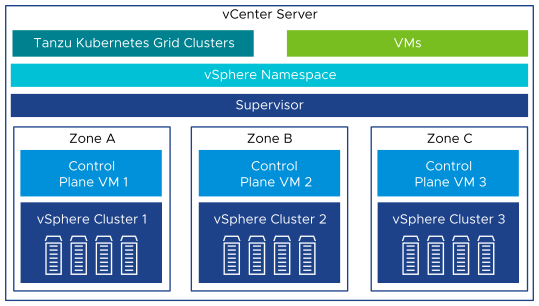
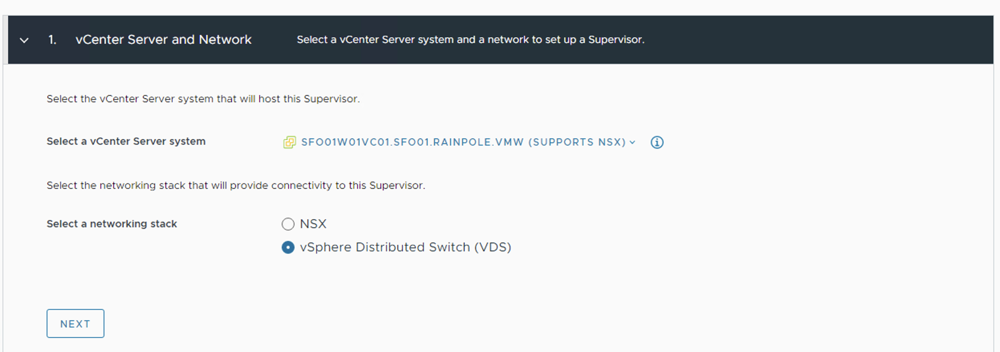

# TKGS Multi-AZ Reference Architecture on VDS Networking

vSphere with Tanzu transforms the vSphere cluster into a platform for running Kubernetes workloads in dedicated resource pools.  When vSphere with Tanzu enabled on three vSphere zones, it creates a kubernetes control plane directly in the hypervisor layer. You can then run kubernetes containers by creating an upstream highly-available kubernetes cluster through VMware Tanzu Kubernetes Grid Service and run your applications inside these clusters. 

This document provides a reference design for deploying a zonal supervisor with NSX Advanced Load Balancer on VDS Networking.

For Non-Zonal deployment, refer [VMware Tanzu for Kubernetes Operations using vSphere with Tanzu Reference Design](https://docs.vmware.com/en/VMware-Tanzu-for-Kubernetes-Operations/2.1/tko-reference-architecture/GUID-reference-designs-tko-on-vsphere-with-tanzu.html)

Supported Component Matrix

The following table provides the component versions and  interoperability matrix supported with reference design


|**Software Components**        | **Version**          |
|------------------------------ |----------------------|
|Tanzu Kubernetes Release       |1.23.8                |
|VMware vSphere ESXi            |8.0 Update 1a 21813344|
|VMware vCenter ( VCSA )        |8.0 Update 1a 21815093|
|NSX Advanced Load Balancer     |22.1.2                |

For the latest information, see [VMware Product Interoperability Matrix](https://interopmatrix.vmware.com/Interoperability?col=789,9250&row=2,5891%261,5890)

vSphere with Tanzu Components

- **Supervisor cluster:** When Workload Management is enabled on a vSphere cluster, it creates a Kuberetes layer within the ESXi hosts that are part of the cluster. A cluster that is enabled for Workload Management is called a Supervisor cluster. You can containerized workloads by creating upstream kubernetes clusters on the top of Supervisor cluster through the Tanzu Kubernetes Grid Service.

  The Supervisor Cluster runs on top of an SDDC layer that consists of 3 vSphere clusters for compute, NSX for networking and a shared storage such as VSAN.
  
  You can deploy a Supervisor on three vSphere Zones to provide cluster-level high-availability that protects your kubernetes workloads against cluster-level failure. A vSphere Zone maps to one vSphere cluster that you can set up as an independent cluster failure domain. In a three-zone deployment, all three vSphere clusters become one Supervisor. 

- **vSphere Namespaces**: A vSphere Namespace is a tenancy boundary within vSphere with Tanzu. A vSphere Namespace allows for sharing vSphere resources(compute, networking & storage ) and enforcing resource limits within the underlying objects such as Tanzu Kubernetes clusters. For each namespace, you configure role-based access control(policies & permissions), image library and virtual machine classes.

  In a Supervisor activated on three vSphere Zones, a namespace resource pool is created on each vSphere cluster that is mapped to a zone. The vSphere Namespace spreads across all three vSphere clusters part of the vSphere Zones. The resources utilized on such namespace are taken from all three underlying vSphere clusters in equal parts.

- **Tanzu Kubernetes Grid Service**: Tanzu Kubernetes Grid Service ( TKGS ) allows you to create and manage ubiquitous kubernetes clusters on a VMware vSphere infrastructure using the Kubernetes Cluster API. The Cluster API provides declarative, kubernetes-style APIS for the creation, configuration and management of Tanzu Kubernetes Cluster. Starting with vSPhere 8.0, a new API is introduced called ClusterClass. ClusterClass is a collection of templates that define a cluster topology and configuration. 


- **Tanzu Kubernetes Cluster ( Workload Cluster )** : Tanzu Kubernetes clusters are kubernetes workload clusters in which your application workloads run. These clusters can be attached to SaaS solutions such as Tanzu Mission Control, Tanzu Observability and Tanzu Service Mesh, which are part of Tanzu for kubernetes Operations.
- **VM Class in vSphere with Tanzu**: A VM class is a template that defines CPU, memory and reservations for VMs. VM classes are used for VM deployment in a Supervisor Namespace. VM classes can be used by standalone VMs that run in a Supervisor Namespace and by VMs hosting a Tanzu Kubernetes cluster.

VM Classes in a vSphere with Tanzu are broadly categorized into two groups.

- Guaranteed: The guaranteed class fully reserves its configured resources/
- Best-effort: The best-effort class allows to be overcommitted.

vSphere with Tanzu offers several default VM classes. You can use them or can create customized new VM classes based on application needs. The following screenshot shows the default VM classes that are available in vSphere with Tanzu.

**Default VM Classes**:


|Class|CPU|Memory(GB)|Reserved CPU and Memory|
| :- | :- | :- | :- |
|best-effort-xsmall|2|2|No|
|best-effort-small|2|4|No|
|best-effort-medium|2|8|No|
|best-effort-large|4|16|No|
|best-effort-xlarge|4|32|No|
|best-effort-2xlarge|8|64|No|
|best-effort-4xlarge|16|128|No|
|best-effort-8xlarge|32|128|No|
|guaranteed-xsmall|2|2|Yes|
|guaranteed-small|2|4|Yes|
|guaranteed-medium|2|8|Yes|
|guaranteed-large|4|16|Yes|
|guaranteed-xlarge|4|32|Yes|
|guaranteed-2xlarge|8|64|Yes|
|guaranteed-4xlarge|16|128|Yes|
|guaranteed-8xlarge|32|128|Yes|

**Note:** If default VM Classes are not meeting application compute/storage requirements, users can create custom VM Classes.

- **Storage Classes in vSphere with Tanzu** :  A StorageClass provides a way for administrators to describe the classes of storage they offer. Different classes can map to meet quality-of-service levels, to backup policies, or to arbitrary policies determined by the cluster administrators. The policies represent datastore and manage storage placement of such components and objects as control plane VMs, vsphere Pod ephemeral disks and container images. You might need policies for storage placement of persistent volumes and VM content libraries. 

A three-zone Supervisor supports zonal storage, where a datastore is shared across all hosts in a single zone. Storage policies that you create for a Supervisor or for a namespace in a three-zone Supervisor must be topology aware and have the consumption domain enabled. For more information, refer [Create Storage Policy for a Three-Zone Supervisor](https://docs.vmware.com/en/VMware-vSphere/8.0/vsphere-with-tanzu-services-workloads/GUID-46783798-E3FD-49C6-BB62-C5EB09C2B82A.html)

When you prepare storage resources for three-zone Supervisor, keep in mind the following considerations

- Storage in all three vSphere zones does not need to be of the same type. However, having uniform storage in all three clusters provides a consistent performance.
- Create a storage policy that is compliant with shared storage in each of the clusters. The storage policy must be topology aware.
- A three-zone Supervisor does not support the following items
  - Cross-zonal volumes
  - vSAN File volumes ( ReadWriteMany Volumes )
  - Static volumes provisioning using Register Volume API
  - Workloads that use VSAN Data Persistence platform
  - vSphere POD
  - VSAN Stretched clusters
  - VMs with vGPU and instance storage

The following table provides recommendations for configuring Storage Classes in a vSphere with Tanzu environment.


|Decision ID|Design Decision|Design Justification|Design Implications|
| :- | :- | :- | :- |
|TKO-TKGS-001|<p>Create custom Storage Classes/Profiles/Policies</p><p></p>|<p>To provide different levels of QoS and SLA for prod and dev/test kubernetes workloads.</p><p></p><p></p>|Storage Policies must include one datastore from each vSphere Zone.|


**Identity and Access Management**

vSphere with Tanzu provides identity and management to Supervisor and vSphere Namespace using below methods

- **vCenter Single Sign-On:** default identity provider that is used to authenticate with vSphere with Tanzu environment, including Supervisors and Tanzu Kubernetes Grid Clusters. vCenter SSO provides authentication for vSphere infrastructure and can integrate with AD/LDAP systems.
- **External Identity Provider:** You can configure a Supervisor with an external identity provider and support the **[OpenID Connect protocol](https://openid.net/connect/).** Once connected, Supervisor functions as an OAuth 2.0 client and uses the **[Pinniped](https://pinniped.dev/)** authentication service to connect to Tanzu Kubernetes Grid clusters by using the  Tanzu CLI. Each Supervisor instance can support one external identity provider. Refer [Configure an External IDP](https://docs.vmware.com/en/VMware-vSphere/8.0/vsphere-with-tanzu-tkg/GUID-766CC14B-BE5D-427E-8EA5-1570F28C95DE.html)  to see list of supported OIDC providers. 

**vSphere with Tanzu Architecture for a Multi-Zone Deployment**

The following diagram shows the high-level architecture of vSphere with Tanzu on three vSphere Clusters.



The Supervisor cluster consists of following:

- **Supervisor Control Plane VM:** A total of three supervisor control plane VMs are created and spread evenly across the three vSphere zones. The three Supervisor control plane VMs are load balanced as each one of them has its own IP address. Additionally, a floating IP address is assigned to one of the VMS and a fifth IP address is reserved for patching purposes. vSphere DRS determines the exact placement of the control plane VMs on the ESXi hosts part of zones and migrate them when needed.

- **Tanzu Kubernetes Grid Service and ClusterClass** Modules running on the Supervisor and enable the provisioning and management of Tanzu Kubernetes Grid clusters.ClusterClass is a new feature introduced as part of Cluster API which reduces the need for redundant templating and enables powerful customization of clusters.

- **Virtual Machine Service:** A module that is responsible for deploying and running stand-alone VMs and VMs that makeup the Tanzu Kubernetes Grid clusters.

After a Supervisor cluster is created, vSphere administrator creates vSphere namespaces. When initially created, namespace has unlimited resources within the Supervisor Cluster.  The vSphere administrator defines the limits for CPU, memory and storage, as well as the number of Kubernetes objects such as deployments, replica sets, persistent volumes, etc, that can run within the boundary of namespace. These limits are configured for each vSphere namespace.

For the maximum supported number, see the vSphere with Tanzu [Configuration Maximum](https://configmax.esp.vmware.com/guest?vmwareproduct=vSphere&release=vSphere%208.0&categories=1-0,70-58,71-0) guide.


Recommendations for using namespace in vSphere with Tanzu


|Decision ID|Design Decision|Design Justification|Design Implications|
| :- | :- | :- | :- |
|TKO-TKGS-003|Create dedicated namespace to environment specific|Segregate prod/dev/test cluster via assigning them to dedicated namespaces.|Clusters created within the namespace share the same access policies/quotas/network & storage resources.|
|TKO-TKGS-004|Register external IDP with Supervisor or AD/LDAP with vCenter SSO|Limit access to namespace based on role of users/groups|NA|
|TKO-TKGS-005|Enable namespace self-service|Enables Devops users to create namespace in self-service manner.|The vSphere administrator must publish a namespace template to LDAP users/groups to enable them to create a namespace.|


vSphere with Tanzu Storage

vSphere with Tanzu integrates with shared datastores available with vSphere infrastructure. The following types of shared datastores are supported:

vSAN

VMFS ( including vSAN ESA )

NFS

vVols

vSphere with Tanzu uses storage policies to integrate with backend shared datastore. The policies represent datastore and manage storage placement of control VMs.

vSphere with Tanzu is agnostic about which storage option you chose. For kubernetes stateful workloads, vSphere with Tanzu installs the [vSphere Container Storage Interface ( vSphere CSI )](https://github.com/container-storage-interface/spec) to automatically provision kubernetes persistent volumes for pods.

Note : Dynamic file persistent volumes ( ReadWriteMany ) access mode, encryption and WaitForFirstConsumer mode are not supported.


Networking for vSphere with Tanzu

vSphere with Tanzu can be enabled in following environments

- vSphere backed with NSX networking
- vSphere backed with virtual Distributed Switch ( VDS ) Networking and HA proxy to provide Load Balancing capabilities
- vSphere backed with virtual Distributed Switch ( VDS ) Networking and NSX Advanced Load Balancer to provide Load Balancing capabilities

**Note:** The scope of this document is limited to vSphere backed with VDS networking with NSX Advanced Load Balancer.

vSphere with Tanzu on VDS Networking with NSX Advanced Load Balancer

In a vSphere with Tanzu environment, a Zonal supervisor cluster configured with vSphere networking uses distributed port groups to provide connectivity to Kubernetes control plane VMs, services and workloads. All 3 vSphere clusters , which are enabled for vSphere with Tanzu, are connected to the same distributed switch that provides connectivity to kubernetes workloads and control plane VMs.

The following diagram shows a general overview of vSphere with Tanzu on VDS networking.


NSX Advanced Load Balancer Components.

NSX Advanced Load Balancer is deployed in write access mode in a vSphere environment. This mode grants NSX Advanced Load Balancer Controllers full write access to the vCenter, which helps in automatically creating, modifying, and removing SEs and other resources as needed to adapt to changing traffic needs. The following are the core components of NSX Advanced Load Balancer:

- **NSX Advanced Load Balancer Controller:** NSX Advanced Load Balancer Controller manages Virtual Service objects and interacts with the vCenter Server infrastructure to manage the lifecycle of the service engines (SEs). It is the central repository for the configurations and policies related to services and management and provides the portal for viewing the health of VirtualServices and SEs and the associated analytics that NSX Advanced Load Balancer provides.

The following table provides recommendations for configuring NSX Advanced Load Balancer in a vSphere with Tanzu environment.


|Decision ID|Design Decision|Design Justification|Design Implications|
| :- | :- | :- | :- |
|TKO-NSXALB-001|Deploy 3 NSX ALB controller nodes, one to each vSphere Zone and make a cluster|To achieve high-availability of the NSX ALB control plane if one of the vSphere clusters goes down.|NSX ALB network should be L2 stretched across three vSphere Zone.|
|TKO-NSXALB-002|Deploy NSX ALB controller cluster nodes on a network dedicated to NSX-ALB.|To isolate NSX ALB traffic from infrastructure management traffic and kubernetes workloads.|Additional VLAN is required|
|TKO-NSXALB-003|Use static IP addresses for the NSX ALB controllers.|NSX Advanced Load Balancer Controller cluster uses management IP addresses to form and maintain quorum for the control plane cluster. Any changes would be disruptive.|NA|
|TKO-NSXALB-004|Use NSX ALB IPAM for SE data network and virtual services.|Guarantees IP address assignment for Service Engine and Virtual Services.|NA|
|TKO-NSXALB-005|Reserve an IP in the NSX Advanced Load Balancer management subnet to be used as the Cluster IP for the Controller Cluster.|NSX Advanced Load Balancer portal is always accessible over Cluster IP regardless of a specific individual controller node failure.||
|TKO-NSXALB-006|Configure backup for the NSX ALB Controller cluster.|Backups are required if the NSX ALB Controller becomes inoperable or if the environment needs to be restored from a previous state.|To store backups, a SCP capable backup location is needed. SCP is the only supported protocol currently.|
|TKO-NSXALB-007|Initial setup should be done only on one NSX ALB controller VM out of the three deployed to create an NSX ALB controller cluster.|<p>NSX ALB controller cluster is created from an initialized NSX ALB controller which becomes the cluster leader.</p><p>Follower NSX ALB controller nodes need to be uninitialized to join the cluster.</p>|NSX ALB controller cluster creation fails if more than one NSX ALB controller is initialized.|
|TKO-NSXALB-008|Configure Remote logging for NSX ALB Controller to send events on Syslog.|For operations teams to centrally monitor NSX ALB and escalate alerts events must be sent from the NSX ALB Controller|<p>Additional Operational Overhead.</p><p>Additional infrastructure Resource.</p>|
|TKO-NSXALB-009|Use LDAP/SAML based Authentication for NSX ALB|Helps to Maintain Role based Access Control.|<p>Additional Configuration is required.</p><p>SAML based authentication requires an NSX ALB Enterprise license.</p>|

- **NSX Advanced Load Balancer Service Engine:** NSX Advanced Load Balancer Service Engines (SEs) are lightweight VMs that handle all data plane operations by receiving and executing instructions from the controller. The SEs perform load balancing and all client and server-facing network interactions.

Following table provides recommendations for NSX Advanced Load Balancer Service Engines deployment.


|Decision ID|Design Decision|Design Justification|Design Implications|
| :- | :- | :- | :- |
|TKO-ALB-SE-001|NSX ALB Service Engine High Availability set to Active/Active.|Provides higher resiliency, optimum performance, and utilization compared to N+M and/or Active/Standby.|<p>Requires NSX ALB Enterprise Licensing. Only the Active/Standby mode is supported with NSX ALB essentials for Tanzu license.</p><p></p><p>Certain applications might not work in the Active/Active mode. For example, applications that preserve the client IP use the Legacy Active/Standby HA mode.</p>|
|TKO-ALB-SE-002|Enable ALB Service Engine Self Elections|Enable SEs to elect a primary amongst themselves in the absence of connectivity to the NSX ALB controller.|Requires NSX ALB Enterprise Licensing. This feature is not supported with NSX ALB essentials for Tanzu license.|
|TKO-ALB-SE-003|<p>Enable ‘Dedicated dispatcher CPU’ on Service Engine Groups that contain the Service Engine VMs of 4 or more vCPUs.</p><p></p><p>**Note:** This setting should be enabled on SE Groups that are servicing applications and have high network requirements.</p>|<p>This will enable a dedicated core for packet processing enabling high packet pipeline on the Service Engine VMs.</p><p>Note: By default, the packet processing core also processes load-balancing flows.</p>|Consume more Resources from Infrastructure.|
|TKO-ALB-SE-004|Set ‘Placement across the Service Engines’ setting to ‘Compact’.|This allows maximum utilization of capacity (Service Engine ).|NA|
|TKO-ALB-SE-005|Set the SE size to a minimum 2vCPU and 4GB of Memory|This configuration should meet the most generic use case|For services that require higher throughput, these configurations need to be investigated and modified accordingly.|
|TKO-ALB-SE-006|Reserve Memory and CPU for Service Engines.|The Service Engines are a critical infrastructure component providing load-balancing services to mission-critical applications. Guarantees the CPU and Memory allocation for SE VM and avoids performance degradation in case of resource contention|<p>You must perform additional configuration to set up the reservations.</p><p></p>|

- **Avi Kubernetes Operator (AKO):** Avi Kubernetes Operator is a Kubernetes operator that runs as a pod in the Supervisor Cluster. It provides ingress and load balancing functionality. Avi Kubernetes Operator translates the required Kubernetes objects to NSX Advanced Load Balancer objects and automates the implementation of ingresses/routes/services on the Service Engines (SE) via the NSX Advanced Load Balancer Controller.

Each environment configured in NSX Advanced Load Balancer is referred to as a cloud. Each cloud in NSX Advanced Load Balancer maintains networking and NSX Advanced Load Balancer Service Engine settings. Each cloud is configured with one or more VIP networks to provide IP addresses to L4 load balancing virtual services created under that cloud.

The virtual services can be spanned across multiple Service Engines if the associated Service Engine Group is configured in Active/Active HA mode. A Service Engine can belong to only one Service Engine group at a time.

IP address allocation for virtual services can be over DHCP or via NSX Advanced Load Balancer in-built IPAM functionality. The VIP networks created/configured in NSX Advanced Load Balancer are associated with the IPAM profile.


Network Architecture

To deploy vSphere with Tanzu, build separate networks for Supervisor clusters, Tanzu Kubernetes Grid Workload clusters , NSX Advanced Load Balancer and the Tanzu Kubernetes Grid control plane HA.

**Note:** The network/portgroup designated for the workload cluster, carries both data and control traffic. Firewalls cannot be utilized to segregate traffic between workload clusters; instead, the underlying CNI must be employed as the main filtering system. Antrea CNI has the Custom Resource Definitions (CRDs) for firewall rules that can be enforced before Kubernetes network policy is added.

**Note:** Based on your requirements, you can create additional networks for your workload cluster. These networks are also referred to as vSphere with Tanzu workload secondary network.

This topology enables the following benefits:

- Isolate and separate SDDC management components (vCenter, ESX) from the vSphere with Tanzu components. This reference design allows only the minimum connectivity between the Tanzu Kubernetes Grid clusters and NSX Advanced Load Balancer to the vCenter Server.
- Isolate and separate the NSX Advanced Load Balancer management network from the supervisor cluster network and the Tanzu Kubernetes Grid workload networks.
- Separate vSphere Admin and Tenant access to the supervisor cluster. This prevents tenants from attempting to connect to the supervisor cluster.
- Allow tenants to access only their own workload cluster(s) and restrict access to this cluster from other tenants. This separation can be achieved by assigning permissions to the supervisor namespaces.
- Depending on the workload cluster type and use case, multiple workload clusters may leverage the same workload network or new networks can be used for each workload cluster.


Following table provides recommendations for networks


|Decision ID|Design Decision|Design Justification|Design Implications|
| :- | :- | :- | :- |
|TKO-NET-001|Use separate networks for Supervisor cluster and workload clusters.|To have a flexible firewall and security policies|Sharing the same network for multiple clusters can complicate creation of firewall rules.|
|TKO-NET-002|Use distinct port groups for network separation of K8s workloads.|Isolate production Kubernetes clusters from dev/test clusters by placing them on distinct port groups.|Network mapping is done at the namespace level. All Kubernetes clusters created in a namespace connect to the same port group.|
|TKO-NET-003|Use routable networks for Tanzu Kubernetes clusters.|Allow connectivity between the TKG clusters and infrastructure components.|<p>Networks that are used for Tanzu Kubernetes cluster traffic must be routable between each other and the Supervisor Cluster Management Network.</p><p></p>|

Networking Prerequisites

- All ESXi hosts, part of three vSphere clusters, share a common VDS with at least one uplink; two uplinks are highly recommended ( VDS must be version 8 or later ). 

Networking Requirements

As per the reference architecture, the list of required network is as follows


|Network Type|DHCP Service|Description|
| :- | :- | :- |
|NSX ALB Management Network|Optional|ALB Controllers and SEs will be attached to this network. |
|TKG Supervisor Network|Optional|Supervisor cluster nodes will be attached to this network|
|TKG Workload Network|Optional|<p>Control Plane and Worker Nodes of the TKG workload cluster will be attached to this network.</p><p></p><p>The second interface of Supervisor nodes is also attached to this network</p>|
|TKG Cluster VIP|No|Virtual Services ( L4 ) for control plane HA of Supervisor and workload. Reserve sufficient IPs depending on the number of TKG clusters planned to be deployed in the environment. |

Note: All these networks need to be L2 stretched across three vSphere clusters.

Subnet and CIDR Examples

The following table provides example entries for the required port groups. Create network entries with the port group name, VLAN ID, and CIDRs that are specific to your environment.


|Network Type|Port Group Name|VLAN|Gateway CIDR|DHCP Enabled|IP Pool fo SE/VIP in NSX ALN|
| :- | :- | :- | :- | :- | :- |
|NSX ALB Management Network|sfo01-w01-albmanagement|1610|172\.16.10.1/27|Optional|172\.16.10.6-172.16.10.30|
|TKG Supervisor Network|sfo01-w01-tkgmanagment|1640|172\.16.40.1/27|Optional|No|
|TKG Workload Network|sfo01-w01-tkgworkload|1660|172\.16.60.1/24|Optional|No|
|TKG Cluster VIP|sfo01-w01-tkgclustervip|1680|172\.16.80.1/26|No|172\.16.80.2-172.16.80.62|

Note: NSX ALB components can be deployed to Supervisor Network. However, it’s  recommended to make use of separate networks for these two.

Firewall Requirements

To prepare the firewall, you need the following information:

1. NSX Advanced Load Balancer Controller nodes and VIP addresses
1. NSX Advanced Load Balancer Service Engine management IP address
1. Supervisor Cluster network (Tanzu Kubernetes Grid Management) CIDR
1. Tanzu Kubernetes Grid workload cluster CIDR
1. Tanzu Kubernetes Grid cluster VIP address range
1. Client machine IP address
1. vCenter server IP address
1. VMware Harbor registry IP address
1. DNS server IP address(es)
1. NTP server IP address(es)

The following table provides a list of firewall rules based on the assumption that there is no firewall within a subnet/VLAN.


|**Source**|**Destination**|**Protocol:Port**|**Description**|
| :- | :- | :- | :- |
|Client Machine|NSX Advanced Load Balancer Controller Nodes and VIP|TCP:443|Access NSX Advanced Load Balancer portal for configuration.|
|Client Machine|vCenter Server|TCP:443|Access and configure WCP in vCenter.|
|Client Machine|TKG Cluster VIP Range|<p>TCP:6443</p><p>TCP:443</p><p>TCP:80</p>|<p>TKG Cluster Access</p><p>Access https workload</p><p>Access http workload</p>|
|<p>Client Machine</p><p>(optional)</p>|<p>\*.tmc.cloud.vmware.com</p><p>console.cloud.vmware.com</p>|TCP:443|Access TMC portal, etc.|
|TKG Management and Workload Cluster CIDR|<p>DNS Server</p><p>NTP Server</p>|<p>TCP/UDP:53</p><p>UDP:123</p>|<p>DNS Service</p><p>Time Synchronization</p>|
|TKG Management Cluster CIDR|vCenter IP|TCP:443|Allow components to access vCenter to create VMs and Storage Volumes|
|TKG Management and Workload Cluster CIDR|NSX Advanced Load Balancer controller nodes|TCP:443|Allow Avi Kubernetes Operator (AKO) and AKO Operator (AKOO) access to NSX Advanced Load Balancer Controller|
|TKG Management and Workload Cluster CIDR|TKG Cluster VIP Range|TCP:6443|Allow Supervisor cluster to configure workload clusters|
|TKG Management and Workload Cluster CIDR|Image Registry (Harbor) (If Private)|TCP:443|Allow components to retrieve container images.|
|TKG Management and Workload Cluster CIDR|<p>wp-content.vmware.com</p><p>\*.tmc.cloud.vmware.com</p><p>Projects.registry.vmware.com</p>|TCP:443|Sync content library, pull TKG binaries, and interact with TMC|
|TKG Management cluster CIDR|TKG Workload Cluster CIDR|TCP:6443|VM Operator and TKC VM communication|
|TKG Workload Cluster CIDR|TKG Management Cluster CIDR|TCP:6443|Allow the TKG workload cluster to register with the Supervisor Cluster|
|NSX Advanced Load Balancer Management Network|vCenter and ESXi Hosts|TCP:443|Allow NSX Advanced Load Balancer to discover vCenter objects and deploy SEs as required|
|NSX Advanced Load Balancer Controller Nodes|<p>DNS Server</p><p>NTP Server</p>|<p>TCP/UDP:53</p><p>UDP:123</p>|<p>DNS Service</p><p>Time Synchronization</p>|
|TKG Cluster VIP Range|TKG Management Cluster CIDR|TCP:6443|To interact with supervisor cluster|
|TKG Cluster VIP Range|TKG Workload Cluster CIDR|<p>TCP:6443</p><p>TCP:443</p><p>TCP:80</p>|To interact with workload cluster and K8s applications|
|vCenter Server|TKG Management Cluster CIDR|<p>TCP:443</p><p>TCP:6443</p><p>TCP:22 (optional)</p>||

Note: For TMC, if the firewall does not allow wildcards, all IP addresses of [account].tmc.cloud.vmware.com and extensions.aws-usw2.tmc.cloud.vmware.com need to be whitelisted.

Installation Experience

Configure each vSphere cluster as an independent failure domain and map it to the vSphere zone. In a Three-Zone deployment, all three vSphere clusters become one Supervisor and can provide :

- Cluster-level high availability to the Supervisor as vSphere cluster is an independent failure domain.
- Distribute the nodes of Tanzu Kubernetes Grid clusters across all three vSphere zones and provide availability via vSphere HA at cluster level.
- Scale the Supervisor by adding hosts to each of the three vSphere clusters.

vSphere with Tanzu deployment starts with deploying the Supervisor cluster on three vSphere Zones. The deployment is directly done from vCenter UI. The Get Started page lists the pre-requisite for the deployment.


In vCenter UI, Select VDS as networking stack



On the next page, give the supervisor cluster a name and select previously created three vSphere Zones.


This installation process takes you through the steps of deploying Supervisor Cluster in your vSphere environment. Once the Supervisor cluster is deployed, you can use either [Tanzu Mission Control](https://tanzu.vmware.com/mission-control) or Kubectl utility to deploy the Tanzu Kubernetes Grid Clusters.


The following tables list recommendations for deploying Supervisor Cluster.


|Decision ID|Design Decision|Design Justification|Design Implications|
| :- | :- | :- | :- |
|TKO-TKGS-001|Deploy Supervisor cluster control plane nodes in large form factor.|Large form factor should suffice to integrate Supervisor Cluster with TMC.|Consume more Resources from Infrastructure. |
|TKO-TKGS-002|Register Supervisor cluster with Tanzu Mission Control.|Tanzu Mission Control automates the creation of the Tanzu Kubernetes clusters and manages the life cycle of all Tanzu Kubernetes Clusters centrally.|Need outbound connectivity to the internet for TMC registration.|

**Note:** SaaS endpoints here refers to Tanzu Mission Control, Tanzu Service Mesh and Tanzu Observability.

**TKG Cluster APIs**

TKG provides two APIS for provisioning and managing the life cycle of TKG2 clusters.

- API Version v1alpha3 for Tanzu Kubernetes clusters
- API version v1beta1 for Clusters based on a ClusterClass

The v1alpha3 API lets you create conformant kubernetes clusters of type TanzuKubernetesCluster. This type of cluster is pre-configured with common defaults for quick provisioning, and can be customized. The v1beta1 API lets you create conformant kubernetes clusters based on the default ClusterClass named **tanzukubernetescluster** and cluster type of **Cluster**.


Tanzu Kubernetes Clusters Networking 

A Tanzu Kubernetes cluster provisioned by the Tanzu Kubernetes Grid supports the following Container Network Interface ( CNI ) options:

- Antrea
- Calico

The CNI options are open-source software that provide networking for cluster pods, services and ingress.

When you deploy a Tanzu Kubernetes cluster using the default configuration of Tanzu CLI, Antrea CNI is automatically enabled in the cluster. 

To provision a Tanzu Kubernetes cluster using Calico CNI, see [**Deploy Tanzu Kubernetes Clusters with Calico**](https://docs.vmware.com/en/VMware-vSphere/8.0/vsphere-with-tanzu-tkg/GUID-0787A2CC-0C57-44F8-B880-F0B8F5483E0F.html)

Each CNI is suitable for a different use case. The following tables lists some common use cases for the CNI options that Tanzu Kubernetes Grid supports. This table will help you select the most appropriate CNI for your Tanzu Kubernetes clusters with Calico.


|CNI|Use Case|Pros and Cons|
| :- | :- | :- |
|Antrea|<p>Enable Kubernetes pod networking with IP overlay networks using VXLAN or Geneve for encapsulation. Optionally encrypt node-to-node communication using IPSec packet encryption.</p><p>Antrea supports advanced network use cases like kernel bypass and network service mesh.</p>|<p>Pros</p><p>- Antrea leverages Open vSwitch as the networking data plane. Open vSwitch supports both Linux and Windows.</p><p>- VMware supports the latest conformant Kubernetes and stable releases of Antrea.</p><p></p>|
|Calico|<p>Calico is used in environments where factors like network performance, flexibility, and power are essential.</p><p>For routing packets between nodes, Calico leverages the BGP routing protocol instead of an overlay network. This eliminates the need to wrap packets with an encapsulation layer resulting in increased network performance for Kubernetes workloads.</p><p></p>|<p>Pros</p><p></p><p>Support for Network Policies</p><p></p><p>High network performance</p><p></p><p>SCTP Support</p><p></p><p>Cons</p><p></p><p>No multicast support</p>|


Recommendations for Tanzu Kubernetes Clusters


|Decision ID|Design Decision|Design Justification|Design Implications|
| :- | :- | :- | :- |
|TKO-TKC-001|Deploy Tanzu Kubernetes clusters with prod plan and multiple worker nodes.|The prod plan provides high availability for the control plane.|Consume resources from Infrastructure.|
|TKO-TKC-002|Assign storage policy as default policy during cluster deployment|Packages installation and applications deployment requires storage policy defined as default|Package and application installation might fail.|
|TKO-TKC-003|Use guaranteed VM class for Tanzu Kubernetes clusters.|Guaranteed compute resources are always available for containerized workloads.|Could prevent automatic migration of nodes by DRS.|
|TKO-TKC-004|Implement RBAC for Tanzu Kubernetes clusters.|To avoid the usage of administrator credentials for managing the clusters.|External AD/LDAP needs to be integrated with vCenter SSO or External IDP integration with Supervisor is required.|
|TKO-TKC-005|Deploy Tanzu Kubernetes clusters from Tanzu Mission Control.|Tanzu Mission Control provides life-cycle management for the Tanzu Kubernetes clusters and can be integrated with Tanzu Service Mesh and Tanzu Observability|<p>Only Antrea CNI is supported on Workload clusters created from the TMC portal.</p><p></p>|

**Kubernetes Ingress Routing** 

vSphere with Tanzu does not ship with a default ingress controller. Any Tanzu-supported ingress controller can be used. One example of an ingress controller is Contour, an open-source controller for Kubernetes ingress routing. Contour is part of a Tanzu package and can be installed on any Tanzu kubernetes cluster. Deploying Contour is a prerequisite for deploying Prometheus, Grafana and Harbour on a workload cluster. You can also manually deploy AKO on the Tanzu Kubernetes cluster and make use of NSX Advanced Load Balancer as L7 ingress but it will require an enterprise license of NSX Advanced Load Balancer.

For more information about Contour, see the [Contour](https://projectcontour.io/) site and [Ingress Using Contour](https://docs.vmware.com/en/VMware-vSphere/8.0/vsphere-with-tanzu-tkg/GUID-D540E8AA-38FE-41D8-9FF2-72C6EB17A721.html)  

[Tanzu Service Mesh](https://tanzu.vmware.com/service-mesh) also offers an Ingress controller based on [Istio](https://istio.io/) 

Each ingress controller has pros and cons of its own. The below table provides general recommendations on when you should use a specific ingress controller for your kubernetes environment.


|**Ingress Controller**|**Use Cases**|
| :- | :- |
|Contour|<p>Use Contour when only north-south traffic is needed in a Kubernetes cluster. You can apply security policies for the north-south traffic by defining the policies in the manifest file for the application.</p><p>Contour is a reliable solution for simple Kubernetes workloads.</p><p></p>|
|Istio|Use Istio ingress controller when you need to provide security, traffic direction, and insight within the cluster (east-west traffic) and between the cluster and the outside world (north-south traffic).|


**Container Registry** 

Harbor provides a location of pushing, pulling, storing and scanning container images used in your kubernetes clusters.

The initial configuration and setup of the platform does not require any external registry because the required images are delivered through vCenter. Harbor registry is used for day 2 operations of the Tanzu Kubernetes workload clusters. Typical day-2 operations include tasks such as pulling images from Harbor for application deployment and pushing custom images to Harbor.

When vSphere with Tanzu is deployed on VDS networking, you can deploy an external container registry (Harbor) for Tanzu Kubernetes clusters.

You may use one of the following methods to install Harbor:

- [**Tanzu Kubernetes Grid Package deployment**](https://docs.vmware.com/en/VMware-Tanzu-Kubernetes-Grid/1.5/vmware-tanzu-kubernetes-grid-15/GUID-packages-harbor-registry.html) : VMware recommends this installation method for general use cases. The Tanzu packages, including Harbor, must either be pulled directly from VMware or be hosted in an internal registry.
- [**VM-based deployment**](https://goharbor.io/docs/latest/install-config/installation-prereqs/) **using docker-compose** :  VMware recommends using this installation method in cases where Tanzu Kubernetes Grid is being installed in an air-gapped or Internet-restricted environment and no pre-existing image registry exists to host the Tanzu Kubernetes Grid system images. VM-based deployments are only supported by VMware Global Support Services to host the system images for air-gapped or Internet-less deployments. Do not use this method for hosting application images.
- [**Helm-based deployment**](https://goharbor.io/docs/latest/install-config/harbor-ha-helm/) **to a Kubernetes cluster** : This installation method may be preferred for customers already invested in Helm. Helm deployments of Harbor are only supported by the Open Source community and not by VMware Global Support Services.

If you are deploying Harbor without a publicly signed certificate, you must include the Harbor root CA in your Tanzu Kubernetes Grid clusters. To configure  TKG2 cluster with private container registry  refer [Integrate TKG 2 cluster with container registry](https://docs.vmware.com/en/VMware-vSphere/8.0/vsphere-with-tanzu-tkg/GUID-EC2C9619-2898-4574-8EF4-EA66CFCD52B9.html) 

Scale a TKG Cluster

You can scale a TKG cluster on supervisor horizontally by changing the number of nodes, or vertically by changing the virtual machine class hosting the nodes. 

The following table lists the supported scaling operations for TKG cluster


|Node|Horizontal Scale Out|Horizontal Scale In|Vertical Scale |Volume Scale|
| :- | :- | :- | :- | :- |
|Control Plane|Yes|Yes|Yes|No|
|Worker|Yes|Yes|Yes|Yes|

Note:

- The number of control plane nodes must be odd, either 3 or 5.
- Worker node volumes can be changed after provisioning, control plane node volumes cannot


**Backup And Restore**

There are two options for backing up and restoring stateless and stateful applications running on TKG Clusters on Supervisor.


|Tool|Comments|
| :- | :- |
|Velero Plugin for vSphere|<p>Both Kubernetes metadata and persistent volumes can be backed up and restored.</p><p>Velero snapshotting is used for persistent volumes with stateful applications.</p><p>Requires that the Velero Plugin for vSphere is also installed and configured on Supervisor.</p><p></p>|
|Standalone Velero and Restic|<p>Both Kubernetes metadata and persistent volumes can be backed up and restored.</p><p>Restic is used for persistent volumes with stateful applications.</p><p>Use this approach if you require portability.</p><p></p>|

To backup and restore workloads running on TKG Cluster on Zonal Supervisor, create a datastore and install Velero with Restic on Kubernetes cluster. Refer [Install and Configure Standalone Velero and Restic](https://docs.vmware.com/en/VMware-vSphere/8.0/vsphere-with-tanzu-tkg/GUID-6CC3E1B5-CDAB-453C-98FE-CB579BC6AAF0.html) for more details. 

Note: Velero Plugin for vSphere runs as a pod which is not supported with Zonal Supervisor and it requires NSX-T networking. Refer prerequisites section of [Install and Configure the Velero Plugin for vSphere on Supervisor](https://docs.vmware.com/en/VMware-vSphere/8.0/vsphere-with-tanzu-tkg/GUID-1E294812-0E8B-494B-9F6E-C8631FEB9403.html)

## <a id="appendix-a"></a> Appendix A - Deploy TKG Cluster

Following is the sample yaml file for deploying the TKG 2 workload cluster on Supervisor.

<!-- /* cspell:disable */ --> 
```yaml
apiVersion: cluster.x-k8s.io/v1beta1
kind: Cluster
metadata:
  name: tkc-prod-cluster-1
  namespace: prod
spec:
  clusterNetwork:
    services:
      cidrBlocks: ["10.96.0.0/12"]
    pods:
      cidrBlocks: ["192.168.0.0/16"]
    serviceDomain: "cluster.local"
  topology:
    class: tanzukubernetescluster
    version: v1.23.8+vmware.2-tkg.2-zshippable
    #describe the cluster control plane
    controlPlane:
      #number of control plane nodes; integer 1 or 3
      replicas: 3
    #describe the cluster worker nodes
    workers:
      #specifies parameters for a set of worker nodes in the topology
      machineDeployments:
        - class: node-pool
          name: node-pool-1
          replicas: 1
          failureDomain: zone-a
        - class: node-pool
          name: node-pool-2
          replicas: 1
          failureDomain: zone-b
        - class: node-pool
          name: node-pool-3
          replicas: 1
          failureDomain: zone-c
    variables:
      #virtual machine class type and size for cluster nodes
      - name: vmClass
        value: guaranteed-small
      #persistent storage class for cluster nodes
      - name: storageClass
        value: gold-sp
```
<!-- /* cspell:enable */ --> 

TKG Cluster is provisioned across vSphere Zones and can be verified by running following command


<!-- /* cSpell:disable */ -->
```
kubectl get nodes -L topology.kubernetes.io/zone

NAME                                                    STATUS   ROLES                  AGE   VERSION            ZONE

tkc-prod-cluster-2-node-pool-1-986dx-5f66d4c87c-5ss6f   Ready    <none>                 46h   v1.23.8+vmware.2   zone-a

tkc-prod-cluster-2-node-pool-2-rbmh4-847684c759-szld4   Ready    <none>                 46h   v1.23.8+vmware.2   zone-b

tkc-prod-cluster-2-node-pool-3-2gwqq-9d5576964-sbsx2    Ready    <none>                 46h   v1.23.8+vmware.2   zone-c

tkc-prod-cluster-2-wtjxq-h55lj                          Ready    control-plane,master   46h   v1.23.8+vmware.2   zone-a

tkc-prod-cluster-2-wtjxq-wcb8b                          Ready    control-plane,master   46h   v1.23.8+vmware.2   zone-b

tkc-prod-cluster-2-wtjxq-wzxgp                          Ready    control-plane,master   46h   v1.23.8+vmware.2   zone-c
```
<!-- /* cSpell:eable */ -->

## <a id="appendix-b"></a> Appendix B - Deploy StatefulSet Application to vSphere Zones

Following Stateful sample application deploys pod to each vSphere zone, each having a persistent identifier that it maintains across any rescheduling.

<!-- /* cSpell:disable */ -->
```yaml
apiVersion: apps/v1
kind: StatefulSet
metadata:
  name: web
spec:
  replicas: 3
  selector:
    matchLabels:
      app: nginx
  serviceName: nginx
  template:
    metadata:
      labels:
        app: nginx
    spec:
      affinity:
        nodeAffinity:
          requiredDuringSchedulingIgnoredDuringExecution:
            nodeSelectorTerms:
            - matchExpressions:
              - key: topology.kubernetes.io/zone 
                operator: In
                values:
                - zone-1
                - zone-2
                - zone-3
        podAntiAffinity:
          requiredDuringSchedulingIgnoredDuringExecution:
          - labelSelector:
              matchExpressions:
              - key: app
                operator: In
                values:
                - nginx
            topologyKey: topology.kubernetes.io/zone
      containers:
        - name: nginx
          image: gcr.io/google_containers/nginx-slim:0.8
          ports:
            - containerPort: 80
              name: web
          volumeMounts:
            - name: www
              mountPath: /usr/share/nginx/html
            - name: logs
              mountPath: /logs
  volumeClaimTemplates:
    - metadata:
        name: www
      spec:
        accessModes: [ "ReadWriteOnce" ]
        storageClassName: zonal-ds-policy-105-latebinding
        resources:
          requests:
            storage: 2Gi
    - metadata:
        name: logs
      spec:
        accessModes: [ "ReadWriteOnce" ]
        storageClassName: zonal-ds-policy-105-latebinding 
        resources:
          requests:
            storage: 1Gi


```

Verify the pod scheduling across zones

<!-- /* cSpell:disable */ -->

<!-- /* cSpell:enable */ -->
```
kubectl get pods -o wide


NAME    READY   STATUS    RESTARTS   AGE   IP            NODE                                                    NOMINATED NODE   READINESS GATES

web-0   1/1     Running   0          34m   192.168.3.5   tkc-prod-cluster-3-node-pool-2-w77p4-578fcc7d54-g99ts   <none>           <none>

web-1   1/1     Running   0          34m   192.168.1.6   tkc-prod-cluster-3-node-pool-1-9d5wd-65b6874698-f59hg   <none>           <none>

web-2   1/1     Running   0          33m   192.168.2.6   tkc-prod-cluster-3-node-pool-3-5vv5h-77b4cc5598-np4wx   <none>           <none>
```
<!-- /* cSpell:disable */ -->

## <a id="appendix-c"></a> Appendix C - NSX Advanced Load Balancer Sizing Guidelines

### NSX Advanced Load Balancer Controller Sizing Guidelines

Regardless of NSX Advanced Load Balancer Controller configuration, each controller cluster can achieve up to 5000 virtual services, which is a hard limit. For further details,  refer to [Sizing Compute and Storage Resources for NSX Advanced Load Balancer Controller(s)](https://docs.vmware.com/en/VMware-Cloud-Foundation/services/vcf-nsx-advanced-load-balancer-v1/GUID-0B159D7A-E9ED-4C3C-B959-AC09877D26CE.html).

|**Controller Size**|**VM Configuration**|**Virtual Services**|**Avi SE Scale**|
| --- | --- | --- | --- |
|Small|4 vCPUS, 12 GB RAM|0-50|0-10|
|Medium|8 vCPUS, 24 GB RAM|0-200|0-100|
|Large|16 vCPUS, 32 GB RAM|200-1000|100-200|
|Extra Large|24 vCPUS, 48 GB RAM|1000-5000|200-400|

### Service Engine Sizing Guidelines

For guidance on sizing your service engines (SEs), see [Sizing Compute and Storage Resources for NSX Advanced Load Balancer Service Engine(s)](https://docs.vmware.com/en/VMware-Cloud-Foundation/services/vcf-nsx-advanced-load-balancer-v1/GUID-149D3FFA-BF77-4B6F-B73D-A42D5375E9CF.html).

|**Performance metric**|**1 vCPU core**|
| --- | --- |
|Throughput|4 Gb/s|
|Connections/s|40k|
|SSL Throughput|1 Gb/s|
|SSL TPS (RSA2K)|~600|
|SSL TPS (ECC)|2500|

Multiple performance vectors or features may have an impact on performance.  For instance, to achieve 1 Gb/s of SSL throughput and 2000 TPS of SSL with EC certificates, NSX Advanced Load Balancer recommends two cores.

NSX Advanced Load Balancer SEs may be configured with as little as 1 vCPU core and 1 GB RAM, or up to 36 vCPU cores and 128 GB RAM. SEs can be deployed in Active/Active or Active/Standby mode depending on the license tier used. NSX Advanced Load Balancer Essentials license doesn’t support Active/Active HA mode for SE.
