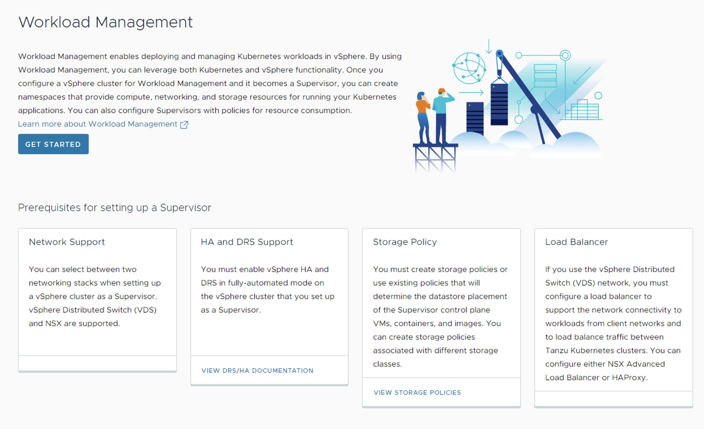
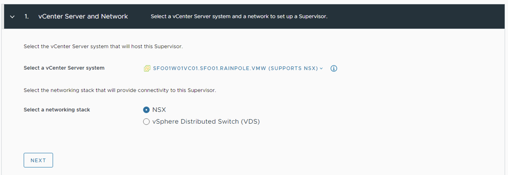

# VMware Tanzu for Kubernetes Operations using vSphere with Tanzu on NSX Reference Design

vSphere with Tanzu transforms vSphere into a platform for running Kubernetes workloads natively on the hypervisor layer. When vSphere with Tanzu is enabled on a vSphere cluster, you can run Kubernetes workloads directly on ESXi hosts and create upstream Kubernetes clusters within dedicated resource pools.

This document lays out a reference design for deploying VMware Tanzu for Kubernetes Operations on vSphere with  Tanzu enabled. This document does not cover any recommendations or deployment steps for underlying software-defined data center (SDDC) environments.

The following reference design is based on the architecture and components described in [VMware Tanzu for Kubernetes Operations Reference Architecture](index.md).

## Supported Component Matrix

The following table provides the component versions and interoperability matrix supported with reference design. For more information, see [VMware Product Interoperability Matrix](https://interopmatrix.vmware.com/Interoperability?isHidePatch=false&isHideGenSupported=true&isHideTechSupported=true&isHideCompatible=false&isHideIncompatible=false&isHideNTCompatible=false&isHideNotSupported=true&isCollection=false&col=912,8325&row=1363,17055%262,17056%26820).

|**Software Components**     |**Version**           |
|--------------------------- |----------------------|
|Tanzu Kubernetes Release    |1.23.8                |
|VMware vSphere ESXi         |8.0 Update 1a 21813344|
|VMware vCenter              |8.0 Update 1a 21815093|
|VMware NSX                  |4.1.0.2               |

## vSphere with Tanzu Components

- **Supervisor Cluster:** When **Workload Management** is enabled on a vSphere cluster, it creates a Kubernetes layer within the ESXi hosts that are part of the cluster. A cluster that is enabled for **Workload Management** is called a Supervisor Cluster. Workloads are either run as native pods or as pods on upstream Kubernetes clusters created through the Tanzu Kubernetes Grid Service.

  The Supervisor Cluster runs on top of an SDDC layer that consists of ESXi for compute, NSX Data Center or vSphere networking, and vSAN or another shared storage solution.

- **vSphere Namespaces:** A vSphere Namespace is a tenancy boundary within vSphere with Tanzu. A vSphere Namespace allows sharing vSphere resources (computer, networking, storage) and enforcing resource limits with the underlying objects such as Tanzu Kubernetes clusters. For each namespace, you configure role-based access control ( policies and permissions ), images library, and virtual machine classes.

- **Tanzu Kubernetes Grid Service:** Tanzu Kubernetes Grid Service allows you to create and manage ubiquitous Kubernetes clusters on a VMware vSphere infrastructure using the Kubernetes Cluster API. The Cluster API provides declarative, Kubernetes-style API's to enable the creation, configuration, and management of the Tanzu Kubernetes cluster. vSphere 8.0 and above supports the `ClusterClass` API. The ClusterClass API is a collection of templates that define a cluster topology and configuration. 

- **Tanzu Kubernetes Cluster (Workload Cluster):** Tanzu Kubernetes clusters are Kubernetes workload clusters in which your application workloads run. These clusters can be attached to SaaS solutions such as Tanzu Mission Control, Tanzu Observability, and Tanzu Service Mesh, which are part of Tanzu for Kubernetes Operations.

- **VM Class in vSphere with Tanzu:** A VM class is a template that defines CPU, memory, and reservations for VMs. VM classes are used for VM deployment in a Supervisor Namespace. VM classes can be used by standalone VMs that run in a Supervisor Namespace, and by VMs hosting a Tanzu Kubernetes cluster.

  VM Classes in a vSphere with Tanzu are categorized into the following two groups:

  - **Guaranteed:** This class fully reserves its configured resources.
  - **Best-effort:** This class allows to be overcommitted.

  
  vSphere with Tanzu offers several default VM classes. You can either use the default VM classes, or create customized VM classes based on the requirements of the application. The following table explains the default VM classes that are available in vSphere with Tanzu:
  
  |**Class**|**CPU**|**Memory(GB)**|**Reserved CPU and Memory**|
  | ------- | ----- | ------------ | ----------- |
  |best-effort-xsmall|2|2|No|
  |best-effort-small|2|4|No|
  |best-effort-medium|2|8|No|
  |best-effort-large|4|16|No|
  |best-effort-xlarge|4|32|No|
  |best-effort-2xlarge|8|64|No|
  |best-effort-4xlarge|16|128|No|
  |best-effort-8xlarge|32|128|No|
  |guaranteed-xsmall|2|2|Yes|
  |guaranteed-small|2|4|Yes|
  |guaranteed-medium|2|8|Yes|
  |guaranteed-large|4|16|Yes|
  |guaranteed-xlarge|4|32|Yes|
  |guaranteed-2xlarge|8|64|Yes|
  |guaranteed-4xlarge|16|128|Yes|
  |guaranteed-8xlarge|32|128|Yes|

- **Storage Classes in vSphere with Tanzu:** A StorageClass allows the administrators to describe the classes of storage that they offer. Different storage classes can map to meet quality-of-service levels, to backup policies, or to arbitrary policies determined by the cluster administrators. The policies representing datastore can manage storage placement of such components and objects as control plane VMs, vsphere Pod ephemeral disks, and container images. You might need policies for storage placement of persistent volumes and VM content libraries. 

	You can deploy vSphere with Tanzu with an existing default storage class or the vSphere administrator can define storage class objects (Storage policy) that let cluster users dynamically create PVC and PV objects with different storage types and rules.

  The following table provides recommendations for configuring VM Classes/Storage Classes in a vSphere with Tanzu environment.

  |**Decision ID**|**Design Decision**|**Design Justification**|**Design Implications**|
  | --- | --- | --- | --- |
  |TKO-TKGS-001|Create custom Storage Classes/Profiles/Policies|To provide different levels of QoS and SLA for prod and dev/test K8s workloads. |Default Storage Policy might not be adequate if deployed applications have different performance and availability requirements. |
  |TKO-TKGS-002|Create custom VM Classes|To facilitate deployment of K8s workloads with specific compute/storage requirements.|Default VM Classes in vSphere with Tanzu are not adequate to run a wide variety of K8s workloads. |

- **vSphere Pods:** vSphere with Tanzu introduces a new construct that is called vSphere Pod, which is the equivalent of a Kubernetes pod. A vSphere Pod is a Kubernetes Pod that runs directly on an ESXi host without requiring a Kubernetes cluster to be deployed. vSphere Pods are designed to be used for common services that are shared between workload clusters, such as a container registry.

	A vSphere Pod is a VM with a small footprint that runs one or more Linux containers. Each vSphere Pod is sized precisely for the workload that it accommodates and has explicit resource reservations for that workload. It allocates the exact amount of storage, memory, and CPU resources required for the workload to run. vSphere Pods are only supported with Supervisor Clusters that are configured with NSX Data Center as the networking stack.

## Identity and Access Management

vSphere with Tanzu supports the following two identity providers:

- **vCenter Single Sign-On:** This is the default identity provider that is used to authenticate with vSphere with Tanzu environment, including the Supervisors and Tanzu Kubernetes Grid Clusters. vCenter Single Sign-On (SSO) provides authentication for vSphere infrastructure and can integrate with AD/LDAP systems.

  To authenticate using vCenter SSO, use vSphere plug-in for kubectl. Once authenticated, use kubectl to declaratively provision and manage the lifecycle of TKG clusters, deploy TKG cluster workloads.

- **External Identity Provider:** You can configure a Supervisor with an external identity provider and support the [OpenID Connect protocol](https://openid.net/connect/). Once connected, the Supervisor functions as an OAuth 2.0 client, and uses the [Pinniped](https://pinniped.dev/) authentication service to connect to Tanzu Kubernetes Grid clusters by using the Tanzu CLI. Each Supervisor instance can support one external identity provider. For more information about the list of supported OIDC providers, see [Configure an External IDP](https://docs.vmware.com/en/VMware-vSphere/8.0/vsphere-with-tanzu-tkg/GUID-766CC14B-BE5D-427E-8EA5-1570F28C95DE.html).

The Tanzu Kubernetes Grid (informally known as TKG) cluster permissions are set and scoped at the vSphere Namespace level. When permissions are set for Namespace, including identity source, users & groups, and roles, all these permissions apply to any TKG cluster deployed within that vSphere Namespace.

### Roles and Permissions

TKG Clusters supports the following three roles: 
- Viewer 
- Editor 
- Owner

These permissions are assigned and scoped at vSphere Namespace.

|**Permission**|**Description**|
| ------ | ------ |
|Can view|Read-only access to TKG clusters provisioned in that vSphere Namespace.|
|Can edit|Create, read, update, and delete TKG clusters in that vSphere Namespace.|
|Owner|Can administer TKG clusters in a vSphere Namespace, and can create and delete additional vSphere Namespaces using kubectl.|

## vSphere with Tanzu Architecture

The Supervisor Cluster consists of the following components:

- **Supervisor control plane VM:** Three Supervisor control plane VMs in total are created on the hosts that are part of the Supervisor Cluster. The three control plane VMs are load balanced as each one of them has its own IP address. Additionally, a floating IP address is assigned to one of the VMS and a fifth IP address is reserved for patching purposes. vSphere DRS determines the exact placement of the control plane VMs on the ESXi hosts part of the cluster and migrate them when needed.

- **Tanzu Kubernetes Grid and Cluster API:** Modules running on the Supervisor and enable the provisioning and management of Tanzu Kubernetes Grid clusters.
- **Virtual Machine Service:** A module that is responsible for deploying and running stand-alone VMs, and VMs that makeup the Tanzu Kubernetes Grid clusters.

The following diagram shows the general architecture of the Supervisor Cluster.

After a Supervisor Cluster is created, the vSphere administrator creates vSphere namespaces. When initially created, vSphere namespaces have unlimited resources within the Supervisor Cluster. The vSphere administrator defines the limits for CPU, memory, and storage, as well as the number of Kubernetes objects such as deployments, replica sets, persistent volumes that can run within the namespace. These limits are configured for each vSphere namespace.

For more information about the maximum supported number, see the **vSphere with Tanzu [Configuration Maximums](https://configmax.esp.vmware.com/guest?vmwareproduct=vSphere&release=vSphere%208.0&categories=1-0,70-58,71-0)** guide.

To provide tenants access to namespaces, the vSphere administrator assigns permission to users or groups available within an identity source that is associated with vCenter SSO.

Once the permissions are assigned, the tenants can access the namespace to create Tanzu Kubernetes clusters using the YAML file and Cluster API.

## vSphere with Tanzu Storage

vSphere with Tanzu integrates with shared datastores available in the vSphere infrastructure. The following types of shared datastores are supported:

- vSAN
- VMFS
- NFS
- vVols

vSphere with Tanzu uses storage policies to integrate with shared datastores. The policies represent datastores and manage the storage placement of objects such as control plane VMs, container images, and persistent storage volumes.

Before you enable vSphere with Tanzu, create storage policies to be used by the Supervisor Cluster and namespaces. Depending on your vSphere storage environment, you can create several storage policies to represent different classes of storage.

vSphere with Tanzu is agnostic about which storage option you choose. For Kubernetes stateful workloads, vSphere with Tanzu installs the [vSphere Container Storage Interface (vSphere CSI)](https://github.com/container-storage-interface/spec) to automatically provision Kubernetes persistent volumes for pods.

## Networking for vSphere with Tanzu

You can enable Vsphere with Tanzu in the following environments:

- vSphere backed with NSX Data Center Networking.
- vSphere backed with virtual Distributed Switch (VDS) Networking and HA proxy to provide Load Balancing capabilities.
- vSphere backed with virtual Distributed Switch (VDS) Networking and NSX Advanced Load Balancer to provide Load Balancing capabilities.

>**Note** The scope of this document is limited to VMware NSX Data Center Networking.

NSX provides network connectivity to the objects inside the Supervisor and external networks. Connectivity to the ESXi hosts within the cluster is backed by VLAN backed port groups.

The following diagram shows a general overview of vSphere with Tanzu on NSX Networking. 

The Supervisor cluster configured with NSX Networking either uses a distributed port group (routable to required infrastructure components such as vCenter, NSX manager, DNS , NTP and so on. For more information, see [Firewal Recommendation](#firewall-recommendation)) or to NSX segment to provide connectivity to Kubernetes control plane VMs. Tanzu Kubernetes clusters and vSphere Pods have their networking provided by NSX segments. All hosts from the cluster, which are enabled for vSphere with Tanzu, are connected to the distributed switch that provides connectivity to Kubernetes workloads and control plane VMs.

The following section explains the networking components and services included in the Supervisor cluster:

- NSX Container Plugin (NCP) provides integration between NSX and Kubernetes. The main component of NCP runs in a container and communicates with the NSX manager and with the Kubernetes control plane. NCP monitors changes to containers and other resources and manages resources such as logical ports, segments, routers, and security groups for the containers by calling the NSX API.
- By default, NCP creates one shared tier-1 gateway for system namespaces, and a tier-1 gateway and load balancer for each namespace. The tier-1 gateway for namespace is connected to the tier-0 gateway and a default segment.
- System namespaces are the namespaces that are used by the core components that are integral to functioning of the Supervisor and Tanzu Kubernetes Grid clusters. The shared network resources that include the tier-1 gateway, load balancer, and SNAT IP are grouped in a system namespace.
- NSX Edge provides connectivity from external networks to the Supervisor resources. An NSX edge cluster normally includes at least two Edge nodes and has a load balancer that provides a redundancy to the Kube-API servers residing on control plane VMs and any application that must be published and be accessible from outside the Supervisor cluster. For more information, see [Install and Configure NSX for vSphere with Tanzu](https://docs.vmware.com/en/VMware-vSphere/8.0/vsphere-with-tanzu-installation-configuration/GUID-8D0E905F-9ABB-4CFB-A206-C027F847FAAC.html).

- A tier-0 gateway is associated with the NSX Edge cluster to provide routing to the external network. The uplink interfaces use either the dynamic routing, BGP, or static routing.
- Workloads running in vSphere Pods, regular VMs, or Tanzu Kubernetes clusters, that are in the same namespace, share a same SNAT IP for North-South connectivity.
- Workloads running in vSphere Pods or Tanzu Kubernetes clusters will have the same isolation rule that is implemented by the default firewall.
- A separate SNAT IP is not required for each Kubernetes namespace. East west connectivity between namespaces does not require SNAT.
- The segments for each namespace reside on the vSphere Distributed Switch (VDS) functioning in Standard mode that is associated with the NSX Edge cluster. The segment provides an overlay network to the Supervisor Cluster.
- Each vSphere namespace has a separate network and set of networking resources shared by applications inside the namespace, such as tier-1 gateway, load balancer service, and SNAT IP address.
- Workloads running in Tanzu Kubernetes Grid clusters have the same isolation rule that is implemented by the default firewall.
- NSX LB provides
  - L4 Load Balancer service for Kube-API to the Supervisor cluster and Workload clusters.
  - L4 Load Balancer service for all services of type LoadBalancer deployed in Workload clusters.

## Network Requirements

The following table lists the required networks for the reference design: 
>**Note** Based on your business requirements, modify subnet range to fit the projected growth.

|**Network Type**|**Sample Recommendation**|**Description**|
| -------------- | ----------------------- | ------------- |
|Supervisor Management Network|/28 to allow for 5 IPs and  future expansion.|Network to host the supervisor VMs. It can be a VLAN backed VDS Port group or pre-created NSX segment. |
|Ingress IP range|/24, 254 address|Each service type Load Balancer deployed will consume 1 IP address. |
|Egress IP range|/27|Each vSphere namespace consumes 1 IP address for the SNAT egress. |
|Namespace/POD network CIDR|/20  By default, it is used in /28 blocks by workload. |Allocate IP address to workload attached to supervisor namespace segments.|
|Supervisor Service CIDR|/24|Network from which IPs for Kubernetes ClusterIP Service will be allocated.|                                           |

## <a id="firewall-recommendation">Firewall Recommendations</a>

To prepare the firewall, you need the following information:

1. Supervisor network (Tanzu Kubernetes Grid Management) CIDR
2. Tanzu Kubernetes Grid workload cluster CIDR
3. Ingress and Egress range
4. Client machine IP address
5. vCenter server IP address
6. NSX Manager IP address
7. VMware Harbor registry IP address
8. DNS server IP address(es)
9. NTP server IP address(es)

The following table provides a list of firewall rules based on the assumption that there is no firewall within a subnet or VLAN.

|**Source**|**Destination**|**Protocol:Port**|**Description**|
| ----- | ------ | ----- | ------ |
|vCenter|Supervisor Network|TCP:6443|Allows vCenter to manage the supervisor VMs.|
|vCenter|Supervisor Network|TCP:22|Allows platform administrators to connect to VMs through vCenter.|
|Supervisor Network|NSX Manager|TCP:443|Allows supervisor to access NSX Manager to orchestrate networking.|
|Supervisor Network|vCenter|
TCP:6443

TCP:443
|Allows supervisor to access vCenter to create VMs and Storage Volumes.|
|Supervisor Network|ESXi Hosts|TCP:10250|Supervisor Cluster to Spherelet ESXi hosts.|
|ESXi Hosts|Supervisor IP Addresses|TCP:6443|Spherelet ESXi hosts to Supervisor Cluster.|
|Supervisor Network|DNS Servers|
TCP:53

UDP:53
|DNS|
|Supervisor Network|NTP Servers|UDP:123|NTP|
|Supervisor Network|Workload Network|TCP:6443|GCM, VMOperator needs to communicate with TKC apiserver.|
|Supervisor Network|\*.tmc.cloud.vmware.com|TCP:443|TMC Connectivity|
|Egress IP Range|DNS Servers|
TCP:53

UDP:53
|DNS|
|Egress IP Range|NTP Servers|UDP:123|NTP|
|Jumpbox|vCenter|
TCP:22

TCP:443
|Management|
|Jumpbox|NSX|TCP:443|Management|
|Jumpbox|Supervisor Network|
TCP:22

TCP:6443
|Management|
|Jumpbox|Workload Network|||
|Jumpbox|Ingress IP pool|
TCP:443

TCP:6443
|Management|
|Jumpbox|Web proxy|TCP:TBC|Settings depend on proxy|
|Jumpbox|Git Server|
TCP:443

TCP:22
|Version Control|
|Jumpbox|Ingress IP Range|
TCP:443

TCP:6443
|Management|
|Platform Admins|Jumpbox|TCP:22|Management|
|Kubernetes users|Ingress IP Range|
TCP:443

TCP:6443
|
Management.  You can further restrict to individual IPs for cluster access.

|

>**Note** For Tanzu Mission Control (TMC), if the firewall does not allow wildcards, you just whitelist all IP addresses of [account].tmc.cloud.vmware.com and extensions.aws-usw2.tmc.cloud.vmware.com.

### Network Segmentation

By default, when vSphere namespaces are created, distributed firewall rules are added to block all access to VMs from sources outside the namespace, other than the Supervisor cluster. This ensure that the VMs and the vSphere Pods by default are not able to communicate directly with the VMs or the pods in another namespace. 

The NSX distributed firewall applies only to ports on switches known to the ESXi host and does not apply to router ports. This distinction is important as NSX load balancer virtual server interfaces are considered router ports, as they only exist as service within a Tier 1 Gateway, which means thats the ports are not known to the ESXi host. The router ports do not include any metadata or tags, which means that the distributed firewall has no way to learn which namespace owns the virtual server.

To isolate traffic between separate namespaces, use one of the following options:

1. When creating the namespace, override the network settings to define dedicated IP blocks. This enables distributed firewall rules to be added to drop/deny traffic from VMs in other namespaces towards the ingress IP pool. This pattern requires separate IP ranges are used for ingress, egress and namespace networks. The networks are expandable at any time, but monitoring and managing IP capacity has an additional overhead.
2. Use gateway firewalls to restrict traffic coming in to each load balancer. The benefit is that no additional IP management is required. The down side is that each namespace has its own gateway with its own firewall rule table, which means that automation is significantly more challenging to implement and manual management will be very difficult. Also the gateway firewall has not had performance testing conducted against groups with dynamic membership. This is an issue at scale, as a workload cluster can only be identified by the tags applied to the segment it is attached to. This means in large environments there is potential for a lot of firewall rebuilds during activities such as upgrades, which could lead to performance issues.

## Deployment options

With vSphere 8 and above, when you enable vSphere with Tanzu, you can configure either one-zone Supervisor mapped to one vSphere cluster or three-zone Supervisor mapped to three vSphere clusters. This reference architecture is based on single zone deployment of a Supervisor Cluster. 

### Single-Zone Deployment of Supervisor

A supervisor deployed on a single vSphere cluster has three control plane VMs, which reside on the ESXi hosts part of the cluster. A single zone is created for the Supervisor automatically or you can use a zone that is created in advance. In a Single-Zone deployment, cluster-level high availability is maintained through vSphere HA and can scale with vSphere with Tanzu setup by adding physical hosts to vSphere cluster that maps to the Supervisor. 
You can run workloads through vSphere Pods, Tanzu Kubernetes Grid clusters, and VMs when Supervisor is enabled with the NSX networking stack.

### Three-Zone Deployment of Supervisor

Configure each vSphere cluster as an independent failure domain and map it to the vSphere zone. In a Three-Zone deployment, all three vSphere clusters become one Supervisor and can
provide :
s
- Cluster-level high availability to the Supervisor as vSphere cluster is an independent failure domain.
- Distribute the nodes of Tanzu Kubernetes Grid clusters across all three vSphere zones and provide availability via vSphere HA at cluster level.
- Scale the Supervisor by adding hosts to each of the three vSphere clusters.

For more information, see [VMware Tanzu for Kubernetes Operations using vSphere with Tanzu Multi-AZ Reference Architecture on NSX Networking](https://docs.vmware.com/en/VMware-Tanzu-for-Kubernetes-Operations/2.1/tko-reference-architecture/GUID-reference-designs-tko-on-vsphere-with-tanzu-multi-az-nsx.html).

## Installation Experience

vSphere with Tanzu deployment starts with deploying the Supervisor cluster (Enabling Workload Management). The deployment is directly executed from the vCenter user interface (UI). The Get Started page lists the pre-requisites for the deployment.

In the vCenter UI, Select NSX as networking stack.

This installation process takes you through the steps of deploying Supervisor cluster in your vSphere environment. Once the Supervisor cluster is deployed, you can use either [Tanzu Mission Control](https://tanzu.vmware.com/mission-control) or Kubectl utility to deploy the Tanzu Kubernetes Grid Clusters.

The following tables list recommendations for deploying the Supervisor Cluster:

|**Decision ID**|**Design Decision**|**Design Justification**|**Design Implications**|
| ------- | -------- | ----- | ----- |
|TKO-TKGS-003|Create a Subscribed Content Library. |
Subscribed Content Library can automatically pull the latest OVAs used by the Tanzu Kubernetes Grid Service to build cluster nodes.

Using a subscribed content library facilitates template management as new versions can be pulled by initiating the library sync.
|
Local Content Library would require manual upload of images, suitable for air-gapped or Internet restricted environment.
|
|TKO-TKGS-004|Deploy Supervisor cluster control plane nodes in large form factor.|Large form factor should suffice to integrate Supervisor cluster with TMC.|Consume more resources from Infrastructure. |
|TKO-TKGS-005|Register the Supervisor cluster with Tanzu Mission Control.|Tanzu Mission Control automates the creation of the Tanzu Kubernetes clusters, and manages the life cycle of all Tanzu Kubernetes clusters centrally.|Need outbound connectivity to the internet for TMC registration.|

>**Note** In this scenario, the SaaS endpoints refer to Tanzu Mission Control, Tanzu Service Mesh, and Tanzu Observability.

The following tables list recommendations for deploying Tanzu Kubernetes Clusters on the Supervisor Cluster:

|**Decision ID**|**Design Decision**|**Design Justification**|**Design Implications**|
| --- | --- | --- | --- |
|TKO-TKC-001|Deploy Tanzu Kubernetes clusters with prod plan and multiple worker nodes.|The prod plan provides high availability for the control plane. | Requires additional Compute resources. |
|TKO-TKC-002|Use guaranteed VM class for Tanzu Kubernetes clusters.|Guarantees compute resources are always available for containerized workloads.|Could prevent automatic migration of nodes by DRS.|
|TKO-TKC-003|Implement RBAC for Tanzu Kubernetes clusters.|To avoid the usage of administrator credentials for managing the clusters.|External AD/LDAP needs to be integrated with vCenter or SSO groups need to be created manually.
|TKO-TKC-04|Deploy Tanzu Kubernetes clusters from Tanzu Mission Control.|Tanzu Mission Control provides life-cycle management for the Tanzu Kubernetes clusters and automatic integration with Tanzu Service Mesh and Tanzu Observability.|Only Antrea CNI is supported on Workload clusters created from TMC portal.|

## vSphere Namespaces 

A vSphere Namespace provides the runtime environment for TKG clusters on Supervisor. To provision a TKG cluster, you first configure a vSphere namespace with users, roles, permissions, compute, storage, content library, and assign virtual machine classes. All these configurations are inherited by TKG clusters deployed in that namespace.

When you create a vSphere namespace, a network segment is created which is derived from the Namespace Network configured in Supervisor. While creating vSphere namespace, you have the option to override cluster network settings. Choosing this option lets you customize the vSphere namespace network by adding Ingress, Egress, and Namespace network CIDR (unique from the Supervisor and from any other vSphere namespace).

The typical use case for overriding Supervisor network settings is to provision a TKG cluster with routable pod networking. 

>**Note** The Override supervisor network setting is only available if the Supervisor is configured with NSX networking.

**Recommendations for Using Namespace with Tanzu**

|**Decision ID**|**Design Decision**|**Design Justification**|**Design Implications**|
| ----- | ------ | ----- | ------ |
|TKO-TKGS-005|Create dedicated namespace to environment specific.|Segregate prod/dev/test cluster via assigning them to dedicated namespaces.|Clusters created within the namespace share the same access policies/quotas/network & storage resources.|
|TKO-TKGS-006|Register external IDP with Supervisor or AD/LDAP with vCenter SSO.|Limit access to namespace based on role of users or groups.|External AD/LDAP needs to be integrated with vCenter or SSO Groups need to be created manually.|
|TKO-TKGS-007|Enable namespace self-service|Enables Devops users to create namespace in self-service manner.|The vSphere administrator must publish a namespace template to LDAP users or groups to enable them to create a namespace.|
|TKO-TKGS-008|Use guaranteed VM Class for production cluster.|CPU and Memory limits configured on vSphere Namespace have impact on TKG cluster if deployed using the guaranteed VM Class type.|Consume more infrastructure resources and contention might occur.|

## Tanzu Kubernetes Grid Cluster API's

Tanzu Kubernetes Grid provides the following two API's for provisioning and managing the life cycle of TKG2 clusters:

- API Version v1alpha3 for Tanzu Kubernetes clusters
- API version v1beta1 for Clusters based on a ClusterClass

The v1alpha3 API lets you create conformant Kubernetes clusters of type `TanzuKubernetesCluster`. This type of cluster is pre-configured with common defaults for quick provisioning, and can be customized. The v1beta1 API lets you create conformant Kubernetes clusters based on the default ClusterClass named **tanzukubernetescluster** and cluster type of **Cluster**.

## Tanzu Kubernetes Clusters Networking

A Tanzu Kubernetes cluster provisioned by the Tanzu Kubernetes Grid supports the following Container Network Interface (CNI) options:

- [Antrea](https://antrea.io/)
- [Calico](https://www.tigera.io/project-calico/)

The CNI options are open-source software that provide networking for cluster pods, services, and ingress.

When you deploy a Tanzu Kubernetes cluster using the default configuration of Tanzu CLI, Antrea CNI is automatically enabled in the cluster.

To provision a Tanzu Kubernetes cluster using Calico CNI, see [Deploy Tanzu Kubernetes clusters with Calico](https://docs.vmware.com/en/VMware-Tanzu-Kubernetes-Grid/2.1/using-tkg-21/workload-clusters-networking.html?hWord=N4IghgNiBcIMaQJZwPYgL5A).

Each CNI is suitable for a different use case. The following table lists some common use cases for the CNI options that Tanzu Kubernetes Grid supports. This table will help you select the most appropriate CNI for your Tanzu Kubernetes Grid implementation.

|**CNI**|**Use Case**|**Pros and Cons**|
| --- | --- | --- |
|Antrea|
Enable Kubernetes pod networking with IP overlay networks using VXLAN or Geneve for encapsulation. Optionally, encrypt node-to-node communication using IPSec packet encryption.

Antrea supports advanced network use cases like kernel bypass and network service mesh.
|
**Pros**

- Antrea leverages Open vSwitch as the networking data plane. Open vSwitch supports both Linux and Windows.

- VMware supports the latest conformant Kubernetes and stable releases of Antrea.
|
|Calico|
Calico is used in environments where factors like network performance, flexibility, and power are essential.

For routing packets between nodes, Calico leverages the BGP routing protocol instead of an overlay network. This eliminates the need to wrap packets with an encapsulation layer resulting in increased network performance for Kubernetes workloads.
|
**Pros**

- Support for Network Policies

- High network performance

- SCTP Support

**Cons**

- No multicast support

|

## Kubernetes Ingress Routing

vSphere with Tanzu does not provide a default ingress controller. You can use Any Tanzu-supported ingress controller. For example, Contour, an open-source controller for Kubernetes ingress routing. Contour is part of a Tanzu package and can be installed on any Tanzu Kubernetes cluster. Deploying Contour is a prerequisite for deploying Prometheus, Grafana, and Harbour on a workload cluster. 

For more information about Contour, see [Contour](https://projectcontour.io/) and [Ingress Using Contour](https://docs.vmware.com/en/VMware-vSphere/8.0/vsphere-with-tanzu-tkg/GUID-D540E8AA-38FE-41D8-9FF2-72C6EB17A721.html). 

[Tanzu Service Mesh](https://tanzu.vmware.com/service-mesh) also offers an Ingress controller based on [Istio](https://istio.io/). 

Each ingress controller has advantages and disadvantages of its own. The following table provides general recommendations on when you should use a specific ingress controller for your Kubernetes environment:

|**Ingress Controller**|**Use Cases**|
| -------------------- | ----------- |
|Contour|
You use Contour when only north-south traffic is needed in a Kubernetes cluster. You can apply security policies for the north-south traffic by defining the policies in the manifest file for the application.

Contour is a reliable solution for simple Kubernetes workloads.

|
|Istio|You use Istio ingress controller when you need to provide security, traffic direction, and insight within the cluster (east-west traffic), and between the cluster and the outside world (north-south traffic).|

## Container Registry

vSphere with Tanzu includes Harbor as a container registry. Harbor provides a location of pushing, pulling, storing, and scanning container images used in your Kubernetes clusters.

The initial configuration and setup of the platform does not require any external registry because the required images are delivered through vCenter. Harbor registry is used for day-2 operations of the Tanzu Kubernetes workload clusters. Typical day-2 operations include tasks, such as pulling images from Harbor for application deployment, and pushing custom images to Harbor.

When vSphere with Tanzu is deployed on NSX networking, you can deploy an external container registry (Harbor) for Tanzu Kubernetes clusters.

You can use one of the following methods to install Harbor:

- [Tanzu Kubernetes Grid Package deployment:](https://docs.vmware.com/en/VMware-Tanzu-Kubernetes-Grid/1.5/vmware-tanzu-kubernetes-grid-15/GUID-packages-harbor-registry.html)** VMware recommends this installation method for general use cases. The Tanzu packages, including Harbor, must either be pulled directly from VMware or be hosted in an internal registry.
- [VM-based deployment using OVA:](https://docs.vmware.com/en/VMware-Tanzu-Kubernetes-Grid/2.1/tkg-deploy-mc-21/mgmt-reqs-harbor.html) VMware recommends using this installation method in cases where Tanzu Kubernetes Grid is being installed in an air-gapped or Internet-restricted environment, and no pre-existing image registry exists to host the Tanzu Kubernetes Grid system images. VM-based deployments are only supported by VMware Global Support Services to host the system images for air-gapped or Internet-less deployments. Do not use this method for hosting application images. 

When deploying Harbor with self-signed certificates or certificates signed by internal CAs, it is necessary for the Tanzu Kubernetes cluster to establish trust with the registry's certificate. To do so, follow the procedure ins [Integrate TKG 2 cluster with container registry](https://docs.vmware.com/en/VMware-vSphere/8.0/vsphere-with-tanzu-tkg/GUID-EC2C9619-2898-4574-8EF4-EA66CFCD52B9.html).

## Scale a Tanzu Kubernetes Grid Cluster

You can scale a Tanzu Kubernetes Grid cluster on Supervisor horizontally by changing the number of nodes, or vertically by changing the virtual machine class hosting the nodes. 

The following table lists the supported scaling operations for TKG cluster:

|**Node**|**Horizontal Scale Out**|**Horizontal Scale In**|**Vertical Scale**|**Volume Scale**|
| ------ | ---- | ----- | ----- | ----- |
|Control Plane|Yes|Yes|Yes|No|
|Worker|Yes|Yes|Yes|Yes|

>**Note**
>- The number of control plane nodes must be odd, either 3 or 5.
>- You can change the Worker node volumes after provisioning. However, you can not change the control plane node volumes.

## Backup And Restore

There are following two options for backing up and restoring stateless and stateful applications running on TKG Clusters on Supervisor:

|**Tool**|**Comments**|
| ---- | ---- |
|Velero plug-in for vSphere|
Both Kubernetes metadata and persistent volumes can be backed up and restored.

Velero snapshotting is used for persistent volumes with stateful applications.

Requires the Velero plug-in for vSphere installed and configured on Supervisor.

|
|Standalone Velero and Restic|
Both Kubernetes metadata and persistent volumes can be backed up and restored.

Restic is used for persistent volumes with stateful applications.

Use this approach if you require portability.

|

To backup and restore workloads running on TKG Cluster, create a datastore and install Velero with Restic on Kubernetes cluster. For more information, see [Install and Configure Standalone Velero and Restic](https://docs.vmware.com/en/VMware-vSphere/8.0/vsphere-with-tanzu-tkg/GUID-6CC3E1B5-CDAB-453C-98FE-CB579BC6AAF0.html). 

## vSphere with Tanzu SaaS Integration

The SaaS products in the VMware Tanzu portfolio are on the critical path for securing systems at the heart of your IT infrastructure. VMware Tanzu Mission Control provides a centralized control plane for Kubernetes, and Tanzu Service Mesh provides a global control plane for service mesh networks. Tanzu Observability features include Kubernetes monitoring, application observability, and service insights.

To learn more about Tanzu Kubernetes Grid integration with Tanzu SaaS, see [Tanzu SaaS Services](tko-saas.md).

### Custom Tanzu Observability Dashboards

Tanzu Observability provides various out-of-the-box dashboards. You can customize the dashboards for your particular deployment. For information on how to customize Tanzu Observability dashboards for Tanzu for Kubernetes Operations, see [Customize Tanzu Observability Dashboard for Tanzu for Kubernetes Operations](../deployment-guides/tko-to-customized-dashboard.md).

## Summary

vSphere with Tanzu on hyper-converged hardware offers high-performance potential, convenience, and addresses the challenges of creating, testing, and updating on-premises Kubernetes platforms in a consolidated production environment. This validated approach will result in a production installation with all the application services needed to serve combined or uniquely separated workload types through a combined infrastructure solution.

This plan meets many Day 0 needs for quickly aligning product capabilities to full-stack infrastructure, including networking, configuring firewall rules, load balancing, workload compute alignment, and other capabilities.