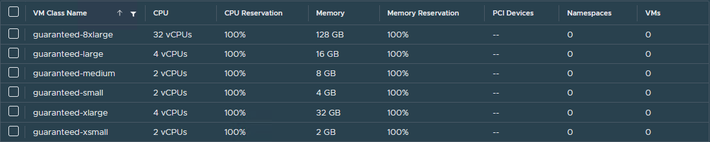
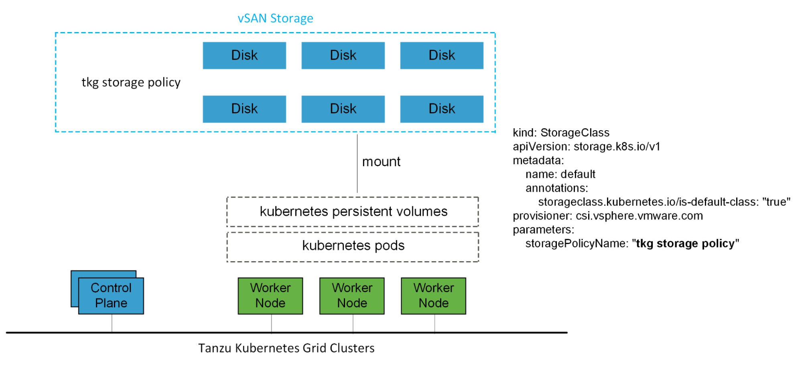
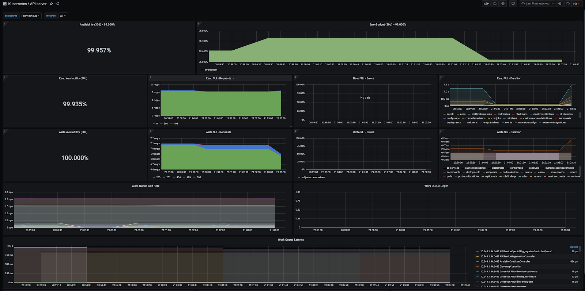
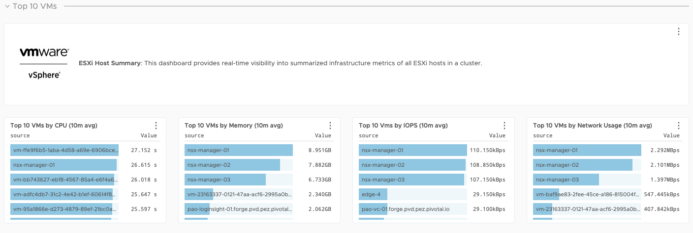
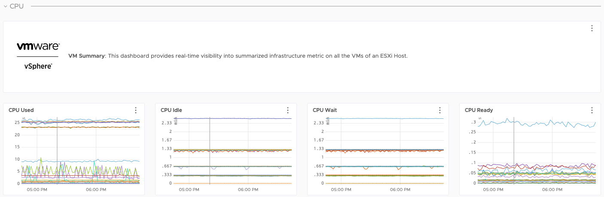
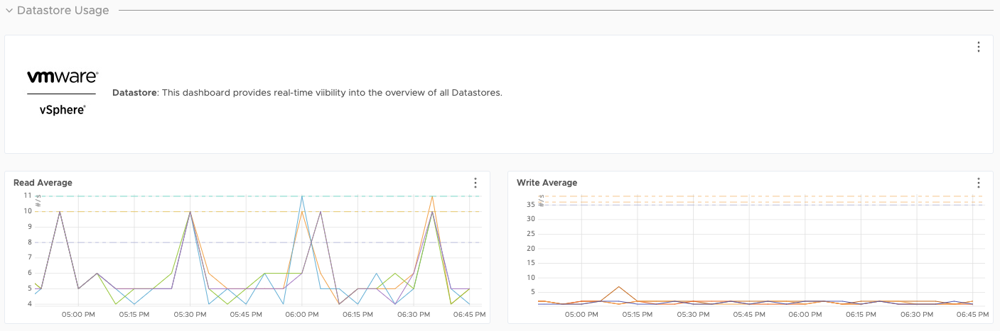
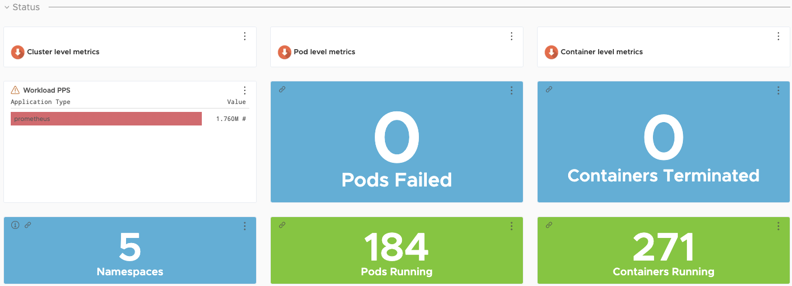
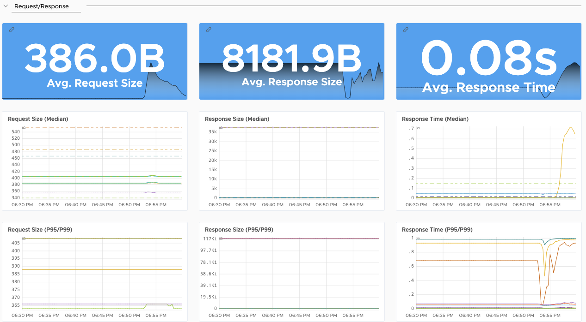

# VMware Tanzu for Kubernetes Operations using vSphere with Tanzu on NSX-T Reference Design

vSphere with Tanzu transforms vSphere into a platform for running Kubernetes workloads natively on the hypervisor layer. When vSphere with Tanzu is enabled on a vSphere cluster, you can run Kubernetes workloads directly on ESXi hosts and create upstream Kubernetes clusters within dedicated resource pools.

This document lays out a reference design for deploying VMware Tanzu for Kubernetes Operations on vSphere with  Tanzu enabled. The reference design is based on the architecture and components described in [Tanzu Solutions Reference Architecture Overview](index.md).

## vSphere with Tanzu Components

- **Supervisor Cluster:** When Workload Management is enabled on a vSphere cluster, it creates a Kubernetes layer within the ESXi hosts that are part of the cluster. A cluster that is enabled for **Workload Management** is called a Supervisor Cluster. Workloads are either run as native pods or as pods on upstream Kubernetes clusters created through the Tanzu Kubernetes Grid Service.

  The Supervisor Cluster runs on top of an SDDC layer that consists of ESXi for compute, NSX-T Data Center or vSphere networking, and vSAN or another shared storage solution.

- **vSphere Namespaces:** A vSphere Namespace is a tenancy boundary within vSphere with Tanzu. A vSphere Namespace allows the sharing of vSphere resources (computer, networking, storage) and enforcing of resource limits with the underlying objects such as Tanzu Kubernetes clusters. It also allows you to attach policies and permissions.

- **Tanzu Kubernetes Grid Service:** Tanzu Kubernetes Grid Service allows you to create and manage ubiquitous Kubernetes clusters on a VMware vSphere infrastructure using the Kubernetes Cluster API. The Cluster API provides declarative, Kubernetes-style APIs to enable the creation, configuration, and management of the Tanzu Kubernetes cluster.

	Tanzu Kubernetes Grid Service also provides self-service lifecycle management of Tanzu Kubernetes clusters.

- **Tanzu Kubernetes Cluster (Workload Cluster):** Tanzu Kubernetes clusters are Kubernetes workload clusters in which your application workloads run. These clusters can be attached to SaaS solutions such as Tanzu Mission Control, Tanzu Observability, and Tanzu Service Mesh, which are part of Tanzu for Kubernetes Operations.

- **VM Class in vSphere with Tanzu:** A VM class is a template that defines CPU, memory, and reservations for VMs. VM classes are used for VM deployment in a Supervisor Namespace. VM classes can be used by stand-alone VMs that run in a Supervisor Namespace and by VMs hosting a Tanzu Kubernetes cluster.

	vSphere with Tanzu offers several default VM classes. You can use them as is or you can create new VM classes. The default VM classes that are available in vSphere with Tanzu are shown in the following images.

	

	

- **Storage Classes in vSphere with Tanzu:** A storage class provides a way for administrators to describe the classes of storage they offer. Different classes can map to quality-of-service levels, or to backup policies, or to arbitrary policies determined by the cluster administrators.

	You can deploy vSphere with Tanzu with an existing default storage class or the vSphere administrator can define storage class objects (Storage policy) that let cluster users dynamically create PVC and PV objects with different storage types and rules.

- **vSphere Pods:** vSphere with Tanzu introduces a new construct that is called vSphere Pod, which is the equivalent of a Kubernetes pod. A vSphere Pod is a Kubernetes Pod that runs directly on an ESXi host without requiring a Kubernetes cluster to be deployed. vSphere Pods are designed to be used for common services that are shared between workload clusters, such as a container registry.

	A vSphere Pod is a VM with a small footprint that runs one or more Linux containers. Each vSphere Pod is sized precisely for the workload that it accommodates and has explicit resource reservations for that workload. It allocates the exact amount of storage, memory, and CPU resources required for the workload to run. vSphere Pods are only supported with Supervisor Clusters that are configured with NSX-T Data Center as the networking stack.

## vSphere with Tanzu Architecture

The following diagram shows the high-level architecture of vSphere with Tanzu deployed with the VCF SDDC Reference Architecture.

The Supervisor Cluster consists of the following components:

- **Kubernetes control plane VM:** Three Kubernetes control plane VMs in total are created on the hosts that are part of the Supervisor Cluster. The three control plane VMs are load balanced as each one of them has its own IP address.

- **Cluster API and Tanzu Kubernetes Grid Service:** These are modules that run on the Supervisor Cluster and enable the provisioning and management of Tanzu Kubernetes clusters.

The following diagram shows the general architecture of the Supervisor Cluster.

After a Supervisor Cluster is created, the vSphere administrator creates vSphere Namespaces. When initially created, the namespace has unlimited resources within the Supervisor Cluster. The vSphere administrator defines the limits for CPU, memory, storage, and the number of Kubernetes objects that can run within the namespace. These limits are configured per vSphere Namespace.

To provide tenants access to namespaces, the vSphere administrator assigns permission to users or groups available within an identity source that is associated with vCenter Single Sign-On.

Once the permissions are assigned, the tenants can access the namespace to create Tanzu Kubernetes clusters using the YAML file and Cluster API.

## Supported Component Matrix

The following table provides the component versions and interoperability matrix supported with the reference design:

| Software Components      | Version                 |
| ------------------------ | ----------------------- |
| Tanzu Kubernetes Release | 1.21.2                  |
| VMware vSphere ESXi      | ESXi - 7.0 U3 and later |
| VMware vCenter (VCSA)    | 7.0 U3 and later        |
| VMware NSX-T             | 3.1 and later           |

## vSphere with Tanzu Storage

vSphere with Tanzu integrates with shared datastores available in the vSphere infrastructure. The following types of shared datastores are supported:

- vSAN
- VMFS
- NFS
- vVols

vSphere with Tanzu uses storage policies to integrate with shared datastores. The policies represent datastores and manage the storage placement of objects, such as control plane VMs, container images, and persistent storage volumes.

Before you enable vSphere with Tanzu, create storage policies. The storage polices are used by the Supervisor Cluster and namespaces. Depending on your vSphere storage environment, you can create several storage policies to represent different classes of storage.

vSphere with Tanzu is agnostic about which option you choose. [VMware vSAN](https://docs.vmware.com/en/VMware-vSAN/index.html) is a recommended storage solution for both Supervisor Cluster and workload cluster VMs.

For Kubernetes stateful workloads, vSphere with Tanzu installs the [vSphere Container Storage interface (vSphere CSI)](https://docs.vmware.com/en/VMware-vSphere-Container-Storage-Plug-in/index.html) to automatically provision Kubernetes persistent volumes for pods.

While the default vSAN storage policy can be used, administrators should evaluate the needs of their applications and configure a specific [vSphere Storage Policy](https://docs.vmware.com/en/VMware-vSphere/6.7/com.vmware.vsphere.storage.doc/GUID-89091D59-D844-46B2-94C2-35A3961D23E7.html). vSAN storage policies describe classes of storage, such as SSD and NVME, as well as quota definitions for the vSAN cluster.

Starting with vSphere 7.0 environments with vSAN, the vSphere CSI driver for Kubernetes also supports the creation of NFS File Volumes, which support ReadWriteMany access modes. This allows for provisioning volumes, which can be read and written from multiple pods simultaneously. To support this, you must enable vSAN File Service.

**Note:** vSAN File Service is available only in vSAN Enterprise and Enterprise Plus editions.

## Clustering on vSphere

### High Availability

vSphere with Tanzu relies heavily on existing vSphere features for mitigating common availability disruptions, such as a single-host hardware failure. In this scenario, ensuring vSphere HA is enabled allows VMs on failed hardware to be automatically restarted on surviving hosts.

The vSphere with Tanzu Supervisor Cluster performs machine health checks on all Kubernetes worker VMs. This ensures workloads remain in a functional state and can remediate issues such as:

* Worker VM accidentally deleted or corrupted

* Kubelet process on worker VM accidentally stopped or corrupted

This health check ensures that your worker capacity remains stable and can be scheduled for workloads. This health check, however, does not apply to control plane VMs that are already deployed and does not recreate VMs due to physical host failure. vSphere HA and machine health checks work in conjunction to enhance workload resilience. For more information about machine health checks, see the [Cluster API](https://cluster-api.sigs.k8s.io/tasks/automated-machine-management/healthchecking.html) documentation.

VMware recommends enabling Fully Automated DRS to ensure that the cluster load is evenly spread over all hosts. This indirectly helps reduce vSphere HA recovery time. Because no single host is overloaded, the VMs are not too large or too many, therefore, reducing the recovery time on surviving hosts.

### Stretched vSphere Clusters Support

Deployment on a stretched cluster is not supported by VMware, as the vSphere with Tanzu layer does not distinguish between stretched and non-stretched vSphere clusters and provisions VMs randomly across the two sites. As a result, vSphere with Tanzu may provision VMs in a way that does not allow enough resources to your applications, resulting in downtime. There is also a known issue in upstream ETCd which VMware has found can cause corruption of one or more ETCd replica. This can result in a cluster being unable to schedule pods, requiring significant time and effort to recover.

## Networking for vSphere with Tanzu

vSphere with Tanzu can be deployed using the following:

- VMware NSX-T Data Center Networking
- vSphere Virtual Distributed Switch (VDS) Networking with HA proxy for Load Balancing
- vSphere Virtual Distributed Switch (VDS) Networking with NSX Advanced Load Balancer

**Note:** The scope of this document is limited to VMware NSX-T Data Center Networking.

### vSphere with Tanzu on VMware NSX-T Data Center Networking

In a vSphere with Tanzu environment, a Supervisor Cluster configured with NSX-T networking uses either a distributed port group or NSX-T segment to provide connectivity to Kubernetes control plane VMs. Tanzu Kubernetes clusters and vSphere Pods have their networking provided by NSX-T segments. All hosts from the cluster, which is enabled for vSphere with Tanzu, are connected to the distributed switch that provides connectivity to Kubernetes workloads and control plane VMs.

You can use one or more distributed port groups as Workload Networks. The network that provides connectivity to the Kubernetes Control Plane VMs is called Primary Workload Network. You can assign this network to all the namespaces on the Supervisor Cluster, or you can use different networks for each namespace. The Tanzu Kubernetes clusters connect to the Workload Network that is assigned to the namespace.

The Supervisor Cluster leverages the NSX-T load balancer to provide L4 load balancing for the Tanzu Kubernetes clusters and vSphere Pods. It also provides L7 ingress to vSphere Pods, but not for Tanzu Kubernetes clusters. Tanzu Kubernetes clusters require an in-cluster ingress controller, such as Contour. Users access the applications by connecting to the Virtual IP address (VIP) of the applications provisioned by the NSX-T load balancer.

The following diagram shows a general overview for vSphere with Tanzu on vSphere Networking. 

A brief description of all networking components and services included in the Supervisor Cluster networking is as follows:

- NSX Container Plug-in (NCP) provides integration between NSX-T Data Center and Kubernetes. The main component of NCP runs in a container and communicates with NSX Manager and with the Kubernetes control plane. NCP monitors changes to containers and other resources and manages networking resources such as logical ports, segments, routers, and security groups for the containers by calling the NSX API. NCP creates one shared tier-1 gateway for system namespaces and a tier-1 gateway and load balancer for each namespace, by default. The tier-1 gateway is connected to the tier-0 gateway and a default segment.
System namespaces are namespaces that are used by the core components that are integral to functioning of the Supervisor Cluster and Tanzu Kubernetes. The shared network resources that include the tier-1 gateway, load balancer, and SNAT IP are grouped in a system namespace.
- NSX Edge provides connectivity from external networks to Supervisor Cluster objects. An NSX Edge cluster normally includes at least two Edge nodes and has a load balancer that provides a redundancy to the Kubernetes API servers residing on the control plane VMs and any application that must be published and be accessible from outside the Supervisor Cluster. There are different topologies possible in terms of shared and dedicated Edge clusters.
- A Tier-0 gateway is associated with an NSX Edge cluster to provide routing to the external network. The uplink interface uses either the dynamic routing protocol, BGP, or static routing.
- Each vSphere Namespace has a separate network and a set of networking resources shared by applications inside the namespace such as, tier-1 gateway, load balancer service, and SNAT IP address.
- Workloads running in vSphere Pods, regular VMs, or Tanzu Kubernetes clusters, that are in the same namespace, share a same SNAT IP for North-South connectivity.
- Workloads running in vSphere Pods or Tanzu Kubernetes clusters will have the same isolation rule that is implemented by the default firewall.
- A separate SNAT IP is not required for each Kubernetes namespace. East west connectivity between namespaces does not require SNAT.
- The segments for each namespace reside on the vSphere Distributed Switch (VDS) functioning in Standard mode that is associated with the NSX Edge cluster. The segment provides an overlay network to the Supervisor Cluster.
- Supervisor Clusters can have separate segments per Tanzu Kubernetes cluster within the shared tier-1 gateway for a particular namespace. 

### Network Sizing

The following table lists the required networks for the reference design.

| Function               | Routed | Expandable | Recommendation                                | Description                                                                                                |
| ---------------------- | ------ | ---------- | --------------------------------------------- | ---------------------------------------------------------------------------------------------------------- |
| Supervisor network     | Yes    | No         | /28 to allow for 5 IPs, plus future expansion | Network to host the supervisor VM routed interface    .                                                    |
| Ingress IP range       | Yes    | Yes        | Use case dependent. /20 Is a good start.      | Each service type load balancer deployed will consume 1 IP address.                                        |
| Egress IP range        | Yes    | Yes        | Use case dependent. /24 Is a good start.      | Each vSphere namespace will consume 1 IP address to use for SNAT egress.                                   |
| Namespace network CIDR | No     | Yes        | Use case dependent. /20 Is a good start.      | Used in /28 blocks by workload clusters and vSphere Pods.                                                  |
| Supervisor services    | No     | No         | /18 to allow for 16384 services               | Used by vSphere Pods to access services and used by NSX-T for each defined workload load balancer service. |
| Container overlay CIDR | No     | No         | /16 to allow for 256 node clusters            | Used within the nodes to form the container overlay. /24 is taken per node.                                |
| Workload services      | No     | No         | /18 to allow for 16384 services               | Used within the workload cluster to access defined services.                                               |

###  Firewall Recommendations

To prepare the firewall, gather the following information:

- vCenter server IP address
- NSX-T Manager VIP address.
- Supervisor Cluster network (vSphere with Tanzu Management) CIDR.
- Supervisor Cluster VIP address.
- Tanzu Kubernetes Grid Workload Cluster VIP address.
- Tanzu Kubernetes cluster (Workload Cluster) CIDR.
- VMware Harbor registry IP address.
- DNS server IP addresses.
- NTP server IP addresses.

| Source            | Destination      |                       | Description                                                                |
| ----------------- | ---------------- | --------------------- | -------------------------------------------------------------------------- |
| vCenter           | Supervisor IP Addresses   | TCP:6443              | Allow vCenter to manage the supervisor VMs                                 |
| vCenter           | Supervisor IP Addresses   | TCP:22                | Allow platform administrators to connect to VMs through vCenter            |
| Supervisor IP Addresses    | NSX-T Manager    | TCP:443               | Allow supervisor to access NSX-T Manager to orchestrate networking         |
| Supervisor IP Addresses    | vCenter          | TCP:6443   TCP:443 | Allow supervisor to access vCenter to create VMs and Storage Volumes       |
| Supervisor IP Addresses    | ESXi Hosts       | TCP:10250             | Supervisor Cluster to Spherelet ESXi hosts                                 |
| ESXi Hosts        | Supervisor IP Addresses   | TCP:6443              | Spherelet ESXi hosts to Supervisor Cluster                                 |
| Supervisor Subnet | DNS Servers      | TCP:53   UDP:53    | DNS                                                                        |
| Supervisor Subnet | NTP Servers      | UDP:123               | NTP                                                                        |
| Egress IP Range   | DNS Servers      | TCP:53   UDP:53    | DNS                                                                        |
| Egress IP Range   | NTP Servers      | UDP:123               | NTP                                                                        |
| Jumpbox           | vCenter          | TCP:22   TCP:443   | Management                                                                 |
| Jumpbox           | NSX-T            | TCP:443               | Management                                                                 |
| Jumpbox           | Supervisor IP Addresses   | TCP:22   TCP:6443  | Management                                                                 |
| Jumpbox           | Ingress IP pool  | TCP:443   TCP:6443 | Management                                                                 |
| Jumpbox           | Web proxy        | TCP:TBC               | Settings depend on proxy                                                   |
| Jumpbox           | Git Server       | TCP:443   TCP:22   | Version Control                                                            |
| Jumpbox           | Ingress IP Range | TCP:443   TCP:6443 | Management                                                                 |
| Platform Admins   | Jumpbox          | TCP:22                | Management                                                                 |
| Kubernetes users  | Ingress IP Range | TCP:443   TCP:6443 | Management. Can be further restricted to individual IPs for cluster access |

### Network Segmentation

By default, when vSphere namespaces are created, distributed firewall rules are added to block all access to VMs from sources outside the namespace, other than the Supervisor Cluster. This ensure that VMs and vSphere Pods by default are not able to communicate directly with VMs or pods in another namespace. 

The NSX-T distributed firewall applies only to ports on switches known to the ESXi host and do not apply to router ports. This distinction is important as NSX-T load balancer virtual server interfaces are considered router ports, as they only exist as service within a Tier 1 Gateway, meaning the ports are not known to the ESXi host. The router ports also do not include any metadata or tags, meaning that the distributed firewall has no way to learn which namespace owns the virtual server.

Should there be the need to isolate traffic between separate namespaces, there are 2 available options:

1. When creating the namespace, override the network settings to define dedicated IP blocks. This enables distributed firewall rules to be added to drop/deny traffic from VMs in other namespaces towards the ingress IP pool. Using this pattern will require that separate IP ranges are used for ingress, egress and namespace networks. The networks are expandable at any time, but monitoring and managing IP capacity has an additional overhead.
2. Use gateway firewalls to restrict traffic coming in to each load balancer. The benefit is that no additional IP management is required. The down side is that each namespace has its own gateway, with its own firewall rule table, which means that automation is significantly more challenging to implement and manual management will be very difficult. Also the gateway firewall has not had performance testing conducted against groups with dynamic membership. This is an issue at scale, as a workload cluster can only be identified by the tags applied to the segment it is attached to. This means in large environments there is potential for a lot of firewall rebuilds during activities such as upgrades, which could lead to performance issues.

###  Networking Recommendations

The key recommendations for a production-grade vSphere with Tanzu deployment are as follows:

- The NSX-T T0 Gateways should be deployed to a dedicated Edge cluster. A separate Edge cluster should be defined for T1 routers, as this is where load balancer services will run. This is for both performance and scalability reasons.
- [NSX-T Config Maximums](https://configmax.esp.vmware.com/guest?vmwareproduct=VMware%20NSX&release=NSX-T%20Data%20Center%203.1.3&categories=20-0) must be considered when sizing the Edge cluster that hosts the T1 routers, as the Edge Node size will determine the supported number of objects. Edge nodes can be added to Edge clusters in pairs, with up to 10 Edge nodes per Edge cluster.
- Workload Clusters should be assigned to separate vSphere namespaces if they are considered separate security zones.
- To fully isolate the cluster between 2 different vSphere namespaces, per namespace networking (requires vCenter update 3+) should be used to define dedicated ingress networks per vSphere namespace. NSX-T distributed firewall rules can be added to deny or drop traffic towards the ingress networks from un-trusted sources.
- An IP block of 5 continuous IP addresses is required for the Supervisor Cluster.

### Ingress Controllers for Tanzu Kubernetes Clusters

VMware recommends installing the Contour Tanzu package on Tanzu Kubernetes clusters when entitled to do so. Contour is exposed by the default Layer 4 load balancer and provides Layer 7 based routing to Kubernetes services. For more information about Contour, see [Contour](https://projectcontour.io) and [Implementing Ingress Control with Contour](https://docs.vmware.com/en/VMware-Tanzu-Kubernetes-Grid/1.5/vmware-tanzu-kubernetes-grid-15/GUID-packages-ingress-contour.html).

Users can also use any third-party ingress controller of their choice.

### Ingress Controller for vSphere Pods

The NSX-T load balancer functions as the default ingress controller for all vSphere Pod based workloads. When an ingress object is created within a vSphere Namespace, it results in an NSX-T load balancer virtual server being created under the same tier 1 router to host all ingress routes.

## Design Recommendations

### Design Recommendations for Supervisor Cluster

- Provide a block of 5 continuous IP addresses for the Supervisor Cluster. DHCP mode is possible, but not recommended, due to known issues if a node's IP address is ever changed.
- For each Supervisor Cluster where you intend to deploy a Tanzu Kubernetes cluster, you must define a Subscribed Content Library object that sources the OVA used by the Tanzu Kubernetes Grid Service to build cluster nodes. The same Subscribed Content Library can be configured for multiple Supervisor Clusters.
- To facilitate different storage tiers for Supervisor and Tanzu Kubernetes clusters, it is recommended to have different storage policies and tag appropriate datastores. If the underlying storage is vSAN, storage policies with distinct capabilities (availability & storage rules) can be created and leveraged in namespaces.
- For a production-grade deployment, to allow Tanzu Mission Control integration, VMware recommends a Supervisor Cluster with a large size form factor for control plane nodes.
- Register the Supervisor Cluster with Tanzu Mission Control to automate workload cluster creation and centralized life cycle management of all workload clusters.

### Design Recommendations for Tanzu Kubernetes Cluster

- Deploy workload clusters (based on type prod/dev/test) in separate namespaces under the Supervisor namespace. This allows for setting limits for CPU, memory, storage, and the number of Kubernetes objects per namespace.
- For deploying Tanzu Kubernetes clusters in a production deployment, VMware recommends deploying at least 3 control plane and worker nodes for achieving high availability.
- Consider using vSphere Namespaces to correspond with security zones (for exmample development and production), then use per Namespace network overrides to allow traffic to be managed using the distributed firewall.
- Configure role-based access control (RBAC) for the Tanzu Kubernetes clusters. Avoid the use of administrator credentials for managing the clusters. You can use the inbuilt user role or create new roles as per your requirements. vSphere SSO can be leveraged to implement RBAC.
- Ensure that the private network ranges used by workload clusters do not overlap with any ranges that are currently or could ever be used in routable address space. Should the IP range used by pods be used elsewhere, then the the pods will never be able to route to the network outside the cluster.

## Container Registry

Tanzu for Kubernetes Operations includes [Harbor](https://goharbor.io/) as a container registry. Harbor provides a location for pushing, pulling, storing, and scanning container images to be used in your Kubernetes clusters.

You may use one of the following methods to install Harbor:

- [**Tanzu Kubernetes Grid Package deployment**](https://docs.vmware.com/en/VMware-Tanzu-Kubernetes-Grid/1.5/vmware-tanzu-kubernetes-grid-15/GUID-packages-harbor-registry.html) to a Tanzu Kubernetes Grid cluster - VMware recommends this installation method for general use cases. The Tanzu packages, including Harbor, must either be pulled directly from VMware or be hosted in an internal registry.
- [**Embedded Harbor**](https://docs.vmware.com/en/VMware-vSphere/7.0/vmware-vsphere-with-tanzu/GUID-5B0373CA-5379-47AF-9284-ED725FC79D89.html) as a Supervisor Service running in vSphere Pods - This is the simplest installation path, because it comes bundled with vCenter. However, it has limitations. Harbor projects can only be created and managed through vSphere namespace integration from the vCenter UI. Harbor features such as image scanning, user management, and image retention polices cannot be carried out.
- [**VM-based deployment**](https://goharbor.io/docs/latest/install-config/installation-prereqs/) using `docker-compose` - VMware recommends using this installation method in cases where Tanzu Kubernetes Grid is being installed in an air-gapped or Internet-less environment and no pre-existing image registry exists to host the Tanzu Kubernetes Grid system images. VM-based deployments are only supported by VMware Global Support Services to host the system images for air-gapped or Internet-less deployments. Do not use this method for hosting application images.
- [**Helm-based deployment**](https://goharbor.io/docs/latest/install-config/harbor-ha-helm/) to a Kubernetes cluster - This installation method may be preferred for customers already invested in Helm. Helm deployments of Harbor are only supported by the Open Source community and not by VMware Global Support Services.

If you are deploying Harbor without a publicly signed certificate, you must include the Harbor root CA in your Tanzu Kubernetes Grid clusters. To do so, follow the procedure in [Trust Custom CA Certificates on Cluster Nodes](https://docs.vmware.com/en/VMware-Tanzu-Kubernetes-Grid/1.5/vmware-tanzu-kubernetes-grid-15/GUID-cluster-lifecycle-secrets.html#trust-custom-ca-certificates-in-new-clusters-6).

## Logging

The Tanzu Editions also include Fluent Bit for integration with logging platforms such as vRealize Log Insight, Elasticsearch, Splunk, or other logging solutions. For more information about Fluent Bit, see [Fluent Bit site](https://fluentbit.io/). To configure Fluent Bit for your logging provider, see [Implementing Log Forwarding with Fluent Bit](https://docs.vmware.com/en/VMware-Tanzu-Kubernetes-Grid/1.5/vmware-tanzu-kubernetes-grid-15/GUID-packages-logging-fluentbit.html).

The Fluent Bit `DaemonSet` extension installs automatically on all TKG clusters, but you can configure each Tanzu Kubernetes Grid cluster differently.

vRealize Log Insight (vRLI) provides real-time log management and log analysis with machine learning-based intelligent grouping, high-performance searching, and troubleshooting across physical, virtual, and cloud environments. vRLI already has a deep integration with the vSphere platform where you can obtain key insights, and it can be extended to include the cloud native stack as well.

vRealize Log Insight appliance is available as a separate on-premises deployable product. You can also use the SaaS version vRealize Log Insight Cloud.

## vSphere with Tanzu SaaS Integration

To integrate with VMware Tanzu SaaS products, it is necessary for both supervisor and workload clusters to have access to the VMware cloud portals. When access to the internet is routed or through a transparent proxy no additional action is needed. When access is through a Web proxy, both the Supervisor Cluster and the workload clusters must be deployed with the appropriate proxy configuration. Supervisor web proxy support requires a minimum of vCenter 7.0 update 3a.

## Tanzu Mission Control

Tanzu Mission Control is a centralized management platform for consistently operating and securing your Kubernetes infrastructure and modern applications across multiple teams and clouds. It provides operators with a single control point to give developers the independence they need to drive the business forward while enabling consistent management and operations across environments for increased security and governance.

### Attaching Tanzu Kubernetes Clusters to Tanzu Mission Control

It is recommended to attach the Supervisor Cluster and workload clusters into Tanzu Mission Control (TMC) as it provides a centralized administrative interface that enables you to manage your global portfolio of Kubernetes clusters.

Tanzu Mission Control can assist you with the following:

- **Centralized Lifecycle Management**: Managing the creation and deletion of workload clusters using registered management clusters.
- **Centralized Monitoring**: Viewing the inventory of clusters and the health of clusters and their components.
- **Authorization**: Centralizing authentication and authorization with federated identity from multiple sources such as AD, LDAP, or SAML. And, an easy-to-use policy engine for granting the right access to the right users across teams.
- **Compliance**: Enforcing all clusters to apply the same set of policies.
- **Data protection**: Using [Velero](https://velero.io/) through Tanzu Mission Control to verify that your workloads and persistent volumes are being backed up.

### Policy-Driven Cluster Management

Tanzu Mission Control allows the creation of policies of various types to manage the operation and security posture of your Kubernetes clusters and other organizational objects. Policies provide a set of rules that govern your organization and all the objects it contains. The policy types available in Tanzu Mission Control include the following:

- Access Policy: Access policies allow the use of predefined roles to specify which identities (individuals and groups) have what level of access to a given resource. For more information, see [Access Control](https://docs.vmware.com/en/VMware-Tanzu-Mission-Control/services/tanzumc-concepts/GUID-EB9C6D83-1132-444F-8218-F264E43F25BD.html).
- Image Registry Policy: Image registry policies allow you to specify the source registries from which an image can be pulled.
- Network Policy: Network policies allow you to use preconfigured templates to define how pods communicate with each other and other network endpoints.
- Quota Policy: Quota policies allow you to constrain the resources used in your clusters, as aggregate quantities across specified namespaces, using pre-configured and custom templates. For more information, see [Managing Resource Consumption in Your Clusters](https://docs.vmware.com/en/VMware-Tanzu-Mission-Control/services/tanzumc-using/GUID-1905352C-856F-4D06-BB86-426F90486C32.html).
- Security Policy: Security policies allow you to manage the security context in which deployed pods operate in your clusters by imposing constraints on your clusters that define what pods can do and which resources they have access to. For more information, see [Pod Security Management](https://docs.vmware.com/en/VMware-Tanzu-Mission-Control/services/tanzumc-concepts/GUID-6C65B33B-C1EA-465D-B909-3C4F51704C1A.html).
- Custom Policy: Custom policies allow you to implement additional business rules, using templates that you define, to enforce policies that are not already addressed using the other built-in policy types. For more information, see [Creating Custom Policies](https://docs.vmware.com/en/VMware-Tanzu-Mission-Control/services/tanzumc-using/GUID-1FF7A1E5-8456-4EF4-A532-9CF31BE88EAA.html).

Not all policies described here are available in the Tanzu Mission Control Standard edition. For a comparison, see [VMware Tanzu Mission Control Feature Comparison Chart.](https://tanzu.vmware.com/content/tanzu-mission-control/tmc-comparison-chart)

### Policy Inheritance

In the Tanzu Mission Control resource hierarchy, you can specify policies at the following levels:

- organization
- object groups (cluster groups and workspaces)
- Kubernetes objects (clusters and namespaces)

In addition to the direct policy defined for a given object, each object also has inherited policies that are defined in the parent objects. For example, a cluster has a direct policy and also has inherited policies from the cluster group and organization to which it is attached.

## Observability

### Metrics On-Premises

Tanzu Kubernetes Grid includes extensions for Prometheus and Grafana to allow you to monitor Tanzu Kubernetes Grid cluster metrics. The following images show examples of cluster metrics as visualized data in Grafana:

You can install Prometheus and Grafana by using Tanzu packages. For more information, see [Implementing Monitoring with Prometheus and Grafana](https://docs.vmware.com/en/VMware-Tanzu-Kubernetes-Grid/1.5/vmware-tanzu-kubernetes-grid-15/GUID-packages-monitoring.html).

### Metrics in Tanzu Observability

Using VMware Tanzu Observability by Wavefront significantly enhances observability. Tanzu Observability is a multi-tenant SaaS application, which collects and displays metrics and trace data from the full stack platform as well as from applications. The service can create alerts tuned by advanced analytics and assist in the troubleshooting of systems to understand the impact of running production code.

In the case of vSphere and Tanzu Kubernetes Grid, Tanzu Observability is used to collect data from components in vSphere, from Kubernetes, and from applications running on top of Kubernetes.

You can configure Tanzu Observability with an array of capabilities. The following table describes the plugins that VMware recommends for this design:

<table>
  <tr>
   <th>Plugin</th>
   <th>Purpose</th>
   <th>Key Metrics</th>
   <th>Example Metrics</th>
  </tr>
  <tr>
   <td>Telegraf for vSphere</td>
   <td>Collects metrics from vSphere</td>
   <td>ESXi Server and VM performance and resource utilization</td>
   <td>vSphere VM, memory, and disk usage and performance</td>
  </tr>
  <tr>
   <td>Wavefront Kubernetes Integration</td>
   <td>Collects metrics from Kubernetes clusters and pods</td>
   <td>Kubernetes container and POD statistics</td>
   <td>POD CPU usage rate
    
   `DaemonSet` ready statistics</td>
  </tr>
  <tr>
   <td>Wavefront by VMware for Istio</td>
   <td>Adapts Istio collected metrics and forwards to Wavefront</td>
   <td>Istio metrics including request rates, trace rates, throughput, etc.</td>
   <td>Request rate (transactions per second)</td>
  </tr>
</table>

Some sample dashboards are as follows. Tanzu Observability can display metric data from the full stack of application elements from the platform (VMware ESXi servers), to the virtual environment, to the application environment (Kubernetes), and down to the various components of an application (APM).

#### ESXi Dashboards

**ESXi Host summary**

**ESXi CPU usage**

**ESXi Memory usage**

**ESXi Storage performance**

**ESXi Network performance**

#### VM Dashboards

**VM CPU usage**

**VM Memory usage**

**VM Disk performance**

**VM Network performance**

#### Storage Dashboards

**Datastore performance**

#### Kubernetes Dashboards

**Summary for one or more Kubernetes clusters**

**Cluster level metrics of a specific cluster**

#### Application Dashboards

**Istio Service Mesh summary (example)**

**Istio Service Mesh details (example)**

**Application Overview - microservices aware out of the box**

**Detailed Application Dashboards - out of the box**

**Automatic Distributed Tracing information between (micro)services**

To view and download integrations with prebuilt dashboards that are available in Wavefront, see [Integrations](https://vmware.wavefront.com/integrations) on the VMware Tanzu Observability site.

## Tanzu Service Mesh (TSM)

VMware Tanzu Service Mesh is an enterprise-class service mesh solution that provides consistent control and security for microservices, end-users, and data across all your clusters and clouds in the most demanding multi-cluster and multi-cloud environments.

### Key Benefits of Tanzu Service Mesh:

- Extends the service mesh capability (discovery, connectivity, control, security, and observability) to users and data.
- Facilitates the development and management of distributed applications across multiple clusters, multiple clouds, and in hybrid-cloud environments with global namespaces, supporting federation across organizational boundaries, technologies, and service meshes.
- Implements consistent application-layer traffic management and security policies across all your clusters and clouds.
- Integrates with VMware Tanzu Mission Control, VMware Enterprise PKS, and VMware Tanzu Kubernetes Grid to provide a seamless user experience.

### Global Namespace

With global namespaces in Tanzu Service Mesh, you can easily connect and secure the services in your application across clusters. You can add the services in your application to a global namespace to have them automatically discovered and connected across the clusters.

The global namespace enables users to view the topology of the services or a cluster as a chart. The topology graph can be used to understand service dependencies and determine the health of the services and the performance metrics related to each service.

Tanzu Service Mesh generates a topology graph view dynamically by observing the traffic that is flowing between the services in a global namespace or a cluster. The topology graph visualizes the communication patterns between the services and helps you gain insights into the service dependencies.

### Recommendation for using Tanzu Service Mesh

- Use Tanzu Service Mesh when containerized applications are deployed in multi-cluster and multi-cloud environments. Using Tanzu Service Mesh, you can apply policies such as security and traffic management at the global namespace level.
- For multi-cluster and multi-cloud applications that have load balancer requirements, use Tanzu Service Mesh in-built integration with AWS Route 53 or NSX Advanced Load Balancer to leverage global load-balancing for containerized applications.
- For applications that require end-to-end encryption for in-flight traffic, Tanzu Service Mesh (using Istio) can set up end-to-end mutual transport layer security (mTLS) encryption utilizing the in-built CA function called Citadel.
- Tanzu Service Mesh is really helpful when planning rolling upgrades of microservices to a newer version at scale. Using Tanzu Service Mesh, you can easily manage multiple rolling upgrades by defining the policies at the GNS level and monitoring the same from the Tanzu Service Mesh dashboard.

## Summary

vSphere with Tanzu on hyper-converged hardware offers high-performance potential, convenience, and addresses the challenges of creating, testing, and updating on-premises Kubernetes platforms in a consolidated production environment. This validated approach will result in a production installation with all the application services needed to serve combined or uniquely separated workload types through a combined infrastructure solution.

This plan meets many Day 0 needs for quickly aligning product capabilities to full-stack infrastructure, including networking, configuring firewall rules, load balancing, workload compute alignment and other capabilities.