# VMware Tanzu for Kubernetes Operations using vSphere with Tanzu Reference Design

vSphere with Tanzu transforms vSphere into a platform for running Kubernetes workloads natively on the hypervisor layer. When vSphere with Tanzu is enabled on a vSphere cluster, you can run Kubernetes workloads directly on ESXi hosts and create upstream Kubernetes clusters within dedicated resource pools.

This document lays out a reference design for deploying VMware Tanzu for Kubernetes operations on vSphere with vSphere with Tanzu enabled. The reference design is based on the architecture and components described in [Tanzu Solutions Reference Architecture Overview](index.md).

## vSphere with Tanzu Components

- **Supervisor Cluster:** When **Workload Management** is enabled on a vSphere cluster, it creates a Kubernetes layer within the ESXi hosts that are part of the cluster. A cluster that is enabled for **Workload Management** is called a Supervisor Cluster. We run workloads as native pods or create upstream Kubernetes clusters on the Supervisor Cluster through the Tanzu Kubernetes Grid Service. We run containerized workloads inside these Tanzu Kubernetes Grid clusters.

  The Supervisor Cluster runs on top of an SDDC layer that consists of ESXi for compute, NSX-T Data Center or vSphere networking, and vSAN or another shared storage solution.

- **vSphere Namespaces:** A vSphere Namespace is a tenancy boundary within vSphere with Tanzu. A vSphere Namespace allows for sharing vSphere resources (computer, networking, storage) and enforcing resource limits with the underlying objects such as Tanzu Kubernetes clusters. It also allows you to attach policies and permissions.

- **Tanzu Kubernetes Grid Service:** Tanzu Kubernetes Grid Service (TKGS) allows you to create and manage ubiquitous Kubernetes clusters on a VMware vSphere infrastructure using the Kubernetes Cluster API. The Cluster API provides declarative, Kubernetes-style APIs for the creation, configuration, and management of the Tanzu Kubernetes Cluster.

	Tanzu Kubernetes Grid Service also provides self-service lifecycle management of Tanzu Kubernetes clusters.

- **Tanzu Kubernetes Cluster (Workload Cluster):** Tanzu Kubernetes clusters are Kubernetes workload clusters in which your application workloads run. These clusters can be attached to SaaS solutions such as Tanzu Mission Control, Tanzu Observability, and Tanzu Service Mesh, which are part of Tanzu for Kubernetes operations.

- **VM Class in vSphere with Tanzu:** A VM class is a template that defines CPU, memory, and reservations for VMs. VM classes are used for VM deployment in a Supervisor Namespace. VM classes can be used by stand-alone VMs that run in a Supervisor Namespace and by VMs hosting a Tanzu Kubernetes cluster.

	vSphere with Tanzu offers several default VM classes. You can use them as is or you can create new VM classes. The default VM classes that are available in vSphere with Tanzu are shown in the following screenshot.

	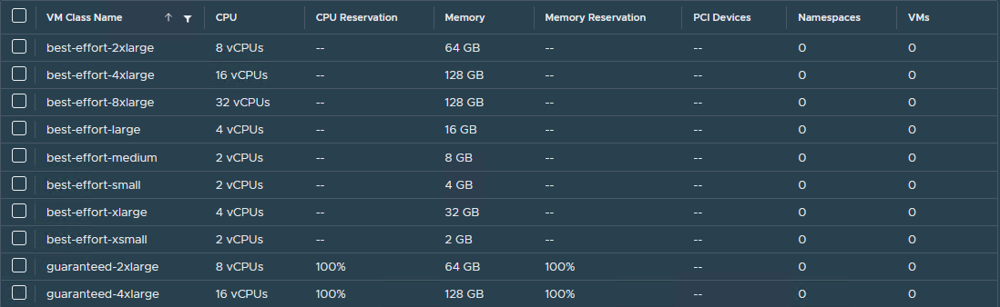

	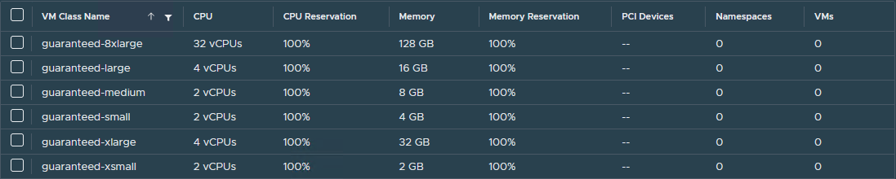

- **Storage Classes in vSphere with Tanzu:** A StorageClass provides a way for administrators to describe the classes of storage they offer. Different classes can map to quality-of-service levels, or to backup policies, or arbitrary policies determined by the cluster administrators.

	You can deploy vSphere with Tanzu with an existing default StorageClass or the vSphere Administrator can define StorageClass objects (Storage policy) that let cluster users dynamically create PVC and PV objects with different storage types and rules.

## vSphere with Tanzu Architecture

The following diagram shows the high-level architecture of vSphere with Tanzu.

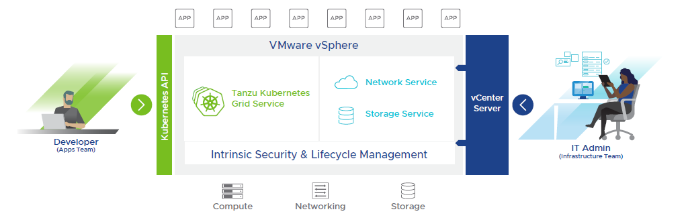

The Supervisor Cluster consists of the following:

*   **Kubernetes control plane VM:** Three Kubernetes control plane VMs in total are created on the hosts that are part of the Supervisor Cluster. The three control plane VMs are load balanced as each one of them has its own IP address.
*   **Cluster API and Tanzu Kubernetes Grid Service:** These are modules that run on the Supervisor Cluster and enable the provisioning and management of Tanzu Kubernetes clusters.

The following diagram shows the general architecture of the Supervisor Cluster.

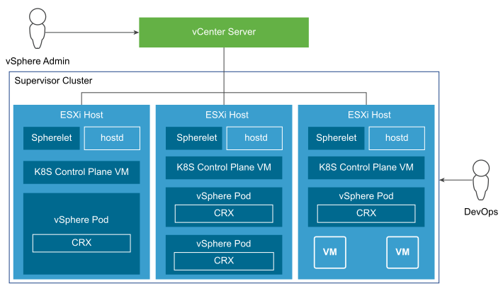

After a Supervisor Cluster is created, the vSphere administrator creates vSphere Namespaces. When initially created, the namespace has unlimited resources within the Supervisor Cluster. The vSphere administrator defines the limits for CPU, memory, storage, as well as the number of Kubernetes objects that can run within the namespace. These limits are configured per vSphere Namespace.

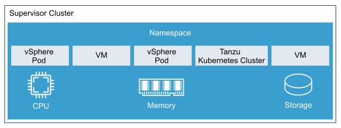

To provide tenants access to namespaces, the vSphere administrator assigns permission to users or groups available within an identity source that is associated with vCenter Single Sign-On.

Once the permissions are assigned, the tenants can then access the namespace to create Tanzu Kubernetes Clusters using the YAML file and Cluster API.

## Supported Component Matrix

The following table provides the component versions and interoperability matrix supported with the reference design:

| Software Components        | Version                    |
| -------------------------- | -------------------------- |
| Tanzu Kubernetes Release   | 1.21.2                     |
| VMware vSphere ESXi        | ESXi - 7.0 U2d\* and later |
| VMware vCenter (VCSA)      | 7.0 U2 and later           |
| NSX Advanced Load Balancer | 20.1.6 and later           |

## vSphere with Tanzu Storage

vSphere with Tanzu integrates with shared datastores available in the vSphere infrastructure. The following types of shared datastores are supported:

*   vSAN
*   VMFS
*   NFS
*   vVols

vSphere with Tanzu uses storage policies to integrate with shared datastores. The policies represent datastores and manage the storage placement of such objects as control plane VMs, container images, and persistent storage volumes.

Before you enable vSphere with Tanzu, create storage policies. The storage polices are used by the Supervisor Cluster and namespaces. Depending on your vSphere storage environment, you can create several storage policies to represent different classes of storage.

vSphere with Tanzu is agnostic about which option you choose. [VMware vSAN](https://docs.vmware.com/en/VMware-vSAN/index.html) is a recommended storage solution for both Supervisor Cluster and workload cluster VMs.

For Kubernetes stateful workloads, vSphere with Tanzu installs the [vSphere Container Storage interface (vSphere CSI)](https://docs.vmware.com/en/VMware-vSphere-Container-Storage-Plug-in/index.html) to automatically provision Kubernetes persistent volumes for pods.

While the default vSAN storage policy can be used, administrators should evaluate the needs of their applications and configure a specific [vSphere Storage Policy](https://docs.vmware.com/en/VMware-vSphere/6.7/com.vmware.vsphere.storage.doc/GUID-89091D59-D844-46B2-94C2-35A3961D23E7.html). vSAN storage policies describe classes of storage, such as SSD and NVME, as well as quotas for your clusters.

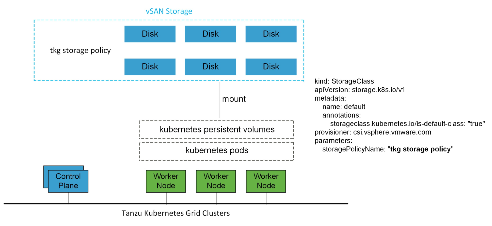

Starting with vSphere 7.0 environments with vSAN, the vSphere CSI driver for Kubernetes also supports the creation of NFS File Volumes, which support ReadWriteMany access modes. This allows for provisioning volumes, which can be read and written from multiple pods simultaneously. To support this, you must enable vSAN File Service.

**Note:** vSAN File Service is available only in vSAN Enterprise and Enterprise Plus editions.

## Networking for vSphere with Tanzu

vSphere with Tanzu can be deployed on various networking stacks, including,

- VMware NSX-T Data Center Networking
- vSphere Virtual Distributed Switch (VDS) Networking with HA proxy for Load Balancing
- vSphere Virtual Distributed Switch (VDS) Networking with NSX Advanced Load Balancer

**Note:** The scope of this document is limited to vSphere Networking (VDS) with NSX Advanced Load Balancer.

### vSphere with Tanzu on vSphere Networking with NSX Advanced Load Balancer

In a vSphere with Tanzu environment, a Supervisor Cluster configured with vSphere networking uses distributed port groups to provide connectivity to Kubernetes control plane VMs, services, and workloads. All hosts from the cluster, which is enabled for vSphere with Tanzu, are connected to the distributed switch that provides connectivity to Kubernetes workloads and control plane VMs.

You can use one or more distributed port groups as Workload Networks. The network that provides connectivity to the Kubernetes Control Plane VMs is called Primary Workload Network. You can assign this network to all the namespaces on the Supervisor Cluster, or you can use different networks for each namespace. The Tanzu Kubernetes clusters connect to the Workload Network that is assigned to the namespace.

The Supervisor Cluster leverages NSX Advanced Load Balancer (NSX ALB) to provide L4 load balancing for the Tanzu Kubernetes Clusters and L7 ingress to the applications deployed in the Tanzu Kubernetes Clusters. Users access the applications by connecting to the Virtual IP address (VIP) of the applications provisioned by NSX Advanced Load Balancer.

The following diagram shows a general overview for vSphere with Tanzu on vSphere Networking.

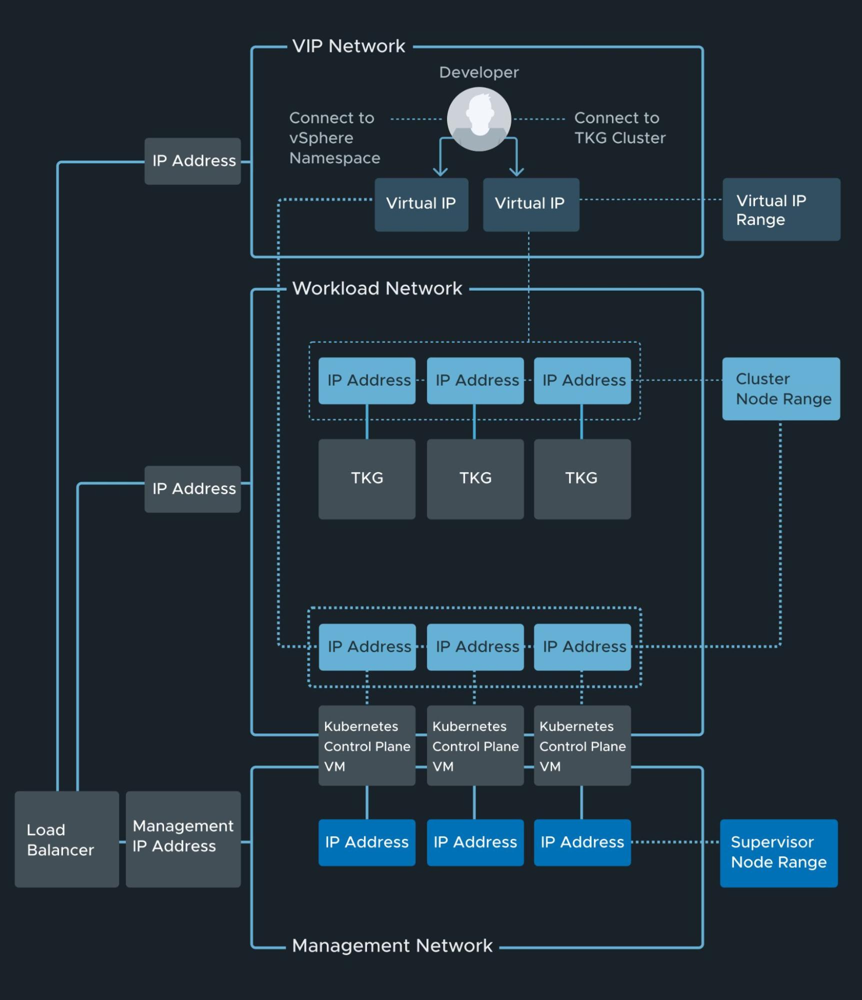

### NSX Advanced Load Balancer Components

NSX Advanced Load Balancer is deployed in write access mode in a vSphere environment. This mode grants NSX Advanced Load Balancer Controllers full write access to the vCenter, which helps in automatically creating, modify and removing SEs and other resources as needed to adapt to changing traffic needs. The following are the core components of NSX Advanced Load Balancer:

*   **NSX Advanced Load Balancer Controller:** NSX Advanced Load Balancer Controller manages Virtual Service objects and interacts with the vCenter Server infrastructure to manage the lifecycle of the service engines (SEs). It is the central repository for the configurations and policies related to services and management and provides the portal for viewing the health of VirtualServices and SEs and the associated analytics that NSX Advanced Load Balancer provides.
*   **NSX Advanced Load Balancer Service Engine:** NSX Advanced Load Balancer Service Engines (SEs) are lightweight VMs that handle all data plane operations by receiving and executing instructions from the controller. The SEs perform load balancing and all client and server-facing network interactions.
*   **Avi Kubernetes Operator (AKO):** Avi Kubernetes Operator is a Kubernetes operator that runs as a pod in the Supervisor Cluster and Tanzu Kubernetes clusters. It provides ingress and load balancing functionality. Avi Kubernetes Operator translates the required Kubernetes objects to NSX Advanced Load Balancer objects and automates the implementation of ingresses/routes/services on the Service Engines (SE) via the NSX Advanced Load Balancer Controller.

## Network Overview

### General Topology

The reference design encompasses the generic network architecture for the vSphere with Tanzu on vSphere networking reference design.

For deployment of vSphere with Tanzu, we build separate networks for the Tanzu Kubernetes Grid Supervisor Cluster, Tanzu Kubernetes Grid workload clusters, NSX Advanced Load Balancer management, Cluster-VIP for Control plane HA.

The network reference design can be mapped into this general framework.

The subnet CIDR shown in the following diagram is just for demonstration purposes. See [Network Recommendation](#network-recommendations) for recommendations on sizing the subnets properly and plan your infrastructure accordingly.

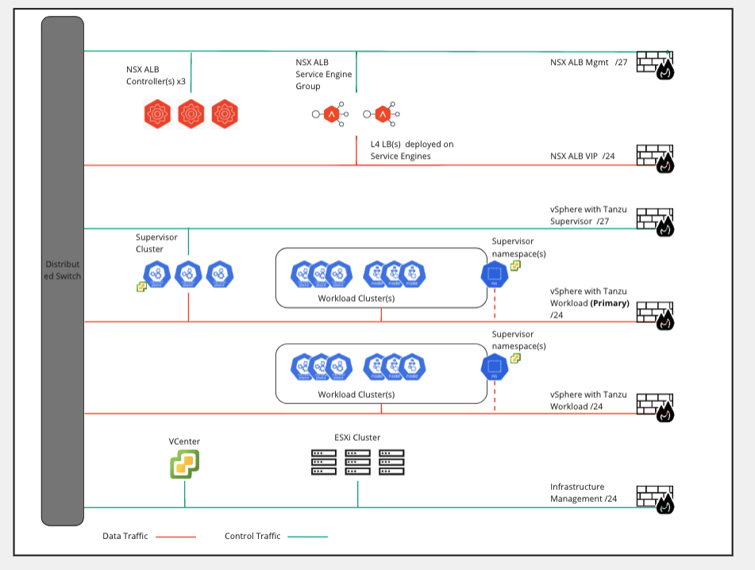

###  Network Requirements

The following table lists the required networks for the reference design.

| Network Type                 | DHCP Service              | Description & Recommendations |
| ---------------------------- | ------------------------- | --------------------------------------------------------------------------------------|
| NSX ALB Management Network   | Optional                  | NSX ALB controllers and SEs will be attached to this network. Use static IPs for the NSX ALB controllers. The Service Engine’s management network can obtain IP from DHCP.                                                                                  |
| TKG Management Network       | IP Pool/DHCP can be used. | Supervisor Cluster nodes will be attached to this network. When an IP Pool is used, ensure that the block has 5 consecutive free IPs.                                                                                                                          |
| TKG Workload Network         | IP Pool/DHCP can be used. | Control plane and worker nodes of TKG Workload Clusters will be attached to this network                                                                                                                                                                        |
| TKG Cluster VIP/Data Network | No                        | Virtual services for Control plane HA of all TKG clusters (Supervisor and Workload). Reserve sufficient IPs depending on the number of TKG clusters planned to be deployed in the environment, NSX ALB handles IP address management on this network via IPAM. |

###  Firewall Recommendations

To prepare the firewall, gather the following:

1.  NSX Advanced Load Balancer Management Network CIDR.
2.  NSX Advanced Load Balancer Controller node IP address.
3.  NSX Advanced Load Balancer Service Engine management & data IP address.
4.  Supervisor Cluster network (Tanzu Kubernetes Grid Management) CIDR.
5.  Supervisor Cluster VIP address.
6.  Tanzu Kubernetes Grid Workload Cluster VIP address.
7.  Tanzu Kubernetes Cluster (Workload Cluster) CIDR.
8.  vCenter Server IP address.
9.  VMware Harbor registry IP.
10.  DNS server IP(s).
11.  NTP Server(s).

| Source                                    | Destination                     | Protocol:Port             | Description                                                                                          |
| ----------------------------------------- | ------------------------------- | ------------------------- | ---------------------------------------------------------------------------------------------------- |
| TKG Management and Workload Cluster CIDR  | DNS Server                      | TCP:53   UDP:53            | DNS Service                                                                                          |
| TKG Management and Workload Cluster CIDR  | NTP Server                      | UDP:123                   | Time Synchronization                                                                                 |
| TKG Management and Workload Cluster CIDR  | vCenter IP                      | TCP:443                   | Allow components to access vCenter to create VMs and Storage Volumes                                 |
| TKG Management and Workload Cluster CIDR. | Harbor Registry                 | TCP:443                   | Allows components to retrieve container images                                                      |
| TKG Management and Workload Cluster CIDR. | NSX ALB Management Network      | TCP:443                   | Allow Avi Kubernetes Operator (AKO) and AKO Operator (AKOO) access to NSX ALB Controller             |
| TKG Management and Workload Cluster CIDR. | Internet                        | TCP:443                   | For interaction with TMC, TO, and TSM                                                               |
| TKG Workload Cluster CIDR                 | Supervisor Cluster VIP address | TCP:6443                  | Allow the TKG workload cluster to register with the Supervisor cluster                              |
| TKG Management Cluster CIDR               | Workload Cluster VIP address   | TCP:6443                  | Allow Supervisor cluster to configure workload clusters.                                             |
| NSX ALB Management Network                | vCenter and ESXi Hosts.         | TCP:443                   | Allow NSX ALB to discover vCenter objects and deploy SEs as required                                 |
| NSX ALB Management Network                | DNS Server, NTP Server          | UDP:53   UDP:123           | DNS Service   Time Synchronization                                                                    |
| NSX ALB Controller Nodes                  | NSX ALB Controller Nodes        | TCP:22   TCP:443   TCP:8443 | Secure channel over SSH   Access to the portal over HTTPS (UI)   Secure key exchange portal over HTTPS |
| NSX ALB Service Engine Management IP      | NSX ALB Controller Nodes        | TCP:22   TCP:8443   UDP:123 | Secure channel over SSH   Secure key exchange portal over HTTPS   NTP time synchronization             |

###  Network Recommendations

The following are the key recommendations for a production-grade vSphere with Tanzu deployment:

*   In order to have flexible firewall and security policies, place the Supervisor Cluster, workload clusters, and VIP/Data network on separate port groups.
*   To isolate and separate Tanzu Kubernetes Grid workload cluster networking from each other, we recommend separate networks for workload clusters based on the type (Prod/Dev/Test) and configuring the required firewall between these networks.
*   vSphere with Tanzu does not support static IP assignments for Kubernetes VM components. An IP Block of 5 continuous IP Addresses/DHCP is required for the Supervisor Cluster. Similarly, an IP Pool/DHCP is required for the workload clusters.
*   NSX Advanced Load Balancer should be configured with **Default-Cloud** only. Creating a custom vCenter cloud is not supported and can lead to deployment failures.
*   Use the NSX Advanced Load Balancer in-built IPAM service for VIP and SE IP address management. However, DHCP is supported for Service Engine management & data network.
*   Share a single VIP network between the Supervisor Cluster and the workload clusters for control plane HA VIP.
*   For the NSX Advanced Load Balancer enterprise license, the L4 load balancer is always configured on the **Default-Cloud** and default **Service Engine Group**. However, for L7 load balancing, a different **Service Engine Group** under **Default-Cloud** can be used.
*   Each Tanzu Kubernetes Grid workload cluster based on the cluster type (Prod/Dev/Test) can use separate VIP networks for L7 services. This can be achieved by installing Avi Kubernetes Operator manually (via helm chart) on each Tanzu Kubernetes Grid workload cluster.
*   Share Service Engines for the same type of workload clusters. For example, all prod workload clusters can leverage the same Service Engine Group to minimize the licensing cost.
*   For the NSX Advanced Load Balancer management network and Supervisor Cluster primary workload network, use subnets of size /28 to avoid infrastructure overhead and wastage of IP addresses.

### Network Topology benefits

This topology enables the following benefits:

*   Isolate and separate SDDC management components (vCenter, ESX) from the vSphere with Tanzu components. This reference design only allows the minimum connectivity between the Tanzu Kubernetes Grid clusters and NSX Advanced Load Balancer to the vCenter Server.
*   Isolate and separate the NSX Advanced Load Balancer management network from the supervisor cluster network and the Tanzu Kubernetes Grid workload networks.
*   Depending on the workload cluster type and use case, multiple workload clusters can leverage the same workload network or new networks can be used for each workload cluster.
*   Network separation between the Tanzu Kubernetes clusters is achieved at the supervisor namespace level. See [Firewall Recommendations](#firewall-recommendations) for more details.
*   Separate vSphere Admin and Tenant access to the Supervisor Cluster prevents tenants from attempting to connect to the supervisor cluster.
*   Allow tenants to access only their workload cluster(s) and restrict access to their workload cluster from other tenants. This separation can be achieved by assigning permissions to the supervisor namespaces.

## Design Recommendations

### Design Recommendations for Supervisor Cluster

*   DHCP is the recommended method for IP assignments for the Supervisor nodes. If DHCP is not present, provide a block of 5 continuous IP addresses for the supervisor cluster.
*   For each Supervisor Cluster where you intend to deploy a Tanzu Kubernetes cluster, you must define a Subscribed Content Library object that sources the OVA used by the Tanzu Kubernetes Grid Service to build cluster nodes. The same Subscribed Content Library can be configured for multiple Supervisor Clusters.
*   To facilitate different storage tiers for Supervisor and Tanzu Kubernetes Clusters, it is recommended to have different storage policies and tag appropriate datastores. If the underlying storage is vSAN, Storage Policies with distinct capabilities (Availability & Storage Rules) can be created and leveraged in namespaces.
*   For a production-grade deployment, to allow Tanzu Mission Control integration, we recommend a Supervisor Cluster with a large size form factor for control plane nodes.
*   Register the Supervisor Cluster with Tanzu Mission Control to automate workload cluster creation and centralized life cycle management of all workload clusters.

### Design Recommendations for Tanzu Kubernetes Cluster

*   Deploy workload clusters (based on type prod/dev/test) in separate namespaces under the Supervisor namespace. This allows for setting limits for CPU, memory, storage, and the number of Kubernetes objects per namespace.
*   For deploying Tanzu Kubernetes Clusters in a production deployment, we recommend deploying at least 3 control plane and worker nodes for achieving high availability.
*   In order to have flexible firewall and security policies, use dedicated distributed port groups backed by distinct subnet CIDR for each Tanzu Kubernetes cluster.
*   Networks that are used for Tanzu Kubernetes cluster traffic must be routable between each other and the Supervisor Cluster Management Network.
*   Configure Role Based Access Control for the Tanzu Kubernetes clusters. Avoid the use of administrator credentials for managing the clusters. You can use the inbuilt user role or create new roles as per your requirements. vSphere SSO can be leveraged to implement RBAC.

## Kubernetes Ingress Routing

vSphere with Tanzu does not ship with any default ingress controller. Therefore, users can use any third-party ingress controller of their choice.

One example of an ingress controller is Contour which is an open-source controller for Kubernetes ingress routing. Contour is part of a Tanzu package and can be installed on any Tanzu Kubernetes cluster. Contour is exposed by an NSX Advanced Load Balancer and provides Layer 7-based routing to Kubernetes services.

For more information about Contour, see [Contour](https://projectcontour.io) and [Implementing Ingress Control with Contour](https://docs.vmware.com/en/VMware-Tanzu-Kubernetes-Grid/1.4/vmware-tanzu-kubernetes-grid-14/GUID-packages-ingress-contour.html).

Another option is to use the NSX Advanced Load Balancer Kubernetes ingress controller. The controller offers an advanced L7 ingress for containerized applications that are deployed in the Tanzu Kubernetes workload cluster. For more information about the NSX Advanced Load Balancer ingress controller, see [Avi Kubernetes Operator](https://avinetworks.com/docs/ako/1.5/avi-kubernetes-operator/).

### Ingress and Load Balancing with NSX Advanced Load Balancer

vSphere with Tanzu comes with the ability to provision load balancer services with the [VMware NSX Advanced Load Balancer](https://avinetworks.com/vmware-tanzu/) (NSX Advanced Load Balancer).

NSX Advanced Load Balancer provides Layer 4 load balancing for your Kubernetes workloads.

### Recommendations for NSX Advanced Load Balancer Controller

*   The NSX Advanced Load Balancer Controller is deployed as a virtual machine and for high availability, three controller nodes are deployed.
*   If more than one VIP network is used for L7 ingress/load balancing, include all VIP networks in the NSX Advanced Load Balancer IPAM profile.
*   The NSX Advanced Load Balancer Controller VMs are only connected to the NSX Advanced Load Balancer management network segment and the required firewall rules are in place. For more information, see [Firewall Recommendations](#firewall-recommendations).

### NSX Advanced Load Balancer Controller Configuration

| Avi Controller Configuration (medium) | Specification |
| ------------------------------------- | ------------- |
| vCPUs                                 | 8             |
| Memory (GB)                           | 24            |
| Hard disk (GB)                        | 128           |
| Number of network adapters            | 1             |
| Number of appliances                  | 3             |

### NSX Advanced Load Balancer Controller Sizing Guidelines

Regardless of NSX Advanced Load Balancer Controller configuration, each Controller cluster can achieve up to 5,000 virtual services, this is a hard limit. For further details, please refer to this [Avi Controller Sizing](https://avinetworks.com/docs/20.1/avi-controller-sizing/).

| Controller Size | VM Configuration    | Virtual Services | Avi SE Scale |
| --------------- | ------------------- | ---------------- | ------------ |
| Small           | 4 vCPUS, 12 GB RAM  | 0-50             | 0-10         |
| Medium          | 8 vCPUS, 24 GB RAM  | 0-200            | 0-100        |
| Large           | 16 vCPUS, 32 GB RAM | 200-1000         | 100-200      |
| Extra Large     | 24 vCPUS, 48 GB RAM | 1000-5000        | 200-400      |

### Recommendations for NSX Advanced Load Balancer Service Engines

*   NSX Advanced Load Balancer Service Engines (SEs) are deployed as virtual machines (VMs) and orchestrated by NSX Advanced Load Balancer Controller.
*   Depending on the network requirement for virtual services, network configurations for SEs are handled by the NSX Advanced Load Balancer controller.
*   The SEs connect to the NSX Advanced Load Balancer Controller over the NSX Advanced Load Balancer management network segment, which is the logical network connection to the vNIC0 of the SE VM.
*   Create a Service Engine group for a Tanzu Kubernetes Grid workload cluster only if you plan to leverage NSX Advanced Load Balancer ingress controller for L7 ingress.
*   Configure High Availability mode for SEs as Elastic HA N + M mode or Elastic HA Active/Active in the Service Engine Group.

### Service Engine Configuration

| Service Engine Configuration                       | Specification |
| -------------------------------------------------- | ------------- |
| vCPUs                                              | 1 (2)\*       |
| Memory (GB)                                        | 2 (4)\*       |
| Hard disk (GB)                                     | 15            |
| Number of network adapters                         | 10            |
| Number of service engines per Service Engine Group | 2             |

### Service Engine Sizing Guidelines

See [Sizing Service Engines](https://avinetworks.com/docs/20.1/sizing-service-engines/) for guidance on sizing your SEs.

| Performance metric | 1 vCPU core |
| ------------------ | ----------- |
| Throughput         | 4 Gb/s      |
| Connections/s      | 40k         |
| SSL Throughput     | 1 Gb/s      |
| SSL TPS (RSA2K)    | ~600        |
| SSL TPS (ECC)      | 2500        |

Multiple performance vectors or features may have an impact on performance.  For example, to achieve 1 Gb/s of SSL throughput and 2000 TPS of SSL with EC certificates, NSX Advanced Load Balancer recommends two cores.

NSX Advanced Load Balancer Service Engines may be configured with as little as 1 vCPU core and 1 GB RAM, or up to 36 vCPU cores and 128 GB RAM.

## Container Registry

VMware Tanzu for Kubernetes operations using vSphere with Tanzu includes Harbor as a container registry. Harbor provides a location for pushing, pulling, storing, and scanning container images used in your Kubernetes clusters.

The initial configuration and setup of the platform does not require any external registry as all the required images are delivered through vCenter itself. Harbor registry is used for day 2 operations of the Tanzu Kubernetes workload clusters. Typical day-2 operations include tasks such as pulling images from Harbor for application deployment and pushing custom images to Harbor.

When vSphere with Tanzu is deployed on VDS networking, you can deploy an external container registry (Harbor) for Tanzu Kubernetes clusters.

There are two main supported installation methods for Harbor:

*   [Helm-based deployment](https://goharbor.io/docs/2.1.0/install-config/harbor-ha-helm/) to a Kubernetes cluster: This installation method may be preferred if you are already invested in Helm.
*   [VM-based deployment](https://goharbor.io/docs/2.1.0/install-config/installation-prereqs) using `docker-compose`: This installation method is recommended in cases where Tanzu Kubernetes Grid is installed in an air-gapped environment and no pre-existing Kubernetes clusters exist on which to install Harbor.

  For VM-based deployments, another option is to use [VMOperator](https://github.com/vmware-tanzu/vm-operator) for deploying a VM in workload cluster and harbor on top of that.

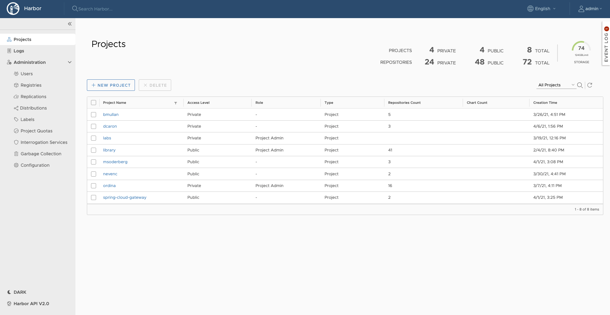

## vSphere with Tanzu SaaS Integration

### Tanzu Mission Control

Tanzu Mission Control is a centralized management platform for consistently operating and securing your Kubernetes infrastructure and modern applications across multiple teams and clouds. It provides operators with a single control point to give developers the independence they need to drive the business forward while enabling consistent management and operations across environments for increased security and governance.

#### Attaching Tanzu Kubernetes Clusters to Tanzu Mission Control

It is recommended to attach the supervisor cluster and workload clusters into Tanzu Mission Control (TMC) as it provides a centralized administrative interface that enables you to manage your global portfolio of Kubernetes clusters.

Tanzu Mission Control can assist you with the following:

*   **Centralized Lifecycle Management**: Managing the creation and deletion of workload clusters using registered management clusters.
*   **Centralized Monitoring**: Viewing the inventory of clusters and the health of clusters and their components.
*   **Authorization**: Centralizing authentication and authorization with federated identity from multiple sources such as AD, LDAP, or SAML. And, an easy-to-use policy engine for granting the right access to the right users across teams.
*   **Compliance**: Enforcing all clusters to apply the same set of policies.
*   **Data protection**: Using [Velero](https://velero.io/) through Tanzu Mission Control to verify that your workloads and persistent volumes are being backed up.

#### Policy-Driven Cluster Management

Tanzu Mission Control allows the creation of policies of various types to manage the operation and security posture of your Kubernetes clusters and other organizational objects. Policies provide a set of rules that govern your organization and all the objects it contains. The policy types available in Tanzu Mission Control include the following:

*   Access Policy: Access policies allow the use of predefined roles to specify which identities (individuals and groups) have what level of access to a given resource. For more information, see [Access Control](https://docs.vmware.com/en/VMware-Tanzu-Mission-Control/services/tanzumc-concepts/GUID-EB9C6D83-1132-444F-8218-F264E43F25BD.html).
*   Image Registry Policy: Image registry policies allow to specify the source registries from which an image can be pulled.
*   Network Policy: Network policies allow you to use preconfigured templates to define how pods communicate with each other and other network endpoints.
*   Quota Policy: Quota policies allow you to constrain the resources used in your clusters, as aggregate quantities across specified namespaces, using pre-configured and custom templates. For more information, see [Managing Resource Consumption in Your Clusters](https://docs.vmware.com/en/VMware-Tanzu-Mission-Control/services/tanzumc-using/GUID-1905352C-856F-4D06-BB86-426F90486C32.html).
*   Security Policy: Security policies allow you to manage the security context in which deployed pods operate in your clusters by imposing constraints on your clusters that define what pods can do and which resources they have access to. For more information, see [Pod Security Management](https://docs.vmware.com/en/VMware-Tanzu-Mission-Control/services/tanzumc-concepts/GUID-6C65B33B-C1EA-465D-B909-3C4F51704C1A.html).
*   Custom Policy: Custom policies allow you to implement additional business rules, using templates that you define, to enforce policies that are not already addressed using the other built-in policy types. For more information, see [Creating Custom Policies](https://docs.vmware.com/en/VMware-Tanzu-Mission-Control/services/tanzumc-using/GUID-1FF7A1E5-8456-4EF4-A532-9CF31BE88EAA.html).

Not all policies described here are available in the Tanzu Mission Control Standard edition. For a comparison, see [VMware Tanzu Mission Control Feature Comparison Chart.](https://tanzu.vmware.com/content/tanzu-mission-control/tmc-comparison-chart)

#### Policy Inheritance

In the Tanzu Mission Control resource hierarchy, you can specify policies at the following levels:

*   organization
*   object groups (cluster groups and workspaces)
*   Kubernetes objects (clusters and namespaces)

In addition to the direct policy defined for a given object, each object also has inherited policies that are defined in the parent objects. For example, a cluster has a direct policy and also has inherited policies from the cluster group and organization to which it is attached.

## Observability

### Metrics On-Premises

vSphere with Tanzu Standard Edition and above includes observability with the Prometheus and Grafana extensions. The extensions can be installed using Tanzu packages. Grafana provides a way to view cluster metrics as shown in the following screenshots:

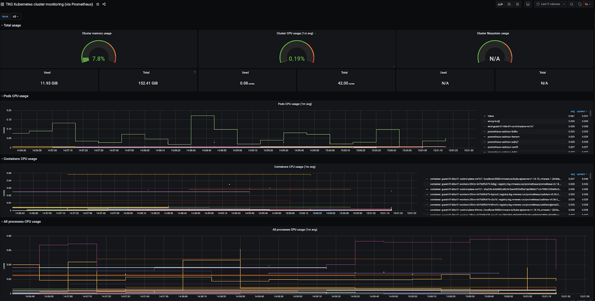

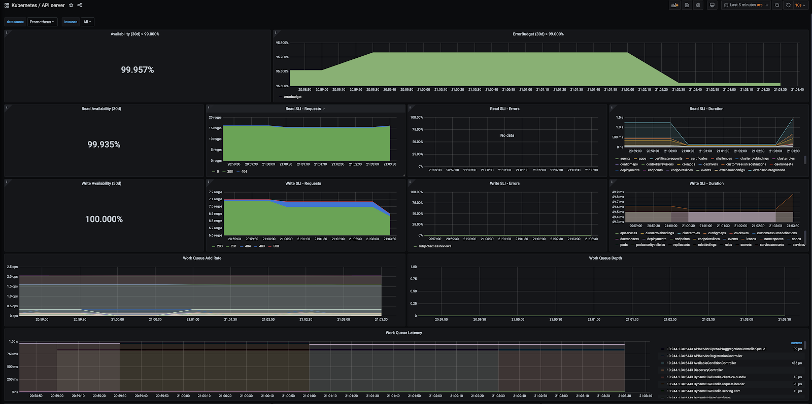

### Metrics in Tanzu Observability

You can significantly enhance observability by using VMware Tanzu Observability by Wavefront. Tanzu Observability is a VMware SaaS offering that collects and displays metrics and trace data from the full-stack platform as well as from applications. The service provides the ability to create alerts tuned by advanced analytics, assist in the troubleshooting of systems, and understand the impact of running production code.

In the case of vSphere and Tanzu Kubernetes Grid, Tanzu Observability collects data from components in vSphere, from Kubernetes, and from applications running on top of Kubernetes.

You can configure Tanzu Observability with an array of capabilities. Here are the recommended plugins for this design:

| Plugin                           | Purpose                                                  | Key Metrics                                                          | Example Metrics                                   |
| -------------------------------- | -------------------------------------------------------- | -------------------------------------------------------------------- | ------------------------------------------------- |
| Telegraf for vSphere             | Collect metrics from vSphere                             | ESXi Server and VM performance & resource utilization                | vSphere VM, Memory and Disk usage and performance |
| Wavefront Kubernetes Integration | Collect metrics from Kubernetes clusters and pods        | Kubernetes container and POD statistics                              | POD CPU usage rate   DaemonSet ready stats         |
| Wavefront by VMware for Istio    | Adapts Istio collected metrics and forwards to Wavefront | Istio metrics including request rates, trace rates, throughput, etc. | Request rate (Transactions per Second)            |

### Tanzu Observability Dashboard Examples

The following sections show sample dashboards available on Tanzu Observability. Tanzu Observability can display metric data from the full stack of application elements from the platform (VMware ESXi servers), to the virtual environment, to the application environment (Kubernetes), and down to the various components of an application (APM).

#### ESXi Dashboards

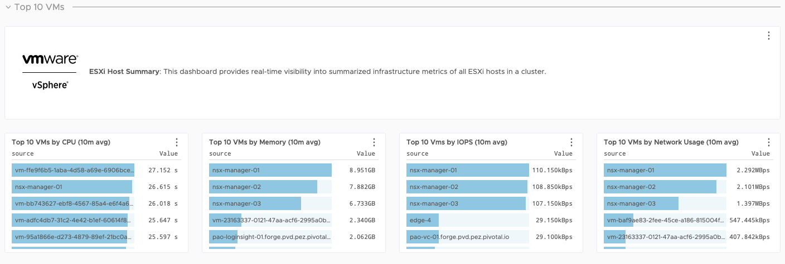

#### VM Dashboards

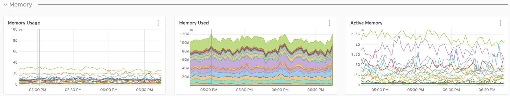

#### Storage Dashboards

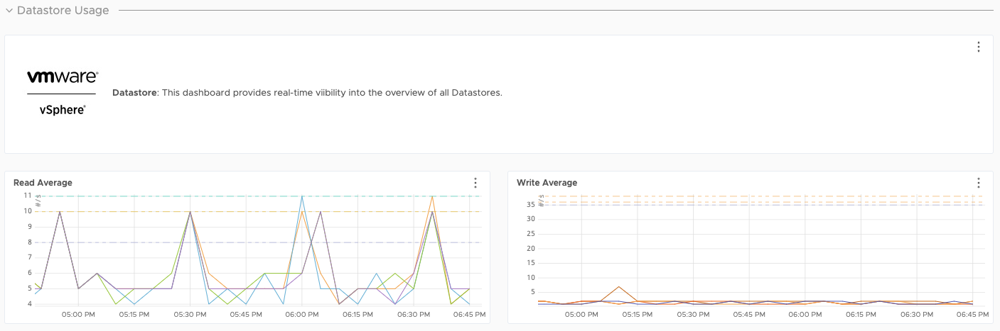

#### Kubernetes Dashboards

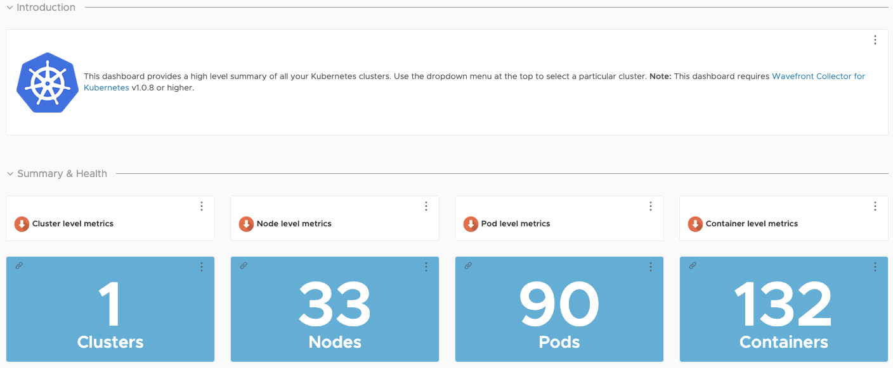

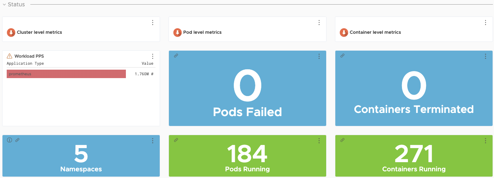

#### Application Dashboards

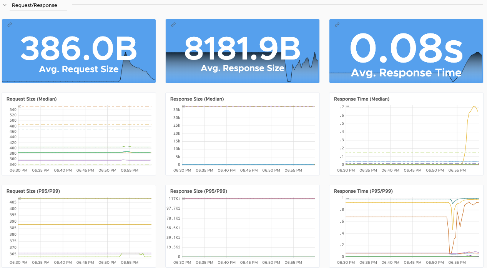

There are over 200 [integrations](https://vmware.wavefront.com/integrations) with prebuilt dashboards available in Wavefront.

## Tanzu Service Mesh (TSM)

VMware Tanzu Service Mesh is an enterprise-class service mesh solution that provides consistent control and security for microservices, end-users, and data across all your clusters and clouds in the most demanding multi-cluster and multi-cloud environments.

### Key Benefits of Tanzu Service Mesh:

*   Extends the service mesh capability (discovery, connectivity, control, security, and observability) to users and data.
*   Facilitates the development and management of distributed applications across multiple clusters, multiple clouds, and in hybrid-cloud environments with Global Namespaces, supporting federation across organizational boundaries, technologies, and service meshes.
*   Implements consistent application-layer traffic management and security policies across all your clusters and clouds.
*   Integrates with VMware Tanzu Mission Control, VMware Enterprise PKS, and VMware Tanzu Kubernetes Grid to provide a seamless user experience.

### Global Namespace

With global namespaces in Tanzu Service Mesh, you can easily connect and secure the services in your application across clusters. You can add the services in your application to a global namespace to have them automatically discovered and connected across the clusters.

The global namespace enables users to view the topology of the services or a cluster as a chart. The topology graph can be used to understand service dependencies and determine the health of the services and the performance metrics related to each service.

Tanzu Service Mesh generates a topology graph view dynamically by observing the traffic that is flowing between the services in a global namespace or a cluster. The topology graph visualizes the communication patterns between the services and helps you gain insights into the service dependencies.

### Recommendation for using Tanzu Service Mesh

*   Use Tanzu Service Mesh when containerized applications are deployed in multi-cluster/multi-cloud environments. Using Tanzu Service Mesh, you can apply policies such as security and traffic management at the Global Namespace level.
*   For multi-cluster/multi-cloud applications, that have load balancer requirements, use Tanzu Service Mesh in-built integration with AWS Route 53 or NSX Advanced Load Balancer to leverage global load-balancing for containerized applications.
*   For applications that require end-to-end encryption for in-flight traffic, Tanzu Service Mesh (using Istio) can set up end-to-end mutual transport layer security (mTLS) encryption utilizing the in-built CA function called Citadel.
*   Tanzu Service Mesh is really helpful when planning rolling upgrades of microservices to a newer version at scale. Using Tanzu Service Mesh, you can easily manage multiple rolling upgrades by defining the policies at the GNS level and monitoring the same from the Tanzu Service Mesh dashboard.

## Summary

vSphere with Tanzu on hyper-converged hardware offers high-performance potential, convenience, and addresses the challenges of creating, testing, and updating on-premises Kubernetes platforms in a consolidated production environment. This validated approach will result in a production installation with all the application services needed to serve combined or uniquely separated workload types via a combined infrastructure solution.

This plan meets many Day 0 needs for quickly aligning product capabilities to full-stack infrastructure, including networking, configuring firewall rules, load balancing, workload compute alignment and other capabilities.

## Deployment Instructions
For instructions on how to deploy this reference design, see [Deploy Tanzu for Kubernetes Operations using vSphere with Tanzu](../deployment-guides/tko-on-vsphere-with-tanzu-deploy.md). 
