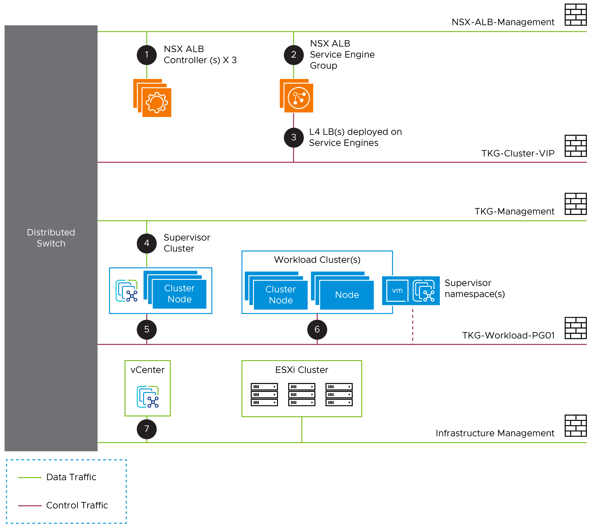

# VMware Tanzu for Kubernetes Operations using vSphere with Tanzu Reference Design

vSphere with Tanzu transforms the vSphere cluster into a platform for running Kubernetes workloads in dedicated resource pools. When vSphere with Tanzu is enabled on a vSphere cluster, vSphere with Tanzu creates a Kubernetes control plane directly in the hypervisor layer. You can then run Kubernetes containers by creating upstream Kubernetes clusters through the VMware Tanzu Kubernetes Grid Service and run your applications inside these clusters.

This document provides a reference design for deploying VMware Tanzu for Kubernetes Operations on vSphere with Tanzu.

The following reference design is based on the architecture and components described in [VMware Tanzu for Kubernetes Operations Reference Architecture](index.md).

## vSphere with Tanzu Components

- **Supervisor Cluster:** When **Workload Management** is enabled on a vSphere cluster, it creates a Kubernetes layer within the ESXi hosts that are part of the cluster. A cluster that is enabled for **Workload Management** is called a Supervisor Cluster. You run containerized workloads by creating upstream Kubernetes clusters on the Supervisor Cluster through the Tanzu Kubernetes Grid Service.

  The Supervisor Cluster runs on top of an SDDC layer that consists of ESXi for compute, vSphere Distributed Switch for networking, and vSAN or another shared storage solution.

- **vSphere Namespaces:** A vSphere Namespace is a tenancy boundary within vSphere with Tanzu. A vSphere Namespace allows for sharing vSphere resources (computer, networking, storage) and enforcing resource limits with the underlying objects such as Tanzu Kubernetes clusters. It also allows you to attach policies and permissions.

- **Tanzu Kubernetes Grid Service:** Tanzu Kubernetes Grid Service (TKGS) allows you to create and manage ubiquitous Kubernetes clusters on a VMware vSphere infrastructure using the Kubernetes Cluster API. The Cluster API provides declarative, Kubernetes-style APIs for the creation, configuration, and management of the Tanzu Kubernetes Cluster.

	Tanzu Kubernetes Grid Service also provides self-service lifecycle management of Tanzu Kubernetes clusters.

- **Tanzu Kubernetes Cluster (Workload Cluster):** Tanzu Kubernetes clusters are Kubernetes workload clusters in which your application workloads run. These clusters can be attached to SaaS solutions such as Tanzu Mission Control, Tanzu Observability, and Tanzu Service Mesh, which are part of Tanzu for Kubernetes Operations.

- **VM Class in vSphere with Tanzu:** A VM class is a template that defines CPU, memory, and reservations for VMs. VM classes are used for VM deployment in a Supervisor Namespace. VM classes can be used by standalone VMs that run in a Supervisor Namespace and by VMs hosting a Tanzu Kubernetes cluster.

  VM classes in vSphere with Tanzu are broadly categorized into two groups.

     - **guaranteed:** The guaranteed class fully reserves its configured resources.
     - **best-effort:** The best-effort class allows resources to be overcommitted.

	vSphere with Tanzu offers several default VM classes. You can use them as is or you can create new VM classes. The following screenshot shows the default VM classes that are available in vSphere with Tanzu.

	

	

- **Storage Classes in vSphere with Tanzu:** A StorageClass provides a way for administrators to describe the classes of storage they offer. Different classes can map to quality-of-service levels, to backup policies, or to arbitrary policies determined by the cluster administrators.

	You can deploy vSphere with Tanzu with an existing default StorageClass or the vSphere Administrator can define StorageClass objects (Storage policy) that let cluster users dynamically create PVC and PV objects with different storage types and rules.

The following table provides recommendations for configuring VM Classes/Storage Classes in a vSphere with Tanzu environment.

|**Decision ID**|**Design Decision**|**Design Justification**|**Design Implications**|
| --- | --- | --- | --- |
|TKO-TKGS-001|Create custom Storage Classes/Profiles/Policies|To provide different levels of QoS and SLA for prod and dev/test K8s workloads.  To isolate Supervisor clusters from workload clusters.|When a storage policy is applied to a VM, vSphere determines how the VM storage objects are provisioned and allocated within the storage resource to guarantee the required level of service.|
|TKO-TKGS-002|Create custom VM Classes|To facilitate deployment of K8s workloads with specific compute/storage requirements.|Default VM Classes in vSphere with Tanzu are not adequate to run a wide variety of K8s workloads.|

## vSphere with Tanzu Architecture

The following diagram shows the high-level architecture of vSphere with Tanzu.

The Supervisor Cluster consists of the following:

*   **Kubernetes control plane VM:** Three Kubernetes control plane VMs in total are created on the hosts that are part of the Supervisor Cluster. The three control plane VMs are load-balanced as each one of them has its own IP address.

*   **Cluster API and Tanzu Kubernetes Grid Service:** These are modules that run on the Supervisor Cluster and enable the provisioning and management of Tanzu Kubernetes clusters.

The following diagram shows the general architecture of the Supervisor Cluster.

After a Supervisor Cluster is created, the vSphere administrator creates vSphere namespaces. When initially created, vSphere namespaces have unlimited resources within the Supervisor Cluster. The vSphere administrator defines the limits for CPU, memory, and storage, as well as the number of Kubernetes objects such as deployments, replica sets, persistent volumes, etc. that can run within the namespace. These limits are configured for each vSphere namespace.

For the maximum supported number, see the **vSphere with Tanzu [Configuration Maximums](https://configmax.esp.vmware.com/guest?vmwareproduct=vSphere&release=vSphere%207.0&categories=70-58,71-0)** guide.

To provide tenants access to namespaces, the vSphere administrator assigns permission to users or groups available within an identity source that is associated with vCenter Single Sign-On.

Once the permissions are assigned, tenants can access the namespace to create Tanzu Kubernetes Clusters using YAML files and the Cluster API.

Here are some recommendations for using namespaces in a vSphere with Tanzu environment.

|**Decision ID**|**Design Decision**|**Design Justification**|**Design Implications**|
| --- | --- | --- | --- |
|TKO-TKGS-003|Create namespaces to logically separate K8s workloads.|Create dedicated namespaces for the type of workloads (prod/dev/test) that you intend to run. |All Kubernetes clusters created under a namespace share the same access policy/quotas/network resources. |
|TKO-TKGS-004|Enable self-service namespaces.|Enable DevOps/Cluster admin users to provision namespaces in a self-service manner.|The vSphere administrator must publish a namespace template to the LDAP users/groups to enable them to create namespaces.|
|TKO-TKGS-005|Register external identity source (AD/LDAP) with vCenter.|Limit access to a namespace to authorized users/groups.|A prod namespace can be accessed by a handful of users, whereas a dev/test namespace can be exposed to a wider audience.|

## Supported Component Matrix

|**Software Components**|**Version**|
| --- | --- |
|Tanzu Kubernetes Release|1.21.2|
|VMware vSphere ESXi|7.0 U3|
|VMware vCenter (VCSA)|7.0 U3|
|NSX Advanced Load Balancer|20.1.7|

## vSphere with Tanzu Storage

vSphere with Tanzu integrates with shared datastores available in the vSphere infrastructure. The following types of shared datastores are supported:

- vSAN
- VMFS
- NFS
- vVols

vSphere with Tanzu uses storage policies to integrate with shared datastores. The policies represent datastores and manage the storage placement of such objects as control plane VMs, container images, and persistent storage volumes.

Before you enable vSphere with Tanzu, create storage policies to be used by the Supervisor Cluster and namespaces. Depending on your vSphere storage environment, you can create several storage policies to represent different classes of storage.

vSphere with Tanzu is agnostic about which storage option you choose. For Kubernetes stateful workloads, vSphere with Tanzu installs the [vSphere Container Storage Interface (vSphere CSI)](https://github.com/container-storage-interface/spec) to automatically provision Kubernetes persistent volumes for pods.

[VMware vSAN](https://docs.vmware.com/en/VMware-vSAN/index.html) is a recommended storage solution for both Supervisor and workload cluster VMs.

|**Decision ID**|**Design Decision**|**Design Justification**|**Design Implications**|
| --- | --- | --- | --- |
|TKO-STG-001|Use vSAN storage for TKO|By using vSAN as the shared storage solution, you can take advantage of local storage, which is more cost-effective.|vSAN File Services need to be configured to leverage this. vSAN File Service is available only in vSAN Enterprise and Enterprise Plus editions|
|TKO-STG-002|Use vSAN storage for TKO|vSAN supports NFS volumes in ReadWriteMany access modes.|vSAN File Services need to be configured to leverage this.|

While you can use the default vSAN storage policy, it is often preferable to craft a custom [vSphere Storage Policy](https://docs.vmware.com/en/VMware-vSphere/6.7/com.vmware.vsphere.storage.doc/GUID-89091D59-D844-46B2-94C2-35A3961D23E7.html) based on the requirements of your applications. vSAN storage policies describe classes of storage (e.g. SSD, NVME, etc.) along with quotas for your clusters.

Starting with vSphere 7.0 environments with vSAN, the vSphere CSI driver for Kubernetes also supports the creation of NFS File Volumes, which support ReadWriteMany access modes. This allows for provisioning volumes, which can be read and written from multiple pods simultaneously. To support this, you must enable vSAN File Service.

**Note:** vSAN File Service is available only in vSAN Enterprise and Enterprise Plus editions.

## Tanzu Kubernetes Clusters Networking

A Tanzu Kubernetes cluster provisioned by the Tanzu Kubernetes Grid supports the following Container Network Interface (CNI) options:

- [Antrea](https://antrea.io/)
- [Calico](https://www.tigera.io/project-calico/)

The CNI options are open-source software that provide networking for cluster pods, services, and ingress.

When you deploy a Tanzu Kubernetes cluster using the default configuration of Tanzu CLI, Antrea CNI is automatically enabled in the cluster.

To provision a Tanzu Kubernetes cluster using Calico CNI, see [Deploy Tanzu Kubernetes clusters with Calico](https://docs.vmware.com/en/VMware-Tanzu-Kubernetes-Grid/1.5/vmware-tanzu-kubernetes-grid-15/GUID-tanzu-k8s-clusters-networking.html#calico)

Each CNI is suitable for a different use case. The following table lists some common use cases for the CNI options that Tanzu Kubernetes Grid supports. This table will help you select the most appropriate CNI for your Tanzu Kubernetes Grid implementation.

|**CNI**|**Use Case**|**Pros and Cons**|
| --- | --- | --- |
|Antrea|
Enable Kubernetes pod networking with IP overlay networks using VXLAN or Geneve for encapsulation. Optionally encrypt node-to-node communication using IPSec packet encryption.

Antrea supports advanced network use cases like kernel bypass and network service mesh.
|
Pros

- Antrea leverages Open vSwitch as the networking data plane. Open vSwitch supports both Linux and Windows.

- VMware supports the latest conformant Kubernetes and stable releases of Antrea.
|
|Calico|
Calico is used in environments where factors like network performance, flexibility, and power are essential.

For routing packets between nodes, Calico leverages the BGP routing protocol instead of an overlay network. This eliminates the need to wrap packets with an encapsulation layer resulting in increased network performance for Kubernetes workloads.
|
Pros

- Support for Network Policies

- High network performance

- SCTP Support

Cons

- No multicast support

|

## Networking for vSphere with Tanzu

You can deploy vSphere with Tanzu on various networking stacks, including:

- VMware NSX-T Data Center Networking.

- vSphere Virtual Distributed Switch (VDS) Networking with NSX Advanced Load Balancer.

**Note:** The scope of this discussion is limited to vSphere Networking (VDS) with NSX Advanced Load Balancer.

### vSphere with Tanzu on vSphere Networking with NSX Advanced Load Balancer

In a vSphere with Tanzu environment, a Supervisor Cluster configured with vSphere networking uses distributed port groups to provide connectivity to Kubernetes control plane VMs, services, and workloads. All hosts from the cluster, which is enabled for vSphere with Tanzu, are connected to the distributed switch that provides connectivity to Kubernetes workloads and control plane VMs.

You can use one or more distributed port groups as Workload Networks. The network that provides connectivity to the Kubernetes Control Plane VMs is called Primary Workload Network. You can assign this network to all the namespaces on the Supervisor Cluster, or you can use different networks for each namespace. The Tanzu Kubernetes clusters connect to the Workload Network that is assigned to the namespace.

The Supervisor Cluster leverages NSX Advanced Load Balancer (NSX ALB) to provide L4 load balancing for the Tanzu Kubernetes clusters control-plane HA. Users access the applications by connecting to the Virtual IP address (VIP) of the applications provisioned by NSX Advanced Load Balancer.

The following diagram shows a general overview for vSphere with Tanzu on vSphere Networking.

### NSX Advanced Load Balancer Components

NSX Advanced Load Balancer is deployed in write access mode in a vSphere environment. This mode grants NSX Advanced Load Balancer Controllers full write access to the vCenter, which helps in automatically creating, modifying, and removing SEs and other resources as needed to adapt to changing traffic needs. The following are the core components of NSX Advanced Load Balancer:

-  **NSX Advanced Load Balancer Controller:** NSX Advanced Load Balancer Controller manages Virtual Service objects and interacts with the vCenter Server infrastructure to manage the lifecycle of the service engines (SEs). It is the central repository for the configurations and policies related to services and management and provides the portal for viewing the health of VirtualServices and SEs and the associated analytics that NSX Advanced Load Balancer provides.

-  **NSX Advanced Load Balancer Service Engine:** NSX Advanced Load Balancer Service Engines (SEs) are lightweight VMs that handle all data plane operations by receiving and executing instructions from the controller. The SEs perform load balancing and all client and server-facing network interactions.

-  **Avi Kubernetes Operator (AKO):** Avi Kubernetes Operator is a Kubernetes operator that runs as a pod in the Supervisor Cluster and Tanzu Kubernetes clusters. It provides ingress and load balancing functionality. Avi Kubernetes Operator translates the required Kubernetes objects to NSX Advanced Load Balancer objects and automates the implementation of ingresses/routes/services on the Service Engines (SE) via the NSX Advanced Load Balancer Controller.

Each environment configured in NSX Advanced Load Balancer is referred to as a cloud. Each cloud in NSX Advanced Load Balancer maintains networking and NSX Advanced Load Balancer Service Engine settings. Each cloud is configured with one or more VIP networks to provide IP addresses to L4 load balancing virtual services created under that cloud.

The virtual services can be spanned across multiple Service Engines if the associated Service Engine Group is configured in Active/Active HA mode. A Service Engine can belong to only one Service Engine group at a time.

IP address allocation for virtual services can be over DHCP or via NSX Advanced Load Balancer in-built IPAM functionality. The VIP networks created/configured in NSX Advanced Load Balancer are associated with the IPAM profile.

## Network Architecture

To deploy vSphere with Tanzu, build separate networks for the Tanzu Kubernetes Grid management (Supervisor) cluster, Tanzu Kubernetes Grid workload clusters, NSX Advanced Load Balancer components, and the Tanzu Kubernetes Grid control plane HA.

The network reference design can be mapped into this general framework.

**Note:** The network/portgroup designated for the workload cluster, carries both data and control traffic. Firewalls cannot be utilized to segregate traffic between workload clusters; instead, the underlying CNI must be employed as the main filtering system. Antrea CNI has the Custom Resource Definitions (CRDs) for firewall rules that can be enforce before Kubernetes network policy is added.

**Note:** Based on your requirements, you can create additional networks for your workload cluster. These networks are also referred to as vSphere with Tanzu workload secondary network.

This topology enables the following benefits:

- Isolate and separate SDDC management components (vCenter, ESX) from the vSphere with Tanzu components. This reference design allows only the minimum connectivity between the Tanzu Kubernetes Grid clusters and NSX Advanced Load Balancer to the vCenter Server.

- Isolate and separate the NSX Advanced Load Balancer management network from the supervisor cluster network and the Tanzu Kubernetes Grid workload networks.

- Separate vSphere Admin and Tenant access to the supervisor cluster. This prevents tenants from attempting to connect to the supervisor cluster.

- Allow tenants to access only their own workload cluster(s) and restrict access to this cluster from other tenants. This separation can be achieved by assigning permissions to the supervisor namespaces.

- Depending on the workload cluster type and use case, multiple workload clusters may leverage the same workload network or new networks can be used for each workload cluster.

**Network Requirements**

As per the reference architecture, the list of required networks is as follows:

|**Network Type**|**DHCP Service**|**Description**|
| --- | --- | --- |
|NSX Advanced Load Balancer Management Network|Optional|
NSX Advanced Load Balancer controllers and SEs will be attached to this network. 

The Service Engine’s management network can obtain IP from DHCP or IP Pool in NSX Advanced Load Balancer.
|
|TKG Management Network|Yes |Supervisor Cluster nodes will be attached to this network.|
|TKG Workload Network (Primary)|Yes. |
Control plane and worker nodes of TKG workload clusters will be attached to this network.

The second interface of the Supervisor nodes is also attached to this network.
|
|TKG Cluster VIP/Data Network|No|
Virtual Services (L4) for Control plane HA of all TKG clusters (Supervisor and Workload).

Reserve sufficient IPs depending on the number of TKG clusters planned to be deployed in the environment.
|

## Subnet and CIDR Examples

For the purpose of demonstration, this document makes use of the following Subnet CIDR for TKO deployment.

|**Network Type**|**Segment Name**|**Gateway CIDR**|**DHCP Pool**|**NSX Advanced Load Balancer IP Pool**|
| --- | --- | --- | --- | --- |
|NSX Advanced Load Balancer Mgmt Network|NSX-Advanced Load Balancer-Mgmt|192.168.11.1/27|NA|192.168.11.14 - 192.168.11.30|
|Supervisor Cluster Network|TKG-Management|192.168.12.1/28|192.168.12.2 - 192.168.12.14|NA|
|TKG Workload Primary Network|TKG-Workload-PG01|192.168.13.1/24|192.168.13.2 - 192.168.13.251|NA|
|TKG Cluster VIP/Data Network|TKG-Cluster-VIP|192.168.14.1/26|NA|
SE Pool: 

192.168.14.2 - 192.168.14.20

TKG Cluster VIP Range: 

192.168.14.21 - 192.168.14.60
|

## Firewall Requirements
To prepare the firewall, you need the following information:

1. NSX Advanced Load Balancer Controller node and VIP addresses
1. NSX Advanced Load Balancer Service Engine management IP address
1. Supervisor Cluster network (Tanzu Kubernetes Grid Management) CIDR
1. Tanzu Kubernetes Grid workload cluster CIDR
1. Tanzu Kubernetes Grid cluster VIP address range
1. Client machine IP address
1. vCenter server IP address
1. VMware Harbor registry IP address
1. DNS server IP address(es)
1. NTP server IP address(es)

The following table provides a list of firewall rules based on the assumption that there is no firewall within a subnet/VLAN.

|**Source**|**Destination**|**Protocol:Port**|**Description**|
| --- | --- | --- | --- |
|Client Machine|NSX Advanced Load Balancer Controller Nodes and VIP|TCP:443|Access NSX Advanced Load Balancer portal for configuration.|
|Client Machine|vCenter Server|TCP:443|Access and configure WCP in vCenter.|
|Client Machine|TKG Cluster VIP Range|
TCP:6443

TCP:443

TCP:80
|
TKG Cluster Access

Access https workload

Access http workload
|
|
Client Machine

(optional)
|
\*.tmc.cloud.vmware.com

console.cloud.vmware.com
|TCP:443|Access TMC portal, etc.|
|TKG Management and Workload Cluster CIDR|
DNS Server

NTP Server
|
TCP/UDP:53

UDP:123
|
DNS Service

Time Synchronization
|
|TKG Management Cluster CIDR|vCenter IP|TCP:443|Allow components to access vCenter to create VMs and Storage Volumes|
|TKG Management and Workload Cluster CIDR|NSX Advanced Load Balancer controller nodes|TCP:443|Allow Avi Kubernetes Operator (AKO) and AKO Operator (AKOO) access to NSX Advanced Load Balancer Controller|
|TKG Management and Workload Cluster CIDR|TKG Cluster VIP Range|TCP:6443|Allow Supervisor cluster to configure workload clusters|
|TKG Management and Workload Cluster CIDR|Image Registry (Harbor) (If Private)|TCP:443|Allow components to retrieve container images.|
|TKG Management and Workload Cluster CIDR|
wp-content.vmware.com

\*.tmc.cloud.vmware.com

Projects.registry.vmware.com
|TCP:443|Sync content library, pull TKG binaries, and interact with TMC|
|TKG Management cluster CIDR|TKG Workload Cluster CIDR|TCP:6443|VM Operator and TKC VM communication|
|TKG Workload Cluster CIDR|TKG Management Cluster CIDR|TCP:6443|Allow the TKG workload cluster to register with the Supervisor Cluster|
|NSX Advanced Load Balancer Management Network|vCenter and ESXi Hosts|TCP:443|Allow NSX Advanced Load Balancer to discover vCenter objects and deploy SEs as required|
|NSX Advanced Load Balancer Controller Nodes|
DNS Server

NTP Server
|
TCP/UDP:53

UDP:123
|
DNS Service

Time Synchronization
|
|TKG Cluster VIP Range|TKG Management Cluster CIDR|TCP:6443|To interact with supervisor cluster|
|TKG Cluster VIP Range|TKG Workload Cluster CIDR|
TCP:6443

TCP:443

TCP:80
|To interact with workload cluster and K8s applications|
|vCenter Server|TKG Management Cluster CIDR|
TCP:443

TCP:6443

TCP:22 (optional)
||

**Note:** For TMC, if the firewall does not allow wildcards, all IP addresses of [account].tmc.cloud.vmware.com and extensions.aws-usw2.tmc.cloud.vmware.com need to be whitelisted.

## Installation Experience

vSphere with Tanzu deployment starts with deploying the Supervisor cluster (Enabling Workload Management). The deployment is directly done from the vCenter user interface (UI). The Get Started page lists the pre-requisites for the deployment.

The vCenter UI shows that, in the current version, it is possible to install vSphere with Tanzu on the VDS networking stack as well as NSX-T Data Center as the networking solution.

This installation process takes you through the steps of deploying **Supervisor Cluster** in your vSphere environment. Once the Supervisor cluster is deployed, you can use either [Tanzu Mission Control](https://tanzu.vmware.com/mission-control) or Kubectl utility to deploy the Tanzu Kubernetes Shared Service and workload clusters.

## Design Recommendations

### NSX Advanced Load Balancer Recommendations

The following table provides recommendations for configuring NSX Advanced Load Balancer in a vSphere with Tanzu environment.

|**Decision ID**|**Design Decision**|**Design Justification**|**Design Implications**|
| --- | --- | --- | --- |
|TKO-Advanced Load Balancer-001|Deploy NSX Advanced Load Balancer controller cluster nodes on a network dedicated to NSX-Advanced Load Balancer.|To isolate NSX Advanced Load Balancer traffic from infrastructure management traffic and Kubernetes workloads.|Using the same network for NSX Advanced Load Balancer Controller Cluster nodes allows for configuring a floating cluster IP address that will be assigned to the cluster leader.|
|TKO-Advanced Load Balancer-002|Deploy 3 NSX Advanced Load Balancer controllers nodes.|To achieve high availability for the NSX Advanced Load Balancer platform.|
In clustered mode, NSX Advanced Load Balancer availability is not impacted by an individual controller node failure. 

|
|TKO-Advanced Load Balancer-003|Configure vCenter settings in Default-Cloud.|Using a non-default vCenter cloud is not supported with vSphere with Tanzu.|Using a non-default cloud can lead to deployment failures.|
|TKO-Advanced Load Balancer-004|Use static IPs for the NSX Advanced Load Balancer controllers if DHCP cannot guarantee a permanent lease.|NSX Advanced Load Balancer Controller cluster uses management IPs to form and maintain quorum for the control plane cluster. Any changes would be disruptive.|NSX Advanced Load Balancer Controller control plane might go down if the management IPs of the controller node changes.|
|TKO-Advanced Load Balancer-005|
Use NSX Advanced Load Balancer IPAM for Service Engine data network and virtual services IP assignment. 

|Guarantees IP address assignment for Service Engine Data NICs and Virtual Services.|Removes the corner case scenario when the DHCP server runs out of the lease or is down.|
|TKO-Advanced Load Balancer-006|Reserve an IP in the NSX Advanced Load Balancer management subnet to be used as the Cluster IP for the Controller Cluster.|NSX Advanced Load Balancer portal is always accessible over Cluster IP regardless of a specific individual controller node failure.|NSX Advanced Load Balancer administration is not affected by an individual controller node failure.|
|TKO-Advanced Load Balancer-007|Use default Service Engine Group for load balancing of TKG clusters control plane.|Using a non-default Service Engine Group for hosting L4 virtual service created for TKG control plane HA is not supported.|Using a non-default Service Engine Group can lead to Service Engine VM deployment failure.|
|TKO-Advanced Load Balancer-008|Share Service Engines for the same type of workload (dev/test/prod)clusters.|Minimize the licensing cost.|
Each Service Engine contributes to the CPU core capacity associated with a license.

Sharing Service Engines can help reduce the licensing cost. 
|

### Network Recommendations

The following are the key network recommendations for a production-grade vSphere with Tanzu deployment:

|**Decision ID**|**Design Decision**|**Design Justification**|**Design Implications**|
| --- | --- | --- | --- |
|TKO-NET-001|Use separate networks for Supervisor cluster and workload clusters.|To have a flexible firewall and security policies|Sharing the same network for multiple clusters can complicate creation of firewall rules. |
|TKO-NET-002|Use distinct port groups for network separation of K8s workloads.|Isolate production Kubernetes clusters from dev/test clusters by placing them on distinct port groups.|Network mapping is done at the namespace level.  All Kubernetes clusters created in a namespace connect to the same port group. |
|TKO-NET-003|Configure DHCP for TKG clusters.|vSphere with Tanzu does not support static IP assignments for Kubernetes VM components.|
An IP Block of 5 continuous IP Addresses can be used for the Supervisor cluster if DHCP is not available. 

IP Pool can be used for the Workload cluster in absence of the DHCP.
|
|TKO-NET-004|Use routable networks for Tanzu Kubernetes clusters.|Allow connectivity between the TKG clusters and infrastructure components.|Networks that are used for Tanzu Kubernetes cluster traffic must be routable between each other and the Supervisor Cluster Management Network.|

### Recommendations for Supervisor Clusters

|**Decision ID**|**Design Decision**|**Design Justification**|**Design Implications**|
| --- | --- | --- | --- |
|TKO-TKGS-003|Create a Subscribed Content Library. |The Content Library sources the OVA used by the Tanzu Kubernetes Grid Service to build cluster nodes.|
VMware updates the repo with the latest versions of the Kubernetes templates when a new version of vSphere with Tanzu is released.

Using a subscribed content library facilitates template management as new versions can be pulled by initiating the library sync.
|
|TKO-TKGS-004|Deploy Supervisor cluster control plane nodes in large form factor.|Allow Supervisor cluster integration with Tanzu Mission Control.|When TKG is integrated with SaaS endpoints, new pods/services, etc are created in the target cluster and the pods have specific CPU requirements which can’t be fulfilled with medium and small-sized control plane/worker nodes|
|TKO-TKGS-005|Register Supervisor cluster with Tanzu Mission Control.|Tanzu Mission Control automates the creation of the Tanzu Kubernetes clusters and manage the life cycle of all clusters centrally.|Tanzu Mission Control also automates the deployment of Tanzu Packages in all Tanzu Kubernetes clusters associated with TMC.|

**Note:** SaaS endpoints here refers to Tanzu Mission Control, Tanzu Service Mesh and Tanzu Observability. 

### Recommendations for Tanzu Kubernetes Clusters

|**Decision ID**|**Design Decision**|**Design Justification**|**Design Implications**|
| --- | --- | --- | --- |
|TKO-TKC-001|Deploy Tanzu Kubernetes clusters with prod plan and multiple worker nodes.|The prod plan provides high availability for the control plane. |The prod plan deploys 3 control plane nodes and is load-balanced via Cluster VIP created in NSX-Advanced Load Balancer|
|TKO-TKC-002|Use guaranteed VM class for Tanzu Kubernetes clusters.|Guarantees compute resources are always available for containerized workloads.|Guaranteed VM class reserves CPU/memory on the backend IaaS.|
|TKO-TKC-003|Implement RBAC for Tanzu Kubernetes clusters.|To avoid the usage of administrator credentials for managing the clusters.|vSphere SSO can be leveraged to implement RBAC.|
|TKO-TKC-04|Deploy Tanzu Kubernetes clusters from Tanzu Mission Control.|Tanzu Mission Control provides life-cycle management for the Tanzu Kubernetes clusters and automatic integration with Tanzu Service Mesh and Tanzu Observability.|Create a cluster group for Tanzu Kubernetes clusters and enable Tanzu Service Mesh and Tanzu Observability integration on the cluster group.|

## Kubernetes Ingress Routing
vSphere with Tanzu does not ship with a default ingress controller. Any Tanzu-supported ingress controller can be used.

One example of an ingress controller is Contour, an open-source controller for Kubernetes ingress routing. Contour is part of a Tanzu package and can be installed on any Tanzu Kubernetes cluster. Deploying Contour is a prerequisite for deploying Prometheus, Grafana, and Harbor on a workload cluster.

For more information about Contour, see the [Contour](https://projectcontour.io/) site and [Implementing Ingress Control with Contour](https://docs.vmware.com/en/VMware-Tanzu-Kubernetes-Grid/1.5/vmware-tanzu-kubernetes-grid-15/GUID-packages-ingress-contour.html).

[Tanzu Service Mesh](https://tanzu.vmware.com/service-mesh) also offers an Ingress controller based on [Istio](https://istio.io/).

Each ingress controller has pros and cons of its own. The below table provides general recommendations on when you should use a specific ingress controller for your Kubernetes environment.

|**Ingress Controller**|**Use Cases**|
| --- | --- |
|Contour|
Use Contour when only north-south traffic is needed in a Kubernetes cluster. You can apply security policies for the north-south traffic by defining the policies in the manifest file for the application.

Contour is a reliable solution for simple Kubernetes workloads. 
|
|Istio|Use Istio ingress controller when you need to provide security, traffic direction, and insight within the cluster (east-west traffic) and between the cluster and the outside world (north-south traffic).|

## NSX Advanced Load Balancer Sizing Guidelines

### NSX Advanced Load Balancer Controller Configuration

Regardless of NSX Advanced Load Balancer Controller configuration, each controller cluster can achieve up to 5,000 virtual services; 5,000 is a hard limit. For further details, see [Avi Controller Sizing](https://avinetworks.com/docs/20.1/avi-controller-sizing/).

| Controller Size | VM Configuration    | Virtual Services | Avi SE Scale |
| --------------- | ------------------- | ---------------- | ------------ |
| Small           | 4 vCPUS, 12 GB RAM  | 0-50             | 0-10         |
| Medium          | 8 vCPUS, 24 GB RAM  | 0-200            | 0-100        |
| Large           | 16 vCPUS, 32 GB RAM | 200-1000         | 100-200      |
| Extra Large     | 24 vCPUS, 48 GB RAM | 1000-5000        | 200-400      |

### Service Engine Sizing Guidelines

See [Sizing Service Engines](https://avinetworks.com/docs/20.1/sizing-service-engines/) for guidance on sizing your SEs.

| Performance metric | 1 vCPU core |
| ------------------ | ----------- |
| Throughput         | 4 Gb/s      |
| Connections/s      | 40k         |
| SSL Throughput     | 1 Gb/s      |
| SSL TPS (RSA2K)    | ~600        |
| SSL TPS (ECC)      | 2500        |

Multiple performance vectors or features may have an impact on performance.  For example, to achieve 1 Gb/s of SSL throughput and 2000 TPS of SSL with EC certificates, NSX Advanced Load Balancer recommends two cores.

NSX Advanced Load Balancer Service Engines may be configured with as little as 1 vCPU core and 1 GB RAM, or up to 36 vCPU cores and 128 GB RAM.

## Container Registry

VMware Tanzu for Kubernetes Operations using vSphere with Tanzu includes Harbor as a container registry. Harbor provides a location for pushing, pulling, storing, and scanning container images used in your Kubernetes clusters.

The initial configuration and setup of the platform does not require any external registry because the required images are delivered through vCenter. Harbor registry is used for day 2 operations of the Tanzu Kubernetes workload clusters. Typical day-2 operations include tasks such as pulling images from Harbor for application deployment and pushing custom images to Harbor.

When vSphere with Tanzu is deployed on VDS networking, you can deploy an external container registry (Harbor) for Tanzu Kubernetes clusters.

You may use one of the following methods to install Harbor:

- [**Tanzu Kubernetes Grid Package deployment**](https://docs.vmware.com/en/VMware-Tanzu-Kubernetes-Grid/1.5/vmware-tanzu-kubernetes-grid-15/GUID-packages-harbor-registry.html) to a Tanzu Kubernetes Grid cluster - VMware recommends this installation method for general use cases. The Tanzu packages, including Harbor, must either be pulled directly from VMware or be hosted in an internal registry.
- [**VM-based deployment**](https://goharbor.io/docs/latest/install-config/installation-prereqs/) using `docker-compose` - VMware recommends using this installation method in cases where Tanzu Kubernetes Grid is being installed in an air-gapped or Internet-less environment and no pre-existing image registry exists to host the Tanzu Kubernetes Grid system images. VM-based deployments are only supported by VMware Global Support Services to host the system images for air-gapped or Internet-less deployments. Do not use this method for hosting application images.
- [**Helm-based deployment**](https://goharbor.io/docs/latest/install-config/harbor-ha-helm/) to a Kubernetes cluster - This installation method may be preferred for customers already invested in Helm. Helm deployments of Harbor are only supported by the Open Source community and not by VMware Global Support Services.

If you are deploying Harbor without a publicly signed certificate, you must include the Harbor root CA in your Tanzu Kubernetes Grid clusters. To do so, follow the procedure in [Trust Custom CA Certificates on Cluster Nodes](https://docs.vmware.com/en/VMware-Tanzu-Kubernetes-Grid/1.5/vmware-tanzu-kubernetes-grid-15/GUID-cluster-lifecycle-secrets.html#trust-custom-ca-certificates-in-new-clusters-6).

  For VM-based deployments, the base VM for Harbor can be provisioned using the [VMOperator](https://github.com/vmware-tanzu/vm-operator).

## vSphere with Tanzu SaaS Integration

The SaaS products in the VMware Tanzu portfolio are on the critical path for securing systems at the heart of your IT infrastructure. VMware Tanzu Mission Control provides a centralized control plane for Kubernetes, and Tanzu Service Mesh provides a global control plane for service mesh networks. Tanzu Observability features include Kubernetes monitoring, application observability, and service insights.

To learn more about Tanzu Kubernetes Grid integration with Tanzu SaaS, see [Tanzu SaaS Services](tko-saas.md).

### Custom Tanzu Observability Dashboards

Tanzu Observability provides various out-of-the-box dashboards. You can customize the dashboards for your particular deployment. For information on how to customize Tanzu Observability dashboards for Tanzu for Kubernetes Operations, see [Customize Tanzu Observability Dashboard for Tanzu for Kubernetes Operations](../deployment-guides/tko-to-customized-dashboard.md).

## Summary

vSphere with Tanzu on hyper-converged hardware offers high-performance potential and convenience and addresses the challenges of creating, testing, and updating on-premises Kubernetes platforms in a consolidated production environment. This validated approach results in a production installation with all the application services needed to serve combined or uniquely separated workload types via a combined infrastructure solution.

This plan meets many Day-0 needs for quickly aligning product capabilities to full-stack infrastructure, including networking, configuring firewall rules, load balancing, workload compute alignment, and other capabilities.

## Deployment Instructions

For instructions on how to deploy this reference design, see [Deploy Tanzu for Kubernetes Operations using vSphere with Tanzu](../deployment-guides/tko-on-vsphere-with-tanzu.md).