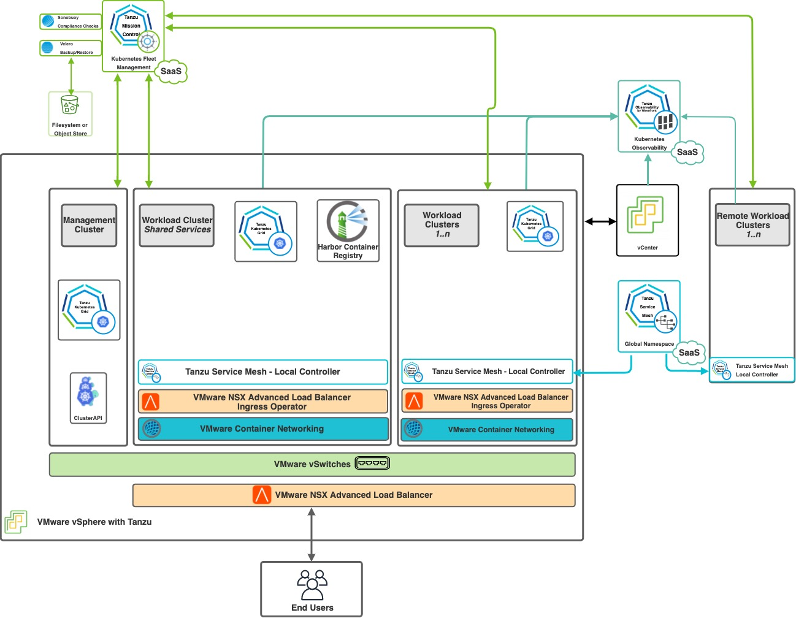
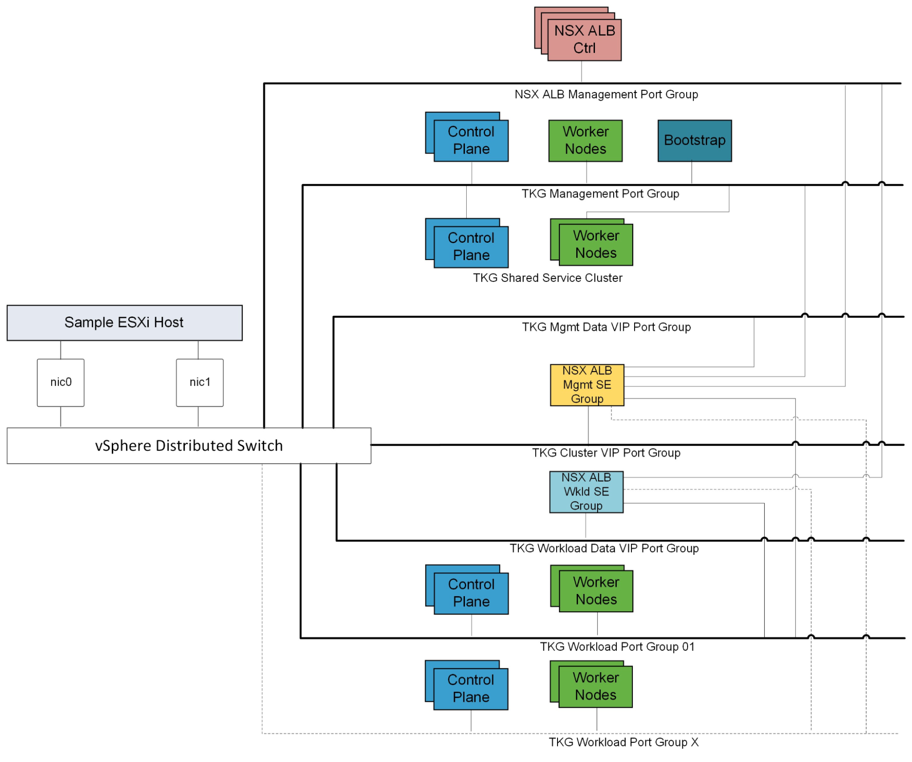
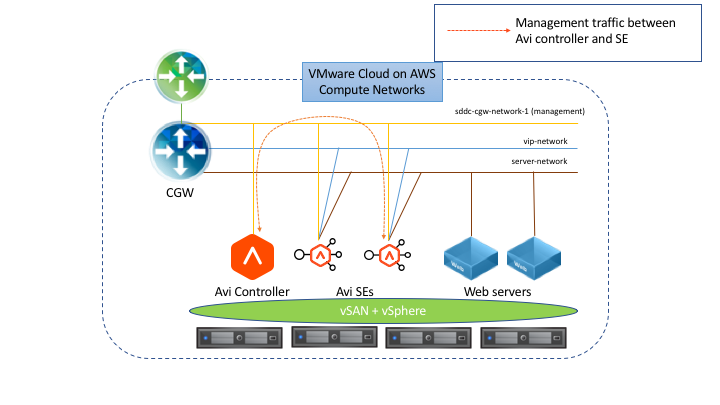
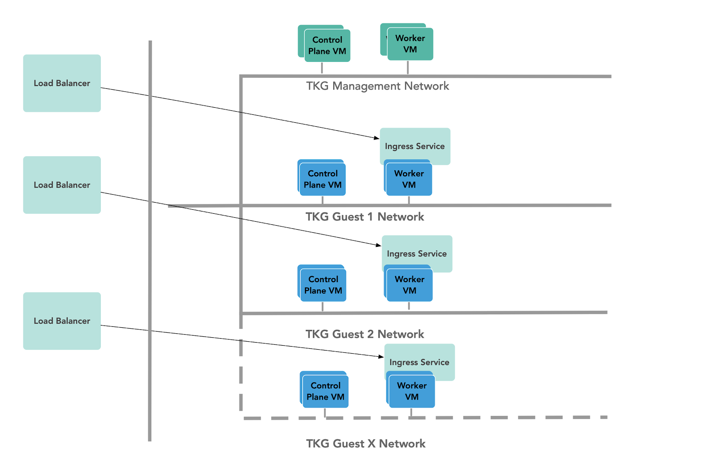
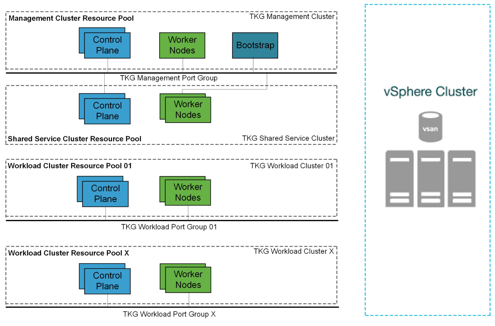
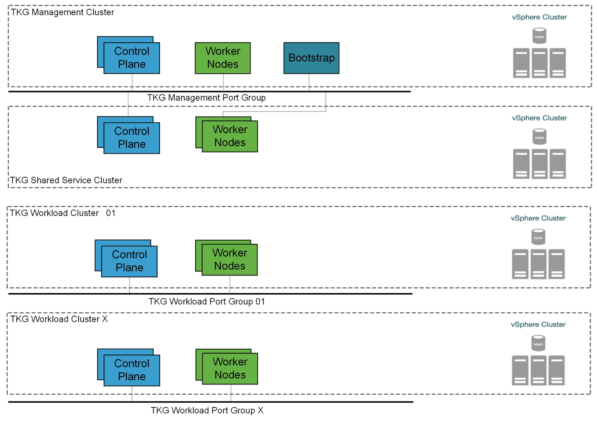
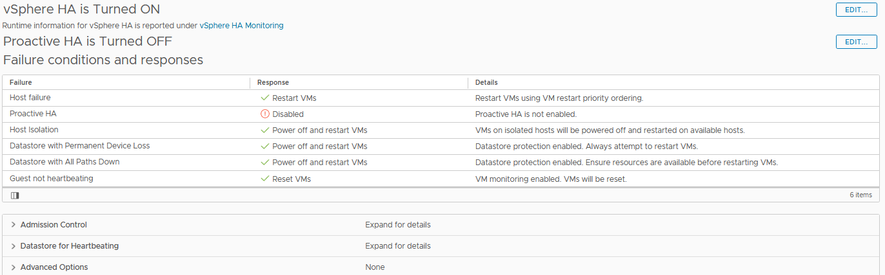
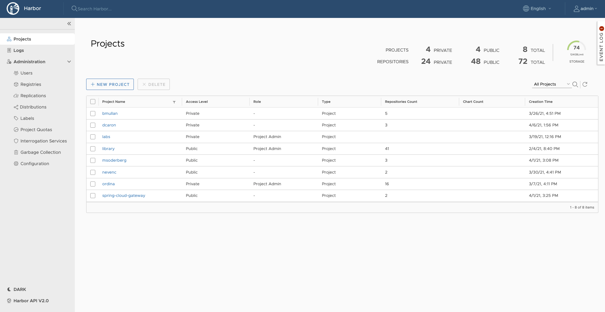

# VMware Tanzu for Kubernetes Operations on vSphere Reference Design

Tanzu for Kubernetes Operations simplifies operating Kubernetes for multi-cloud deployment by centralizing management and governance for clusters and teams across on-premises, public clouds, and edge. Tanzu for Kubernetes Operations delivers an open source aligned Kubernetes distribution with consistent operations and management to support infrastructure and application modernization.

This document describes a reference design for deploying VMware Tanzu for Kubernetes Operations on vSphere.

The following reference design is based on the architecture and components described in [VMware Tanzu for Kubernetes Operations Reference Architecture](index.md).

## Supported Component Matrix

The following table provides the component versions and interoperability matrix supported with this reference architecture:

<table>
  <tr>
   <th>Software Components</th>
   <th>Version</th>
  </tr>
  <tr>
   <td>Tanzu Kubernetes Grid</td>
   <td>1.4.0</td>
  </tr>
  <tr>
   <td>VMware vSphere ESXi</td>
   <td>6.7U3 and later</td>
  </tr>
  <tr>
   <td>VMware vCenter (VCSA)</td>
   <td>6.7U3 and later</td>
  </tr>
  <tr>
   <td>VMware vSAN</td>
   <td>6.7U3 and later</td>
  </tr>
  <tr>
   <td>NSX Advanced Load Balancer</td>
   <td>20.1.6</td>
  </tr>
</table>

## Network Overview

### General Topology

The reference design described in this section encompasses the generic network architecture for Tanzu Kubernetes Grid. To deploy Tanzu Kubernetes Grid on vSphere, you must create separate networks for the Tanzu Kubernetes Grid management cluster, Tanzu Kubernetes Grid workload clusters, NSX Advanced Load Balancer (NSX ALB) management, cluster VIP network for a highly available (HA) control plane, Tanzu Kubernetes Grid management VIP and data network, and Tanzu Kubernetes Grid workload VIP and data network.

The following diagram illustrates the reference design:

### Network Recommendations

By bootstrapping a Kubernetes management cluster with the Tanzu command line tool, Tanzu Kubernetes Grid is able to manage the lifecycle of multiple Kubernetes workload clusters. As you configure the network around Tanzu Kubernetes Grid, consider the following:

* In order to create flexible firewall and security policies, you must place Tanzu Kubernetes Grid Management clusters, workload clusters, and all VIP and data networks on different networks.

* Tanzu Kubernetes Grid does not support static IP addresses for Kubernetes VM components. DHCP is required for each of the Tanzu Kubernetes Grid management, shared services, and workload cluster networks.

* The NSX Advanced Load Balancer makes the control plane of each Kubernetes cluster HA.

* The NSX Advanced load balancer provides load balancing for applications hosted on shared services and workload clusters.

* Tanzu Kubernetes Grid supports network port groups spread across multiple Virtual Distributed Switch (VDS) instances.

This topology has the following benefits:

* Isolates and separates SDDC management components (vCenter, ESX) from the Tanzu Kubernetes Grid components. This reference design only allows minimum connectivity between the Tanzu Kubernetes Grid clusters and NSX Advanced Load Balancer to the vCenter Server.

* Isolates and separates NSX Advanced Load Balancer management network from the Tanzu Kubernetes Grid management segment and the Tanzu Kubernetes Grid workload segments.

* Depending on the workload cluster type and use case, multiple workload clusters may leverage the same workload network or new networks can be used for each workload cluster. To isolate and separate Tanzu Kubernetes Grid workload cluster networking from each other, VMware recommends using separate networks for each workload cluster and configuring the required firewall between these networks. See [Firewall Recommendations](#firewall) for more details

* Separate provider and tenant access to the Tanzu Kubernetes Grid environment. Only provider administrators need access to the Tanzu Kubernetes Grid management cluster. This prevents tenants from attempting to connect to the Tanzu Kubernetes Grid management cluster.

* Only allow tenants to access their Tanzu Kubernetes Grid workload clusters and restrict access to this cluster from other tenants.

#### Network Requirements

As per the defined architecture, below are the list of required networks:

<table>
  <tr>
   <th>Network Type</th>
   <th>DHCP Service</th>
   <th>Description and Recommendations</th>
  </tr>
  <tr>
   <td>NSX ALB Management Network</td>
   <td>Optional</td>
   <td>NSX ALB controllers and SEs use this network. DHCP is not a mandatory requirement on this network as NSX ALB can take care of IPAM.</td>
  </tr>
  <tr>
   <td>TKG Management Network</td>
   <td>Yes</td>
   <td>Control plane and worker nodes of TKG management cluster and shared services clusters use this network.</td>
  </tr>
  <tr>
   <td>TKG Workload Network</td>
   <td>Yes</td>
   <td>Control plane and worker nodes of TKG workload clusters use this network.</td>
  </tr>
  <tr>
   <td>TKG Cluster VIP/Data Network</td>
   <td>No</td>
   <td>Virtual services for Control plane HA of all TKG clusters (Management, Shared services, and Workload). Reserve sufficient IPs depending on the number of TKG clusters you plan to deploy in the environment. NSX ALB takes care of IPAM on this network.</td>
  </tr>
  <tr>
   <td>TKG Management VIP/Data Network</td>
   <td>No</td>
   <td>Virtual services for all user-managed packages (such as Contour, Harbor, Contour, Prometheus, Grafana) hosted on the shared services cluster. For more information, see <a href="https://docs.vmware.com/en/VMware-Tanzu-Kubernetes-Grid/1.4/vmware-tanzu-kubernetes-grid-14/GUID-packages-user-managed-index.html">User-Managed Packages</a>.</td>
  </tr>
  <tr>
   <td>TKG Workload VIP/Data Network</td>
   <td>No</td>
   <td>Virtual services for all applications hosted on the workload clusters. Reserve sufficient IPs depending on the number of applications you plan to host on the workload clusters along with scalability considerations.</td>
  </tr>
</table>

### Firewall Recommendations

To prepare the firewall, gather the following:

* The CIDR of your NSX Advanced Load Balancer management network

* The CIDR of your Tanzu Kubernetes Grid management cluster network

* The CIDR of your Tanzu Kubernetes Grid cluster VIP network

* The CIDR of your Tanzu Kubernetes Grid management VIP network

* The CIDR of your Tanzu Kubernetes Grid workload cluster

* The IP address of your Harbor Image Registry instance

* The IP address of your vCenter Server

* IP addresses for your DNS server

* NTP servers

<table>
  <tr>
   <th>Source</th>
   <th>Destination</th>
   <th>Protocol:Port</th>
   <th>Description</th>
  </tr>
  <tr>
   <td>TKG management and workload networks</td>
   <td>DNS server NTP server</td>
   <td>UDP:53 UDP:123</td>
   <td>DNS service Time synchronization</td>
  </tr>
  <tr>
   <td>TKG management and workload networks</td>
   <td>DHCP Server</td>
   <td>UDP: 67, 68</td>
   <td>Allows hosts to retrieve DHCP addresses.</td>
  </tr>
  <tr>
   <td>TKG management and workload networks</td>
   <td>vCenter IP</td>
   <td>TCP:443</td>
   <td>Allows components to access vCenter to create VMs and storage volumes.</td>
  </tr>
  <tr>
   <td>TKG management and workload cluster CIDR</td>
   <td>Harbor Registry</td>
   <td>TCP:443</td>
   <td>Allows components to retrieve container images. This registry can be a local or public image registry, such as <code>projects.registry.vmware.com</code>.</td>
  </tr>
  <tr>
   <td>TKG management cluster network</td>
   <td>TKG Cluster VIP Network</td>
   <td>TCP:6443</td>
   <td>Allows the management cluster to configure the workload cluster.</td>
  </tr>
  <tr>
   <td>TKG workload cluster network</td>
   <td>TKG Cluster VIP Network</td>
   <td>TCP:6443</td>
   <td>Allows workload cluster to register with management cluster.</td>
  </tr>
  <tr>
   <td>TKG management and workload networks</td>
   <td>AVI Controllers</td>
   <td>N/A</td>
   <td>Allows applications reach to dependent services, such as an external database.</td>
  </tr>
  <tr>
   <td>AVI Controllers (NSX ALB Management network)</td>
   <td>vCenter and ESXi Hosts</td>
   <td>TCP:443</td>
   <td>Allows NSX ALB to discover vCenter objects and deploy SEs as required.</td>
  </tr>
  <tr>
   <td>Admin network</td>
   <td>Bootstrap VM</td>
   <td>SSH:22</td>
   <td>Deploys, manages, and configures TKG clusters.</td>
  </tr>
</table>

### Ingress and Load Balancing

You can provision load balancer services with the VMware NSX Advanced Load Balancer (NSX ALB). For more information, see the [Avi documentation](https://avinetworks.com/vmware-tanzu/).

NSX Advanced Load Balancer Essentials provides Layer 4 load balancing for your Kubernetes workloads:

#### NSX Advanced Load Balancer Integration with vSphere

NSX Advanced Load Balancer is deployed in orchestrated Write Access Mode in the vSphere environment. This mode grants Avi Vantage full write access to the vCenter. Avi Vantage can automatically create, modify, and remove SEs and other resources as needed to adapt to changing traffic needs.

The following diagram depicts the deployment of the Avi Controller and Service Engines on the vSphere environment:

Based on the NSX Advanced Load Balancer deployment diagram:

**For Avi Service Engines**

* Avi Service Engines (SEs) are deployed as virtual machines (VMs).

* SEs are connected to the NSX Advanced Load Balancer management, VIP/Data Networks, and Tanzu Kubernetes Grid workload cluster network segments.

* The SEs connect to the Avi Controller over the NSX Advanced Load Balancer management network segment, which is the logical network connection to the vNIC0 of the SE VM.

* Multiple SE groups can be created under a single cloud. VMware recommends that you use use separate SE groups for:
    * Tanzu Kubernetes Grid Management: Service Engines part of this SE group, serves virtual services for Tanzu Kubernetes Grid cluster control plane HA, and for shared services applications hosted on shared services cluster.
    * Tanzu Kubernetes Grid Workload: Service Engines part of this SE group, serves virtual services for all applications hosted on workload clusters.
       
      **Note:**
      * Based on your requirements, you can create additional Service Engine (SE) groups for the workload clusters.
      * Multiple workload clusters can be mapped to a single SE group.
      * A Tanzu Kubernetes Grid cluster can be mapped to only one SE group for application load balancer services.

**For Avi Controller**

* The Avi Controller service runs on three virtual machines and is a clustered service.
   
  **Note:** This requires advanced licensing.

* The Avi Controller VMs are only connected to the NSX Advanced Load Balancer management network segment.

**Avi Controller Configuration**

<table>
  <tr>
   <th>Avi Controller Configuration (medium)</th>
   <th>Specification</th>
  </tr>
  <tr>
   <td>vCPUs</td>
   <td>8</td>
  </tr>
  <tr>
   <td>Memory (GB)</td>
   <td>24</td>
  </tr>
  <tr>
   <td>Hard disk (GB)</td>
   <td>128</td>
  </tr>
  <tr>
   <td>Number of network adapters</td>
   <td>1</td>
  </tr>
  <tr>
   <td>Number of appliances</td>
   <td>3</td>
  </tr>
</table>

**Avi Controller Sizing Guidelines**

Regardless of Avi Controller configuration, each Avi Controller cluster can achieve up to 5,000 virtual services, which is a hard limit. For more information, see [Avi documentation](https://avinetworks.com/docs/20.1/avi-controller-sizing/#cpuandmemalloc).

<table>
  <tr>
   <th>Controller Size</th>
   <th>VM Configuration</th>
   <th>Virtual Services</th>
   <th>Avi SE Scale</th>
  </tr>
  <tr>
   <td>Small</td>
   <td>4 vCPUS, 12 GB RAM</td>
   <td>0-50</td>
   <td>0-10</td>
  </tr>
  <tr>
   <td>Medium</td>
   <td>8 vCPUS, 24 GB RAM</td>
   <td>0-200</td>
   <td>0-100</td>
  </tr>
  <tr>
   <td>Large</td>
   <td>16 vCPUS, 32 GB RAM</td>
   <td>200-1000</td>
   <td>100-200</td>
  </tr>
  <tr>
   <td>Extra Large</td>
   <td>24 vCPUS, 48 GB RAM</td>
   <td>1000-5000</td>
   <td>200-400</td>
  </tr>
</table>

**Service Engine Configuration**

<table>
  <tr>
   <th>Service Engine Configuration</th>
   <th>Specification 
 (Recommended&#42;)
</th>
  </tr>
  <tr>
   <td>vCPUs</td>
   <td>1 (2)*</td>
  </tr>
  <tr>
   <td>Memory (GB)</td>
   <td>2 (4)*</td>
  </tr>
  <tr>
   <td>Hard disk (GB)</td>
   <td>15</td>
  </tr>
  <tr>
   <td>Number of network adapters</td>
   <td>10</td>
  </tr>
  <tr>
   <td>Number of service engines per Service Engine Group</td>
   <td>2</td>
  </tr>
</table>

**Service Engine Sizing Guidelines**

For guidance on sizing your SEs, see the [Avi documentation](https://avinetworks.com/docs/20.1/sizing-service-engines/). In summary, for Intel v4 CPUs, for example Intel(R) Xeon(R) CPU E5-2686 v4 @ 2.30GHz:

<table>
  <tr>
   <th>Performance metric</th>
   <th>1 vCPU core</th>
  </tr>
  <tr>
   <td>Throughput</td>
   <td>4 Gb/s</td>
  </tr>
  <tr>
   <td>Connections/s</td>
   <td>40k</td>
  </tr>
  <tr>
   <td>SSL Throughput</td>
   <td>1 Gb/s</td>
  </tr>
  <tr>
   <td>SSL TPS (RSA2K)</td>
   <td>~600</td>
  </tr>
  <tr>
   <td>SSL TPS (ECC)</td>
   <td>2500</td>
  </tr>
</table>

Multiple performance vectors or features may have an impact on performance. For instance, to achieve 1 Gb/s of SSL throughput and 2000 TPS of SSL with EC certificates, VMware recommends two cores.

You can configure Avi Service Engines with a minimum of 1 vCPU core and 1 GB of RAM, or a maximum of 36 vCPU cores and 128 GB of RAM.

**Network Requirements**

* AVI Controllers should only be connected to AVI management Network and AVI SEs should be connected to multiple networks, such as, Management, VIP/Data networks, and Tanzu Kubernetes Grid cluster networks.

* As part of the Tanzu requirement, DHCP service is mandatory on the Tanzu Kubernetes Grid cluster networks (management, shared services, and workload clusters). SEs connected to these networks can either make use of the available DHCP service or a static pool of IP addresses can be configured in NSX Advanced Load Balancer so that NSX Advanced Load Balancer assigns IP addresses from the pools to these SEs.

* Starting from Tanzu Kubernetes Grid 1.4, either NSX Advanced Load Balancer or Kube-Vip can be used to provide HA for control plane endpoints of Tanzu Kubernetes Grid clusters. VMware recommends making use of NSX Advanced Load Balancer as the HA provider.

* For each Tanzu Kubernetes Grid VIP/Data network, reserve a block of IP addresses for the NSX Advanced Load Balancer service engines and Virtual services. NSX Advanced Load Balancer can be used to handle IPAM for these networks.

#### Contour for Kubernetes Ingress routing

The Tanzu Editions also include Contour for Kubernetes Ingress routing. Contour is part of a Tanzu package and can be installed on any Tanzu Kubernetes Grid cluster. Contour is exposed by an NSX Advanced Load Balancer and provides Layer 7-based routing to Kubernetes services. For more information about Contour, see [Contour site](https://projectcontour.io/) and [Implementing Ingress Control with Contour](https://docs.vmware.com/en/VMware-Tanzu-Kubernetes-Grid/1.4/vmware-tanzu-kubernetes-grid-14/GUID-packages-ingress-contour.html).

## Storage

Many storage options are available and Kubernetes is agnostic about which option you choose.

For Kubernetes stateful workloads, Tanzu Kubernetes Grid installs the vSphere Container Storage interface (vSphere CSI) to provision Kubernetes persistent volumes for pods automatically. While the default vSAN storage policy can be used, site reliability engineers (SREs) and administrators should evaluate the needs of their applications and craft a specific vSphere Storage Policy. vSAN storage policies describe classes of storage such as SSD and NVME, as well as cluster quotas.

In vSphere 7u1+ environments with vSAN, the vSphere CSI driver for Kubernetes also supports creating NFS File Volumes, which support ReadWriteMany access modes. This allows for provisioning volumes which can be read and written from multiple pods simultaneously. To support this, the vSAN File Service must be enabled.

You can also use other types of vSphere datastores. There are Tanzu Kubernetes Grid Cluster Plans that operators can define to use a certain vSphere datastore when creating new workload clusters. All developers would then have the ability to provision container-backed persistent volumes from that underlying datastore.

## Clustering on vSphere

### Single-Cluster Deployments

Starting with a single vSphere cluster, management and workload Kubernetes clusters can be separated into different vSphere resource pools. Using a resource pool lets you manage each Kubernetes cluster's CPU and memory limitations and reservations. However, it does not separate elements on the physical layer.

This approach is ideal for functional trials, proof-of-concept environments, or production application deployments that do not require hardware separation.

### Multi-Cluster Deployments

For more physical separation of application workloads on Kubernetes, operators can deploy separate Kubernetes clusters to independent vSphere clusters and gain physical layer separation. For example, a Kubernetes cluster with intense computing workloads can leverage hosts with high performance CPU, while extreme IO workload clusters can be placed onto hosts with high performance storage.

This also applies to the management cluster for compute separation between management and workloads.

### High Availability

Tanzu Kubernetes Grid relies heavily on existing vSphere features for mitigating common availability disruptions, such as a single-host hardware failure. In this scenario, ensuring vSphere HA is enabled allows VMs on failed hardware to be automatically restarted on surviving hosts.

The Tanzu Kubernetes Grid management cluster performs machine health checks on all Kubernetes worker VMs. This ensures workloads remain in a functional state and can remediate issues such as:

* Worker VM accidentally deleted or corrupted

* Kubelet process on worker VM accidentally stopped or corrupted

This health check ensures that your worker capacity remains stable and can be scheduled for workloads. This health check, however, does not apply to control plane VMs that are already deployed and does not recreate VMs due to physical host failure. vSphere HA and machine health checks work in conjunction to enhance workload resilience. For more information about machine health checks, see the [Cluster API](https://cluster-api.sigs.k8s.io/tasks/healthcheck.html) documentation.

VMware recommends enabling Fully Automated DRS to ensure that the cluster load is evenly spread over all hosts. This indirectly helps reduce vSphere HA recovery time. Because no single host is overloaded, the VMs are not too large or too many, therefore, reducing the recovery time on surviving hosts.

### Non-Stretched vSphere Clusters

VMware recommends that you deploy Tanzu Kubernetes Grid on non-stretched vSphere clusters. Although you can deploy Tanzu Kubernetes Grid on stretched vSphere clusters, the Tanzu Kubernetes Grid layer does not distinguish between stretched and non-stretched vSphere clusters and provisions VMs randomly across the two sites. As a result, Tanzu Kubernetes Grid may provision VMs in a way that does not allow enough resources to your applications, resulting in downtime. You can run the workloads in an active-passive way by putting the hosts on the second site in maintenance mode, and perform DRS on site failure. But, this would also cause downtime. VMware does not recommend using these configurations in a production environment.

## Container Registry

The Tanzu Editions include [Harbor](https://goharbor.io/) as a container registry. Harbor provides a location for pushing, pulling, storing, and scanning container images to be used in your Kubernetes clusters. There are three main supported installation methods for Harbor:

* **[Tanzu Kubernetes Grid Package deployment](https://docs.vmware.com/en/VMware-Tanzu-Kubernetes-Grid/1.4/vmware-tanzu-kubernetes-grid-14/GUID-packages-harbor-registry.html)** to a Tanzu Kubernetes Grid cluster - this installation method is recommended for general use cases.

* **[Helm-based deployment](https://goharbor.io/docs/2.1.0/install-config/harbor-ha-helm/)** to a Kubernetes cluster - this installation method may be preferred for customers already invested in Helm.

* **[VM-based deployment](https://goharbor.io/docs/2.1.0/install-config/installation-prereqs/)** using docker-compose - VMware recommends using this installation method in cases where Tanzu Kubernetes Grid is being installed in an air-gapped or Internet-less environment and no pre-existing Kubernetes clusters exist on which to install Harbor. When Kubernetes is already available, the Helm based deployment also works for air-gapped environments.

If you are deploying Harbor without a publicly signed certificate, you must include the Harbor root CA in your Tanzu Kubernetes Grid clusters. To do so, follow the procedure in [Trust Custom CA Certificates on Cluster Nodes](https://docs.vmware.com/en/VMware-Tanzu-Kubernetes-Grid/1.4/vmware-tanzu-kubernetes-grid-14/GUID-cluster-lifecycle-secrets.html#trust-custom-ca-certificates-on-cluster-nodes-3).

## Deployment Instructions
For instructions on how to deploy this reference design, see [Deploy Tanzu for Kubernetes Operations on AWS](../deployment-guides/tko-on-vsphere-vds.md).
