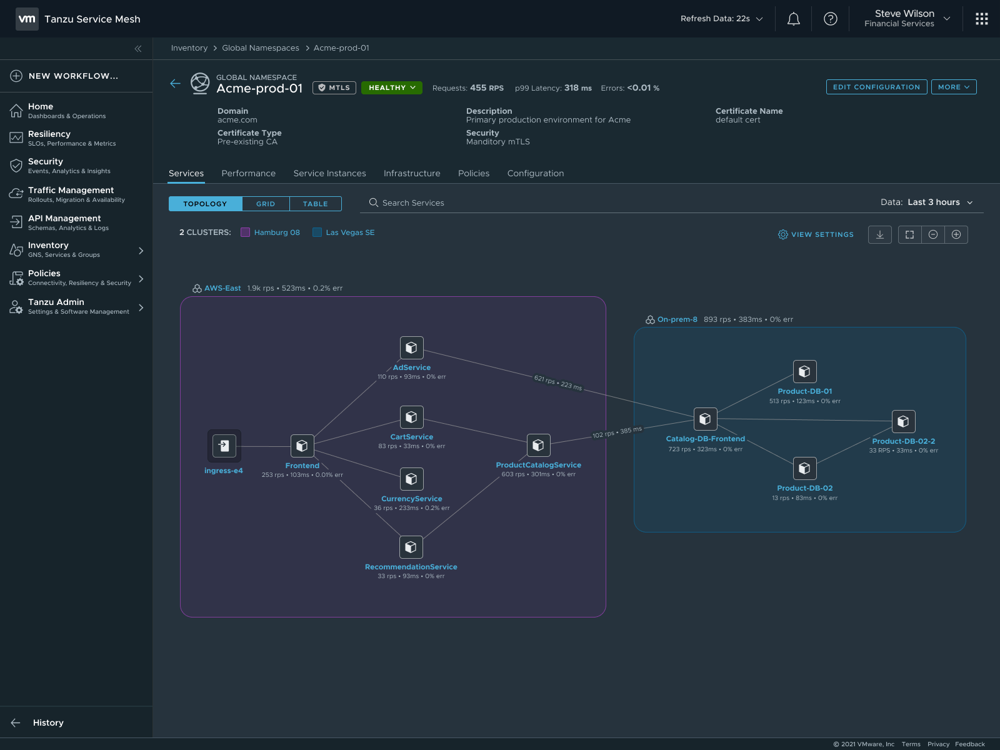

The following VMware SaaS services provide additional Kubernetes lifecycle management, observability, and service mesh features. This document outlines the configuration needed to set up the VMware SaaS services for Tanzu for Kubernetes operations.

Tanzu Mission Control (TMC)
Tanzu Observability (TO)
Tanzu Service Mesh (TSM)

## **Tanzu Mission Control (TMC)**

Tanzu Mission Control is a centralized management platform for consistently operating and securing your Kubernetes infrastructure and modern applications across multiple teams and clouds. It provides operators with a single control point to give developers the independence they need to drive the business forward while enabling consistent management and operations across environments for increased security and governance.

### **Registering Tanzu Kubernetes Clusters to Tanzu Mission Control**
It is recommended to attach the Management and workload clusters into Tanzu Mission Control (TMC) as it provides a centralized administrative interface that enables you to manage your global portfolio of Kubernetes clusters. 

TMC can assist you with:

- **Centralized Lifecycle Management** - managing the creation and deletion of workload clusters using registered management clusters.
- **Centralized Monitoring** - viewing the inventory of clusters and the health of clusters and their components.
- **Authorization** - Centralized authentication and authorization, with federated identity from multiple sources (eg. AD, LDAP, or SAML), plus an easy-to-use **policy engine** for granting the right access to the right users across teams.
- **Compliance** - enforcing all clusters to have the same set of policies applied.
- **Data protection** - using [Velero](https://velero.io/) through TMC to verify your workloads and persistent volumes are being backed up.

### **Policy-Driven Cluster Management**
TMC allows the creation of policies of various types to manage the operation and security posture of your Kubernetes clusters and other organizational objects.
The policy provides a set of rules that govern your organization and all the objects it contains. The policy types available in Tanzu Mission Control include the following:

- Access Policy: Access policies allow the use of predefined roles to specify which identities (individuals and groups) have what level of access to a given resource. For more information, see [Access Control](https://docs.vmware.com/en/VMware-Tanzu-Mission-Control/services/tanzumc-concepts/GUID-EB9C6D83-1132-444F-8218-F264E43F25BD.html#GUID-EB9C6D83-1132-444F-8218-F264E43F25BD)
- Image Registry Policy: Image registry policies allow to specify the source registries from which an image can be pulled.
- Network Policy: Network policies allow to use pre-configured templates to define how pods communicate with each other and other network endpoints.
- Quota Policy: Quota policies allow you to constrain the resources used in your clusters, as aggregate quantities across specified namespaces, using pre-configured and custom templates. For more information, see [Managing Resource Consumption](https://docs.vmware.com/en/VMware-Tanzu-Mission-Control/services/tanzumc-using/GUID-1905352C-856F-4D06-BB86-426F90486C32.html) in Your Clusters in Using VMware Tanzu Mission Control.
- Security Policy: Security policies allow you to manage the security context in which deployed pods operate in your clusters by imposing constraints on your clusters that define what pods can do and which resources they have access to. For more information, see [Pod Security Management](https://docs.vmware.com/en/VMware-Tanzu-Mission-Control/services/tanzumc-concepts/GUID-6C65B33B-C1EA-465D-B909-3C4F51704C1A.html#GUID-6C65B33B-C1EA-465D-B909-3C4F51704C1A)
- Custom Policy: Custom policies allow you to implement additional business rules, using templates that you define, to enforce policies that are not already addressed using the other built-in policy types. For more information, see [Creating Custom Policies](https://docs.vmware.com/en/VMware-Tanzu-Mission-Control/services/tanzumc-using/GUID-1FF7A1E5-8456-4EF4-A532-9CF31BE88EAA.html)

### **Policy Inheritance**
In the Tanzu Mission Control resource hierarchy, there are three levels at which you can specify policies. 
- organization 
- object groups (cluster groups and workspaces) 
- Kubernetes objects (clusters and namespaces) 

In addition to the direct policy defined for a given object, each object also has inherited policies that are defined in the parent objects. For example, a cluster has a direct policy and also has inherited policies from the cluster group and organization to which it is attached.

## **Observability**

### **Metrics on-premises**

Tanzu Standard Edition and above includes observability with **Prometheus** and **Grafana** packages. The packages can be installed using Tanzu packages as documented [here](https://docs.vmware.com/en/VMware-Tanzu-Kubernetes-Grid/1.5/vmware-tanzu-kubernetes-grid-15/GUID-packages-monitoring.html). Grafana provides a way to view cluster metrics as shown in the screen-shots below:

### **Metrics in Tanzu Observability**
With Tanzu Kubernetes Operations for TKG,  you can significantly enhance observability by using VMware Tanzu Observability by Wavefront. Tanzu Observability is a VMware SaaS system that is used to collect and display metrics and trace data from the full-stack platform as well as from applications. The service provides the ability to create alerts tuned by advanced analytics, assist in the troubleshooting of systems, and understand the impact of running production code.

In the case of vSphere and TKG, Tanzu Observability is used to collect data from components in vSphere, from Kubernetes, and from applications running on top of Kubernetes.

You can configure Tanzu Observability with an array of capabilities. Here are the recommended plugins for this design:

|**Plugin**|**Purpose**|**Key Metrics**|**Example Metrics**|
| :- | :- | :- | :- |
|Telegraf for vSphere|Collect metrics from vSphere|ESXi Server and VM performance & resource utilization|vSphere VM, Memory and Disk usage and performance|
|Wavefront Kubernetes Integration|Collect metrics from Kubernetes clusters and pods|Kubernetes container and POD statistics|
POD CPU usage rate

Daemonset ready stats
|
|Wavefront by VMware for Istio|Adapts Istio collected metrics and forwards to Wavefront|Istio metrics including request rates, trace rates, throughput, etc.|Request rate (Transactions per Second)|

The below table provides recommendations for configuring Observability in your Tanzu Kubernetes clusters.

|**Decision ID**|**Design Decision**|**Design Justification**|**Design Implications**|
| :- | :- | :- | :- |
|TKO-MON-001|Use Tanzu Observability|Tanzu** Kubernetes clusters have outbound connectivity to the internet.|VMware Tanzu Observability by Wavefront is an enterprise observability solution for multi-cloud environments.|
|TKO-MON-002|Use Prometheus/Grafana|TKG is deployed in an air gap environment.|You have to use an internal registry solution where you have pushed the required tanzu packages for installing Prometheus/Grafana.|

Some sample dashboards are shown below. Tanzu Observability can display metric data from the full stack of application elements from the platform (**VMware ESXi servers**), to the **virtual environment**, to the application environment (**Kubernetes**), and down to the various components of an **application** (**APM**).

#### **ESXi Dashboards**

#### **VM Dashboards**

#### **Storage Dashboards**

#### **Kubernetes Dashboards**

#### **Application Dashboards**

There are over 200 [integrations](https://vmware.wavefront.com/integrations) with prebuilt dashboards available in Wavefront. More are being added each week.

## **Tanzu Service Mesh (TSM)**

Tanzu Service Mesh is VMware’s enterprise-class service mesh solution that provides consistent control and security for microservices, end-users, and data across all your clusters and clouds in the most demanding multi cluster and multi-cloud environments.

### **Key Benefits of TSM:**

- Extends the service mesh capability (discovery, connectivity, control, security, and observability) to users and data.
- Facilitates the development and management of distributed applications across multiple clusters, multiple clouds, and in hybrid-cloud environments with Global Namespaces, supporting federation across organizational boundaries, technologies, and service meshes
- Implement consistent application-layer traffic management and security policies across all your clusters and clouds
- Integrate with VMware Tanzu Mission Control, VMware Enterprise PKS, and VMware Tanzu Kubernetes Grid to provide a seamless user experience.

### **Tanzu Service Mesh Architecture**

Tanzu Service Mesh has the following architecture at a high level:

- **Global Controller and Observer:** A collection of microservices that run in VMware SaaS and deliver differentiated control, security, visibility, and auto scaling capabilities.
- **Local Controller:** Local control-plane components operating in each Kubernetes cluster to provide fault tolerance if a cluster loses connection to the Global Controller.
- **Sidecars:** Data-plane components that run in each Kubernetes cluster and handle east-west traffic inside the service mesh.
- **Ingress and Egress Gateways:** Data-plane components that run in each Kubernetes cluster and handle north-south traffic going in and out of the service mesh.

### **Tanzu Service Mesh Key Concepts**

The key concepts that distinguish Tanzu Service Mesh as an enterprise-class service mesh solution are as follows:

- Global Namespaces
- Resource Groups
- Clusters
- Nodes
- Services
- Public Services

To learn more about the key components, please refer to the [Tanzu Service Mesh product documentation](https://docs.vmware.com/en/VMware-Tanzu-Service-Mesh/services/concepts-guide/GUID-CCD4EDBD-4DBA-449A-B8F9-4128B4F4B473.html).
###

### **Global Namespace**
With global namespaces in Tanzu Service Mesh, you can easily connect and secure the services in your application across clusters. You can add the services in your application to a global namespace to have them automatically discovered and connected across the clusters.

A Global Namespace connects resources and workloads that form the application into a virtual unit. Each GNS is an isolated domain that provides automatic service discovery and manages the following functions that are part of it, no matter where they are located:

- **Identity:** Each global namespace has its own certificate authority (CA) that provisions identities for the resources inside that global namespace
- **Discovery (DNS):** The global namespace controls how one resource can locate another and provides a registry.
- **Connectivity:** The global namespace defines how communication can be established between resources and how traffic within the global namespace and external to the global namespace is routed between resources.
- **Security:** The global namespace manages security for its resources by enforcing that all traffic between the resources is encrypted using Mutual Transport Layer Security authentication (mTLS).
- **Observability:** Tanzu Service Mesh aggregates telemetry data, such as metrics for services, clusters, and nodes, inside the global namespace.

### **TSM Key Use Cases**

1: Identify Service Dependencies 

The global namespace enables users to view the topology of the services or a cluster as a chart. The topology graph can be used to understand service dependencies and determine the health of the services and the performance metrics related to each service. 

The topology graph view is generated dynamically by observing the traffic that is flowing between the services in a global namespace or a cluster. 

2: Intelligent, graph-aware application resiliency and scalability

As application usage and traffic increase, Tanzu Service Mesh can automatically scale application instances up and down to ensure that applications perform within the bounds of their SLO policies and meet performance objectives for SLA compliance.

3: Deep application visibility and actionable insights

Tanzu Service Mesh help teams overcome the performance and security visibility gaps resulting from distributed microservices architectures and adoption of multiple platforms and clouds. Operations teams have access to rich troubleshooting tools, including multi-cloud topology maps and traffic flows, performance and health metrics, and application-to-infrastructure correlation. 

