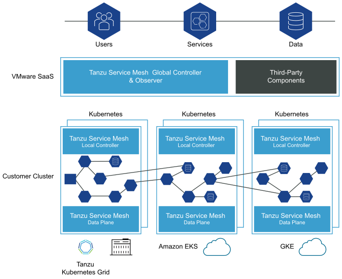
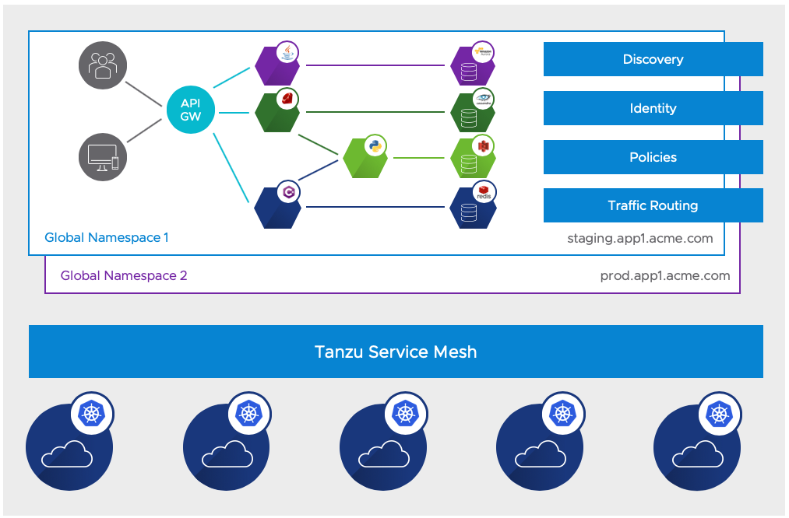
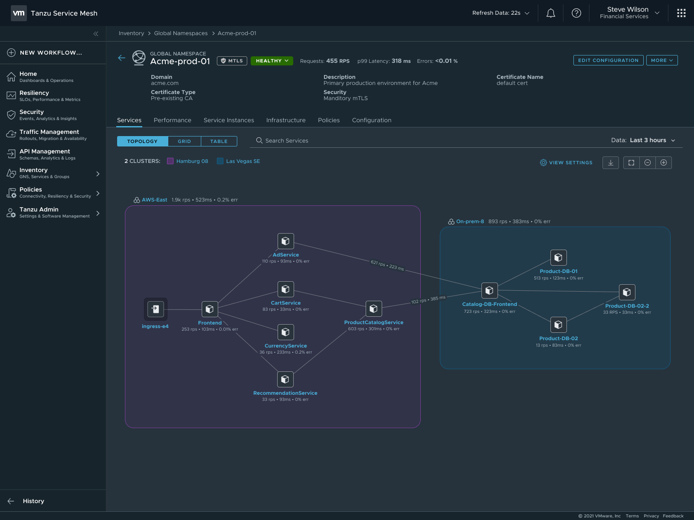
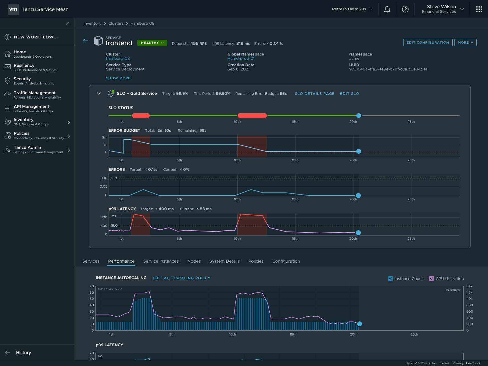
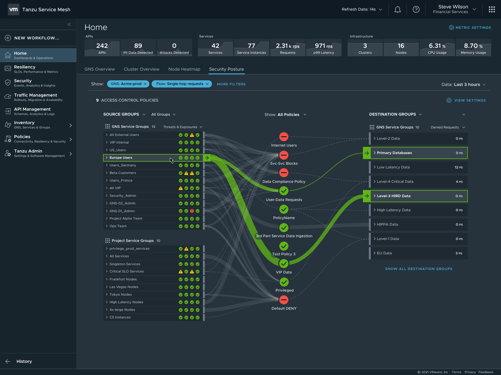

# Tanzu for Kubernetes Operations SaaS Integration

The SaaS products in the VMware Tanzu portfolio are critical components for securing your IT infrastructure. VMware Tanzu Mission Control provides a centralized control plane for Kubernetes, and Tanzu Service Mesh provides a global control plane for service mesh networks. VMware Tanzu Observability by Wavefront offers observability and analytics for multi-cloud Kubernetes environments.

The following VMware SaaS services provide additional Kubernetes lifecycle management, observability, and service mesh features. This document outlines the configuration needed to set up the VMware SaaS services for Tanzu for Kubernetes operations.

- Tanzu Mission Control (TMC)
- Tanzu Observability (TO)
- Tanzu Service Mesh (TSM)

## Tanzu Mission Control

Tanzu Mission Control is a centralized management platform for consistently operating and securing your Kubernetes infrastructure and modern applications across multiple teams and clouds. It provides operators with a single control point to give developers the independence they need to drive business forward, while enabling consistent management and operations across environments for increased security and governance.

### Registering Tanzu Kubernetes Clusters to Tanzu Mission Control

VMware recommends registering Tanzu Kubernetes Grid (TKG) management, shared services and workload clusters in Tanzu Mission Control as it provides a centralized administrative interface for managing your global portfolio of Kubernetes clusters. If the Tanzu Kubernetes Grid clusters are behind a proxy, import the proxy configuration to Tanzu Mission Control and attach the cluster using the Tanzu Mission Control UI or CLI.

Tanzu Mission Control can assist you with:

* **Centralized lifecycle management:** Managing the creation and deletion of workload clusters using registered management clusters.

* **Centralized monitoring:** Viewing the inventory of clusters and the health of clusters and their components.

* **Authorization:** Centralized authentication and authorization, with federated identity from multiple sources (for example, AD, LDAP or SAML), plus an easy-to-use policy engine for granting the right access to the right users across teams.

* **Compliance:** Enforcing the same set of polices to all clusters.

* **Data protection:** Using Velero through Tanzu Mission Control to verify that your workloads and persistent volumes are being backed up. For more information about Velero, see the [Velero site](https://velero.io/).

### Policy-Driven Cluster Management

Tanzu Mission Control allows the creation of policies of various types to manage the operation and security posture of your Kubernetes clusters and other organizational objects.

Policies provide a set of rules that govern your organization and all the objects it contains. The policy types available in Tanzu Mission Control include the following:

* Access Policy: Access policies allow the use of predefined roles to specify which identities (individuals and groups) have what level of access to a given resource. For more information, see [Access Control](https://docs.vmware.com/en/VMware-Tanzu-Mission-Control/services/tanzumc-concepts/GUID-EB9C6D83-1132-444F-8218-F264E43F25BD.html#GUID-EB9C6D83-1132-444F-8218-F264E43F25BD).

* Image Registry Policy: Image registry policies allow you to specify the source registries from which an image can be pulled.

* Network Policy: Network policies allow you to use preconfigured templates to define how pods communicate with each other and other network endpoints.

* Quota Policy: Quota policies allow you to constrain the resources used in your clusters as aggregate quantities across specified namespaces, using pre-configured and custom templates. For more information, see [Managing Resource Consumption](https://docs.vmware.com/en/VMware-Tanzu-Mission-Control/services/tanzumc-using/GUID-1905352C-856F-4D06-BB86-426F90486C32.html).

* Security Policy: Security policies allow you to manage the security context in which deployed pods operate in your clusters by imposing constraints on your clusters that define what pods can do and which resources they have access to. For more information, see [Pod Security Management](https://docs.vmware.com/en/VMware-Tanzu-Mission-Control/services/tanzumc-concepts/GUID-6C65B33B-C1EA-465D-B909-3C4F51704C1A.html).

* Custom Policy: Custom policies allow you to implement additional business rules, using templates that you define, to enforce policies that are not already addressed using the other built-in policy types. For more information, see [Creating Custom Policies](https://docs.vmware.com/en/VMware-Tanzu-Mission-Control/services/tanzumc-using/GUID-1FF7A1E5-8456-4EF4-A532-9CF31BE88EAA.html).

Some policies mentioned here are not available in Tanzu Mission Control Standard edition. For more information, see the [VMware Tanzu Mission Control Feature Comparison Chart](https://tanzu.vmware.com/content/tanzu-mission-control/tmc-comparison-chart).

### Policy Inheritance

In the Tanzu Mission Control resource hierarchy, you can specify policies at the following three levels:

* Organization

* Object groups (cluster groups and workspaces)

* Kubernetes objects (clusters and namespaces)

In addition to the direct policy defined for a given object, each object also has inherited policies that are defined in the parent objects. For example, a cluster has a direct policy and also has inherited policies from the cluster group and organization to which it is attached.

## Observability

### Metrics On-Premises

Tanzu Kubernetes Grid includes the Prometheus and Grafana packages for monitoring Tanzu Kubernetes Grid cluster metrics.

You can install Prometheus and Grafana by using Tanzu packages through the Tanzu Mission Control Catalog. For more information, see [Installing Tanzu Packages through TMC](../deployment-guides/tkg-package-install.md).

### Metrics in Tanzu Observability

Using VMware Tanzu Observability by Wavefront significantly enhances observability. Tanzu Observability is a multi-tenant SaaS application, which collects and displays metrics and trace data from the full-stack platform as well as from applications. The service can create alerts tuned by advanced analytics and assist in the troubleshooting of systems to understand the impact of running production code.

In the case of vSphere and Tanzu Kubernetes Grid, Tanzu Observability collects data from components in vSphere, from Kubernetes, and from applications running on top of Kubernetes.

You can configure Tanzu Observability with an array of capabilities. The following table describes the plugins that VMware recommends for this design:

|**Plugin**|**Purpose**|**Key Metrics**|**Example Metrics**|
| --- | --- | --- | --- |
|Telegraf for vSphere|Collect metrics from vSphere|ESXi Server and VM performance & resource utilization|vSphere VM, Memory and Disk usage and performance|
|Wavefront Kubernetes Integration|Collect metrics from Kubernetes clusters and pods|Kubernetes container and POD statistics|
POD CPU usage rate

`DaemonSet` ready stats
|
|Wavefront by VMware for Istio|Adapts Istio collected metrics and forwards to Wavefront|Istio metrics including request rates, trace rates, throughput, etc.|Request rate (Transactions per Second)|

To view and download integrations with prebuilt dashboards that are available in Wavefront, see [Integrations](https://vmware.wavefront.com/integrations) on the VMware Tanzu Observability site.

### Custom Tanzu Observability Dashboards

Tanzu Observability provides various out-of-the-box dashboards. You can customize the dashboards for your particular deployment. For information on how to customize Tanzu Observability dashboards for Tanzu for Kubernetes Operations, see [Customize Tanzu Observability Dashboard for Tanzu for Kubernetes Operations](../deployment-guides/tko-to-customized-dashboard.md).

## Tanzu Service Mesh (TSM)

Tanzu Service Mesh is VMware’s enterprise-class service mesh solution that provides consistent control and security for microservices, end-users, and data across all your clusters and clouds in the most demanding multi-cluster and multi-cloud environments.

Key Benefits of Tanzu Service Mesh:

* Extends the service mesh capability (discovery, connectivity, control, security, and observability) to users and data.

* Facilitates the development and management of distributed applications across multiple clusters, multiple clouds, and in hybrid-cloud environments with Global Namespaces, supporting federation across organizational boundaries, technologies, and service meshes.

* Implement consistent application-layer traffic management and security policies across all your clusters and clouds.

* Integrate with VMware Tanzu Mission Control, VMware Enterprise PKS, and VMware Tanzu Kubernetes Grid to provide a seamless user experience.

## Tanzu Service Mesh Architecture

Tanzu Service Mesh has the following architecture at a high level:

* **Global Controller and Observer:** A collection of microservices that run in VMware SaaS and deliver differentiated control, security, visibility, and autoscaling capabilities.

* **Local Controller:** Local control-plane components operating in each Kubernetes cluster to provide fault tolerance if a cluster loses connection to the Global Controller.

* **Sidecars:** Data-plane components that run in each Kubernetes cluster and handle east-west traffic inside the service mesh.

* **Ingress and Egress Gateways:** Data-plane components that run in each Kubernetes cluster and handle north-south traffic going in and out of the service mesh.

   

## Tanzu Service Mesh Key Concepts

The key concepts that distinguish Tanzu Service Mesh as an enterprise-class service mesh solution are as follows:

* Global Namespaces
* Resource Groups
* Clusters
* Nodes
* Services
* Public Services

To learn more about the key components, refer to the [Tanzu Service Mesh product documentation](https://docs.vmware.com/en/VMware-Tanzu-Service-Mesh/services/concepts-guide/GUID-CCD4EDBD-4DBA-449A-B8F9-4128B4F4B473.html)

## Global Namespace

With global namespaces in Tanzu Service Mesh, you can easily connect and secure the services in your application across clusters. You can add the services in your application to a global namespace to have them automatically discovered and connected across the clusters.

   

A Global Namespace connects resources and workloads that form the application into a virtual unit. Each GNS is an isolated domain that provides automatic service discovery and manages the following functions that are part of it, no matter where they are located:

* **Identity:** Each global namespace has its own certificate authority (CA) that provisions identities for the resources inside that global namespace
* **Discovery (DNS):** The global namespace controls how one resource can locate another and provides a registry.
* **Connectivity:** The global namespace defines how communication can be established between resources and how traffic within the global namespace and external to the global namespace is routed between resources.
* **Security:** The global namespace manages security for its resources by enforcing that all traffic between the resources is encrypted using Mutual Transport Layer Security authentication (mTLS).
* **Observability:** Tanzu Service Mesh aggregates telemetry data, such as metrics for services, clusters, and nodes, inside the global namespace.

# Tanzu Service Mesh Key Use Cases

- Identify Service Dependencies

  The global namespace enables users to view the topology of the services or a cluster as a chart. The topology graph can be used to understand service dependencies and determine the health of the services and the performance metrics related to each service. The topology graph view is generated dynamically by observing the traffic that is flowing between the services in a global namespace or a cluster.

  

- Intelligent, graph-aware application resiliency and scalability

  As application usage and traffic increase, Tanzu Service Mesh can automatically scale application instances up and down to ensure that applications perform within the bounds of their SLO policies and meet performance objectives for SLA compliance.

  

- Deep application visibility and actionable insights

  Tanzu Service Mesh help teams overcome the performance and security visibility gaps resulting from distributed microservices architectures and adoption of multiple platforms and clouds. Operations teams have access to rich troubleshooting tools, including multi-cloud topology maps and traffic flows, performance and health metrics, and application-to-infrastructure correlation.

  

## Deployment Instructions

For instructions on how to deploy and configure SaaS services, see [Configure Tanzu SaaS Components for Tanzu for Kubernetes Operations](../deployment-guides/tko-saas-services.md)
