# Tanzu Platform Self-Managed on vSphere - Dual-Site Reference Design  

VMware Tanzu Platform is an application development and deployment platform that helps you to modernize your applications and infrastructure to continuously deliver better software to production.  

Tanzu Platform allows platform engineers to containerize workloads to run on premises with vSphere, while increasing security and manageability. It allows developers to access the resources they need to build modern applications and push them to production. It also provides business analytics and policies that help you keep your applications and the underlying resources as healthy as possible. Tanzu Platform also incorporates policies to govern, keep safe, and secure your infrastructure and applications.  

Tanzu Platform is available as software as a service (SaaS) offering hosted by Tanzu Platform cloud services, or as a self-managed installation that you deploy to a Kubernetes cluster in your own data center.  

This document focuses on **adopting Tanzu Platform Self-Managed on a vSphere infrastructure with two availability zones backed by vSphere Distributed Switch and NSX ALB**.  

### Audience  

This document is intended for key stakeholders, including executives, IT decision-makers, infrastructure architects, and technical teams responsible for planning, deploying, and managing the Tanzu Platform environment. It also addresses individuals involved in strategic initiatives focused on enhancing application resilience, reliability, and performance within the digital ecosystem.  

-   [Bill Of Materials	4](#bill-of-materials)
-   [vSphere IaaS control plane key Components	5](#vsphere-iaas-control-plane-key-components)
-   [Overview on VCF Topology	8](#overview-on-vcf-topology)
    -   [Single Instance \- Multiple Availability Zones	8](#single-instance---multiple-availability-zones)
    -   [vCenter Server for VMware Cloud Foundation	9](#vcenter-server-for-vmware-cloud-foundation)
    -   [vSphere Cluster Design for VMware Cloud Foundation	11](#vsphere-cluster-design-for-vmware-cloud-foundation)
    -   [vSphere Networking Design for VMware Cloud Foundation	11](#vsphere-networking-design-for-vmware-cloud-foundation)
-   [Tanzu Platform on vSphere \- Dual Site Platform Architecture	12](#tanzu-platform-on-vsphere---dual-site-platform-architecture)
    -   [vSphere Management Domain Platform Architecture	12](#vsphere-management-domain-platform-architecture)
    -   [vSphere Workload Domain Platform Architecture	13](#vsphere-workload-domain-platform-architecture)
-   [Dual Site High Level Design for Tanzu Platform on vSphere	15](#dual-site-high-level-design-for-tanzu-platform-on-vsphere)
    -   [Network Requirements	16](#network-requirements)
    -   [Firewall Requirements	20](#firewall-requirements)
-   [NSX Advanced Load Balancer	23](#nsx-advanced-load-balancer)
    -   [NSX ALB Controller CPU/Memory Sizing	23](#nsx-alb-controller-cpu/memory-sizing)
    -   [NSX ALB Controller Storage Sizing	24](#nsx-alb-controller-storage-sizing)
    -   [NSX ALB Controller and Cloud Design	24](#nsx-alb-controller-and-cloud-design)
    -   [NSX ALB Service Engine Groups and Service Engines	30](#nsx-alb-service-engine-groups-and-service-engines)
        -   [NSX ALB Service Engine High Availability	30](#nsx-alb-service-engine-high-availability)
    -   [NSX ALB GSLB	33](#nsx-alb-gslb)
-   [Tanzu Platform \- Self Managed	35](#tanzu-platform-self-managed)
    -   [Tanzu Platform \- Component Architecture	35](#tanzu-platform---component-architecture)
    -   [Overview of Tanzu Platform for Kubernetes	36](#overview-of-tanzu-platform-for-kubernetes)
    -   [Tanzu Platform Self Managed Deployment Guidelines	38](#tanzu-platform-self-managed-deployment-guidelines)
        -   [TP-SM Control Plane Installation Flavor	38](#tp-sm-control-plane-installation-flavor)
        -   [TP-SM Control Plane Installation Profile	38](#tp-sm-control-plane-installation-profile)
        -   [Tanzu Kubernetes Cluster Sizing Requirements for TP-SM Control Plane	39](#tanzu-kubernetes-cluster-sizing-requirements-for-tp-sm-control-plane)
    -   [Design Recommendations for TP-SM on vSphere IaaS Control Plane	41](#design-recommendations-for-tp-sm-on-vsphere-iaas-control-plane)
    -   [Control Plane and Tanzu Application Engine	43](#control-plane-and-tanzu-application-engine)
    -   [General Recommendations on Configuring Spaces(In Progress)	45](#general-recommendations-on-configuring-spaces\(in-progress\))
    -   [RBAC in Tanzu Platform Self-Managed	46](#rbac-in-tanzu-platform-self-managed)  

{#bill-of-materials}
### Bill Of Materials  
Below is the validated Bill of Materials that can be used to install TKG on your vSphere environment today: 

| Software Components  | Version  |
| :---- | :---- |
| vSphere ESXi | 8.0.3 |
| vCenter | 8.0.3 |
| NSX Advanced Load balancer | 22.1.5 |
| Tanzu Kubernetes Release | 1.28.x |
| Tanzu Platform  | 10.0.0 |  

{#vsphere-iaas-control-plane-key-components}
## vSphere IaaS control plane key Components  

To deploy and utilize Tanzu Platform features and capabilities on a vSphere infrastructure, it is essential to configure the vSphere IaaS control plane. This IaaS control plane serves as the foundational layer, managing compute, storage, and networking resources required to support Kubernetes clusters and modern application workloads. Proper configuration ensures seamless integration with Tanzu services, enabling efficient workload management, scalability, and automation.   
Before delving into the dual-site architecture, it is important to establish this control plane to ensure high availability, resource optimization, and operational efficiency. The dual-site architecture builds on this foundation, enhancing resilience and disaster recovery capabilities across multiple locations.

The vSphere IaaS control plane leverages vSphere clusters to deploy Kubernetes workloads in dedicated resource pools. After activating the vSphere IaaS control plane on vSphere clusters, you can deploy upstream Kubernetes clusters using VMware vSphere Kubernetes Service (VKS), previously Tanzu Kubernetes Grid Service (TKGS), allowing you to run your applications within these clusters.  

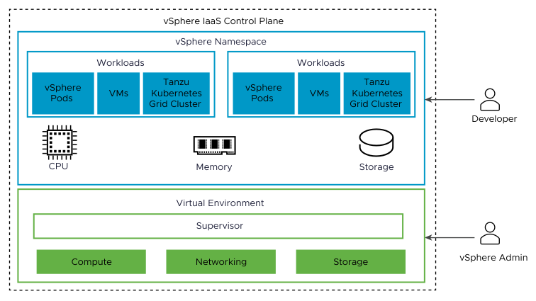

**Supervisors**: Clusters activated with the vSphere IaaS control plane are known as Supervisors. Supervisors form the foundation of the vSphere IaaS control plane, offering the essential components and resources required to run workloads, such as vSphere Pods, VMs, and TKG clusters.

**vSphere Zones**: vSphere Zones provide high availability against cluster-level failure to workloads deployed on vSphere IaaS control plane

Deployment options vary based on specific requirements and environment setup:

* **Three-Zone Deployment:** A single Supervisor is enabled across three vSphere clusters, with each cluster configured as an independent failure domain, mapped to a vSphere zone. In this configuration, the three vSphere clusters collectively function as one Supervisor.  
* **Single-Cluster Deployment:** The Supervisor is enabled on individual vSphere clusters, maintaining cluster-level high availability through vSphere HA. The vSphere IaaS control plane can be scaled by adding hosts to the vSphere cluster that corresponds to the Supervisor.

This document focuses on Supervisors in a Single-Cluster Deployment, as the focus is on enabling TP on dual site environments.

**vSphere Namespace**: A vSphere Namespace defines the resource boundaries where vSphere Pods, VMs, and TKG clusters can operate. vSphere administrators can create and configure vSphere Namespaces through the vSphere Client.

Upon creation, a vSphere Namespace initially has unlimited resources within the Supervisor. Administrators can set limits for CPU, memory, storage, and the number of Kubernetes objects that can run within the vSphere Namespace, as well as define access privileges to the namespace. Storage limitations are represented as storage quotas in Kubernetes. A resource pool is created in vSphere for each vSphere Namespace on the Supervisor.

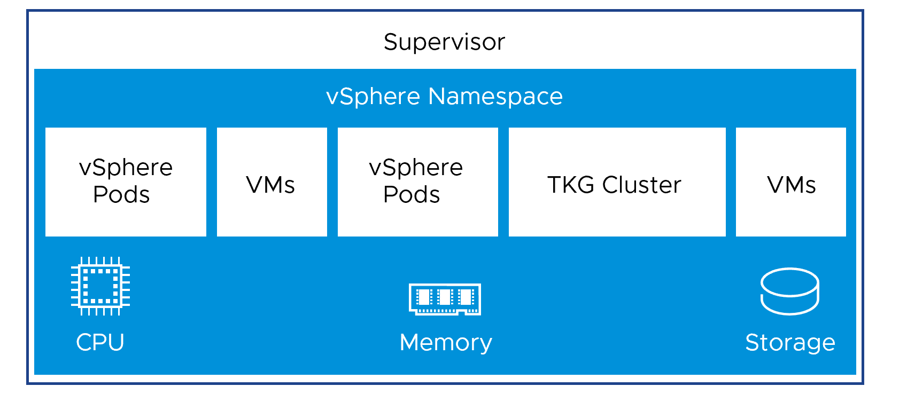

Although a vSphere Namespace serves a similar function to a Kubernetes namespace, it is specific to the vSphere IaaS control plane. A vSphere Namespace should not be confused with a Kubernetes namespace.

**VMware vSphere Kubernetes Service(VKS)**: Previously called as Tanzu Kubernetes Grid Service, provides components for provisioning and managing the lifecycle of Kubernetes clusters in the vSphere IaaS control plane environment.

**TKG Cluster (TKC)**: A TKG cluster is a complete distribution of Kubernetes that is built, signed, and supported by VMware/Broadcom. Upstream TKG clusters can be provisioned and operated on Supervisors using TKG.

**Virtual Machines in vSphere IaaS control plane**: The vSphere IaaS control plane provides VM Service functionality, allowing DevOps engineers to deploy and run VMs alongside containers within a shared Kubernetes environment.  

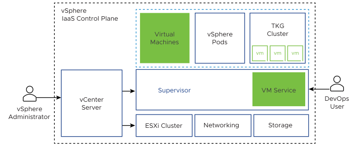

Both containers and VMs utilize the same vSphere Namespace resources and can be managed through a unified vSphere IaaS control plane interface. 

**vSphere Pod**: A vSphere Pod is a lightweight VM designed to run one or more Linux containers. Each vSphere Pod is precisely sized for its specific workload, with explicit resource reservations for storage, memory, and CPU, ensuring that only the required resources are allocated. vSphere Pods are supported exclusively on Supervisors configured with NSX as the networking stack. 

**Note:** NSX is essential for deploying vSphere Pods. However, since this document focuses on vSphere Distributed Switch, vSphere Pods are not covered in detail.

**NSX Advanced Load Balancer (NSX ALB)**: NSX ALB integrates seamlessly with the vSphere IaaS control plane, providing dynamically scalable load balancing endpoints for both the control plane and applications. In its default configuration, NSX ALB acts as a load balancer, delivering L4 load balancing solutions for applications hosted on Tanzu Kubernetes Grid. It also features a Kubernetes operator hosted on the Supervisor cluster that integrates with the Kubernetes API to manage the lifecycle of load balancing for workloads.

Overall, the Tanzu platform enables teams to deploy and manage Kubernetes clusters and modern applications efficiently. By leveraging this platform, businesses can enhance application resilience, reliability, and performance, aligning with industry-leading practices.

{#overview-on-vcf-topology}
## Overview on VCF Topology  

The Tanzu Platform will be deployed on a Tanzu Kubernetes Cluster (TKC) hosted on the vSphere IaaS control plane. The architecture of the Tanzu Platform on vSphere is influenced by the selected VMware Cloud Foundation (VCF) topology. For the scope of this document, the following VCF topology is considered.

* Single Instance \- Multiple Availability Zones  
* vCenter Server for VMware Cloud Foundation  
* vSphere Cluster Design for VMware Cloud Foundation  
* vSphere Networking Design for VMware Cloud Foundation

>   **Note** This document offers a high-level overview of the Tanzu Platform Self-Managed (TP-SM) and does not include detailed design or recommendations for SDDC management components or the IaaS control plane. The information provided below serves only as a reference. Customers should evaluate and choose the most appropriate VCF topology based on their specific business and application needs. For more details on supported/recommended VCF topology refer to the official [VMware Cloud Foundation Design Guide](https://docs.vmware.com/en/VMware-Cloud-Foundation/5.2/vcf-design/GUID-5B0A8D19-E82C-49B6-BA36-D72FF0A4F9C7.html) 

{#single-instance---multiple-availability-zones}
### Single Instance \- Multiple Availability Zones  

This approach utilizes a single VMware Cloud Foundation (VCF) instance, with the Management Domain deployed as a stretched vSAN cluster. All critical management components, including the Management vCenter, Workload vCenter, NSX Advanced Load Balancer (NSX ALB) instances, and other supporting infrastructure components, are hosted within this domain.

For enhanced business application resiliency, workload resources can be configured either as a vSAN stretched cluster within the Virtual Infrastructure(VI) Workload Domain or as standard VI Workload Domains in each availability zone. This setup mitigates the impact of hardware failures within a fault domain by distributing resources across multiple availability zones, thereby improving application availability and minimizing disruption.

In most scenarios, availability zones are deployed across two independent data centers, ensuring high availability and fault tolerance for critical workloads.

For more details on the design and its considerations refer to the [official documentation](https://docs.vmware.com/en/VMware-Cloud-Foundation/5.2/vcf-design/GUID-AC019746-F353-4C5A-8E6E-931BF23C6B10.html).

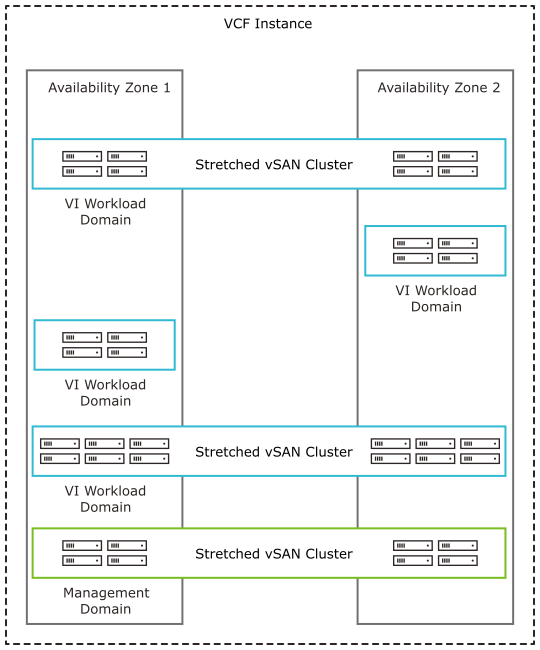

{#vcenter-server-for-vmware-cloud-foundation}
### vCenter Server for VMware Cloud Foundation  

Each workload domain is managed by a dedicated vCenter Server instance, responsible for overseeing customer workloads. These Workload vCenter Server instances reside within the management domain and share a common vCenter Single Sign-On (SSO) domain within the VMware Cloud Foundation instance.

For more details on design, recommendations, requirements and sizing guidelines, refer to the [official documentation](https://docs.vmware.com/en/VMware-Cloud-Foundation/5.2/vcf-design/GUID-CD0E3596-AB45-442D-B9C8-7BE0BEC0892B.html).

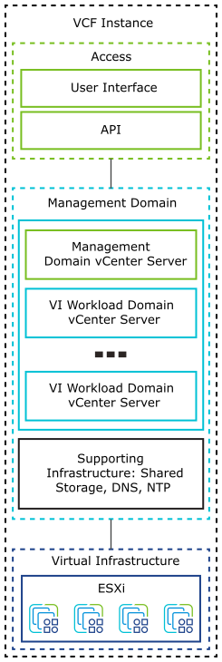

{#vsphere-cluster-design-for-vmware-cloud-foundation}
### vSphere Cluster Design for VMware Cloud Foundation  

The vSphere cluster design should account for the specific needs of standard, stretched, and remote clusters, as well as the life cycle management of ESXi hosts based on workload characteristics. This documentation focuses on standard workload clusters. **This documentation focuses exclusively on standard workload clusters.**

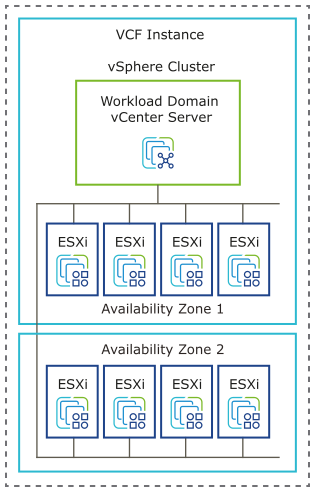

{#vsphere-networking-design-for-vmware-cloud-foundation}
### vSphere Networking Design for VMware Cloud Foundation  

Designing vSphere networking requires careful consideration of vSphere Distributed Switches (VDS), distributed port groups, and VMkernel adapters within the VMware Cloud Foundation environment. Workload domains in VMware Cloud Foundation necessitate multiple port groups configured on the vSphere Distributed Switch.

As per the best practices it is recommended to ​​use a single vSphere Distributed Switch per cluster. For more details on design, recommendations, and requirements refer to the [official documentation](https://docs.vmware.com/en/VMware-Cloud-Foundation/5.2/vcf-design/GUID-611238ED-60FE-4DEE-A735-0016640DE5DD.html).

{#tanzu-platform-on-vsphere---dual-site-platform-architecture}
## Tanzu Platform on vSphere \- Dual Site Platform Architecture  

Based on the above VCF considerations, the following diagram provides a high-level overview of the vSphere platform architecture supporting Tanzu Platform deployment. 
{#vsphere-management-domain-platform-architecture}
### vSphere Management Domain Platform Architecture  

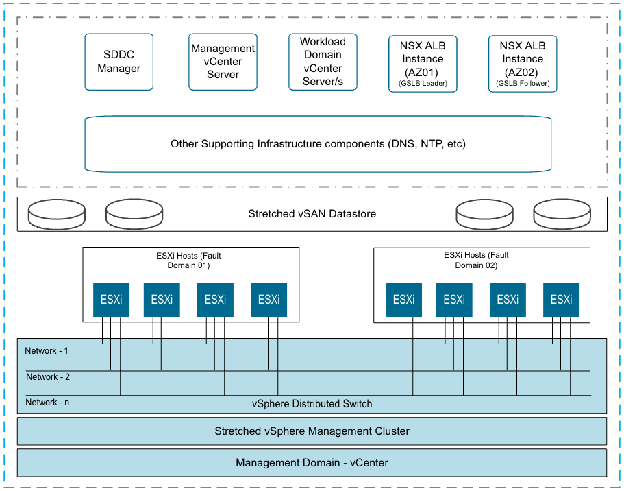

As shown in the diagram, a stretched vSAN cluster is being leveraged to host management and supporting infrastructure components. 

In this documentation, the Management Domain is primarily leveraged to host the NSX Advanced Load Balancer (NSX ALB) Controllers. These NSX ALB controllers are essential for delivering load balancing services to both the IaaS control plane components and applications deployed on Tanzu Kubernetes Clusters (TKCs) managed by the Tanzu Platform Self-Managed (TP-SM).

{#vsphere-workload-domain-platform-architecture}
### vSphere Workload Domain Platform Architecture  

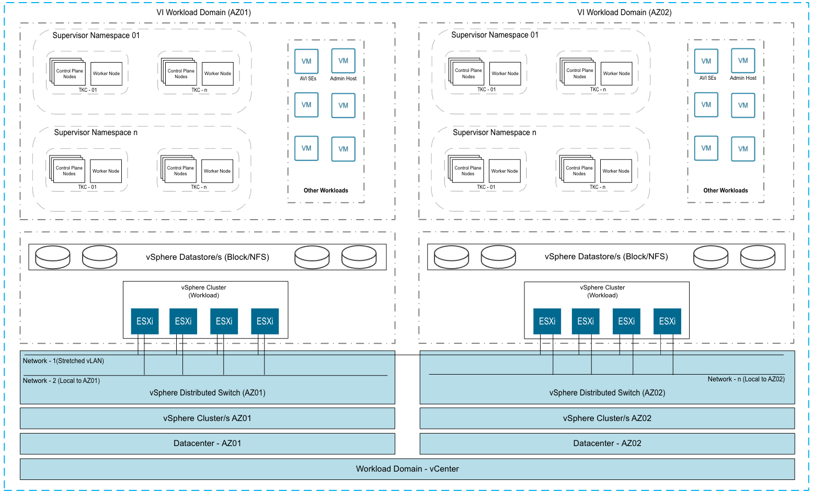

As illustrated in the above diagram, each vSphere Cluster represents an availability zone (AZ) and is managed by a single vCenter instance within the same datacenter region. The architecture proposes that the ESXi hosts in each availability zone are connected and managed by separate vSphere Distributed Switches (vDS). 

**Key Points:**

* **vSphere Clusters and Availability Zones (AZs)**:  
  * The architecture comprises two vSphere clusters, each representing a separate availability zone (AZ01 and AZ02).  
  * This configuration enhances fault tolerance and disaster recovery capabilities, as workloads/applications can be distributed across zones.  
* **Network Configuration**:  
  * Each vSphere cluster is associated with a dedicated vSphere Distributed Switch (vDS), which manages all hosts within a given availability zone.   
  * Depending on the design, networks can either be stretched across both availability zones or confined to a single zone. However, it is mandatory for the TKG Control Plane/Application VIP Network to be stretched across both availability zones to ensure seamless connectivity and high availability.  
  * For the scope of this document, it is assumed that only the TKG Control Plane/Application VIP Network network is stretched across both availability zones  
  * **Key Point:** Stretched networks are not a requirement for all networks, it is essential to stretch the VIP network. For additional details, refer to the **Network Requirements** section of this document.  
* **Supervisor Services and Tanzu Kubernetes Clusters (TKCs)**:  
  * Supervisor Services are enabled independently on each vSphere Zone (mapped to the vSphere Cluster), enabling the deployment of TKCs within the supervisor namespace of each vSphere Zone.   
    TP-SM components are deployed to a dedicated TKCs, while a group of TKCs (Cluster Group) will be designated as the availability target to host applications via the Tanzu Platform.  
    **Important Note**: Supervisor namespaces and Kubernetes cluster nodes are confined to their respective availability zones and do not span across sites. This ensures isolation and simplifies management within each zone.  
* **NSX Advanced Load Balancer**  
  * Each site will have its own instance of NSX Advanced Load Balancer (ALB) to provide L4 load balancing for the Supervisor Control Plane, TKC control plane, and applications deployed on the TKC.  
  * The NSX ALB will also be configured to manage Global Server Load Balancing (GSLB) services, ensuring efficient traffic distribution and high availability for applications hosted on TKCs (Run Cluster) through the Tanzu Platform.  
* **Storage Considerations**:  
  * Storage is configured locally within each Availability Zone, meaning that vSphere datastores (Block or NFS) are not stretched across the availability zones. Each zone utilizes its own local storage resources to support the deployed workloads and Kubernetes clusters.   
* **Workload Management**:  
  * In addition to TKCs, other workloads, including virtual machines and NSX ALB  Service Engines (SEs), are managed within this architecture, leveraging the distributed resources across zones.

{#dual-site-high-level-design-for-tanzu-platform-on-vsphere}
## Dual Site High Level Design for Tanzu Platform on vSphere  

The diagram illustrates the high-level design for deploying Tanzu Platform (TP) components on the IaaS control plane, utilizing VDS and NSX ALB for load balancing.

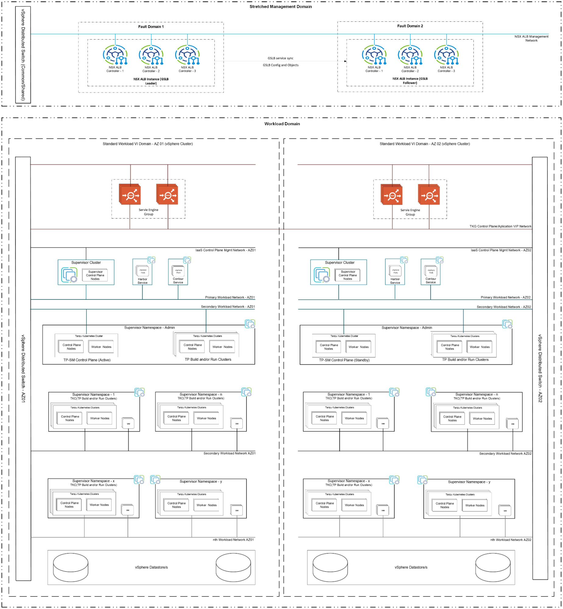

{#network-requirements}
### Network Requirements  

As per the proposed architecture, all the Tanzu Components will be deployed on a VLAN backed Portgroup.  Below is the list of required vLAN Portgroups:

| Network | Minimum/Recommended Subnet Requirement | Description | L2 Stretching |
| :---- | :---- | :---- | :---- |
| NSX ALB Management Network | /27 | The NSX Advanced Load Balancer (NSX ALB) controller nodes at both sites will connect to this network, which is part of the management domain. Based on the VCF Management Domain topology outlined in this documentation, it is assumed that the Management Domain/Cluster is stretched across both sites, along with the associated networks. **Note**:  If the management domain is not stretched and a dedicated management domain is used per site, two separate networks must be configured, one at each site. This document does not cover scenarios with a single standard (non-stretched) management domain in a multi-site environment, as this configuration is not recommended. | Stretched |
| NSX ALB SE Management Network   | /24 | The management interface of the Service Engines (SEs) will connect to this network, and its sizing must align with the Service Engine group configuration at each site. **Considerations: Number of Networks:** One network per availability zone is recommended. **Stretched Network Option:** This network can optionally be stretched across both zones, allowing the same network to be used for SE management at both sites. In such cases, the subnet must be sized to accommodate the total number of Service Engines across both sites. The available IP addresses should then be divided into two distinct blocks, with each block assigned to the NSX ALB instance in the respective availability zone. | Optional |
| TKG Control Plane/Application VIP Network  | /24 | This network is used for hosting L4 Virtual Services for Control plane HA of all Kubernetes clusters (Supervisor and Workload) and to host Virtual services for the applications deployed on the Tanzu Kubernetes Clusters (TKC) Reserve sufficient IPs depending on the number of TKG clusters and applications planned to be deployed in the environment. **Considerations:** **IP Allocation:** Reserve an adequate pool of IP addresses based on the number of planned TKG clusters and applications at both sites. **Number of Networks:** One. **Network Configuration:** This network must be stretched across both sites. The available IP addresses should be divided into three distinct blocks: **Block 1:** Added to the DHCP range in the NSX ALB instance at the primary site. **Block 2:** Added to the DHCP range in the NSX ALB instance at the secondary site. **Block 3:** This block, containing a single IP address, is added to the DHCP range of the NSX ALB instance at the primary site where TP-SM is deployed. The IP address is used to expose the TP-SM instance. In the event of a TP-SM recovery at the secondary site, this IP block must be reassigned to the NSX ALB instance at the secondary site to maintain service continuity. | Stretched |
| IaaS Control Plane Mgmt Network  | /27 | Supervisor Cluster nodes will utilize this network, with each cluster requiring a reserved block of five IP addresses. Initially, two Supervisor Clusters (one at each site) will be deployed, necessitating two such blocks. **Considerations: Number of Networks:** One network per availability zone is recommended. **Stretched Network Option:** If the network is stretched, the same network can be used by both the supervisor cluster, in such case reserve two blocks of five IP addresses from the same network to accommodate both sites. | Optional |
| Primary Workload Network   | /24 | The second interface of the Supervisor nodes will be connected to this network, requiring 3 IP addresses per Supervisor cluster. Supervisor services such as Harbor, Contour, and Velero vSphere services will be deployed as vSphere Pods and will consume IPs from this range. **Considerations:** **Number of Networks**: One network per availability zone is recommended. **Stretched Network Option**: This network can optionally be stretched across both sites. In such cases, the same network can be used as the primary workload network at both sites. The network should be divided into two blocks, with each block allocated to the respective site. | Optional |
| Secondary Workload Network  | ​​/24 | The control plane and worker nodes of TKG workload clusters will connect to this network. As depicted in the diagram, this network is associated with a dedicated Supervisor namespace (Admin Namespace) utilized by the platform administrator to deploy TP-SM components on one of the TKCs. Optionally, this network can also be used to host TP Build and/or Run clusters. **Considerations:** **Number of Networks**: One network per availability zone is recommended. **Stretched Network Option**: This network can optionally be stretched across both sites. In such cases, the same network can be used as the secondary workload network at both sites. The network should be divided into two blocks, with each block allocated to the respective site. | Optional |
| Additional Workload Network (One per availability zone)   | /24 | Additional workload networks can be created as needed to segregate TKCs. Depending on the requirements, these TKCs can be configured to function as either TP Build or Run clusters. **Considerations:** **Number of Networks**: One network per availability zone is recommended. **Stretched Network Option**: This network can optionally be stretched across both sites. In such cases, the same network can be used as the secondary workload network at both sites. The network should be divided into two blocks, with each block allocated to the respective site. | Optional |

{#firewall-requirements}
### Firewall Requirements  

Below are the minimum required firewall that’s required for the proposed architecture: 

| Source | Destination | Protocol:Port | Description |
| :---- | :---- | :---- | :---- |
| IaaS Control Plane Mgmt Network NSX ALB Management Network Primary Workload Network  Secondary Workload Network Additional Workload Network(If Any) | DNS Server/s | TCP/UDP:53 | DNS Service |
| IaaS Control Plane Mgmt Network NSX ALB Management Network Primary Workload Network  Secondary Workload Network Additional Workload Network(If Any) | NTP Server/s | UDP:123 | NTP Service |
| IaaS Control Plane Mgmt Network NSX ALB Management Network | vCenter Server | TCP:443 | Allow Supervisor to access vCenter to create required objects such as TKC nodes(VMs), PVCs, etc. Allow NSX Advanced Load Balancer to discover vCenter objects and deploy SEs as required. |
| IaaS Control Plane Mgmt Network Secondary Workload Network  | NSX ALB Management Network  | TCP:443 | Enable the Avi Kubernetes Operator (AKO) hosted on the Supervisor Nodes to access the NSX Advanced Load Balancer Controller to create/delete/modify the Virtual Services and other objects. Allow TP-SM to create/delete/modify GSLB DNS records |
| NSX ALB SE Management Network   | NSX ALB Management Network  | TCP:22 TCP: 8443 UDP:123 | Secure channel over SSH Secure key exchange over  HTTPS NTP time synchronization  |
| IaaS Control Plane Mgmt Network Primary Workload Network  Secondary Workload Network Additional Workload Network   | TKG Control Plane/Application VIP Network | TCP:6433 | Allow Supervisor clusters to create and manage workload clusters. Allow Workload Cluster Nodes to access the Kube API endpoint |
| IaaS Control Plane Mgmt Network Primary Workload Network  Secondary Workload Network Additional Workload Network/s(If Any)	 | Private Image Repository/s (Harbor and jFrog) Source Code Management tools (Git Repository/Bitbucket or others) | TCP: 443 / Custom Port | Allow accessing the image binaries to build TKC, install required packages and any code dependencies For TP-SM Control plane to scan the code repository for vulnerability assessment To deploy K8s artifacts (helm charts) via Flux capability |
| Secondary Workload Network  NSX ALB Management Network | AD/LDAP Servers | TCP/UDP: 389/636 | Allow NSX ALB controllers and TP-SM control plane components to establish connections with AD/LDAP servers for authentication services.  |
| Primary Workload Network  Secondary Workload Network Additional Workload Network/s(If Any) | External Services | \<Ports and protocol on which the External Services are exposed\> | Enable applications running on TKC clusters to communicate with external services, including databases and external artifact repositories (for build process).  |
| administration network CIDR(s) | IaaS Control Plane Mgmt Network Primary Workload Network  Secondary Workload Network Additional Workload Network/s TKG Control Plane/Application VIP Network vCenter Server | TCP: 443 TCP: 22TCP: 6443 | Allow administrators to manage IaaS control Plane via vCenter Connect to TP-SM endpoint over the port 443 Access the nodes via SSH Connect to Kube API Endpoints of Supervisor and/or TKCs  |
| Developer network CIDR(s) | TKG Control Plane/Application VIP | TCP: 443 TCP/UDP: \<Application ports Exposed: 443/80/any  TCP: 6443(Optional) | Connect to TP-SM endpoint over the port 443 (UI/CLI) Access the applications hosted via Tanzu platform (Port 443/80/or any custom ports) Allow administrators to access TKCs. With sufficient privileges developers can access the K8s clusters if/when required |

{#nsx-advanced-load-balancer}
## NSX Advanced Load Balancer  

The NSX ALB Controller provides central control and management of the Service Engines. The AVI Controller runs on a VM and can be managed using its web interface, CLI, or REST API. 

VMware NSX Advanced Load Balancer (Avi) provides multi-cloud load balancing, web application firewall, and application analytics across on-premises data centers and any cloud. 

NSX ALB is leveraged to provide L4 load balancing functionalities for the:

* Control Plane components of Tanzu Kubernetes Clusters  
* Services deployed in the Tanzu Kubernetes clusters 

The following are the core components of NSX ALB that will be leveraged for the setup:

* **NSX ALB Controller** \- NSX ALB Controller manages Virtual Service objects and interacts with the vCenter Server infrastructure to manage the lifecycle of the service engines (SEs). It is the central repository for the configurations and policies related to services and management and provides the portal for viewing the health of VirtualServices and SEs and the associated analytics that NSX Advanced Load Balancer provides.  
* **NSX ALB Service Engine** \- The Service Engines (SEs) are lightweight VMs that handle all data plane operations by receiving and executing instructions from the controller. The SEs perform load balancing and all client and server-facing network interactions.  
* **Avi Kubernetes Operator (AKO)** \- It is a Kubernetes operator that runs as a pod in the Supervisor Cluster that provides load balancing functionality. AKO translates the required Kubernetes objects to NSX ALB objects and automates the implementation of services on the Service Engines (SE) via the NSX ALB Controller.

{#nsx-alb-controller-cpu/memory-sizing}
### NSX ALB Controller CPU/Memory Sizing  

Regardless of NSX ALB Controller configuration, each Controller cluster can achieve up to 10000 virtual services, this is a hard limit.

For more details, refer to NSX ALB [documentation](https://docs.vmware.com/en/VMware-Avi-Load-Balancer) and [NSX ALB Configuration Limits](https://configmax.broadcom.com/guest?vmwareproduct=NSX%20Advanced%20Load%20Balancer&release=22.1.5&categories=119-0).

| Controller Size  | VM Configuration  | Virtual Services Limit  | Avi SE Scale  |
| :---- | :---- | :---- | :---- |
| Essentials  | 4 vCPUS, 24 GB RAM  | 100 | 0-10  |
| Small  | 6 vCPUS, 24 GB RAM  | 400 | 0-100  |
| Medium  | 10 vCPUS, 32 GB RAM  | 2000  | 100-200  |
| Large  | 16 vCPUS, 48 GB RAM  | 10000 | 200-400  |

{#nsx-alb-controller-storage-sizing}
### NSX ALB Controller Storage Sizing  

The amount of disk capacity to allocate to an Avi Controller is calculated based on the following parameters:  

* The amount of disk capacity required by analytics components    
* The number of virtual services to support. 

Note the following:  

* Starting with Avi Vantage version 18.2.6, the default Controller OVA template should be increased to 128 GB.    
* Controllers in the same cluster should all have the same/similar disk capacity. Allocations of significantly different sizes should not be permitted for prolonged periods of time.  

For more details on NSX ALB Controller Storage Sizing refer to [NSX Advanced Load Balancer Controller Sizing](https://docs.vmware.com/en/VMware-NSX-Advanced-Load-Balancer/22.1/Installation_Guide/GUID-6366FAA5-8FDF-4B0F-B170-1D846B6CAF86.html#allocating-disk-capacity-2)

{#nsx-alb-controller-and-cloud-design}
### NSX ALB Controller and Cloud Design  

NSX ALB Load Balancer is a software-based solution that provides real-time analytics and elastic application delivery services.It optimizes core web functions, including SSL termination and load balancing. 

NSX ALB Load Balancer runs on virtual machines (VMs) managed by VMware vCenter. When deployed into a vCenter-managed VMware cloud, it performs as a fully distributed, virtualized system consisting of a Controller and SEs each running as a VM.

In the selected dual-site topology, NSX Advanced Load Balancer (NSX ALB) is deployed within the stretched management domain, with two instances configured to support the dual-site architecture.

* The NSX ALB instance responsible for managing resources in **Availability Zone 01 (AZ01)** will be associated with the AZ01 fault domain.  
* Similarly, the NSX ALB instance managing resources in **Availability Zone 02 (AZ02)** will be associated with the AZ02 fault domain.

Below is a high-level overview of the architecture and distribution of NSX ALB components across the availability zones.  
In the diagram below, the NSX ALB instance in the AZ01 Fault Domain is selected as the GSLB leader, while the NSX ALB instance in the AZ02 Fault Domain serves as the follower. However, the roles of leader and follower can be reversed based on your specific requirements.

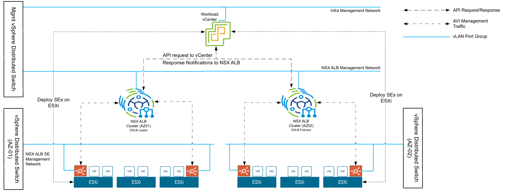

**Note**: Below are the minimum design recommendations that need to be considered, for the production setup.

| ID  | Design Recommendations  | Justification  | Implication   |
| :---- | :---- | :---- | :---- |
| NSXALB-CTRL-01  | In each site deploy NSX ALB controller cluster nodes on a dedicated vLAN backed network or on infra network under Management Cluster. | Isolate NSX ALB Controller traffic from other Tanzu Components  | None |
| NSXALB-CTRL-02  | At each site initial setup should be done only on one NSX Advanced Load Balancer Controller VM out of the three deployed to create an NSX Advanced Load Balancer Controller cluster.  | NSX Advanced Load Balancer Controller cluster is created from an initialized NSX Advanced Load Balancer Controller which becomes the cluster leader. Follower NSX Advanced Load Balancer Controller nodes need to be uninitialized to join the cluster.  | NSX Advanced Load Balancer Controller cluster creation will fail if more than one NSX Advanced Load Balancer Controller is initialized.  |
| NSXALB-CTRL-03  | At each fault domain in stretched Management Cluster, deploy 3 NSX ALB controller nodes  | To achieve high availability for the NSX ALB platform.  In clustered mode, NSX ALB availability is not impacted by an individual controller node failure. The failed node can be removed from the cluster and redeployed if recovery is not possible.  | Additional resource requirements  |
| NSXALB-CTRL-04  | Under Compute policies Create ‘VM-VM anti-affinity’ rule that prevents collocation of the NSX ALB Controllers VMs on the same host/fault domain. | vSphere will take care of placing the NSX Advanced Load Balancer Controller VMs in a way that always ensures maximum HA  | Affinity Rules need to be configured manually.  |
| NSXALB-CTRL-05  | Protect NSX Advanced Load Balancer Controller cluster nodes using vSphere High Availability  | Supports the availability objectives for the NSX Advanced Load Balancer Controller cluster without requiring manual intervention during an ESXi host failure event.  | None  |
| NSXALB-CTRL-06  | Size of each NSX ALB controller set to Extra-Large  | Provides support to scale up to 10000 Virtual Services and 400 Service Engines  | Additional resource requirements  **Note:** This is a generic recommendation, customize the resources based on your requirements |
| NSXALB-CTRL-07  | Use Static IPs for the NSX ALB controllers if DHCP cannot guarantee a permanent lease  | NSX ALB Controller cluster uses management IPs to form and maintain quorum for the control plane cluster. Any changes would be disruptive  | None  Recommended to proceed with static IP and required Name resolution  |
| NSXALB-CTRL-08  | Reserve an IP in the NSX ALB management subnet to be used as the Cluster IP for the Controller Cluster.  | NSX ALB portal is always accessible over Cluster IP regardless of a specific individual controller node failure.  | Additional IP is required    |
| NSXALB-CTRL-09  | Create a dedicated resource pool with appropriate reservations for NSX ALB controllers  | Guarantees the CPU and Memory allocation for NSX ALB Controllers and avoids performance degradation in case of resource contention  | None  |
| NSXALB-CTRL-10  | Replace default NSX ALB certificates with custom CA or Public CA-signed certificates with all below SAN entries  Mandatory:  NSX ALB Cluster FQDN  Optional  NSX ALB Cluster IP  Controller 1 IP and FQDN  Controller 2 IP and FQDN  Controller 3 IP and FQDN  | To establish a trusted connection with other infra components, and the default certificate doesn’t include SAN entries which is not acceptable by Tanzu   | None, SAN entries are not applicable if using wildcard certificate  |
| NSXALB-CTRL-11  | Use the internal NSX-ALB backup utility, schedule an automatic backup with appropriate frequency interval. | Backups are the primary means of a DR, as such it is required that these are taken regularly.   These timers can be adjusted based on specific RPO Requirements  | The maximum RPO of the AVI controller configuration is 1 day.  |
| NSXALB-CTRL-12  | Store minimum 4 backups locally on the controller.  | Meets the need to be able to restore from a local failure.    | Requires additional storage on the controllers  Note: The number of backups can be adjusted based on specific RPO requirements.. |
| NSXALB-CTRL-13  | Configure NSX ALB backup with a remote server as backup location  | Periodic backup of NSX ALB configuration database is recommended. The database defines all clouds, all virtual services, all users, and others.   As best practice store backups in an external location to provide backup capabilities in case of entire cluster failure  | The storage on the backup server is not monitored, and backups are not automatically rotated.  Monitoring of this is the responsibility of the operational team.  |
| NSXALB-CTRL-14  | Use the NSX ALB Controller to perform the life cycle management of the NSX ALB platform  | NSX ALB Controller performs patching, and upgrade of components as a single process  | The operations team must understand and be aware of the impact of a patching, and upgrade operations by using the NSX ALB Controller  |
| NSXALB-CTRL-15  | Specify external system(s) for the NSX ALB Controller to send events on Syslog.  | For operations teams to be able to centrally monitor NSX ALB and escalate alerts events must be sent from the NSX ALB Controller  | None  |
| NSXALB-CTRL-16  | Use LDAP/SAML based Authentication for NSX ALB  | LDAP integration allows to authenticate users against a centralized directory server, such as Microsoft Active Directory or OpenLDAP by enhancing security and scalability | Additional Configuration is required  |
| NSXALB-CTRL-17  | Configure the NSX ALB Controller to allow local logins.  | Allowing a local login provides for a failback in case of network or remote authentication issues.  | Local account must be stored securely and must be used only as a fallback option Password of the local account must be rotated regularly based on enterprise standards Local accounts are not specific to user identity and do not offer complete auditing from an endpoint back to the user identity. |
| NSXALB-CLOUD-01 | Create a local content library at each site in VI Workload Domain. | This content library will be used by NSX ALB controllers to push the SEs, which speeds up the process of deploying SEs based on requirement | Requires additional storage |
| NSXALB-CLOUD-02 | For each NSX ALB instance (AZ01 and AZ02), create a new cloud instance of type “VMware vCenter/vSphere ESX.”  | A vCenter Cloud must be configured in NSX ALB to discover VMs, data centers, networks, and hosts. It also facilitates the deployment, scaling (up or down), and lifecycle management of Service Engines (SEs). | NoneNote: In the proposed architecture, both NSX ALB instances point to a single vCenter. In environments with separate vCenters for each availability zone, each NSX ALB instance must map to its respective vCenter. |
| NSXALB-CLOUD-03 | Create an IPAM profile for each NSX ALB instance and associate it with the vCenter Cloud object.  | The IPAM profile is necessary to manage IP addresses for the TKG Control Plane/Application VIP Network. | The IPAM profile should manage only a single network, specifically the TKG Control Plane/Application VIP Network. Adding multiple networks to this profile may disrupt IaaS control plane load balancing services  |

{#nsx-alb-service-engine-groups-and-service-engines}
### NSX ALB Service Engine Groups and Service Engines  

Service Engines (SEs) in NSX ALB are organized within groups, which define their sizing, placement, and high availability configurations. Each cloud environment includes at least one SE group.

The options available within an SE group can vary depending on the type of cloud and its specific settings, such as access mode (e.g., no access or write access). SEs are exclusively associated with one group, with each group serving as an isolated domain. While SE resources within a group can be reallocated to accommodate virtual services, they are never shared across different SE groups.

NSX ALB Service Engines (SEs) are software entities deployed across bare metal servers, virtual machines, and containers. They deploy application services across various environments, including on-premises and colocation datacenters, as well as public clouds. Additionally, they gather data on application performance, security, and client interactions.

As distributed software, Service Engines support horizontal autoscaling within minutes, enabling them to act as service proxies for microservices.

{#nsx-alb-service-engine-high-availability}
#### NSX ALB Service Engine High Availability  

NSX ALB provides Service Engine (SE) redundancy within each SE group to ensure high availability. If an SE fails, the system automatically compensates by either spinning up a new SE or redistributing workloads, depending on the configured HA mode. SE high availability is managed at the SE group level, and NSX ALB supports the following HA models:

1. **Legacy HA**  
   1. This mode simulates a traditional **active/standby setup**, similar to hardware-based HA.  
   2. The active SE handles all traffic for assigned virtual services (VS), while the standby SE remains idle until a failure occurs.  
   3. Failover is quick, but this mode does not support scaling SEs horizontally.  
2. **Elastic HA**:   
   Elastic HA enables dynamic handling of virtual service failures with fast recovery. It supports two modes:  
   1. **Active/Active**  
      1. Virtual services are distributed across multiple SEs. The number of SEs for each service is determined by the **Minimum Scale per Virtual Service** parameter.  
      2. If an SE fails, the services continue running on other SEs with reduced capacity until a replacement SE is provisioned.  
      3. When the NSX ALB Orchestrator is in write-access mode, a new SE is automatically spun up, and the failed services are redeployed.  
   2. **N \+ M**  
      1. In this mode, virtual services are typically placed on a single SE, optimizing resource utilization. However, failover may take longer as services need to be reassigned.  
      2. N represents the minimum number of SEs required for all virtual services based on the Virtual Services per SE parameter. This number adjusts dynamically as services are added or removed.  
      3. M denotes the number of additional SEs allocated as a buffer to handle failures without reducing group capacity. The Buffer Service Engines parameter defines this value.  
      4. The buffer SE count represents the system’s tolerance for SE failures while maintaining service functionality. If a virtual service requires a higher minimum scale, adjust the buffer SE accordingly to maintain capacity.

The following are the minimum design recommendations for configuring NSX ALB Service Engines (SEs), which must be followed during their setup for both sites/availability zones.

| ID  | Design Recommendations  | Justification  | Implication   |
| :---- | :---- | :---- | :---- |
|  | Utilize the default Service Engine (SE) group. | As of the writing of this document, the IaaS control plane (version 8.0.3) only supports the use of the default Service Engine (SE) group. | All applications and the HA endpoints of the TKC clusters will share the same SE group for their data path. |
|  | NSX ALB Service Engine High Availability set to Active/Active | Isolate NSX ALB Controller traffic from other Tanzu Components  | Some features like ‘Preserve Client IP’ require legacy Active-Standby mode for bidirectional traffic. |
|  | Enable ALB Service Engine Self Elections | Enable SEs to elect a primary amongst themselves in the absence of connectivity to the NSX ALB controller | None |
|  | Enable 'Dedicated dispatcher CPU' on Service Engine Groups that contain the Service Engine VMs of 4 or more vCPUs. Note: This setting should be enabled on SE Groups that are servicing applications that have high network requirements. | This will enable a dedicated core for packet processing enabling high packet pipeline on the Service Engine VMs | None |
|  | Set 'Placement across the Service Engines' setting to ‘Distributed’. | This allows for maximum fault tolerance and even utilization of capacity. | Might require more SE VMs as compared to 'compact' placement mode. |
|  | Set the SE size to a minimum 2vCPU and 4GB of Memory | This configuration should meet the most generic use case | For services that require higher throughput, these configuration needs to be looked into and modified accordingly For more details refer [Service Engine Sizing documentation](https://techdocs.broadcom.com/us/en/vmware-security-load-balancing/avi-load-balancer/avi-load-balancer/22-1/vmware-avi-load-balancer-configuration-guide/se-advanced-networking/sizing-service-engines.html)  |
|  | Reserve Memory and CPU for Service Engines | The Service Engines are a critical infrastructure component providing load-balancing services to mission-critical applications.  Guarantees the CPU and Memory allocation for SE VM and avoids performance degradation in case of resource  contention | Resources are locked even when the SEs are underutilised |
|  | The minimum number of active Service Engines for the Virtual Service is set to 2 | Ensures that any Virtual Service is active on at least 2 Service Engines, which improves SLA in case of individual Service Engine failure | None |
|  | NSX ALB Service engines placed in respective VI Workload domain/clusters | NSX ALB Service engines provide Load Balancing services for tenant workloads and applications. Placing NSX ALB SEs in the same workload domains as tenant applications ensures optimal performance by reducing latency and improving data locality | NSX ALB Service Engine (SE) components must be accounted for when sizing the workload clusters  |

{#nsx-alb-gslb}
### NSX ALB GSLB  

Global server load balancing (GSLB) is the act of balancing an application’s load across instances of the application that have been deployed to multiple locations (typically, multiple data centers and/or public clouds). Application load at any one of those locations is usually managed by a “local” load balancer, which could be NSX ALB or a third-party ADC solution.

An NSX ALB Site can be configured as a Leader or a Follower, as mentioned in the previous section under “NSX ALB Controller and Cloud Design” for the purpose of this document the NSX ALB instance in the AZ01 Fault Domain is selected as the GSLB leader, while the NSX ALB instance in the AZ02 Fault Domain serves as the follower. However, the roles of leader and follower can be reversed based on your specific requirements.

* The NSX ALB site on which the administrator first defines a GSLB configuration is automatically designated as the GSLB leader. Exactly one active site is statically designated as the GSLB leader.  
* The other active site/s subsequently added are GSLB followers. The GSLB configuration is propagated to them from the leader.

**Key Points:** 

* Before configuring the GSLB deployment, identify the GSLB subdomain. The GSLB subdomain is a part of your domain for which NSX Advanced Load Balancer will be authoritative. Each of the GSLB subdomains is a subdomain for which a delegation is configured on the corporate DNS server so that NSX Advanced Load Balancer DNS servers are authoritative for that particular subdomain.  
* The domain configured here will be utilized in the Tanzu Platform Domain configuration. One of the components in the TP-SM (UCP) will automatically configure the necessary GSLB services when a developer deploys an application on k8s cluster (Space) managed by the Tanzu Platform.  
  more details on UCP and Space are covered in the Tanzu Platform \- Self Managed Section in this document.

**Key functions of NSX ALB GSLB**:

* Definition and ongoing synchronization/maintenance of the GSLB configuration \- responsibility of NSX ALB Controller   
* Monitoring the health of configuration components \- responsibility shared by NSX ALB Controllers and Service Engines  
* Optimizing application service for clients by providing GSLB DNS responses to their FQDN requests based on the GSLb algorithm configured \- responsibility of NSX ALB GSLB DNS Virtual Service running in one or more Service Engines  
* Processing of application requests \- responsibility of services placed on NSX ALB SEs

**Minimum design recommendations for configuring NSX ALB**

| ID  | Design Recommendations  | Justification  | Implication   |
| :---- | :---- | :---- | :---- |
|  | Create a separate SE Group for hosting the GSLB DNS virtual servers at each site | This approach offers flexibility for platform engineers to size the SEs according to specific requirements, as the SEs for applications have distinct sizing and HA/scale needs. | Additional licenses and resources needed for the service cores consumed GSLB SE VMs. |
|  | Enable Health Monitor(HM) Sharding | Optimize health monitor scalability/performance using health monitor sharding across multiple GSLB DNS VS SE’s Optimize resource utilization in large GSLB deployments. | None |
|  | Enable GSLB persistence | Applications needing site persistence for long lived connections. | Without persistence, the application sessions could break, having an impact on end users |
|  | Enable DNS policies and rate limits. | DNS policies and rate limits to secure GSLB DNS infrastructure Mitigate DNS based attacks on GSLB DNS infrastructure. | None |

### interrupt 

{#tanzu-platform-self-managed}
## Tanzu Platform Self-Managed  

The Tanzu Platform enables the building and deployment of applications by providing pipelines to streamline app deployment into production on the runtime of your choice:

* **Tanzu Platform for Cloud Foundry**: Tanzu Platform for Cloud Foundry allows platform engineers to build public and private clouds with VMware’s implementation of the Cloud Foundry open source project. App developers and operators develop, deploy, and manage apps on those clouds. You can attach your Cloud Foundry environment to Tanzu Platform, and monitor its infrastructure and running applications from the Tanzu Platform UI.  
* **Tanzu Platform for Kubernetes**: Tanzu Platform for Kubernetes is the Kubernetes runtime for Tanzu Platform, exposed by the Tanzu Platform UI and the Tanzu CLI. It helps platform engineers to build conformant and replicable Kubernetes environments, and DevOps engineers to push applications into production, both in the Tanzu Platform UI and with the Tanzu CLI.

As this document focuses on leveraging the IaaS control plane provided by the VMware Cloud Foundation (VCF) infrastructure, the primary emphasis will be on design considerations for **Tanzu Platform’s Kubernetes Runtime**.

{#tanzu-platform---component-architecture}
### Tanzu Platform \- Component Architecture  

Tanzu platform consists of several components which enables platform engineers to build conformant and scalable Kubernetes environments while empowering DevOps teams to streamline application deployment using the Tanzu CLI and UI. 

After deploying the control plane, any conformant Kubernetes clusters can be attached to the platform for managing applications. Examples of compatible Kubernetes clusters include Tanzu Kubernetes Clusters, TKGi Clusters, AKS, and EKS.

For the Tanzu Platform to function effectively, integration with identity providers (IDPs) is essential, such as OIDC endpoints, LDAP, or Active Directory over LDAP. Additionally, integration with an OCI Image Registry is required to facilitate seamless pushing and pulling of container images and application builds.

Below is a highly simplified component architecture of Tanzu Platform

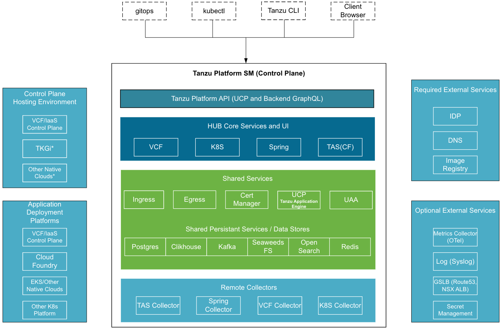

An optional but significant component is the Global Server Load Balancer (GSLB). The platform supports integration with NSX ALB GSLB. Alternatively, a custom DNS provider can be used, requiring manual configuration of GSLB and related DNS entries.

{#overview-of-tanzu-platform-for-kubernetes}
### Overview of Tanzu Platform for Kubernetes  

The diagram below provides a concise overview of how Platform Engineers and Developers can leverage the Tanzu Platform. Further details about App Engine, Space, and other components are covered in the subsequent sections.

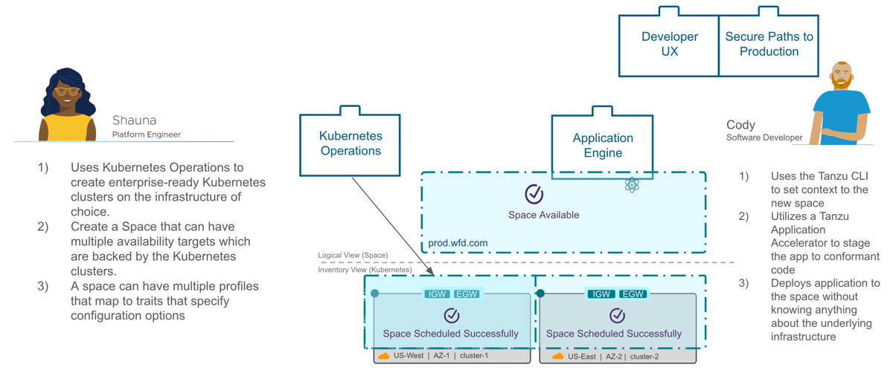

**Key Benefits for Platform Engineers**

* Automates the management of Kubernetes clusters and associated infrastructure, including certificate handling, ingress, API gateways, service mesh, and policy enforcement.  
* Simplifies and secures container infrastructure management with automation and insights across private clouds.  
* Facilitates seamless infrastructure updates without disrupting application developers or running workloads.  
* Supports the implementation of DevSecOps practices for faster, secure, and reliable application delivery.

**Key Benefits for Application Developers**

* Enhances the deployment experience with templated production paths that follow best practices.  
* Abstracts Kubernetes complexities, offering a self-service API tailored to developers, increasing productivity and speed.  
* Automates infrastructure setup, framework assembly, and application component preparation for seamless deployment to Kubernetes-based private clouds.

Tanzu Platform for Kubernetes is accessible via the Tanzu Platform UI, offering centralized management and visibility into infrastructure resources. Powered by a graph-based datastore, the platform ensures responsive application delivery and efficient private cloud management. For more details refer [About VMware Tanzu Platform](https://techdocs.broadcom.com/us/en/vmware-tanzu/platform/tanzu-platform/10-0/tnz-platform/index.html)

Once the IaaS Control Plane is configured, three distinct types of Tanzu Kubernetes Clusters are required. These clusters can reside within the same Supervisor Namespace or in separate Namespaces, depending on specific business requirements and use cases.

**Tanzu Platform Self-Managed Control Plane Cluster:**   
This cluster hosts key Tanzu Platform Control Plane components, enabling platform engineers to create scalable and conformant Kubernetes environments. It also empowers DevOps teams to efficiently deploy applications using the Tanzu CLI and UI.

**Tanzu Platform Build Cluster:**  
The Tanzu Platform allows developers to build containerized applications on dedicated Tanzu Kubernetes Build Clusters. These Build Clusters utilize the “Tanzu Build Controller” capability, which, when installed on a Tanzu Kubernetes Cluster (TKC), enables it to function as a Build Cluster.

**Tanzu Run Cluster:**  
The Tanzu Platform also supports the deployment of containerized applications on dedicated Tanzu Kubernetes Run Clusters. These Run Clusters leverage the “ContainerApp” capability, which, when installed on a TKC, enables it to operate as a Run Cluster.

For more details, refer to the section “General Recommendations on Configuring Spaces,” which provides additional insights into leveraging Build and Run Clusters effectively.

{#tanzu-platform-self-managed-deployment-guidelines}
### Tanzu Platform Self Managed Deployment Guidelines  

This section provides a high-level overview on the Tanzu Platform Self-Managed Installation Flavors, profiles and Sizing of K8s Clusters

{#tp-sm-control-plane-installation-flavor}
#### TP-SM Control Plane Installation Flavor  

The installation flavor defines which services and capabilities are available in the deployment. This allows you to tailor the installation for your needs. For the 10.x release, the following flavors are available: 

* **essentials**: This flavor installs Tanzu Platform, including features to support VMware Cloud Foundation inventory, Tanzu Platform for Cloud Foundry multi-foundation view, Tanzu Spring and Tanzu Salt.   
* **full**: This flavor installs Tanzu Platform with the essentials features, and additionally enables features to support Kubernetes operations, Spaces, and build services. This is the default mode for installation.

{#tp-sm-control-plane-installation-profile}
#### TP-SM Control Plane Installation Profile  

Installation profile defines the resources required to deploy Tanzu Platform Self-Managed, which is correlated to how many resources you will be managing. It is possible to change profile later, if you need to expand your deployment. Select a profile that meets your current requirements and change profiles later as your requirements change.

For this release, you can choose from the following profiles:

* **evaluation**  
  The evaluation profile has a minimal resource footprint, and can be used for demonstration and evaluation. It is not supported for production use. This profile allows you to create 2 projects with up to 10 application instances, and manage up to 20 Kubernetes clusters.  
* **foundation**  
  The foundation profile is a minimal production deployment, and intended for small environments or for customers who wish to gradually adopt Tanzu Platform and expand as needed. This profile allows you to create 4 projects with thousands of application instances, and manage up to 100 clusters.  
* **regular**  
  The regular profile corresponds to most customer environments. Most deployments use this profile because it provides a good balance between supported resources and hardware requirements. This profile allows you to create 6 projects with thousands of application instances, and manage up to 500 clusters.  
* **enterprise**  
  The enterprise profile is suitable for customers who require support for thousands of applications and resources. Select this profile initially only if you expect to support more resources than the regular profile. This profile allows you to create 6 projects with thousands of application instances, and manage up to 1000 clusters.

{#tanzu-kubernetes-cluster-sizing-requirements-for-tp-sm-control-plane}
#### Tanzu Kubernetes Cluster Sizing Requirements for TP-SM Control Plane  

A TP-SM implementation is sized based on operational and scalability needs. The following table shows the specific resource requirements and load limits of the available installation profiles.

| Installation Profile  | Usage Limits | Resource Requirements |
| :---- | :---- | :---- |
| evaluation | Ingest: 20 RPSQuery: 2 QPSConcurrent assessments: 2Application instances: 10Resource dimension: 2 projects, 2 spaces, 20 clusters (Run \+ Build) | **Control plane**Nodes: 3vCPUs per node: 4Memory per node: 16GBStorage per node: 20GB **Workers**Nodes: 3vCPUs per node: 8Memory per node: 32 GBStorage per node: 40 GB |
| foundation | Ingest: 100 RPSQuery: 20 QPSConcurrent assessments: 50Application instances: 5000Resource dimension: 4 projects, 10 spaces, 100 clusters (Run \+ Build) | **Control plane**Nodes: 3vCPUs per node: 4Memory per node: 16GBStorage per node: 20GB **Workers**Nodes: 9vCPUs per node: 8Memory per node: 32 GBStorage per node: 40 GB |
| regular | Ingest: 200 RPSQuery: 50 QPSConcurrent assessments: 100Application instances: 15000Resource dimension: 6 projects, 20 spaces, 500 clusters (Run \+ Build) | **Control plane**Nodes: 3vCPUs per node: 4Memory per node: 16GBStorage per node: 20GB **Workers**Nodes: 10vCPUs per node: 12Memory per node: 48 GBStorage per node: 40 GB |
| enterprise | Ingest: 500 RPSQuery: 100 QPSConcurrent assessments: 200Application instances: 30000Resource dimension: 6 projects, 30 spaces, 1000 clusters (Run \+ Build) | **Control plane**Nodes: 3vCPUs per node: 4Memory per node: 16GBStorage per node: 20GB **Workers**Nodes: 11vCPUs per node: 16Memory per node: 64 GBStorage per node: 40 GB |

The sizing recommendations for Build and Run clusters are determined by the number of concurrent builds and the applications deployed on the respective target clusters.

\*\*For Build Cluster we need to get some inputs from Engineering\*\*

{#design-recommendations-for-tp-sm-on-vsphere-iaas-control-plane}
### Design Recommendations for TP-SM on vSphere IaaS Control Plane  

| ID  | Design Recommendations  | Justification  | Implication   |
| :---- | :---- | :---- | :---- |
| DD-TPSM-CP-01 | Create a dedicated Supervisor Namespace (e.g., *Admin Namespace*) to host a Tanzu Kubernetes Cluster (TKC) for deploying the TP-SM Control Plane Components. | A dedicated Supervisor namespace simplifies the management and allocation of underlying compute and storage resources. Access controls can be enforced at the Supervisor namespace level, restricting unauthorized users from accessing the namespace and the associated TKC(s). | None Optionally, the same namespace can be used to host Build Clusters, see DD-TPSM-BLD-01 |
| DD-TPSM-CP-02 | Assign a dedicated network or port group (Workload Network) to the Admin Supervisor Namespace | Using a dedicated network or port group allows for the configuration of customized firewall rules and security policies, ensuring enhanced security and isolation. | Requires Additional Network |
| DD-TPSM-CP-03 | Create a custom VM Class with the required vCPU and memory specifications based on the selected installation profile for TP-SM Control Plane, and map it to the Admin Supervisor Namespace. | The out-of-the-box (OOB) VM Classes may not meet the node size requirements specified for the chosen Tanzu Platform profiles.  | None |
| DD-TPSM-CP-04 | Deploy Cert-Manager on the TKC where the TP-SM components will be hosted. | Cert-Manager is a critical prerequisite for deploying TP-SM components as it handles certificate management for internal components, ensuring secure communication and operation. | Cert Manager must be [manually deployed](https://docs.vmware.com/en/VMware-vSphere/8.0/vsphere-with-tanzu-tkg/GUID-8355712F-A1DA-47C0-A023-E2EEF6191D93.html) |
| DD-TPSM-BLD-01 | One or more Supervisor Namespace to host Tanzu Build Clusters | This approach streamlines the management of build clusters. It enables simplified handling of underlying compute and storage resources for a single or a group of build clusters. Access controls can be applied at the Supervisor Namespace level, ensuring that unauthorized users cannot access the namespace and its associated Tanzu Kubernetes Clusters (TKC). Platform engineers gain better visibility into build cluster usage, allowing them to scale the clusters horizontally or vertically based on demand. | None |
| DD-TPSM-BLD-02 | Deploy build clusters at both sites/zones. | Having build clusters deployed across multiple sites enhances resiliency, ensuring continuity during disasters or planned maintenance activities. | None |
| DD-TPSM-RUN-01 | One or more Supervisor Namespace to host Tanzu Run Clusters | Depending on the business requirement, platform admin can choose to deploy one or more Supervisor Namespaces to host Tanzu Run Clusters. | None |
| DD-TPSM-RUN-02 | Deploy Run clusters at both sites/zones. | Having Run clusters deployed and configured across multiple sites enhances resiliency for the applications deployed by the developers, ensuring continuity during disasters or planned maintenance activities. | NSX ALB provides GSLB services for these applications. GSLB records are automatically created by UCP For more details refer to the “General Recommendations on Configuring Spaces” section in this document |
|  | Install the [Local Consumption Interface](https://vsphere-tmm.github.io/Supervisor-Services/) (LCI) supervisor plugin for the vSphere IaaS Control Plane. | Provides the Local Consumption Interface (LCI) for managing Namespaces within vSphere Client UI and provides SSO authentication for [Cloud Consumption Interface (CCI)](https://docs.vmware.com/en/VMware-Aria-Automation/8.17/Using-Automation-Service-Broker/GUID-03D4F41F-D4A6-4350-91AE-F7A40FDC3C7D.html) in Aria Automation within VMware Cloud Foundation. |  |

{#control-plane-and-tanzu-application-engine}
### Control Plane and Tanzu Application Engine  

The Tanzu Platform Control Plane, serves as a foundational framework rather than an end-user functional component. It offers a Kubernetes Resource Model (KRM) API but is not limited to Kubernetes, as it can also operate on Cloud Foundry (CF). 

Tanzu Application Engine/UCP which builds on top of the Control plane provides a *syncer* component that can be implemented on any platform, enabling broad compatibility. While it does not offer direct end-user features, it delivers essential capabilities such as an API surface, a reconciliation engine, and integration with Tanzu Platform's authorization and tenancy mechanisms.

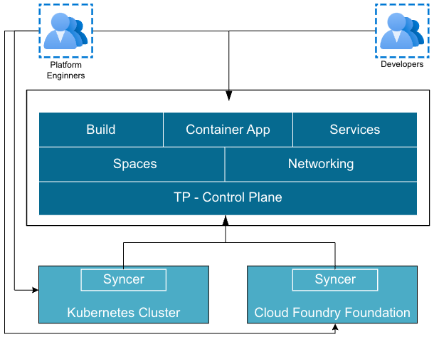

**Spaces**   
Spaces serve as an API interface for Application Developers while allowing Platform Engineers and Operator roles to contribute to an application-aware environment. Each Space acts as a logical abstraction where Application Developers can deploy workloads aligned with the Space's configuration.   
A Space is created by composing Profiles, into which Traits and Capabilities are curated by domain experts. For example, a Network Operator may define an Ingress Gateway Trait as part of a Space's configuration. General Recommendations on Configuring Spaces is provided in the **below section**, and for more information refer to the [official documentation](https://techdocs.broadcom.com/us/en/vmware-tanzu/platform/tanzu-platform/10-0/tnz-platform/spaces-concepts-about-spaces.html).

**Build**  
The Tanzu Platform allows developers to build container applications locally or on the server, targeting Kubernetes or Cloud Foundry. Using the *tanzu build* command, developers can leverage curated configurations retrieved from the Tanzu Control Plane. Local builds utilize the Docker Daemon on the user’s computer and primarily rely on buildpacks. Remote builds, on the other hand, are executed transparently through the Tanzu Platform, abstracting the complexity from users and ensuring a seamless experience.  
For more details on how to build and bind Container apps, refer to the [official documentation](https://techdocs.broadcom.com/us/en/vmware-tanzu/platform/tanzu-platform/10-0/tnz-platform/spaces-how-to-build-bind-deploy-index.html)

**​​Container Apps**  
A ContainerApp is a core interface representing an application within the Tanzu Platform. The ContainerApp API forms the backbone of all CLI and UI interactions with applications, enabling a clear separation of concerns. For more details, refer to the official documentation on [Container Apps](https://techdocs.broadcom.com/us/en/vmware-tanzu/platform/tanzu-platform/10-0/tnz-platform/spaces-concepts-about-containerapps.html).

**Services and Service Binding**  
Tanzu Platform for Kubernetes connects applications to various data services, such as databases, messaging systems, and caching services, through services and service bindings. These services can either be pre-provisioned or dynamically provisioned, depending on the use case:

* **Pre-Provisioned Services:**  
  Pre-provisioned services are typically used for production environments. These services are curated and managed externally, off-platform, and then attached to your Space within the Tanzu Platform.  
* **Dynamically Provisioned Services:**  
  Dynamically provisioned services are tailored for development environments. The Tanzu Platform for Kubernetes supports a variety of development services, including MySQL, PostgreSQL, RabbitMQ, and Redis, which are backed by Bitnami Helm charts.

For more details, refer to the official documentation on [Services and Service Binding](https://techdocs.broadcom.com/us/en/vmware-tanzu/platform/tanzu-platform/10-0/tnz-platform/spaces-concepts-about-services.html)

**Networking:**   
Tanzu Platform enables you to configure network ingress to your applications so that the interactions between the teams involved are frictionless and follow best practices. The components of application ingress on Tanzu Platform for Kubernetes are: 

* **Domains**: The DNS record through which applications are accessed.   
* **Routes**: Connects traffic in the Space to the application or service.   
* **Domain bindings**: Connects between a Space and a domain.

For more details, refer to the official documentation on [Network Ingress](https://techdocs.broadcom.com/us/en/vmware-tanzu/platform/tanzu-platform/10-0/tnz-platform/spaces-concepts-about-ingress.html)

{#general-recommendations-on-configuring-spaces(in-progress)}
### General Recommendations on Configuring Spaces (In Progress)  

Before diving into specific recommendations for configuring spaces, it is crucial to first understand fundamental components such as **Projects**, **Cluster** **Groups**, **Availability** **Targets**, **Profiles**, **Capabilities**, and **Traits**. These elements are key to managing Kubernetes clusters efficiently and providing a resilient platform for developers to host their applications. Proper alignment of these components enables platform engineers to enhance the stability, scalability, and usability of the Tanzu Platform.

**Project**

In the Tanzu Platform for Kubernetes, resources are organized within a project, which serves as a logical grouping for  Tanzu Platform for Tanzu Platform for Kubernetes resources. Before creating any resources, it is necessary to first create a project. 

A project streamlines the management of packages, configurations, and role-based access controls (RBAC) for all clusters in a cluster group, eliminating the need to manage each cluster individually. Creating a project requires either Organization Admin or Organization Owner roles.

**Cluster Groups**

Cluster groups on the Tanzu Platform provide a way to logically group Kubernetes clusters, enabling platform engineers to apply configurations consistently across all clusters within a group. 

Each project created in the Tanzu Platform includes one or more Run and Build cluster groups with the necessary Capabilities applied to support application environments.

**Availability Targets**

Availability Targets are groupings of clusters that define where applications are scheduled. With Availability Targets, platform teams can abstract sets of clusters into logical groups that provide compute capacity without requiring their developers to know exactly which cluster their workload cluster is running on.

Availability Targets ensure that a Namespace is provisioned across multiple fault-domains resulting in greater availability in the face of failure.  They are a coarse-grained selector that describes a collection of clusters that all exist within a given fault-domain.  Availability Targets aren’t prescriptive (they’re based on metadata labels), but are generally used to select Clusters within a given region or availability zone.  The goal is to identify discrete, disjoint collections of clusters so that if a failure happens (e.g. a power cut or network failure) the contents of the Space are running in another fault-domain that is unaffected.  It is unlikely that all the Clusters within an Availability Target can meet the requirements for a given Space (required Capabilities, requested resources), but at least one must in order for a Space to be scheduled within that Target. An Availability Target is not intended to deliver horizontal scale, but that may occur as a side-effect of the fault-tolerance.

{#rbac-in-tanzu-platform-self-managed}
### RBAC in Tanzu Platform Self-Managed  

Tanzu Platform provides configurable Identity Provider (IdP) integration for user authentication. Authenticated users can log in to the Tanzu Platform, but they cannot view data or perform any actions until assigned a role by an administrator.

**Built-in Admin Role**  
During the deployment of the TP-SM Control Plane, a built-in Super Admin user, **tanzu\_platform\_admin**, is automatically created. The password for this user is specified in the deployment configuration file. 

Initially, Platform Engineers use this account to log in to the platform. From there, they can add additional users or user groups and assign them the necessary roles and scopes as required.

**Role Binding**  
A role binding is the association of a user or group with a specific role and scope. The scope determines the area where the assigned role is applicable, such as a Project, Space, or other hierarchical levels.

Users with administrative privileges in a given scope can create, update, or delete role bindings within that scope or any of its sub-scopes. For example, an administrator at the Project level can manage role bindings for that Project and its sub-scopes, such as Application Spaces, Cluster Groups, and Clusters.

**Supported Identities in Role Bindings**

* **User ID:**  
  The email address of a user present in the IdP. After the user logs in for the first time, their first and last names are stored in Tanzu Platform and displayed in the role binding UI. If the user has not logged in, only the User ID will be visible.  
* **Group Name:**  
  Represents a group defined in the IdP. When a role binding is created for a group, all users mapped to that group in the IdP inherit the assigned role and scope. This eliminates the need to create individual role bindings for each user. Member users can view the group role binding.

**Supported Scope Types in Role Bindings**  
Role bindings can be defined for the following scope types:

* Global  
* Project  
* Cloud Foundry Foundation  
* Cloud Foundry Org  
* Cloud Foundry Space  
* Kubernetes Cluster Group  
* Kubernetes Cluster  
* Application Space

For more details on the above mentioned scope, see [RBAC reference](https://techdocs.broadcom.com/us/en/vmware-tanzu/platform/tanzu-platform/10-0/tnz-platform/users-projects-reference-index.html). To create and configure Role Bindings and Scope, see [Configure role-based access control](https://techdocs.broadcom.com/us/en/vmware-tanzu/platform/tanzu-platform/10-0/tnz-platform/users-projects-configure-rbac.html)

Certificates and Trusts

&nbsp; 
