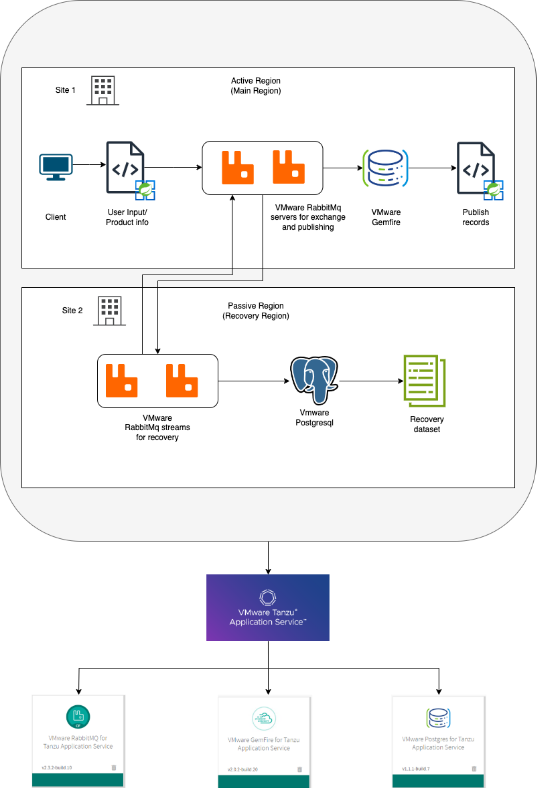
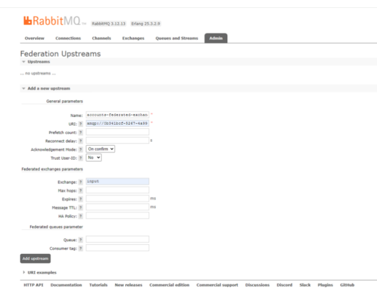
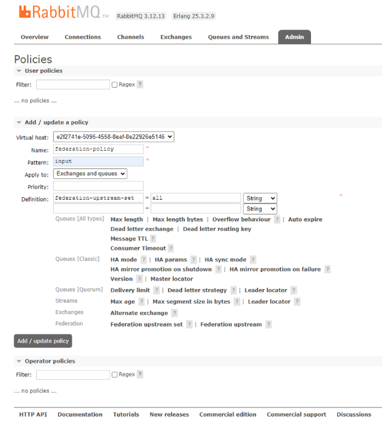
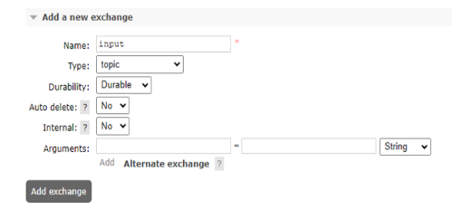
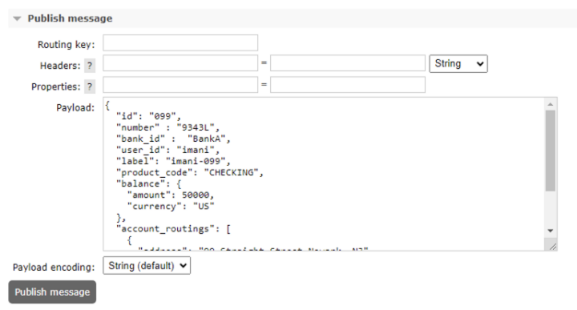
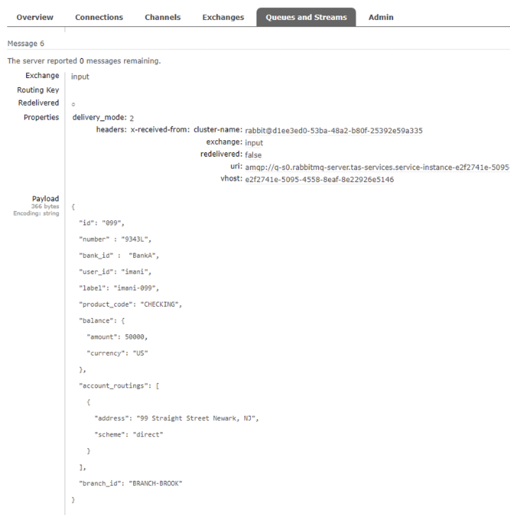

# Deploy Multi-site Spring application using Tanzu Data on TAS


## Overview

A multi-site application operates seamlessly across multiple locations, ensuring centralised management, consistency, and scalability. One of the critical aspects of multi-site applications is their robust data replication and restore capabilities, which are essential for minimising downtime and maintaining operations continuity.

In critical scenarios like banking, retail chains, healthcare networks, and government agencies, multi-site applications equipped with Tanzu Data can be widely used to restore data in case of system failures and disruptions quickly. It ensures efficient operations and robust data recovery mechanisms to prevent production delays. It helps in replicating and restoring data in case of network outages and rapid recovery to maintain public services. 

The use case covered in this document demonstrates syncing big account information between two sites by enabling communication using VMware Tanzu Data Services. This solution workbook using Tanzu Data Services like Tanzu RabbitMQ. Tanzu Gemfire and Tanzu Postgres and Tanzu Application Service.


## Supported Component Matrix

The validated Bill of Materials to install Tanzu Data Services in multi-sute environments.

|**Software Components** |**Version** |
| --- | --- |
|Tanzu Application Service (TAS)|v2.11.45|
|VMware RabbitMQ|v2.3.3-build.5|
|VMware Gemfire|v2.0.3-build.4|
|VMware Postgres|v1.1.2-build.6|


**Prequisities** Two regions/sites (active and passive)

Note: The scope of this document is limited to configuring replication between active and passive site using Tanzu Data Services.

**Region 1 (Active Region)**

- Region 1 is the cloud-native Spring application.
- It is the main region where the applications and services exist and event streaming across various Tanzu Data Services happens.
- It performs operations like creating bank accounts and generating account IDs. It also lists all the accounts opened in a particular bank using the bank ID.
- The application receives User/bank details, sends them to RabbitMQ servers for exchange and publishes them to Tanzu Gemfire for cache management.

**Region 2 (Passive Region)**

- Region 2 is the .NET Steeltoe application.
- The passive region replicates the active region and is mainly used for achieving resiliency and data restoration.
- RabbitMQ Servers (maintain stream of data in region 1), maintain global records for backup and recovery using Postgres.

## Tanzu Data Services
Tanzu Data Services provides robust disaster recovery (DR) solutions through several key features:

1. **Automated Backups and Recovery**:
   Tanzu Data Services automate the backup processes, ensuring that data is regularly and consistently backed up. This reduces the risk of data loss and ensures that a recent copy of data is always available for recovery.

1. **Replication**:
   Data is often replicated across multiple geographic locations. This geographic redundancy ensures that even if one location experiences a failure or disaster, the data is still available from another location.

1. **High Availability (HA)**:
   Tanzu Data Services are built with high availability in mind. This includes features like automatic failover, where the system can switch to a backup instance if the primary instance fails.

By incorporating these features, Tanzu Data Services offer a comprehensive and reliable disaster recovery solution that enhances overall efficiency and service quality for organizations across various sectors.

## Tanzu RabbitMQ

VMware RabbitMQ will be there in both Region 1 and Region 2. It can move, exchange and publish data between multiple regions to ensure data is seamlessly replicated for data recovery, ensuring no data loss even in case of any failovers.

## Tanzu Gemfire
Tanzu Gemfire is significant for achieving low-latency in-memory data access.

## Tanzu Postgress
VMware Postgres establishes dedicated instances of Postgres databases and supports distributed high-availability (HA) systems.

## Tanzu Application Service

Deploying a multisite application integrated with VMware Tanzu Data on Tanzu Application Service (TAS) ensures high availability and effective disaster recovery for applications through several key features ensuring business continuity, and reliable service with robust disaster recovery capabilities.

## Architecture

 

## Deploy the multi-site Spring and .NET application using Tanzu Data Services on TAS


1. Install the **Tanzu Data tiles** on TAS. We will install **Tanzu RabbitMQ, Tanzu Gemfire** and **Taznu Postgres**.

2. Create services for **Tanzu RabbitMQ**, **Tanzu Gemfire** and **Tanzu Postgres** and validate service status.

<!-- /* cSpell:disable */ -->

```yaml
cf create-service postgres on-demand-postgres-db bank-postgres

cf create-service p-cloudcache extra-small bank-gemfire

cf create-service p.rabbitmq on-demand-plan bank-rabbit

cf create-service p.rabbitmq on-demand-plan bank-rabbit-site2

```
<!-- /* cSpell:enable */ -->

3. **Gemfire*8 Configuration

(a) Set the settings.xml file for Gemfire,

<!-- /* cSpell:disable */ -->

```yaml

<settings>
  <servers>
    <server>
      <id>gemfire-release-repo</id>
      <username>your-username</username>
      <password>your-password</password>
    </server>
    <server>
      <id>gemfire-repository</id>
      <username>your-username</username>
      <password>your-password</password>
    </server>
    <server>
      <id>gitlab-maven</id>
      <username>your-username</username>
      <password>your-password</password>
      <configuration>
        <authenticationInfo>
          <userName>your-username</userName>
          <password>your-password</password>
        </authenticationInfo>
      </configuration>
    </server>
  </servers>
</settings>

```
<!-- /* cSpell:enable */ -->


(b) Create the service key and get service account details

<!-- /* cSpell:disable */ -->

```yaml

// create service key with name 'bank-gemfire-key'

cf create-service-key bank-gemfire bank-gemfire-key

// get service account details

cf service-key bank-gemfire bank-gemfire-key

```
<!-- /* cSpell:enable */ -->


(c) Connect to the cluster by running the below command in the gfsh terminal. Provide the username and password from the service account details.

<!-- /* cSpell:disable */ -->

```yaml

// use the values received from the service account details

connect --url=<url-value> --user=<username> --password=<password> --skip-ssl-validation

```
<!-- /* cSpell:enable */ -->

(d) Create a region for Gemfire using gfsh terminal

<!-- /* cSpell:enable */ -->
```yaml

create region --name=BankAccount --type=PARTITION
```
<!-- /* cSpell:enable */ -->

4. Deploy **TAS (Java Application)** on Site 1

(a)) Generate jar files for the Java application.
<!-- /* cSpell:enable */ -->
```yaml
mvn package

```
<!-- /* cSpell:enable */ -->

This command compiles the code, runs tests, and packages the compiled code into a distributable format, such as a JAR (Java ARchive) located in the ‘target’ directory of the project.

(b) Write manifest files for the required Java applications.

Manifest for bank-account-api-service (bank-account-api-service-manifest.yaml)

<!-- /* cSpell:enable */ -->
```yaml
applications:
  - name: bank-account-api-service
    memory: 1G
    random-route: true
    log-rate-limit-per-second: -1
    env:
      JBP_CONFIG_OPEN_JDK_JRE: '{ jre: { version: 17.+}}'
      SPRING_PROFILES_ACTIVE: 'gemfire'
      spring.data.gemfire.security.username: <username>
      spring.data.gemfire.security.password: <password>
      spring.data.gemfire.pool.default.locators: <locators-value>


```
<!-- /* cSpell:enable */ -->

Manifest for bank-account-sink (bank-account-sink-manifest.yaml) 

<!-- /* cSpell:enable */ -->
```yaml

applications:
  - name: bank-account-sink
    memory: 1G
    random-route: true
    log-rate-limit-per-second: -1
    services:
      - bank-gemfire
      - bank-rabbit
    env:
      JBP_CONFIG_OPEN_JDK_JRE: '{ jre: { version: 17.+}}'
      SPRING_PROFILES_ACTIVE: 'gemfire'

```
<!-- /* cSpell:enable */ -->

(c) Do cf push for region 1 application: bank-account-api-service and bank-account-sink.

<!-- /* cSpell:enable */ -->
```yaml
// perform cf push by providing the manifests and jar files of the respective application

// bank-account-api-service

cf push bank-account-api-service -f bank-account-api-service-manifest.yaml -p bank-account-api-service-0.0.1-SNAPSHOT.jar

// bank-account-sink

cf push bank-account-sink -f bank-account-sink-manifest.yaml -p bank-account-sink-0.0.2-SNAPSHOT.jar

```
<!-- /* cSpell:enable */ -->

(d) Validate the status of deployed apps.
<!-- /* cSpell:enable */ -->
```yaml
// it will reflect the names and status of the pushed apps

cf apps
```
<!-- /* cSpell:enable */ -->

5. Deploy **TAS (.NET and Steeltoe Application)** on Site 2

(a) Dotnet publish
<!-- /* cSpell:enable */ -->
```yaml
// cd into the folder where the .NET application is present

// run the dotnet publish command

dotnet publish -r linux-x64 -f net6.0

```
<!-- /* cSpell:enable */ -->

Prepares the application for deployment by compiling the code and copying all necessary files (assemblies, dependencies, configuration files) to a publish folder. The output file is a directory containing the executable and all required files to run the application on the system. 

(b) Write the manifest files for the required .NET applications.

Manifest for global-accounts-service-api (manifest.yaml)

<!-- /* cSpell:enable */ -->
```yaml
applications:
  - name: global-accounts-service-api
    memory: 1G
    random-route: true
    log-rate-limit-per-second: -1
    services:
      - bank-postgres

```
<!-- /* cSpell:enable */ -->

Manifest for global-accounts-streaming-consumer (manifest.yaml)

<!-- /* cSpell:enable */ -->
```yaml

applications:
  - name: global-accounts-streaming-consumer
    memory: 1G
    random-route: true
    log-rate-limit-per-second: -1
    services:
      - bank-postgres
      - bank-rabbit

```
<!-- /* cSpell:enable */ -->

(c) Do cf push for region 2 application: global-accounts-service-api and global-accounts-streaming-consumer

<!-- /* cSpell:enable */ -->
```yaml

// perform cf push by providing the buildpack and dotnet publish files of the respective application

// global-accounts-service-api

cf push global-accounts-service-api -p bin/Debug/net6.0/linux-x64/publish/ -b dotnet\_core\_buildpack

// global-accounts-streaming-consumer

cf push global-accounts-service-api -p bin/Debug/net6.0/linux-x64/publish/ -b dotnet\_core\_buildpack

```
<!-- /* cSpell:enable */ -->

(d) Validate the status of deployed apps.

<!-- /* cSpell:enable */ -->
```yaml
// it will reflect the names and status of the pushed apps

cf apps

```
<!-- /* cSpell:enable */ -->

## Add Tanzu Postgres connection string for the application

When the Postgres service is bound to the application, the **VCAP_APPLICATION** and **VCAP_SERVICES** variables become available in the container environment.

The application developer can use the following environment variables from **VCAP_SERVICES** to create a Postgres connection URI- host, database, username, and password.

## Configure Tanzu RabbitMQ Servers using Federated Exchange

Configure Tanzu RabbitMQ Servers present in different regions to communicate with each other using Federated Exchanges.

Federation exchange is a mechanism that allows a flow of messages through an exchange in one location (upstream) to be replicated to exchanges in other locations (downstream).

**Upstream Server:** This is the primary system where the original messages are generated and published.

**Downstream Server:** This is the secondary system responsible for transmitting the messages. It handles the federation exchange and queues the messages for further processing. Additionally, the connection to the upstream server is established and configured within this system.

1. Login to Server 2 of RabbitMQ.

   The username, passwords, dashboard URL and other fields like URI can be fetched using-

<!-- /* cSpell:enable */ -->
```yaml

cf env <app\_name>

The values can be found under VCAP_SERVICES under rabbitmq field.

```
<!-- /* cSpell:enable */ -->

2.  Navigate to Admin > Federation Upstreams > Add a new upstream
3.  Provide the values as given below and submit them using the ‘Add upstream’ button-
  - ‘Name’ - Provide a name of your choice.
  - ‘URI’ - Provide the URI of RabbitMQ from Site 1.
  - ‘Acknowledge Mode’ - On confirm
  - ‘Exchange’ - the name of the Exchange in site 1 of RabbitMQ (check under the ‘Exchanges’ tab)

      Leave other fields as it is.



4. Add Policy by navigating to Admin > Policies > Add/update a policy
   - ‘Name’ - Add the name of the policy as per your choice.
   - ‘Pattern’ - name of exchange in site 1 of RabbitMQ
   - ‘Apply to’ - Exchanges and Queues
   - ‘Definition’ - Provide key as ‘federated-upstream-set’ and value as ‘all’

      Leave other fields as it is and click on the ‘Add/update policy’ button.



5. Create an Exchange in Site 2 of RabbitMQ with the same name as present in Site 1.
   Navigate to Exchanges > Add a new exchange
   - ‘Name’ - Name of the exchange (keep it the same as the one present in site 1)
   - ‘Type’ - topic
   - ‘Durability’ - Durable



6. Now check the Federation status. It should be green and in a running state.

7. Create Binding.
   In Site 1, navigate to Exchanges > Select your Exchange > Bindings
   - ‘To queue’ - Name of the exchange
   - ‘Routing key’ - ‘#’

      Click on ‘Bind’ to submit.

8. Now the user can publish messages from site 1 and the data will be replicated in site 2 of RabbitMQ automatically.

   In Site 1 of RabbitMQ, navigate to Exchanges > Publish Message

   Add the Payload value and click on the ‘Publish message’ button.

   

9. In Site 2 of RabbitMQ, navigate to Queues and Streams > Get messages

   

   The data replication will be successful and you can view the message published from Site 1 of RabbitMQ in Site 2 of RabbitMQ.

## Conclusion​​
For broadcasting messaging from one site to another, RabbitMQ makes sure an instant replica for widespread accessibility. This leverages cross-site messaging within a distributed system.

This helps in solving challenges like establishing and maintaining communication between multiple RabbitMQ clusters in various data centres. 

Tanzu Gemfire acts as a low-latency in-memory caching database.

This implementation for data transfer guarantees systematic and automated message replication. It helps the client to achieve reliable multi-site data transfer without manual intervention.

This also demonstrates how applications written in different languages can be easily deployed on TAS and communication and data processing can be enabled using Tanzu Data.


