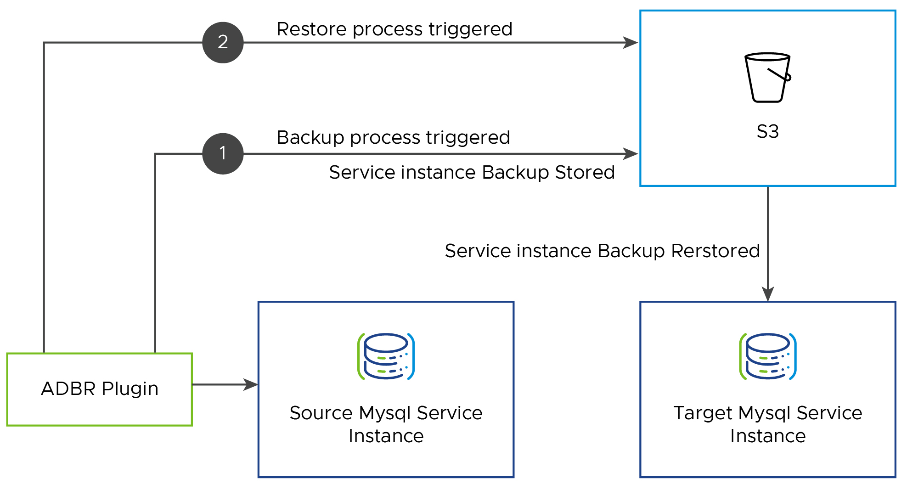
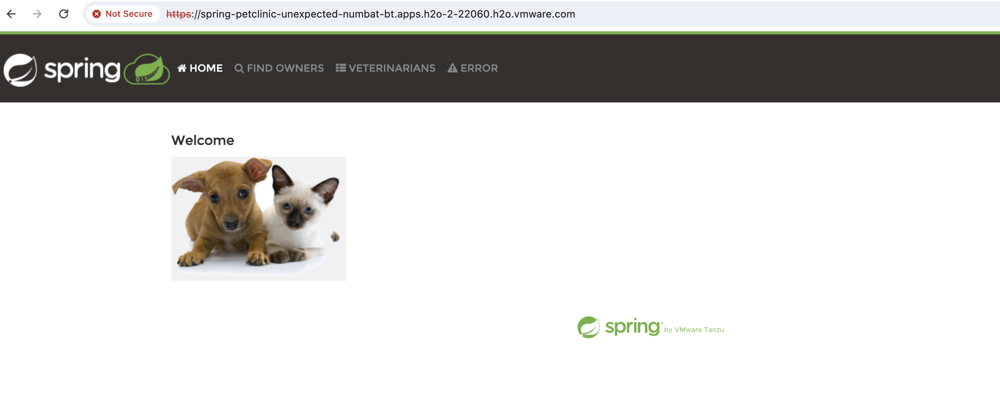
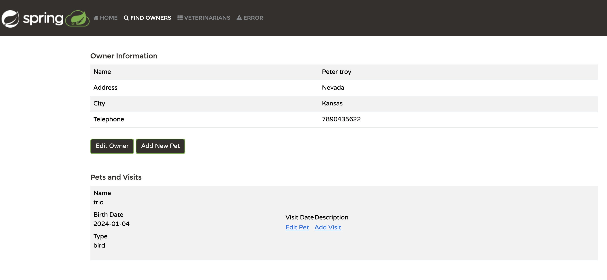
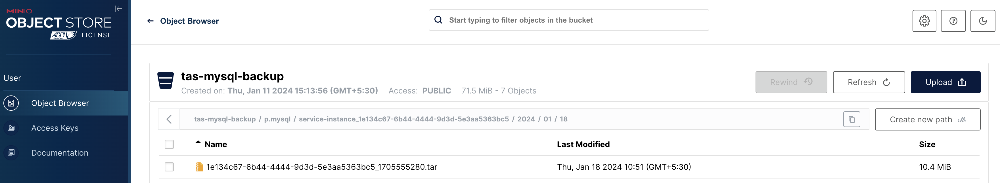
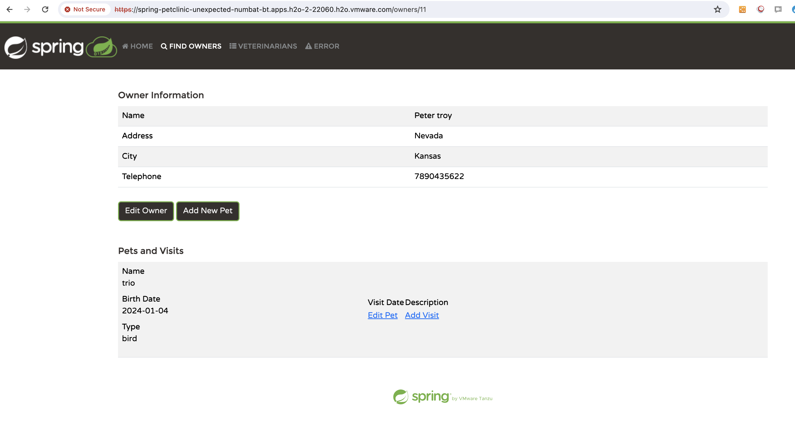

# Backing Up & Restoring VMware SQL with MySQL Instances for TAS

VMware SQL with MySQL for Tanzu Application Service (informally known as TAS) enables developers to provision and use dedicated instances of MySQL database on demand. When you install VMware SQL with MySQL for TAS, the tile deploys and maintains a single service broker that integrates VMware SQL with MySQL for TAS with Ops Manager.

In this document, we'll demonstrate backing up a running MySQL service instance into the desired S3 (AWS, Ceph, GCS, Azure, and Minio) compatible storage, and restore it back to a new service instance. 

- In VMware SQL with MySQL for TAS `v2.9.0` to `v2.9.2` and above, the `ApplicationDeveloperBackupRestore(adbr)` CF plug-in helps to trigger both backup and recovery processes while storing the backup artifacts organized under subfolders in external storage. They are now stored under `p.mysql > service-instance_GUID > yyyy > mm > dd` path.

- The following approach helps to automate some of the steps through CF CLI as compared to the manual process for taking backup/restore of service instances on TAS for MYSQL VMs using mysqldump.

- Using this approach we can take logical backup of the Service instances and not any physical backup.



## Prerequisites

- Install the `ApplicationDataBackupRestore` plug-in for the Cloud Foundry Command Line Interface (CF CLI) tool.

    - Install the `adbr` plug-in by running the following command:

        ```bash
        # cf install-plugin -r CF-Community "ApplicationDataBackupRestore"
        Searching CF-Community for plugin ApplicationDataBackupRestore...
        Plugin ApplicationDataBackupRestore 0.4.0 found in: CF-Community
        Attention: Plugins are binaries written by potentially untrusted authors.
        Install and use plugins at your own risk.
        Do you want to install the plugin ApplicationDataBackupRestore? [yN]: y
        Starting download of plugin binary from repository CF-Community...
        7.93 MiB / 7.93 MiB[============================================================================================================================================================================================================================] 100.00% 6s
        Installing plugin ApplicationDataBackupRestore...
        OK
        Plugin ApplicationDataBackupRestore 0.4.0 successfully installed.
        ```
    - Validate that the `adbr` plug-in is listed under CF plug-in list:

        ```bash
        cf plugins
        Listing installed plugins...
        plugin                         version   command name   command help
        ApplicationDataBackupRestore   0.4.0     adbr           application data backup restore operations
        ```

- Configure an S3 compatible storage to store service instance data backup. For more information about supported blob store for MySQL backups, see the `configuring backups` section in [Installing and configuring VMware SQL with MySQL for Tanzu Application Service](https://techdocs.broadcom.com/us/en/vmware-tanzu/data-solutions/tanzu-for-mysql-on-cloud-foundry/3-3/mysql-for-tpcf/install-config.html).

    > **Note** If you use `Minio` as S3 storage for backups, you must enable the `Force path style access to bucket` option under the `Backups` configuration in the `VMware SQL with MySQL for Tanzu Application Service` tile, particularly when accessing MinIO over an IP address. For more information, see the `Back Up to Amazon S3 or Ceph` section in [Configuring automated backups](https://techdocs.broadcom.com/us/en/vmware-tanzu/data-solutions/tanzu-for-mysql-on-cloud-foundry/3-3/mysql-for-tpcf/automated-backup.html#configure-backups-in-tanzu-operations-manager-6).

## Backup a Service Instance Created with MySQL for TAS

In this section, we'll backup the data on a service instance created with MySQL for TAS Service Instance tile. For this demonstration, we used a Spring Petclinic application on TAS for MySQL VM v3.1.1-build.21. 

1. Before backing up the data, access the application and validate the data that is running on the sample petclinic application binded with MySQL service instance.

    

    

1. Retrieve the service instance details that is scheduled to be backed up:

    ```bash
    # cf service tas-db-medium
    Showing info of service tas-db-medium in org system / space system as admin...
    name:            tas-db-medium
    guid:            1e134c67-6b44-4444-9d3d-5e3aa5363bc5
    type:            managed
    broker:          dedicated-mysql-broker
    offering:        p.mysql
    plan:            mysql-db-medium
    tags:            
    offering tags:   mysql
    description:     Dedicated instances of MySQL
    documentation:   https://techdocs.broadcom.com/us/en/vmware-tanzu/data-solutions/tanzu-for-mysql-on-cloud-foundry/3-3/mysql-for-tpcf/use.html
    dashboard url:   
    Showing status of last operation:
    status:    create succeeded
    message:   Instance provisioning completed
    started:   2024-01-16T08:18:47Z
    updated:   2024-01-16T08:18:47Z
    Showing bound apps:
    name               binding name   status             message
    spring-petclinic                  create succeeded   
    Showing sharing info:
    This service instance is not currently being shared.
    The "service_instance_sharing" feature flag is disabled for this Cloud Foundry platform.
    Showing upgrade status:
    There is no upgrade available for this service.
    ```
1. Back up the service instance using the `adbr` plug-in by running the below command:

    ```bash
    $ cf adbr backup <service_instance_name>

    # cf adbr backup tas-db-medium        
    OK
    ```
1. Validate the status of the service instance backup from the CF CLI:

    ```bash
    # cf adbr get-status tas-db-medium
    Getting status of service instance tas-db-medium in org system / space system as admin...
    [Thu Jan 18 05:21:33 UTC 2024] Status: Backup was successful. Uploaded 10.4M
    ```
1. Validate that the backup file is available in the blob store, which is Minio in this demonstration:

    

## Restore the Backup File to a New Service Instance

In this section, we'll restore the backup file to a new service instance with an empty database. The backup process might fail if any of the following steps are executed:

- Creating a service key for the instance.
- Configuring a service instance for Multi-Site replication.
- Generating any automatic backup on the existing service instance.

Perform the following steps to create a new service instance, and restore the backup file from the previous instance:

1. Create a service instance with the same plan or with a higher plan (Persistent disk size should be equal to or greater than the source service instance):

    ```bash
    # cf create-service p.mysql mysql-db-medium restore-db-medium 
    Creating service instance restore-db-medium in org system / space system as admin...
    Create in progress. Use 'cf services' or 'cf service restore-db-medium' to check operation status.
    OK
    ```

1.  Verify if the service instance has been created successfully:

    ```bash
    # cf service restore-db-medium 
    Showing info of service restore-db-medium in org system / space system as admin...
    name:            restore-db-medium
    guid:            36bdb1b4-b23b-4108-baa6-cb58ba842e62
    type:            managed
    broker:          dedicated-mysql-broker
    offering:        p.mysql
    plan:            mysql-db-medium
    tags:            
    offering tags:   mysql
    description:     Dedicated instances of MySQL
    documentation:   https://techdocs.broadcom.com/us/en/vmware-tanzu/data-solutions/tanzu-for-mysql-on-cloud-foundry/3-3/mysql-for-tpcf/use.html
    dashboard url:   
    Showing status of last operation:
    status:    create succeeded
    message:   Instance provisioning completed
    started:   2024-01-18T07:29:19Z
    updated:   2024-01-18T07:29:19Z
    Showing bound apps:
    There are no bound apps for this service instance.
    Showing sharing info:
    This service instance is not currently being shared.
    The "service_instance_sharing" feature flag is disabled for this Cloud Foundry platform.
    Showing upgrade status:
    There is no upgrade available for this service.
    ```
1.  Check the available backup artifacts for your service instance by running the below command:</br>
You must note down the backup ID from the output.

    ```bash
    # cf adbr list-backups tas-db-medium
    Getting backups of service instance tas-db-medium in org system / space system as admin...
    Backup ID                                         Time of Backup
    1e134c67-6b44-4444-9d3d-5e3aa5363bc5_1705555280   Thu Jan 18 05:21:20 UTC 2024
    ```
1. Restore the backup file to the newly-created service instance:

    ```bash
    $ cf adbr restore DESTINATION-INSTANCE BACKUP-ID

    # cf adbr restore restore-db-medium 1e134c67-6b44-4444-9d3d-5e3aa5363bc5_1705555280
    OK
    ```
1. Check the status of the restore process, and confirm that the file has been successfully restored:

    ```bash
    # cf adbr get-status restore-db-medium
    Getting status of service instance restore-db-medium in org system / space system as admin...
    [Thu Jan 18 07:57:47 UTC 2024] Status: Restore was successful
    ```
1. Unbind the application from the source service instance, and bind to the new target service instance where the backup was restored:

    ```bash
    # cf unbind-service spring-petclinic tas-db-medium 
    Unbinding app spring-petclinic from service tas-db-medium in org system / space system as admin...
    OK
    -------------------
    # cf bind-service spring-petclinic restore-db-medium
    Binding service instance restore-db-medium to app spring-petclinic in org system / space system as admin...
    OK
    TIP: Use 'cf restage spring-petclinic' to ensure your env variable changes take effect
    ```
1. Confirm if the `VCAP_SERVICES` populate the backup database information correctly:

    ```bash
   # cf env spring-petclinic
    Getting env variables for app spring-petclinic in org system / space system as admin...
    System-Provided:
    VCAP_SERVICES: {
    "p.mysql": [
        {
        "binding_guid": "cb43fb28-3986-4a61-a1a9-7749599b68ad",
        "binding_name": null,
        "credentials": {
            "credhub-ref": "/c/548966e5-e333-4d65-8773-7b4e3bb6ca97/36bdb1b4-b23b-4108-baa6-cb58ba842e62/cb43fb28-3986-4a61-a1a9-7749599b68ad/credentials"
        },
        "instance_guid": "36bdb1b4-b23b-4108-baa6-cb58ba842e62",
        "instance_name": "restore-db-medium",
        "label": "p.mysql",
        "name": "restore-db-medium",
        "plan": "mysql-db-medium",
        "provider": null,
        "syslog_drain_url": null,
        "tags": [
            "mysql"
        ],
        "volume_mounts": []
        }
    ]
    }
    VCAP_APPLICATION: {
    "application_id": "c9a095a3-998c-4c72-9f63-bfccccdb6872",
    "application_name": "spring-petclinic",
    "application_uris": [
        "spring-petclinic-unexpected-numbat-bt.apps.h2o-2-22060.h2o.vmware.com"
    ],
    "cf_api": "https://api.sys.h2o-2-22060.h2o.vmware.com",
    "limits": {
        "fds": 16384
    },
    "name": "spring-petclinic",
    "organization_id": "d51a5550-84db-480c-afa7-644f6fd018c5",
    "organization_name": "system",
    "space_id": "8c54d30a-7340-4a62-8b26-5f9cc04663a4",
    "space_name": "system",
    "uris": [
        "spring-petclinic-unexpected-numbat-bt.apps.h2o-2-22060.h2o.vmware.com"
    ],
    "users": null
    }
    User-Provided:
    JBP_CONFIG_OPEN_JDK_JRE: { jre: { version: 17.+ } }
    JBP_CONFIG_SPRING_AUTO_RECONFIGURATION: {enabled: false}
    SPRING_PROFILES_ACTIVE: http2,mysql
    No running env variables have been set
    No staging env variables have been set
    ```
1. Access the application and confirm if you are able to get the old data backed up from the source instance:

    ```bash
    # cf app spring-petclinic
    Showing health and status for app spring-petclinic in org system / space system as admin...
    name:              spring-petclinic
    requested state:   started
    routes:            spring-petclinic-unexpected-numbat-bt.apps.h2o-2-22060.h2o.vmware.com
    last uploaded:     Thu 18 Jan 13:53:01 IST 2024
    stack:             cflinuxfs4
    buildpacks:        
        name                     version                                                                   detect output   buildpack name
        java_buildpack_offline   v4.63.1-offline-https://github.com/cloudfoundry/java-buildpack#9e247374   java            java
    type:           web
    sidecars:       
    instances:      3/3
    memory usage:   1024M
        state     since                  cpu    memory         disk           logging        details
    #0   running   2024-01-18T08:23:30Z   0.7%   269.3M of 1G   216.8M of 1G   0/s of 16K/s   
    #1   running   2024-01-18T08:23:30Z   0.6%   264.6M of 1G   216.8M of 1G   0/s of 16K/s   
    #2   running   2024-01-18T08:23:31Z   0.7%   297.9M of 1G   216.8M of 1G   0/s of 16K/s   
    type:           task
    sidecars:       
    instances:      0/0
    memory usage:   1024M
    There are no running instances of this process.
    ```
1. You can also access the application from any browser, and confirm that the previous data has been backed up.

    

    


## Summary

- This use case streamlines the process of backing up and recovering the service instances of MySQL for TAS VMs by using the CF community plug-in ApplicationDeveloperBackupRestore (ADRB).
- This process is less error-prone and minimizes the heavy lifting involved in the manual approach with mysqld command line for the operator.
- To initiate and govern this approach, you might not need expertise with the mysqld command line because processes are self-automated.