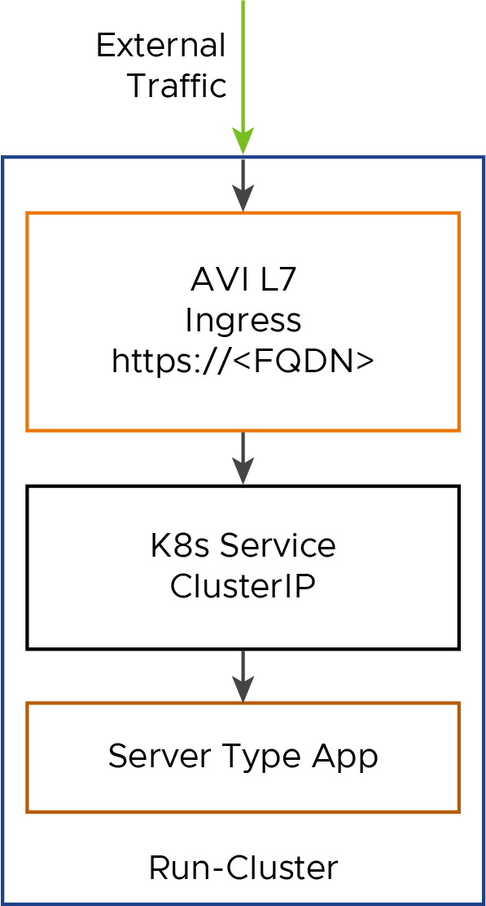
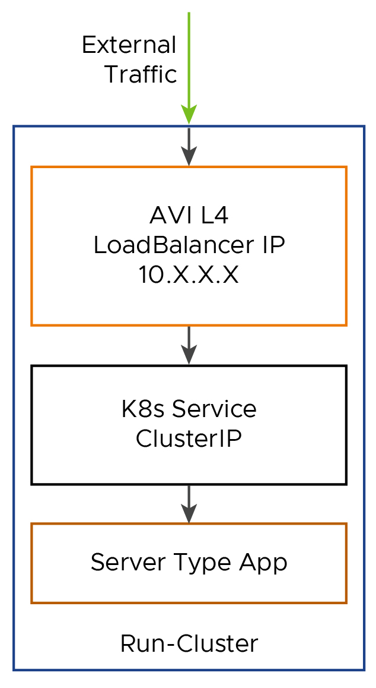
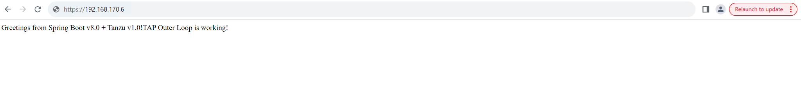

# Exposing TAP Workloads Outside the Cluster Using AVI L4/L7

VMware Tanzu Application Platform (informally known as TAP) is an advanced application development platform equipped with a comprehensive suite of developer tools. It provides developers with a well-defined route to production, facilitating the swift and secure development and deployment of software. This platform is adaptable to any compliant public cloud or on-premises Kubernetes (K8s) cluster, ensuring flexibility and ease of use in diverse computing environments.

In this document, we'll explore how to leverage cartographer to template custom K8s resources (creating new workload types) by modifying the [ClusterConfigTemplate](https://cartographer.sh/docs/v0.3.0/reference/template/#clusterconfigtemplate) for deploying a workload which can be exposed outside the cluster using either AVI L4 or L7. 

`ClusterConfigTemplate` is an object in the supply chain, which consists of resources that are specified via Templates. Each template acts as a wrapper for existing Kubernetes resources, and allows them to be used with Cartographer.

## Prerequisites: 
- [Tanzu Kubernetes Grid Cluster on vSphere](https://docs.vmware.com/en/VMware-Tanzu-for-Kubernetes-Operations/2.3/tko-reference-architecture/GUID-reference-designs-tko-on-vsphere-with-tanzu.html)
- [Tanzu Application Platform](https://docs.vmware.com/en/VMware-Tanzu-Application-Platform/1.6/tap-reference-architecture/GUID-reference-designs-index-tap.html) 
- Install the `yq` CLI on client machine. The `yq` CLI is a lightweight and portable command-line YAML processor. You can download `yq` by from [here](https://github.com/mikefarah/yq/releases/), and run the below commands to install.

    ```bash
    tar -zxvf yq_linux_amd64.tar.gz
    mv yq_linux_amd64 /usr/local/bin/yq
    ```


## Create a New Server Workload Type in TAP

The `server` workload type allows you deploy traditional network applications on Tanzu Application Platform.

Using an application workload specification, you can build and deploy application source code to a manually-scaled Kubernetes deployment which exposes an in-cluster Service endpoint. Subsequently, you have the option to use AVI LoadBalancer (L4) Services or Ingress (L7) resources to expose these applications beyond the cluster. For more information, see the `Use server workloads` section in [TAP documentation](https://docs.vmware.com/en/VMware-Tanzu-Application-Platform/1.7/tap/workloads-server.html). 


Tanzu Application Platform allows you to create new workload types. In this example, we'll explore the steps for adding an Ingress resource to the `server-template ClusterConfigTemplate` when this new type of workload is created:

1. Save the existing server-template in a local file by running the following command:

    ```bash
    kubectl get ClusterConfigTemplate server-template -o yaml > avi-l4-l7-server-template.yaml
    ```
1. Extract the `.spec.ytt` field from this file and create another file by running the following command:

    ```bash
    yq eval '.spec.ytt' avi-l4-l7-server-template.yaml > spec-ytt.yaml
    ```
1. Next, add the `Ingress` resource snippet to `spec-ytt.yaml`. This step provides a sample `Ingress` resource snippet below. You must edit the `spec-ytt.yaml` file before adding the `Ingress` resource snippet:

    - Replace `INGRESS-DOMAIN` with the Ingress domain that you set during the installation.
    - Set the annotation `cert-manager.io/cluster-issuer` to the `shared.ingress_issuer` value configured during installation or leave it as `tap-ingress-selfsigned` to use the default annotation.
    - This configuration is based on your workload service running on port 8080.
    - `ingressClassName: #@ data.values.params.ingressClass`: This parameter is passed from the `workload.yaml` parameter section which specifies the ingress class name to be used while creating the ingress object.
    - If `data.values.params.serviceType != "LoadBalancer"`: This condition is added to create the ingress resource based on the value assigned to the `serviceType` parameter from `workload.yaml`. 
        - If the `serviceType = LoadBalancer`: The ingress object is not created. Only a K8s service of type LoadBalancer(AVI L4) is created.
        - If the `serviceType != LoadBalancer`: The ingress object(AVI L7) is created along with a K8s service of type ClusterIp is created.

    A sample Ingress resource snippet is shown below:

    ```bash
    #@ if data.values.params.serviceType != "LoadBalancer":
    apiVersion: networking.k8s.io/v1
    kind: Ingress
    metadata:
    name: #@ data.values.workload.metadata.name
    annotations:
        cert-manager.io/cluster-issuer: tap-ingress-selfsigned
        ingress.kubernetes.io/force-ssl-redirect: "true"
        kubernetes.io/tls-acme: "true"
        kapp.k14s.io/change-rule: "upsert after upserting Services"
    labels: #@ merge_labels({ "app.kubernetes.io/component": "run", "carto.run/workload-name": data.values.workload.metadata.name })
    spec:
    ingressClassName: #@ data.values.params.ingressClass
    tls:
        - secretName: #@ data.values.workload.metadata.name
        hosts:
            - #@ data.values.workload.metadata.name + ".tap-run-avi.cloud.vmw"
    rules:
        - host: #@ data.values.workload.metadata.name + ".tap-run-avi.cloud.vmw"
        http:
            paths:
            - pathType: Prefix
                path: /
                backend:
                service:
                    name: #@ data.values.workload.metadata.name
                    port:
                    number: 8080
    #@ end
    ```

1. Add the `Ingress` resource snippet to the `spec-ytt.yaml` file and save. Look for the `Service` resource, and insert the snippet before the last `#@ end`. For example:

    ```bash
    #@ load("@ytt:data", "data")
    #@ load("@ytt:yaml", "yaml")
    #@ load("@ytt:struct", "struct")
    #@ load("@ytt:assert", "assert")

    #@ def merge_labels(fixed_values):
    #@   labels = {}
    #@   if hasattr(data.values.workload.metadata, "labels"):
    #@     exclusions = ["kapp.k14s.io/app", "kapp.k14s.io/association"]
    #@     for k,v in dict(data.values.workload.metadata.labels).items():
    #@       if k not in exclusions:
    #@         labels[k] = v
    #@       end
    #@     end
    #@   end
    #@   labels.update(fixed_values)
    #@   return labels
    #@ end

    #@ def intOrString(v):
    #@   return v if type(v) == "int" else int(v.strip()) if v.strip().isdigit() else v
    #@ end

    #@ def merge_ports(ports_spec, containers):
    #@   ports = {}
    #@   for c in containers:
    #@     for p in getattr(c, "ports", []):
    #@       ports[p.containerPort] = {"targetPort": p.containerPort, "port": p.containerPort, "name": getattr(p, "name", str(p.containerPort))}
    #@     end
    #@   end
    #@   for p in ports_spec:
    #@     targetPort = getattr(p, "containerPort", p.port)
    #@     type(targetPort) in ("string", "int") or fail("containerPort must be a string or int")
    #@     targetPort = intOrString(targetPort)
    #@
    #@     port = p.port
    #@     type(port) in ("string", "int") or fail("port must be a string or int")
    #@     port = int(port)
    #@     ports[p.port] = {"targetPort": targetPort, "port": port, "name": getattr(p, "name", str(p.port))}
    #@   end
    #@   return ports.values()
    #@ end

    #@ def delivery():
    ---
    apiVersion: apps/v1
    kind: Deployment
    metadata:
    name: #@ data.values.workload.metadata.name
    annotations:
        kapp.k14s.io/update-strategy: "fallback-on-replace"
        ootb.apps.tanzu.vmware.com/servicebinding-workload: "true"
        kapp.k14s.io/change-rule: "upsert after upserting servicebinding.io/ServiceBindings"
    labels: #@ merge_labels({ "app.kubernetes.io/component": "run", "carto.run/workload-name": data.values.workload.metadata.name })
    spec:
    selector:
        matchLabels: #@ data.values.config.metadata.labels
    template: #@ data.values.config
    ---
    apiVersion: v1
    kind: Service
    metadata:
    name: #@ data.values.workload.metadata.name
    labels: #@ merge_labels({ "app.kubernetes.io/component": "run", "carto.run/workload-name": data.values.workload.metadata.name })
    spec:
    selector: #@ data.values.config.metadata.labels
    type: #@ data.values.params.serviceType
    ports:
    #@ hasattr(data.values.params, "ports") and len(data.values.params.ports) or assert.fail("one or more ports param must be provided.")
    #@ declared_ports = []
    #@ if "ports" in data.values.params:
    #@   declared_ports = data.values.params.ports
    #@ else:
    #@   declared_ports = struct.encode([{ "containerPort": 8080, "port": 8080, "name": "http"}])
    #@ end
    #@ for p in merge_ports(declared_ports, data.values.config.spec.containers):
    - #@ p
    #@ end
    ---
    #@ if data.values.params.serviceType != "LoadBalancer":
    apiVersion: networking.k8s.io/v1
    kind: Ingress
    metadata:
    name: #@ data.values.workload.metadata.name
    annotations:
        cert-manager.io/cluster-issuer: tap-ingress-selfsigned
        ingress.kubernetes.io/force-ssl-redirect: "true"
        kubernetes.io/tls-acme: "true"
        kapp.k14s.io/change-rule: "upsert after upserting Services"
    labels: #@ merge_labels({ "app.kubernetes.io/component": "run", "carto.run/workload-name": data.values.workload.metadata.name })
    spec:
    ingressClassName: #@ data.values.params.ingressClass
    tls:
        - secretName: #@ data.values.workload.metadata.name
        hosts:
            - #@ data.values.workload.metadata.name + ".tap-run-avi.cloud.vmw"
    rules:
        - host: #@ data.values.workload.metadata.name + ".tap-run-avi.cloud.vmw"
        http:
            paths:
            - pathType: Prefix
                path: /
                backend:
                service:
                    name: #@ data.values.workload.metadata.name
                    port:
                    number: 8080
    #@ end
    #@ end
    ---
    apiVersion: v1
    kind: ConfigMap
    metadata:
    name: #@ data.values.workload.metadata.name + "-server"
    labels: #@ merge_labels({ "app.kubernetes.io/component": "config" })
    data:
    delivery.yml: #@ yaml.encode(delivery())
    ```

1. Add the above snippet to the `.spec.ytt` property in `avi-l4-l7-server-template.yaml` by running the following command:

    ```bash
    SPEC_YTT=$(cat spec-ytt.yaml) yq eval -i '.spec.ytt |= strenv(SPEC_YTT)' avi-l4-l7-server-template.yaml
    ```

1. Change the name of `ClusterConfigTemplate` to `avi-l4-l7-server-template` by running the following command:

    ```bash
    yq eval -i '.metadata.name = "avi-l4-l7-server-template"' avi-l4-l7-server-template.yaml
    ```
1. Create the new `ClusterConfigTemplate` by running the following command:

    ```bash
    kubectl apply -f avi-l4-l7-server-template.yaml
    ```
1. Verify that the new `ClusterConfigTemplate` is in the cluster by running the following command:

    ```bash
    kubectl get ClusterConfigTemplate

    # Expected output:
    kubectl get ClusterConfigTemplate
    NAME                         AGE
    api-descriptors              82m
    config-template              82m
    convention-template          82m
    avi-l4-l7-server-template    22s
    server-template              82m
    service-bindings             82m
    worker-template              82m
    ```
1. Add the new workload type to the `tap-values.yaml` file. The new workload type is named `avi-l4-l7-server` and `cluster_config_template_name` is renamed to `avi-l4-l7-server-template`:

    ```bash
    ootb_supply_chain_basic:
    supported_workloads:
        - type: web
        cluster_config_template_name: config-template
        - type: server
        cluster_config_template_name: server-template
        - type: worker
        cluster_config_template_name: worker-template
        - type: avi-l4-l7-server
        cluster_config_template_name: avi-l4-l7-server-template
    ```
1. Update your Tanzu Application Platform installation as follows:

    ```bash
    tanzu package installed update tap -p tap.tanzu.vmware.com --values-file "/path/to/your/config/tap-values.yaml"  -n tap-install
    ```
1.  Provide the necessary privileges to the `deliverable` role to manage `Ingress` resources:

    ```bash
    cat <<EOF | kubectl apply -f -
    apiVersion: rbac.authorization.k8s.io/v1
    kind: ClusterRole
    metadata:
    name: deliverable-with-ingress
    labels:
        apps.tanzu.vmware.com/aggregate-to-deliverable: "true"
    rules:
    - apiGroups:
    - networking.k8s.io
    resources:
    - ingresses
    verbs:
    - get
    - list
    - watch
    - create
    - patch
    - update
    - delete
    - deletecollection
    EOF
    ```

## Deploying a Server Workload Using AVI L7

In this section, we'll deploy a server workload using AVI L7, and expose it externally. The following diagram shows the flow of external traffic entering the cluster through AVI L7 ingress, and passing through the successive K8s objects before reaching the application.



1. Apply the below workload YAML to deploy the server application. Here, the parameter `ingressClass` specifies the ingressclass to be used while creating the ingress object.
    ```bash
    apiVersion: carto.run/v1alpha1
    kind: Workload
    metadata:
    generation: 1
    labels:
        app.kubernetes.io/part-of: tanzu-java-web-app
        apps.tanzu.vmware.com/auto-configure-actuators: "true"
        apps.tanzu.vmware.com/has-tests: "true"
        apps.tanzu.vmware.com/workload-type: l7-server
    name: tanzu-java-web-app
    spec:
    params:
    - name: scanning_source_policy
        value: lax-scan-policy
    - name: serviceType
        value: ClusterIP
    - name: scanning_image_policy
        value: lax-scan-policy
    - name: ingressClass
        value: avi-lb
    - name: testing_pipeline_matching_labels
        value:
        apps.tanzu.vmware.com/language: java
    serviceAccountName: default
    source:
        git:
        ref:
            branch: main
        url: <Git url with Application code>
    ```

1. Once the process completes, you will see the Deployment, Service, and Ingress(L7) resources similar to the following snippet:

    ```bash
    # kubectl get ingress,svc,deploy -l carto.run/workload-name=tanzu-java-web-app

    NAME                                                    CLASS    HOSTS                                          ADDRESS          PORTS     AGE
    ingress.networking.k8s.io/tanzu-java-web-app            avi-lb   tanzu-java-web-app.INGRESS-DOMAIN              34.111.111.111   80, 443   37s


    NAME                                       TYPE        CLUSTER-IP       EXTERNAL-IP   PORT(S)                                              AGE
    service/tanzu-java-web-app                 ClusterIP   None             <none>        80/TCP                                               3d1h
    service/tanzu-java-web-app-00001           ClusterIP   100.68.55.248    <none>        80/TCP,443/TCP                                       3d1h
    service/tanzu-java-web-app-00001-private   ClusterIP   100.66.160.115   <none>        80/TCP,443/TCP,9090/TCP,9091/TCP,8022/TCP,8012/TCP   3d1h

    NAME                                                  READY   UP-TO-DATE   AVAILABLE   AGE
    deployment.apps/tanzu-java-web-app-00001-deployment   1/1     1            1           3d1h
    ```

1. Validate the application accessibility by using the FQDN from the above Ingress object output. 

    

## Deploying a Server Workload Using AVI L4

Now, let's deploy a server workload using AVI L4, and expose it externally. The below diagram shows the flow of external traffic entering the cluster through AVI L4 IP, and passing through the successive K8s objects before reaching the application.



1. Apply the below workload YAML to deploy the server application. The value assigned serviceType parameter is `LoadBalancer`, this creates a service of type LoadBalancer and the ingress object creation is skipped.
    ```bash
    apiVersion: carto.run/v1alpha1
    kind: Workload
    metadata:
    generation: 1
    labels:
        app.kubernetes.io/part-of: tanzu-java-web-app
        apps.tanzu.vmware.com/auto-configure-actuators: "true"
        apps.tanzu.vmware.com/has-tests: "true"
        apps.tanzu.vmware.com/workload-type: l4-server
    name: tanzu-java-web-app
    spec:
    params:
    - name: scanning_source_policy
        value: lax-scan-policy
    - name: serviceType
        value: LoadBalancer
    - name: scanning_image_policy
        value: lax-scan-policy
    - name: testing_pipeline_matching_labels
        value:
        apps.tanzu.vmware.com/language: java
    serviceAccountName: default
    source:
        git:
        ref:
            branch: main
        url: <Git url with Application code>
    ```
1. Once the process completes, you'll see the Deployment and LoadBalancer Service(L4) resources similar to the following snippet:

    ```bash
    # kubectl get ingress,svc,deploy -l carto.run/workload-name=tanzu-java-web-app

    NAME                                    TYPE        CLUSTER-IP       EXTERNAL-IP   PORT(S)                                              AGE
    tanzu-java-web-app                     LoadBalancer 18.217.87.23      <none>        80/TCP                                               14d
    tanzu-java-web-app-00001                ClusterIP   100.68.55.248     <none>        80/TCP,443/TCP                                       14d
    tanzu-java-web-app-00001-private        ClusterIP   100.66.160.115    <none>        80/TCP,443/TCP,9090/TCP,9091/TCP,8022/TCP,8012/TCP   14d


    NAME                                                  READY   UP-TO-DATE   AVAILABLE   AGE
    deployment.apps/tanzu-java-web-app-00001-deployment   1/1     1            1           3d1h
    ```
1. Use the IP address from the above service object output to access the application as shown below:
    

## Conclusion
In this document, we have uncovered a powerful approach to streamline Kubernetes operations using supply chain objects. The supply chain does the heavy lifting to generate the necessary K8s Ingress objects. Also, during an application deployment, this feature helps Platform operators to generate a spectrum of K8s objects (configmaps, pvc’s, secrets, and so on) by defining the required conditions within the supply chain.