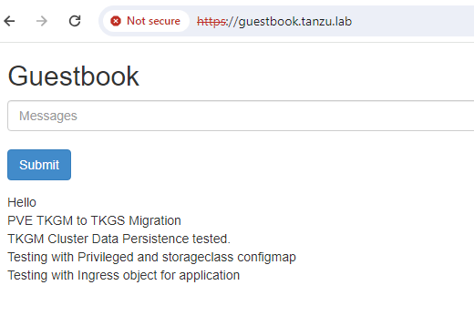

# Migrating a Stateful Application from a TKGm Cluster to TKGS Cluster

The purpose of this document is to showcase migration of stateful applications from TKGm based workload cluster to TKGs based workload cluster with data persistence. 


Migrating the stateful applications across Kubernetes clusters is not straightforward as compared to the stateless applications migration. Because, the stateful applications would always be associated with stable system, network and storage configurations. For this reason, the migration of stateful applications needed a proper assessment, planning and execution of migration.

In this demonstration, we used Velero to migrate a sample stateful application configured with an Ingress. Velero is an open source community standard tool to back up and restore TKG workloads. For more information on Velero installation, see [Installing Velero in Tanzu Kubernetes Cluster](https://docs.vmware.com/en/VMware-Tanzu-Reference-Architecture/services/tanzu-solutions-workbooks/solution-workbooks-velero-with-restic.html)
 
 ## Assumptions:

Below are few assumptions for end users to consider:
1. This document is intended for apps which can tolerate maintenance downtime and not for apps with zero downtime.
1. Have access to S3 Storage for configuration of Velero.
1. Knowledge of Kubernetes concepts like ingress objects, ingress class, etc.

## RTO and RPO Requirement

Defining RPO and RTO requirements for each application is crucial in migration planning. RPO refers to the maximum acceptable amount of time since the last backup on the source cluster, which essentially means the amount of data loss that a business can tolerate. 

On the other hand, RTO refers to the maximum acceptable delay between the interruption of service and restoration of service, which is the amount of time it takes to fully recover on the destination cluster. 
- **RPO**: RPO for migrating an app from TKGm to TKGs depends on the amount of time taken to backup to the remote S3 location and amount of time taken to restore on the destination cluster. It depends on several parameters like PV data size, network latency and backend infrastructure etc. 
- **RTO**: To minimise the RTO, run both source and destination cluster simultaneously, backup the application from source and restore it on destination cluster, then stop the services at source and switch to access the app from destination cluster.


## Environment Overview

We have configured two ESXi clusters part of the same Datacenter, with different storage but having networking connectivity across the clusters. One cluster is configured with TKGm environment and considered as the source environment, and the other one is configured with TKGS which will be the destination environment.

### Source Environment - TKGm

We have configured the source environment- TKGm backed with NSX-T Networking and NSX ALB as load balancer. This environment is configured by following the [VMware Tanzu for Kubernetes Operations on vSphere with NSX Networking Reference Design](https://docs.vmware.com/en/VMware-Tanzu-for-Kubernetes-Operations/2.3/tko-reference-architecture/GUID-reference-designs-tko-on-vsphere-nsx.html) with the below Bill of materials. 

|**Software Components**|**Version**|
| --- | --- |
|Tanzu Kubernetes Grid |2.4.x|
|VMware vSphere ESXi|8.0 U1c|
|VMware vCenter (VCSA)|8.0 U1c|
|NSX Advanced Load Balancer|22.1.43|
|VMware NSX|4.1.0.2|

TKGm environment is configured with a single Management cluster and multiple workload clusters for application deployment. Workload clusters are configured with NSX ALB L7 with NodeportLocal mode for Application Ingress functionality. For more information on enabling the ALB L7 on TKGm, see [Configure ADC to enable NSX ALB L7](https://docs.vmware.com/en/VMware-Tanzu-for-Kubernetes-Operations/2.3/tko-reference-architecture/GUID-deployment-guides-tko-on-vsphere-nsxt.html#configure-ako-deployment-config-adc-for-workload-cluster-to-enable-nsx-alb-l7-ingress-with-nodeportlocal-mode-28).

```bash
# tanzu cluster list -A --include-management-cluster
  NAME                    NAMESPACE   STATUS   CONTROLPLANE  WORKERS  KUBERNETES        ROLES       PLAN  TKR
  tkgm-wrkl-cluster       default     running  1/1           3/3      v1.27.5+vmware.1  <none>      dev   v1.27.5---vmware.1-tkg.1
  tkg-standalone-mgmt-cl  tkg-system  running  1/1           1/1      v1.27.5+vmware.1  management  dev   v1.27.5---vmware.1-tkg.1
```

### Destination Environment - TKGS

We have configured the TKGs environment backed with NSX-T Networking by following the reference architecture, [VMware Tanzu for Kubernetes Operations using vSphere with Tanzu on NSX Reference Design](https://docs.vmware.com/en/VMware-Tanzu-for-Kubernetes-Operations/2.3/tko-reference-architecture/GUID-reference-designs-tko-on-vsphere-with-tanzu-nsxt.html), with the below bill of materials. 

|**Software Components**|**Version**|
| --- | --- |
|VMware vSphere ESXi|8.0 U1c|
|VMware vCenter (VCSA)|8.0 U1c|
|Supervisor Version|v1.25.6|
|Tanzu Kubernetes Release(for workload clusters)|v1.26.13|
|VMware NSX|4.1.0.2|

We have enabled the Supervisor cluster, created a Supervisor Namespace, and deployed a Tanzu workload cluster. TKGs environment is backed with NSX-T Networking and Contour is deployed as a Tanzu package on the workload cluster to provide L7 Ingress functionality. For more information on installing Tanzu packages on the TKGS workload cluster, please visit [Prepare to install Tanzu Packages](https://docs.vmware.com/en/VMware-Tanzu-Packages/2024.2.1/tanzu-packages/prep.html). 

```bash
# kubectl vsphere login --vsphere-username=administrator@vsphere.local --server=192.168.120.2 --tanzu-kubernetes-cluster-name tkgs-cluster-01 --insecure-skip-tls-verify

KUBECTL_VSPHERE_PASSWORD environment variable is not set. Please enter the password below
Password:

Logged in successfully.

You have access to the following contexts:
   192.168.120.2
   tkgs-cluster-01
   tkgs-namespace-01
```

### Velero Installation on Tanzu Kubernetes Clusters:

Velero has been configured on Tanzu Kubernetes Clusters to backup and restore the workloads. It should be configured on both source and destination clusters. Velero configuration includes:
- Installed Velero CLI on the local client machine
- Configured a storage provider with buckets to store the backups, in our case we used MinIO as the storage provider.
- Configured Velero server on source and destination Tanzu Kubernetes clusters. 

For more information on configuring Velero and best practices, see [Installing Velero in Tanzu Kubernetes Cluster](https://docs.vmware.com/en/VMware-Tanzu-Reference-Architecture/services/tanzu-solutions-workbooks/solution-workbooks-velero-with-restic.html).

## App Deployment on TKGm cluster and Backup via Velero

We will deploy a stateful application named `Guestbook` on the source cluster, and enter some messages for data persistence validation. We will also create an Ingress object for backing up this application and ensure to backup and restore this in the destination environment. 

1. Deploy the Guestbook app on the TKGM cluster by following the steps mentioned [here](https://docs.vmware.com/en/VMware-vSphere/8.0/vsphere-with-tanzu-tkg/GUID-A6348191-D403-4CDA-9183-4F4C28A6B093.html). Please refer [here](./resources/tkgm-to-tkgs-stateful-app-migration/) for app config files.
1. Add some data entries in the guestbook app before taking Velero backup and ensure that you see the new entries.


1. Backup the application using Velero, by including the complete Namespace.
    ```bash
    # velero backup create<backup name > --include-namespaces <namespace name>
    ```
1. Verify the backup status by running the below command and ensure that all the objects are backed up and the status is COMPLETE:
    ```bash
    # velero backup describe <backup name>
    ```

## App restore on TKGS cluster using Velero

Now we will restore this application on the destination cluster and ensure that all the objects are backed up and validate the data persistency.

1. Restore the app backed up in the above section to the TKGS workload cluster.
    ```bash
    # velero restore create --from-backup <backup name>
    ```
1. Validate the restore status by running the following command:
    ```bash
    # velero restore describe <restore name>
    ```
1. Once Velero restore completes, validate the status application by ensuring all the pods, services, PV/PVCs, and Ingress objects are deployed as expected
    ```bash
    # kubectl get all -n <namespace>
    # kubectl get pv,pvc -n <namespace>
    # kubectl get ingress -n <namespace>
    ```
1. Edit the ingress object of the app, and update the `spec.ingressClass` name to match the IngressClass name on the Destination cluster.
1. Access the application and validate that the data is persistent after the migration. Also, make some new entries to the application to ensure the app runs fine on the destination. 

## TKGm-TKGS Migration Observations:

In this section, we will discuss some of the issues we encounter and document the customizations we need to perform to complete the app migration from the TKGm to the TKGS environment. 

### Pod creation failure with PodSecurityAdmission error:

When you configure a source application with an image created with non-root permissions or privileged containers, pod restore on the TKGs cluster will fail with the PodSecurityPolicy error.

```bash
error restoring pods/guestbook/guestbook-frontend-deployment-7fd64c8b4c-m424b: pods "guestbook-frontend-deployment-7fd64c8b4c-m424b" is forbidden: violates PodSecurity "restricted:latest": allowPrivilegeEscalation != false (container "php-redis" must set securityContext.allowPrivilegeEscalation=false), unrestricted capabilities (container "php-redis" must set securityContext.capabilities.drop=["ALL"]), runAsNonRoot != true (pod or container "php-redis" must set securityContext.runAsNonRoot=true), seccompProfile (pod or container "php-redis" must set securityContext.seccompProfile.type to "RuntimeDefault" or "Localhost")
```

PodSecurityAdmission replaces the PodSecurityPolicy from K8s 1.25.x onwards, and you need to add the below label on Namespace to enable the Privileged containers.

```bash
# kubectl label --overwrite ns <namespace> pod-security.kubernetes.io/enforce=privileged
```

However, when you restore the workloads using Velero, it creates the Namespace as well and the restored pods will fail as the namespace does not have the above label applied. To avoid this scenario, if you have any Privileged containers running in the source cluster, ensure to label the namespace at the source cluster itself, so that the same settings will be applied on the destination namespace and restore works without any issues. 

### Changing PV/PVC StorageClasses:

When you create a stateful application with Dynamic Persistent Volumes, you provide a Storage Class Name to create the PVs on the backend storage. When you restore these stateful applications on the destination cluster, it expects the same StorageClass to be available and PV creation fails if it does not exist.

To avoid this issue, you need to ensure that the same storage class is present on the destination cluster as well. However, this might not always be feasible as customers might be interested in using an existing SC instead of creating a new SC with a matching name on the destination cluster. 

Velero provides an option to change the storage class of persistent volumes and persistent volume claims during restores. To configure this, create a config map in the Velero namespace on the destination cluster by mapping the source and destination storage class names. For more information, see [Velero Documentation.](https://velero.io/docs/v1.13/restore-reference/#changing-pvpvc-storage-classes)

```yaml
apiVersion: v1
kind: ConfigMap
metadata:
  # any name can be used; Velero uses the labels (below)
  # to identify it rather than the name
  name: change-storage-class-config
  # must be in the velero namespace
  namespace: velero
  # the below labels should be used verbatim in your
  # ConfigMap.
  labels:
    # this value-less label identifies the ConfigMap as
    # config for a plugin (i.e. the built-in restore item action plugin)
    velero.io/plugin-config: ""
    # this label identifies the name and kind of plugin
    # that this ConfigMap is for.
    velero.io/change-storage-class: RestoreItemAction
data:
  # add 1+ key-value pairs here, where the key is the old
  # storage class name and the value is the new storage
  # class name.
  <old-storage-class1>: <new-storage-class1>
  <old-storage-class2>: <new-storage-class2>
```

### Updating IngressClass on Destination Cluster:

Source (TKGm) cluster is configured with NSX ALB and Destination (TKGs) cluster is configured with contour for L7 ingress functionality. So when you backup and restore the ingress workloads, ingress will not be assigned with an IP address due to ingress class mismatch. 

You need to ensure to change the IngressClass name after restoring the workloads on the destination cluster. To perform this edit the Ingress object, and update the `spec.ingressClass` field to match with the destination ingress class name, or just remove the field to make use of the default Ingress provider. 

## Appendix: References
- [Velero Storage classes config map](https://velero.io/docs/v1.13/restore-reference/#changing-pvpvc-storage-classes)
- [Package Installation on TKGS cluster](https://docs.vmware.com/en/VMware-Tanzu-Packages/2024.2.1/tanzu-packages/prep.html#supervisor-version-requirements-4)
- [NSX ALB L7 for TKGM](https://docs.vmware.com/en/VMware-Tanzu-for-Kubernetes-Operations/2.3/tko-reference-architecture/GUID-deployment-guides-tko-on-vsphere-nsxt.html#configure-ako-deployment-config-adc-for-workload-cluster-to-enable-nsx-alb-l7-ingress-with-nodeportlocal-mode-28)
- [Guesbook config files]()
- [App deployment steps](https://docs.vmware.com/en/VMware-vSphere/8.0/vsphere-with-tanzu-tkg/GUID-A6348191-D403-4CDA-9183-4F4C28A6B093.html)
